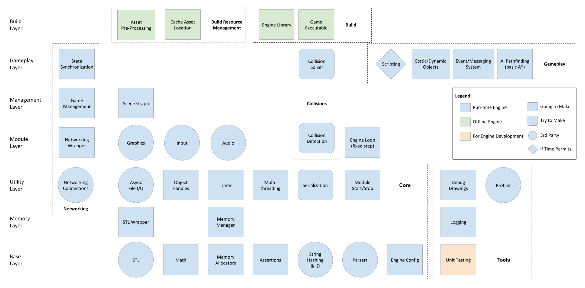
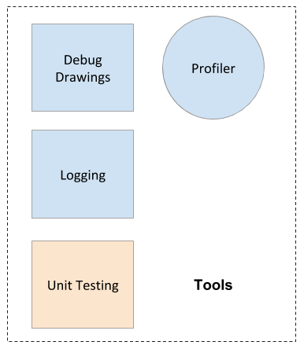

# Engine Architecture

This past week, we developed the initial design of our engine architecture. The diagram is broken down into layers, where the layers above depend on one or more systems on the layers below. The legend on the right of the diagram describes the meaning behind the colors and shapes; colors are for how the system will be used and shape is whether we will be build. **Run-time Engine** systems are ones that will be built with the engine and are required at runtime of the game. **Offline Engine** systems will be packaged with the engine but won't be used at runtime by a user, rather, all actions will be done prior to playing the game. **For Engine Development** systems are solely for engine developers' benefit and don't need to be packaged with the engine DLL[^1]. **Going to Make** signifies we are building this system from scratch, where **Try to Make** means we are going to attempt to develop the system. However, if we can't get a functioning system within an allotted time we will substitutes ours for a 3rd party library. The **3rd Party** systems are all of the systems that we won't be developing ourselves, but rather integrating into the engine and creating a wrapper[^2] for the end user. The **If Time Permits** category are for components which aren't necessary for the engine, however could be useful for the game developer.

[^1]: A DLL is a dynamic-linked library which is Microsoft shared library concept which can be transported around easier than a project and contains information about the compiled project.

[^2]: A wrapper is a class that "wraps" around another class to hide/change/add functionality. This is usually done when using other people's libraries to ensure only your features are available.

## Architecture Layers

Believe it or not, our architecture _does_ have some semblance of organization. On the left side of the diagram, we list our engine's layers. The layers of a game engine range from very vague to extremely specific, and we've made ours somewhat vague to keep us from being architecture astronauts[^3] and spending too much time on irrelevant details. But we have made some distinctions here because engines, like most software, have tons of dependencies.

[^3]: Joel describes this problem as _"When you go too far up, abstraction-wise, you run out of oxygen. Sometimes smart thinkers just don't know when to stop, and they create these absurd, all-encompassing, high-level pictures of the universe that are all good and fine, but don't actually mean anything at all."_ For more, read his blog post [here](https://www.joelonsoftware.com/2001/04/21/dont-let-architecture-astronauts-scare-you/)

1.  **Base Layer:** This layer contains any library or module that has no dependencies whatsoever, and especially those that are depended upon by most other modules. These are essentially the tools we'll be using to build everything else up.
1.  **Memory Layer:** The memory layer is so sparse because really it's just our memory management getting shoved between everything that needs memory and the actual memory allocators. We want to control all of our allocations through a single manager, so this is kind of a gatekeeper layer.
1.  **Utility Layer:** Utilities span everything that we would still use in multiple modules or systems, but aren't so basic as to be independent of other libraries. Much of our utility layer uses the memory manager but is used by the layer directly above, so we figured this layer would be important to get out of the way before the rest of the engine.
1.  **Module Layer:** A module is a system in our game engine that is initialized at the start of the engine runtime, destroyed at the end of the engine runtime, and is self-contained from any other system at its level. This gives a rather broad definition, but that's also the power of modules: You can add some more in later if you need their features! Most of our modules consist of 3rd party libraries because modules are generally the brunt of the game engine development work, and we're trying to be mindful of our deadlines!
1.  **Management Layer:** Similarly to the memory layer, the management layer has few systems because it mostly consists of a couple overarching management system. Ours are the networked game management system, which mostly conducts the networking side of the engine, and the scene graph, which is how gameplay-level systems will access most objects and information.
1.  **Gameplay Layer:** The gameplay layer is the final layer of our engine's runtime systems. Gameplay systems are the first systems in our hierarchy that exist mainly for the sake of the gameplay sequence. They either define data or behavior that gets used at a high level in the game, such as scripting, AI, and event messaging. A lot of smaller features can be introduced in this layer without mucking up the rest of the engine, which is also why our only potentially-not-developed system is in this layer, since a lower-level system would probably break much of our systems above it.
1.  **Build Layer:** Lastly, our build layer consists of any engine technology that solely processes assets and code offline, either for the sake of generating the game build or the engine build itself. Our only section in this layer that is not the actual builds of the software is the build resource management section. We would use this to make our build process both effective and fast.

The architecture is divided into 10 main sections: core, tools, networking, graphics, input, audio, collisions, gameplay, build resource management, and build. These sections were pulled from our understanding of engine architecture after reading _[Game Engine Architecture](https://www.gameenginebook.com/)_, however other authors categorizations of engine design also overlap with our systems. For example in _[Game Engine Design and Implementation](https://www.amazon.com/Game-Engine-Design-Implementation-Thorn/dp/0763784516)_, Alan Thorn lists the Render, Resource, Scene, Input, and Error Managers as the essential managers which overlap with our Graphics, Build Resource Management, Scene Graph, Input, and Tools respectively cover his categories. We have broken our architecture more granularly to help see which features we need to be developing. For decisions on 3rd party libraries see our other [blog](week-1.md).

## Core

Core systems are the underlying foundations of all other systems/modules like the audio engine and rendering engine. They are like the screws and bearing upon which everything else runs. Due to this nature, a big percentage of the core systems do not depend on other parts and is self-contained (STL, math, memory allocation system, assertions, parsing, string hashing, engine config, and timer are all systems that are dependency-free). Here is a list of our core systems:

*   **STL:** We will use STL for containers (`vector`, `queue`, `list`), algorithms (`sort`), and time (`chrono`). Because it's easy and complete, and we don't want to spend time on rebuilding things we already have plenty of experience with. However, if you are interested and have the time, we encourage you to implement them by yourself, they are good programming exercise anyway
*   **Math:** Math library is the foundation for graphics and 3D gameplay, and typically includes Vector3, Vector4, Matrix3x3, Matrix4x4, Quaternion, and random number generators. We decided to implement our own math library for the following reasons: we have never implemented it before, it's a good part to practice unit testing, and we can customize it to our own needs. Also, it's probably easier to build it than bring in a 3rd party one. It finally took us around 25 hours to implement the [math library](https://github.com/Isetta-Team/Isetta-Engine/tree/code-review/Isetta/Isetta/Core/Math)
*   **Assertions:** Currently, we are using the assertions from Microsoft Foundation Class (MFC) library. Assertions are important to ensure the engine stops when something unexpected happens, that is related to user input error, this forces us as a developer to track down and solve the issue.
*   **String hashing:** String hashing is the process of converting a `string` to another type like an `int`, so it takes less memory, brings faster comparison time, and can be used as keys for hash tables. String hashing is extremely useful for asset look-up. We imported an [open source String ID library](https://github.com/TheAllenChou/string-id) for this.
*   **Memory allocation:** Ideally, we will have no or minimal dynamic memory because the default `new` and `delete` operators in C++ are pretty slow and game engines usually need to be super performant and prevent problems like memory fragmentation. We will implement our own memory manager and memory allocators, including stack allocator, pool allocator, heap allocator, etc. The memory manager will be the interface through which our systems interact with memory allocators.
*   **Module startup/shutdown:** We are implementing a `ModuleManager` class to manage the startup, update, and shutdown of each submodule, like `AudioModule` and `RenderingModule`. It's an easy and safe way to hide access to sub-modules from users and a good way to manage the startup/shutdown sequence of them.
*   **Multithreading:** To be clear, we are not doing crazy things with multithreading. The only reason we want to bring it in is so we can implement a sequencing technique similar to [Unity's Coroutine](https://docs.unity3d.com/ScriptReference/Coroutine.html). We are going to find and bring in a 3rd party library to do this
*   **Serialization and Reflection:** It's a very useful system, especially if we are doing networking. But it's too big a system for us to implement, so we decided to find an import a 3rd party library.
*   **Parsers:** Parsers are used to read and convert data from data files like XML, JSON, and YAML. We will import a 3rd party library to do this because it's well established and implemented by other people.
*   **Engine Configuration:** Our engine will support different configurations, such as window size, logging verbosity, etc. We'll make our own file type for storing configs and implement a library with 3rd party parsers to read from it.
*   **Object handles:** Handles are essentially a layer between an actual object and whatever is referencing it. By using a handle to access an object, we can check the validity of the object regardless of how the object is referenced/stored, and we can even know if the object has been moved! Handles provide a better redirection of data than simple pointers do, at little cost of complexity or memory. We plan on making a simple handle system, but depending on our needs we may need to build it up to handle the data more smartly.
*   **Async File I/O:** All games need to load resource files, like meshes, sound, at runtime. And the process of asset loading should not completely block other processes. To achieve this, we will bring in an async file I/O library to load assets on another thread.
*   **Time:** A game will have different timelines when running, like real-world time, game time, unscaled time, scaled time, the timeline for a cinematic sequence, etc. We are going to implement our own `Time` manager and utility classes on top of `<chrono>` from STL

## Tools

The tools of the engine can be broken out into two subsections: _In-engine_ tools and _developer_ tools. In-engine tools can be used by both engine and game developers. Developer tools, on the other hand, are only for engine developer's benefit.

**In-Engine Tools:**

*   **Profiler**: The profiler can be a powerful debugging tool for both developing the engine and the game. The Visual Studio profiler isn't packaged with the engine. Therefore, it's useful to have one that can inform the developer of the engine's performance within their game. Implementing a basic profiler isn't too difficult, as the key idea is to measure the time for a frame to process for each system (physics, graphics, etc.). There can be more difficult logic with measuring hierarchical function calls. The difficult part for our team is visualizing this information in an understandable format. Creating a profiler which displays readable information requires a decent UI sense as well as iteration/customization with users which isn't something we have time for.
*   **Debug Logging**: Debugging is a necessary part of any development, and the debug logging system gives the user access to output to a console (currently set as Visual Studio, however, we may include an in-game console in the future). There are few requirements we wanted from our own logger:
    *   Be able to specify the _severity_ of the message (if a message is a critical error or just information).
    *   Be able to designate _channels_ which only display messages related to that topics, this stops messages from all systems flooding the scene without removing the message.
    *   Write debug information to files to have a record of the events.

This system allows us to have a good amount of customizability based on the architecture of our engine as well as being simple enough that we don't foresee significant difficulty with its implementation. The debugging system will also be expanded with the graphics wrapper which for debug drawing and an in-game console.

**Offline Tools:**

*   **Unit testing:** Unit testing is something that isn't necessarily fun (until your tests pass) but can be necessary for a codebase as large as an engine. These unit tests don't need to be run at runtime nor packed into the engine DLL, but they will ensure the robustness of the engine. The plan is to write base unit testing cases for our public functions in the core library, but won't be full-coverage and may decline in the higher systems based on the development schedule.

## Networking

Networking is straightforward conceptually: You click a button, that click is communicated across a wire all the way to another computer, and it receives the click and responds to it. The model becomes messier as you include details like state synchronization and authority, prediction, and the mode of networking such as peer-to-peer or dedicated server. In fact, it becomes so messy that it's one of the hardest features to retroactively fit into a game!

Networking is also a domain that none of us have experience with, which makes us pretty terrified. It doesn't help that every industry developer we've consulted with has remarked on how bad of an idea including networking in our engine is. This means we need to hit it early to determine just whether or not it's _doable_, let alone in scope.

We found some promising libraries online that we want to build from to skip as much of the headache as possible, but we fear that the networking will start simple enough then grow into something unsustainable. In any case, we're going to try networking!

Our solutions for state synchronization and game management will be _very_ naïve - e.g. Warcraft 3 style: one person hosts a room, and the others join it. The host is the server and holds all of the world data, and others sync to that. It won't provide the best experience, but our game isn't exactly aiming to be _Journey_.

## Graphics

Graphics includes rendering objects on the screen, animation of skeletons, skinning, model importing, materials, and calling render update. Really, this is one of the biggest chunks of a game engine, but you can also make it pretty barebones.

For our engine, we have decided to use a 3rd party 3D rendering engine. Although some of us have graphics knowledge and interest, creating a rendering engine which has enough features for creating a game is no small task. The problem is it can include features which could span 3 months on their own. Rather than focusing on something we have an idea about, as well as something that is fairly well documented, we will be integrating a 3rd party library which has its own unique challenges. With this, we have to choose which 3rd party library to integrate as well as develop a wrapper around the rendering engine. It is important that the rendering is only exposed as specified by the engine. The graphics will be integrated into other system components, including the module start-up/shut-down, engine update loop, and debug drawing. Since this is such a large component of our game engine, we selected the library early.

## Input

The input is the system which directs all input from external devices into the game engine and up to the game. The input system can have multiple layers and fairly abstracted depending on how much your engine is aiming to support or be cross-platform. 

For our engine, since we will be focusing on the twin-stick genre, this requires our engine at a minimum to support some type of controller. Although twin-stick shooters can be played on keyboards, Wiimotes, and other peripheral devices, we have chosen to support Xbox 360 controllers. 360 controllers are advantageous because of their compatibility with Windows, plus the fact that we have a few readily available. Ideally, we will abstract our input to be able to support keyboard and mouse. Right now that's a secondary device concern, though. Since most engines rely on the operating system for input and create a wrapper around this, we will also use a 3rd party library and create a wrapper for the user.

## Audio

Sound plays a big role in almost every immersive experience. Every engine on the market probably includes an audio engine [^4]. By talking to industry professionals, we learned that studios usually don't build their own audio system from scratch. Instead, they tend to bring in audio middlewares (to get an overview of frequently used audio tools in the industry, see the [post](https://www.somatone.com/demystifying-audio-middleware/) from Somatone Interactive). Therefore, to line up with industry standard and make our workload realistic, we decided to bring in a third party audio library.

We started by looking at the requirements of our game - to recap, our engine is going to be used to support a minimal networked twin-stick shooter. For this game, we will need t to:

*   Load different audio clips
*   Play music in loop mode
*   Control volume of each audio clip being played
*   Play multiple instances of the same audio clips at the same time or in a high frequency, like gun firing sounds
*   3D sound support: Your ally's gun firing sound should be different when he is on your left side than when he is on your right side

That's all from the game side. Having an audio engine that supports this feedback will let us develop exciting and juicy gameplay. From an engineering and optimization point of view, though, we have some other requirements:

*   The 3rd party library should allow us to do memory management for it
*   The 3rd party library ideally should be widely used in the game industry

[^4]: It's also good advice that sound in games should get as much attention as other systems and be included in the iteration process, to match their huge influence on the final gameplay experience.

## Collisions

A collision system is exactly what it sounds like: The detection of colliders with other colliders including functionality like raycasting. This system is needed to ensure characters don't pass through objects, including other players if online, as well as doing raycasting to detect if you gunshot an enemy or if the player is in the line of sight. 

A collision system is not equivalent to a physics system, physics includes much more calculation and possibly prediction. The collision detection detects collisions between collidable objects, which can vary in shape depending on what's supported, and have a callback function when triggered. The collision solver stops the colliding objects from passing through one another and can be more advanced as to "nudge" enemies running into a wall around corners. The requirements for our collision system are as follows:

*   Primitive colliders: spheres, cubes, and capsules
*   Raycasting (not volume-casting[^5])
*   A solver to stop objects from passing through others

Since we only need a subsection of a collision system's features for our test game as well as in general for twin-stick shooters, we decided to build that functionality ourselves. This is dependent on that the time remaining not to include something like the industry standard PhysX[^6]. There is a benefit in developing our own in keeping things simple as well as getting familiar with some of the standard math questions that junior developers are asked when interviewing for a position.

[^5]: Also known as volume ray casting, is when a volume's path is traced along a line/curve to test collisions with other objects.

[^6]: [PhysX](https://www.geforce.com/hardware/technology/physx) is NVIDIA's real-time physics engine used by most commercially available game engines such as Unity, Unreal, and Lumberyard.

## Gameplay

*   **Game loop:** The game loop is the assembly line of a game. A simple version would be checking which key you have pressed on the keyboard, moving an object on the screen depending on the key, rendering it a certain color depending on the key, then repeating. The real hard part of this process is keeping your pieces independent: if your animations can influence your physics, which do you update first? How can you make them _not_ be dependent on one another?

    We already know we want to make a variable-render fixed-update loop[^7] as most modern engines do, but we're anticipating difficulty in organizing our system updates.

*   **Scripting:** Scripting is a more accessible version of coding. Instead of having to rebuild your engine for your code to change, you can simply pick an updated script file and you're good! This can even be done with games themselves—that's what modding essentially is.

    We suspect we won't have time for this one (shout out to all the experienced developers who have told us this), but it would be a nice addition as far as game engines are concerned because it greatly reduces iteration time. The plan would almost definitely be importing a 3rd party scripting engine.

*   **Static/Dynamic game objects:**  "Static" objects would have several possible qualities, including fixed transform, fixed lighting, and even memory-allocation static. These options allow the engine to better optimize and structure its data, and so we hope to have a couple of them to better service the game development end of the engine.
*   **Event/messaging system:** Messaging systems allow objects to communicate with one another dynamically during the game. This is a feature that could be developed by an engine user, but having it within the engine itself can yield more benefits à la performance and breadth of effect. Ours will likely be rudimentary, but allowing objects to communicate outside of user code seems almost like a necessity in a tool like a game engine.
*   **AI Pathfinding:** Most games have computer-driven enemies that the player faces, and for any game involving character movement, you typically need some pathfinding algorithms so that the characters aren't too easy to defeat or frustrating to work with. A baseline of A* will be needed if we have any collisions in the level that could obstruct enemy movement.

[^7]: Variable-render refers to the fact that rendering will be updated as fast as the CPU/GPU can allow, not being slowed by a frame rate. All other modules will then be updated with a fixed timestep since some of them dependent on the timestep and can become non-deterministic with a variable timestep.

## Build Resource Management

As a very necessary step in the game engine usage process, we need some form of build system at the end of our pipeline for the engine. Assets and the level scene graphs[^8] will need to be processed for the built executable, and if the build process takes a long time, then caching those processed assets could help speed up the process as well.

We will obviously need to have some form of build system in our engine, but we're also interested in using asset caching or other optimizations to make the builds run a bit faster.

[^8]: A level scene graph is the scene graph corresponding to a level, similar to a level configuration file. It will contain the information (transformation, behavior, whether it is static, etc.) about the starting game objects.

## Build

The use of all game engines, in the end, is to be used to make games, so a build of the engine is needed so that game developers can make those games. The engine needs to be packaged up such that it can be given to a game developer, and that developer is able to have the functionality they need without having access to the inner workings of the engine. Our goal with the engine will be to create a CMake, or something of the sort, which will create a DLL library to be included with the game code. The game build will include the engine DLL, and also have a CMake file which creates an executable of the game.

 

## [Resources](../resources.md)

The [resource page](../resources.md) has been updated, too!

<!-- Begin MailChimp Signup Form -->
<link href="//cdn-images.mailchimp.com/embedcode/classic-10_7.css" rel="stylesheet" type="text/css">

	<form action="https://isetta.us19.list-manage.com/subscribe/post?u=1d83cb806c55e205be26db856&amp;id=860c7d79cf" method="post" id="mc-embedded-subscribe-form" name="mc-embedded-subscribe-form" class="validate" target="_blank" novalidate>
	    

			<h3>Subscribe to our mailing list</h3>
			
Get notifications about the upcoming blogs and interviews!

			  
			

				<label for="mce-EMAIL"> </label>
				<input type="email" placeholder="Email Address..." name="EMAIL" class="required email" id="mce-EMAIL">
			

			

				

				

			

		    

		    	<input type="text" name="b_1d83cb806c55e205be26db856_860c7d79cf" tabindex="-1" value="">
		    

		    

		    	<input type="submit" value="Subscribe" name="subscribe" id="mc-embedded-subscribe" class="button">
		    

	    

	</form>

<!--End mc_embed_signup-->