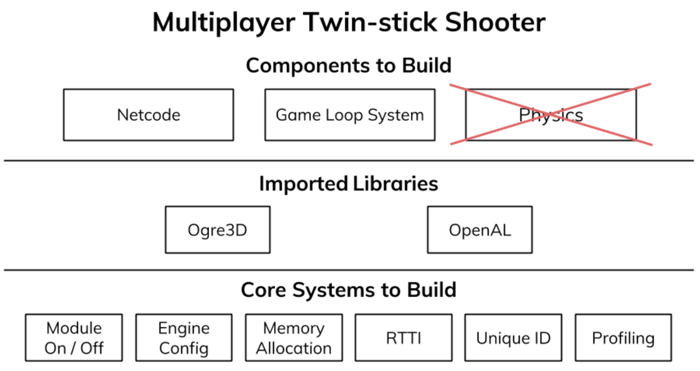

## Introduction

The Isetta Engine is a student-driven project about demystifying game engine development and providing a roadmap and relevant knowledge for novice developers. To do so, [our team](../team.md) will make a game engine by ourselves starting from a rendering framework, and document the process, pitfalls, and advice for our audience with periodic blogs. Besides that, we will conduct interviews with experienced professionals to augment our novice perspective. We believe the novice perspective from our blogs and expert perspective from the interviews will nicely come together and form a complete document to help people get started. 

The reason we think more work needs to be done in this field is that too many game engine developers wait until the completion of the engine, typically years, to talk about the development. These talks typically lose the minutiae of the actual daily struggles that took place in the development process. There are others who document their development which has been going on for years, which makes it a daunting task for newcomers to start following along. 

Although the project is aimed at helping novice developers, this is not to be used as a sole source of learning engine development. Being new engine developers ourselves, we can't guarantee the way we develop the engine will be correct, which is why interviews will help the project remain grounded. This means others who are learning can use what we've done as a guide and not necessarily the ground truth. The blogs won't be a walkthrough/tutorial/step-by-step instructions on how to develop an engine. We are learning as we go and suggest you do the same. 

    

This project is being done as a student-pitched project at the [Entertainment Technology Center](https://www.etc.cmu.edu/) (ETC). The ETC is an interdisciplinary Master's degree program at Carnegie Mellon University where students' main focus is working on small teams on a project each semester during a 3-month time period. Throughout the semester, a team's work will be presented to faculty and peers with feedback and critique being presented to help aid in the project development. Our particular project idea has gone through multiple iterations to do the following:

1.  Simplify the engine to be feasible within 3 months and
1.  Deliver content that would be useful, and hopefully enjoyable, to consume.

As of writing this, we've learned that creating content that will satisfy both is difficult and time-consuming, so we will be focusing on writing these milestone-type blogs as well as posting various types of content to test which is the best form of presenting our work. The short project duration also forces us to think clearly about our scope and be lean on the features we include before starting. 

### Schedule

During the course of this project **(08/26 - 12/16, 2018**), a blog post will be published every time we hit a milestone (core systems, game loop & rendering, networking, etc), and an interview will be published every 1-2 weeks. The interview schedule depends on our progress on the engine itself, as each interview's topic will be themed around our current work.

## Prerequisites

Although we will cover some basic features of engine development, it will profoundly help if you have experience in C++ programming and developing software, especially games, as our project won't provide step-by-step instructions on how to do everything. For a list of resources on how to gain related knowledge, please go to the [Readings](#Readings) section. 

Another prerequisite is passion for learning game engine development. As you are still reading this, we assume you are as excited about this as we are. This will be a bumpy ride, but you will have us on your side.

## Research

Being a student-pitched ETC project means that the project needed to pass through a pitch process of consulting and convincing faculty in the program. This allowed us to receive feedback about what could be considered a reasonable/manageable scope and where we might hit challenges for a general project. For this project to be a valid ETC project as well as accomplish our mission statement, there needs to be a fine balance between documentation and development. 

Before confronting the big monster of engine development and documentation, we thought it would be a good idea to gear up by getting input from people who have actually done this. During our pitch process, we reached out and got the chance to talk to numerous industry professionals and got extremely helpful advice from them. All of these suggestions helped us shape our project into what it is now and provided invaluable knowledge on how to start a game engine. Thus we encourage you, too, to approach professionals and get advice if possible. We've compiled our notes from our conversations with them into a write-up, which will be published soon.

### Why another engine?

Using an existing game engine like [Unity](https://unity3d.com/), [Unreal](https://www.unrealengine.com/en-US/what-is-unreal-engine-4) or [Panda3D](https://www.panda3d.org/) is always a handy option to make a game. These well-established engines have a strong collection of tools and APIs so that developers can focus on making the game, not the wheels. However, there is the limitation of not having full control over all systems in the engine as well as not knowing how the engine is processing the game logic and assets. These can obstruct the complex systems of an engine, so although you may have an understanding of how a physics or graphics engine works, each engine operates differently and optimizes for different constraints. 

In terms of learning about game engines and how to develop one, these established engines aren't a good source. Panda3D, originally developed by Disney and expanded by past ETC projects, has an old, unmaintained codebase with limited community involvement. What's more, it is not using the current industry standard language (C++). Unity and Unreal are both too massive and too cutting-edge to be suitable engine learning material for novices. In addition, Unity's source code isn't publicly available so you technically can't learn from it. The huge codebase sets a high threshold for any beginner to get started.

## Roadmap

The Isetta Engine will support the most primitive form of networked multiplayer twin-stick shooter game. Networked multiplayer was selected to be a part of the engine because it offers significant design and development challenge on every level of the project, and will help differentiate this engine from others being developed. We decided to create the engine in 3D for two reasons: Most AAA engines are 3D, and 3D requires more math and problem solving for us as developers to learn and grow from.

While planning, and before we knew too much about game engines, we had a basic idea of what a game engine would consist of. The image below displays the second/third iteration of what the Isetta engine would look like. We were initially naive thinking we may be able to do both networking as well as physics, however quickly came to grips that would baloon the scope too much. The audio and graphics were and are still planned to be imported from external libraries, and more of the discussion of what is imported and why will be included in a future blog. This diagram of the engine will soon be replaced with more in-depth explanations

As for our choice of the twin-stick shooter genre, we came to the decision after lengthy consideration of the components required to build other game types as well as how that genre would utilize multiplayer. Twin-stick shooters can effectively have little to no physics, which is different from collisions (this will be explained in [week 1 blog](week-1.md)). Likewise, the information passed between networked sessions is relatively minimal and not too strict on latency. What's more, a twin-stick shooter specializes in simplistic gameplay that doesn't need a world editor or too much design. 

During our Skype meeting, Walt Destler said, each game -and more particularly, each genre- requires vastly different netcode solutions. This is also one of the reasons why we prefer netcode over physics, as it can greatly narrow down the genre options. For example, multiplayer shooters, specifically PvP shooters, require small amounts of information to be passed (i.e. bullet and player locations) from server to client with relatively low latency. PvP shooters can also feature client-side prediction [^0] as well as the additional requirement of lobby/matchmaking with usually more than 2 players. On the other hand, genres like turn-based strategy require large amounts of information to be passed (all units, decisions, resources, etc.) to all users without too much concern for latency or prediction.

The other piece of advice we frequently heard from professionals and our faculty alike was the benefit of developing a game in conjunction with the engine. Doing so, they explained, allows you to prove and demonstrate your engine works as expected. The game can also test features to show immediate edge cases of the engine. 

Another nicety of developing an engine is that it can stop feature creep; when you keep expanding certain features that won't be utilized in the final product. What the game built from this engine _won't_ be is something original or necessarily fun. However, that's not to say a fun, original game couldn't be created from this engine. The idea of our sample game is to intentionally be derivative so features of a basic twin-stick shooter will be already included in the engine, rather than only specific features on our niche experience.

As stated, the game we are making is a simple twin-stick shooter, reminiscent of a game you would create when first learning game development. It is a simpler derivative of the _[Call of Duty Black Ops: Dead Ops Arcade mode](https://www.youtube.com/watch?time_continue=166&v=LSnAmsJGTwY)_, though without much of the polished and juicy gameplay _Call of Duty_ is known for. We have already developed a version of our game in Unreal, and we'll be replicating and using it to compare the functionality to our game engine. We will be able to create scenarios in the Unreal version of the game to then replicate in the Isetta Engine version of the game. Having a version of the game already built stops us from having to be concerned with the logic or design of the actual game, so we can focus on the engine doing exactly what the game currently does. It also allows us to pull the assets from the Unreal version of the game directly to the Isetta Engine without having to worry about a bad asset. In other words, if it worked in Unreal, it should work in Isetta because this is our minimal viable product (MVP).

<iframe width="100%" height="500px" src="https://www.youtube.com/embed/j7kMT83ViXo" frameborder="0" allow="autoplay; encrypted-media" allowfullscreen></iframe>

Since this project is already a large undertaking and restricted to such a short time, it simply isn't possible for us to write the code for every part of the engine. If you look at an industry engineer position, you'll see no single person writes code for the entire engine because teams are usually tens to hundreds of people. However, what everyone on the team needs to know how to do is integrate and use libraries created by others. Below is our engine plan broken down into seven oversimplified components: 

1.  **Core Systems**: The code underneath everything else which will be more familiar to software developers
1.  **Graphics, Audio, and Input**
1.  **Engine Tools,** which will help debugging and profiling the game
1.  **Resource Management**- how files are processed prior to the game running
1.  **Gameplay Foundations**- how the engine connects to game logic
1.  **Collisions**- the system for collidables but not handling actual physics calculations
1.  **Networking,** which will be layered throughout the engine to enable multiplayer. 

Of these components, number 1 will have a smattering of imported libraries to assist with problems that we believe wouldn't benefit us or the engine if writing them; 2 will be purely imported libraries because graphics alone could engulf a full 3 months (especially for 3D and animation); and 3 will use an existing profiler because our simplified version of a profiler may end up being unusable due to the lack of UI design. All other systems, though, will be implemented from scratch in the Isetta Engine, and possibly by you if you follow our journey.

## Readings

Creating an engine can be a daunting task, especially considering there is no clear starting point. When we started the project, we looked to others to see how we could be guided, but we were greeted with massive textbooks that were both daunting and dense. As fearful as we were, we read a few of these books and blogs in order to have a better grasp of developing an engine in such a short period. We strongly recommend you read some of these books, or at least the chapters listed, because it will give you a better understanding of the language we use as well as what we are trying to accomplish. Our goal for these blogs is to be able to explain what we are doing and why are doing it. However, we won't be covering the "how" because it takes time to develop content that is teachable. This is by no means an end-all list of engine books and resources; it is only what we used/think could be most useful.

### Books

*   [Game Engine Architecture](https://www.amazon.com/Engine-Architecture-Third-Jason-Gregory/dp/1138035459): This is the definitive game engine book, written by Naughty Dog's Jason Gregory. It shows readers the big picture of what a game engine is and has a complete discussion about each of the major components. Our team read the second edition of this book, because the third edition was just released July 2018. To have a brief idea of a game engine itself, Chapters 1, 4, 5, 7, 14, 15 are especially recommended.
*   [Game Programming Patterns](http://gameprogrammingpatterns.com/): Design patterns are general and reusable solutions to common problems in software engineering. Game developing shares some concepts with that field but has its own problems. This book is easy to read and not only goes over the classic design patterns, but also introduces game-specific design patterns. In our opinion, the most important patterns to know are:
    *   [Observer](http://gameprogrammingpatterns.com/observer.html) pattern: A great way to decouple different systems
    *   [State](http://gameprogrammingpatterns.com/state.html) pattern: Extensively used for controlling NPCs, animations, etc
    *   [Game loop](http://gameprogrammingpatterns.com/game-loop.html): The heart of almost every game engine
    *   [Data locality](http://gameprogrammingpatterns.com/data-locality.html): One of the fundamentals of data-oriented design
    *   [Object pool](http://gameprogrammingpatterns.com/object-pool.html): A ubiquitous solution for memory management
*   [A Tour of C++](https://www.amazon.com/Tour-2nd-Depth-Bjarne-Stroustrup/dp/0134997832): Modern C++ is always hard to follow, even for experienced programmers. This book is a thin handbook from Bjarne Stroustrup, creator of C++, designed for developers who have programmed before, and gives an overview of modern C++ (C++17).
*   [Effective C++ Series](https://www.aristeia.com/books.html): This series of books gives the best practices of C++ and covers most things used in C++ development. It can greatly improve the code quality and hopefully reduce StackOverflow searches.

### Blogs

*   [Handmade Hero](https://handmadehero.org/): Handmade Hero is an ongoing project to create a complete, professional-quality game from scratch. Casey Muratori, the developer, streams the creation of every line of source code and the videos are also available on Youtube and Handmade Hero website.
*   [Gaffer On Games](https://gafferongames.com/): This is a blog site by Glenn Fiedler, who writes in depth about game topics mainly focusing on physics and networking. It can be a great resource to understand an obscure topic better, or just learn about something you didn't know existed.
*   [Red Blob Games](https://www.redblobgames.com): Amit Patel, the author of Red Blob, aims to teach math and computer science topics through the lens of games. His blogs do a very good job of educating on topics that are closely related to games, and offer interactive examples throughout the page to augment just reading.
*   [How to Write Your Own C++ Game Engine](http://preshing.com/20171218/how-to-write-your-own-cpp-game-engine/): This blog is most similar to the blogs we will be trying to write, but on a more regular interval. It talks about Jeff Preshing's journey of writing his own game engine with a smattering of advice and nuances that he encountered.

### Videos

*   [CppCon 2014: Mike Acton "Data-Oriented Design and C++"](https://www.youtube.com/watch?v=rX0ItVEVjHc): Mike Acton discusses why data-oriented design is a much more appropriate view of programs than object-oriented design is, and why dealing with the reality of specific hardware and very low-level, platform-oriented optimization is more true than theoretical abstractions. Over the course of the presentation, Acton discusses three big lies of how code has been designed and what action programmers should take to rectify those lies.

## Coming Soon/Next Week

As of now, our team has finished a preliminary architecture design for the engine and the subsystems that will be implemented or imported from third party libraries. Engine development is already underway and in next week's blog we will share our design process for the architecture and the roadmap of development.

Besides the Isetta Engine development, the first interview with Adam Serdar, a Senior Game Engineer from Schell Games, will be coming out next week, so stay tuned!

[^0]: John Carmack: _"I am now allowing the client to guess at the results of the users movement until the authoritative response from the server comes through. This is a biiiig architectural change. The client now needs to know about solidity of objects, friction, gravity, etc. I am sad to see the elegant client-as-terminal setup go away, but I am practical above idealistic."_ For more, see: [Gaffer on games: What Every Programmer Needs To Know About Game Networking](https://gafferongames.com/post/what_every_programmer_needs_to_know_about_game_networking/)

<!-- GD2md-html version 1.0β11 -->
