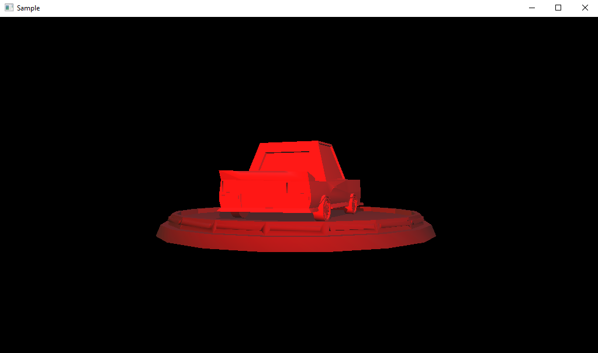
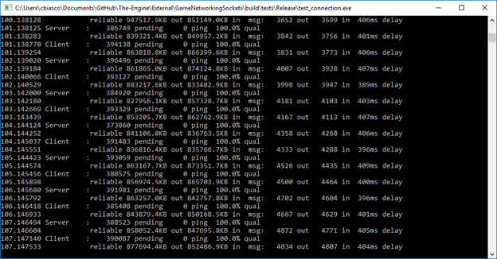
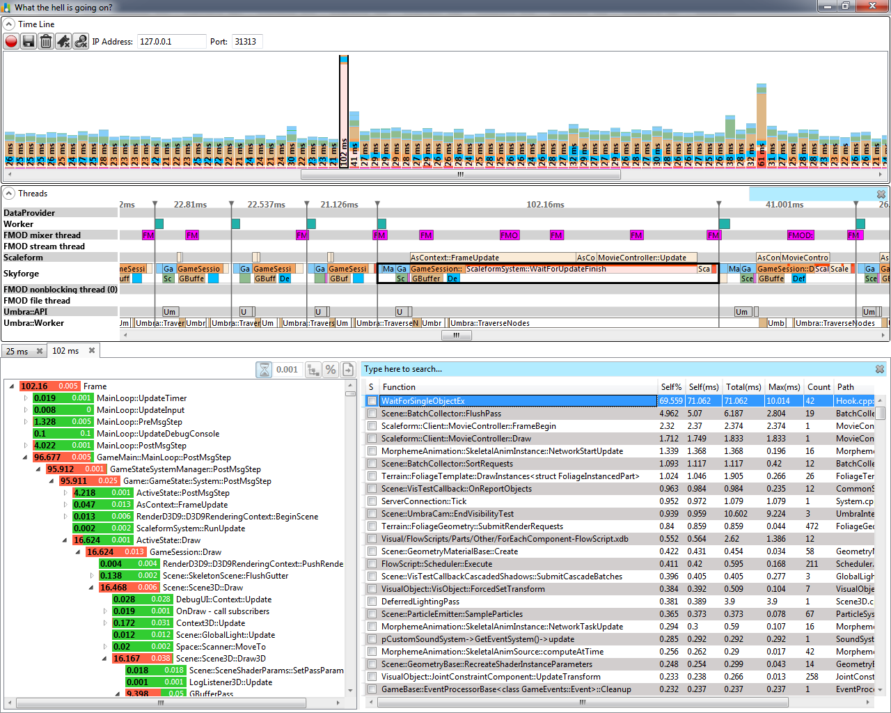
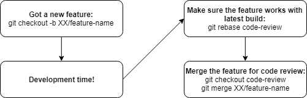

# The Building Blocks

### Byte-Sized Summary
* General setup: Talk about our development using GitHub, linter, API design, and unit testing -- hint: we are relying on standards established by others.
* [Roadmap](#roadmap): Roadmap of the engine’s development for the next 3 months, broken into thirds, each with systems we will building during it.
* [Version Control](#version-control): Set up Github repo and decided on workflow.
* [Rendering](#rendering): Chose Horde3D over Ogre and made a demo of it
* [Module Manager](#module-manager): Made all initialization and deinitialization private and made the module manager a friend class of all modules
* [Audio](#audio): Chose FMOD over OpenAL Soft, integrated it into our engine, and made a wrapper on it
* [Networking](#networking): Built the GameNetworkingSockets library and successfully ran a sample test
* [Profiler](#profiler): Selected Brofiler as the profiler and forked the repo in preparation of needed changes.
* [Debug Logging](#debug-logging): Programmed a logger to output to VS output window and log files as well as masking messages for channel and verbosity.
* [Error-Handling](#error-handling): Using Microsoft afx headers for assertions temporarily and using standard exceptions.

It's hard to believe we technically started less than two weeks ago! During the summer, we pored over planning what the project would include, approximating how much we could accomplish in 3 months and preparing ourselves by reading relative materials. This week we started making decisions on our engine (we have a [separate blog](engine-architecture.md) on this!) and actual development. Before full-on diving into programming, we set up three systems not directly related to our engine but can ease our development process.

First, we set up the version control system with GitHub. We recommend you use version control in engine development just as you would with any kind of programming project. It preserves the project's history (so you can do crazy experiments without worrying about destroying your project!) and allows a team to work simultaneously on the same project together. We have broken our repository into development and feature branches, where each feature branch correspond to one "block" in our architecture diagram (as seen below).

Second, we set up the Google Linter [^1] to ensure the coding style amongst the four programmers remain consistent. A number of professionals we spoke to told us that coding styles can cause arguments between programmers and thus slow down the project. To nip this in the bud, we decided to use an automated system and always default to what was established in the linter, rather than personal opinion. This would give us a consistent code base that someone, such as yourself, may be able to follow. Although we will do our best to follow best practices, we can't guarantee we will. We are more focused on developing our own engine than software engineering as a whole. 

[^1]: A **linter** is a tool that flags code for errors, bugs, stylistic errors, and suspicious constructs.

We have found ourselves using fallbacks when designing since we aren’t experienced with architecture or API design. Our primary fall-back is The Game Engine Architecture book by Jason Gregory; although we don’t want this book to be a required reading for our audience, there are times when we are having discussions where we ask, “how was it done in the book?” When developing the systems themselves we will try to find other sources that we also think could be useful, these will be included on our [Resources](../resources.md) page which will be linked and updated with each blog. With regards to API design, since we all have Unity experience and are comfortable with their API, some of our decisions will clearly be influenced by that.

On this note, we will be trying to develop systems as they would in an engine, but there is no guarantee it will be correct—in fact, it most likely won't be. We will be pulling from our knowledge of the _Game Engine Architecture_ book, since it is a book we have all read; however, we are writing about the topics from our understanding. We believe it is the journey of us talking about the topics, not necessarily the right decisions, which can be beneficial to you.

Finally, we set up a unit testing framework. This won't be used by the engine but we see it as a valuable system that can prevent code regression as we add new features. However, as with the coding standards, testing in general can subtract a large chunk of development time. So we are only doing light testing on public functions rather than the more lengthy full-coverage. If you have the time, we suggest you do full-coverage testing for your own engine.

## Roadmap

We have broken our architecture into 3 deadlines, over the next 3 months. 

The first deadline is September 24, where the base layer, the memory layer, tools, and our imported modules will be completed. The base layer is the groundwork of the engine and thus must be completed because the other systems rely on at least one of these systems in one way or another. The memory layer is the base for all modules, and needs to be done well because of the strong reliance on it. Doing it early allows us the opportunity to struggle through it as well as ample time to optimize. The tools will also be used throughout the rest of the engine which is why it is important to get them ready early. The imported modules are good to bring in early because it ensures that they work (which gives time in the case they don't) and can be a spike in motivation/confidence. Finally, starting the networking as soon as possible is something that we have been advised to do by many because it is integrated deeply with most systems.

")

The next deadline is October 22, where the utility layer, module layer, and networking will be completed. Networking is the biggest chunk of this roadmap phase because it's the largest unknown to us in our engine, and we want to prepare accordingly. The other systems being developed are in line with the future systems depending on them to function.

")

The final deadline is November 26, when we'll enter the feature lock phase. During the weeks following, we will be polishing the code as well as completing the game being built alongside the engine. The gameplay systems are in the highest layer of our engine, which is why it can be held off until the end, and the build portions of our architecture will be focused on at this point. Asset processing and caching can be held off until the end because they are features which convert final assets into playable assets of the final build of the game for better performance.

")

## Development

Based on our progress at the end of the first full week, we can what our team's four programmers accomplish would take 3-4 weeks for a single developer. It can be found on the [github repo](https://github.com/Isetta-Team/Isetta-Engine/tree/week-1) tagged with week-1.

### Module Manager
As shown in our [architecture blog](engine-architecture.md#core), the module manager takes charge of starting up and shutting down different modules like `AudioModule` and `RenderModule`. The design of modules seems to be straightforward. But when we got our hands dirty designing and implementing modules, we found that two factors affected our structure a lot: accessibility and initialization/deinitialization order.

#### Singletons, Globals, or a Manager
One of the common design is to make modules as global variables. However, using global variables might be dangerous since not only the `ModuleManager`, but also anyone else has access to the modules and can accidentally create the same module twice or modify the modules. Also, the initialization order of global variables in different files is unspecified. These two drawbacks can totally break a game engine. To prevent that, Singleton seems to be a better solution: it can restrict the instance to one and with construct on-demand technique[^2], we can also control the initialization order. 

[^2]: The **construct on-demand technique** in the context of the [singleton pattern](http://gameprogrammingpatterns.com/singleton.html) means that the single instance is only constructed when first requested. We can utilize this nature to control initialization order by manually invoking the getter for the singletons in the right order.

We found that both of the methods allow engine users to get access to the modules, which should be hidden from them. Also, neither of them can control the deinitialization order. If there is any dependency between two modules, the nondeterministic deinitialization order can crash a game. To fix those two issues, we finally turned to a more complex solution: we make all the constructors, destructors, as well as `StartUp()` and `ShutDown()` methods private in the modules and make `ModuleManager` as a friend class to them to instantiate and destroy them. Since initialization and deinitialization functions are both private and only the `ModuleManager` is their friend, the creation of a module can be perfectly controlled. Moreover, now we can completely hide the module classes from the engine users.

For naming methods, we chose to use `StartUp()` and `ShutDown()` functions for initialization and deinitialization instead of constructors and destructors because of readability. We would like to explicitly say that the module now is started or shut down, especially for the deinitialization which usually is done by calling the destructors implicitly.

### Rendering

From our research, we narrowed our candidate libraries down to two: one is [Ogre](https://www.ogre3d.org/) and the other one is [Horde3D](http://horde3d.org/). Ogre is a powerful and flexible 3D graphics engine. It has a long history and is well known in the game industry for a while. In _Game Engine Architecture_, Jason Gregory described it as a well-architected, easy-to-learn and easy-to-use 3D rendering engine. Horde3D, relatively, is a younger 3D rendering engine, which just released its first stable release last year (2017). 

Choosing between these two libraries was hard. Both are well-designed, well-implemented, and can bring good visual capacity to the game engine. Thus, we thought about it more from our project's perspective:

*   Importing the rendering library is supposed to simplify our workload. **Building the library should be easy, the documentation should be clear, and the interface should be easy to use.**
*   We are not building a game engine around the rendering library, but using the rendering library as a replaceable module. We would like the rendering library to fit in our engine design. **The library should be lightweight, flexible and ideally ECS[^3]-friendly**

[^3]: **Entity-component-system (ECS)** is an architectural pattern that follows composition over inheritance principle and is mostly used in games.

With the criteria above, we went through the building process and made simple demos with both libraries. For Ogre, we used Ogre 2.1 instead of the popular Ogre 1.x because Ogre 2.x fixed the architecture and performance issues pointed out by Mike Acton[^4].

[^4]: **Mike Acton** once made some notes on Ogre's source code: [bounceapp](https://www.bounceapp.com/116414)

After some experiments, we decided to use Horde3D as our rendering library. We don't think that Ogre is a bad library (its popularity disproves that!), but we believe that Horde3D fits better with the game engine itself for the following reasons:

*   **Building Horde3D is much easier than building Ogre 2.1.** The build process of Horde3D is so friendly that with one single click in CMake, we can have both GLFW (its dependency library) and Horde3D built. For Ogre, we need to download the dependency and core library from separate repos and build each of them separately. We also had to set the optimization of some components to /Od level (optimization disabled) to make it build successfully! Also, the official documentation for getting started was unclear and provides two sets of non-identical instructions in two different places.
*   **Horde3D is more lightweight and designed as components.** Ogre 2.1 has already encapsulated the rendering APIs into GameState and RenderSystem. To integrate it into our game engine, we will have to derive our solution from there. Instead, Horde3D only provides a small set of procedure interfaces, which allows us to implement the wrapper module by ourselves.

In the first week, we made a simple wrapper around the Horde3D as a proof-of-concept (see the HordeDemo folder). We will finish the wrapper as a module in the upcoming week.

### Audio

With the requirements listed in our [architecture blog](engine-architecture.md#audio) (a library which allows us to allocate the used memory ourselves and is widely used in the game industry) we started our research and found two strong candidates: OpenAL Soft and FMOD.

OpenAL caught our eyes first because it seemed related to OpenGL (it's not, but they do have other things in common), and we found an open source implementation of the standard named [OpenAL Soft](https://github.com/kcat/openal-soft). On the other hand, we had heard of FMOD because Unity uses it on several platforms, and we think it's a good candidate purely from the [huge list of games](https://www.fmod.com/games) (with some hit titles) that use it.

We chose to give OpenAL Soft a try first because it's open source, while FMOD is owned by a commercial company and is not free (however, it does provide a free license for indie games with a budget under 500k). However, the team member who was assigned the task failed to get anything working in 3 hours, by the end of which he was still confused and stuck. This is partially due to the lack of Getting Started documentation and tutorials online, and partially because he is not experienced with audio APIs at all.

Then we decided to experiment with FMOD. It turns out that FMOD's low-level API is surprisingly easy to integrate and use, and has a [comprehensive documentation](https://www.fmod.com/resources/documentation-api). We were able to get the library integrated and play our first audio clip in 2 hours, with the help of some Getting Started tutorials [^5]. We think that, for novice engine programmers, these kind of tutorials are invaluable. They are a great way to introduce you to a new field and get you up and running quickly. Also, thanks to the FMOD documentation, we easily found the way to control its memory usage with [`Memory_Initialize()`](https://www.fmod.com/resources/documentation-api?page=content/generated/FMOD_Memory_Initialize.html#/). FMOD also provides a [tutorial](https://www.fmod.com/resources/documentation-api?page=content/generated/overview/memorysaving.html#/) on managing its memory!

[^5]: We referred to two tutorials by Cody Claborn when integrating FMOD API. [Setting Up Xcode and Visual Studio for FMOD Development](https://codyclaborn.me/tutorials/setting-up-xcode-and-visual-studio-for-fmod-development/) and [Making a Basic FMOD Audio Engine in C++](https://codyclaborn.me/tutorials/making-a-basic-fmod-audio-engine-in-c/)

After stitching the FMOD API into our project, we continued using it to create a minimal audio engine. It takes care of loading sound files, managing loaded sound assets (with the help of [string-id](engine-architecture.md#core)), playing sound, managing a sound's play mode, managing a sound's lifetime with pause/continue/stop, and prevent memory leaks. You can take a look at the source code: [`Audio.h`](https://github.com/Isetta-Team/Isetta-Engine/blob/code-review/Isetta/Isetta/Core/Audio/Audio.h), [`Audio.cpp`](https://github.com/Isetta-Team/Isetta-Engine/blob/code-review/Isetta/Isetta/Core/Audio/Audio.cpp)

#### Who Owns the Sound?
In the current design,  every `AudioSource` owns an instance of `FMOD::Sound` and is responsible for loading their own audio clip. However, this prevents the same loaded `FMOD::Sound` from playing in multiple instances. For example, if we have a gunfire sound, which can possibly be played 3 times every second, we need to make a new `AudioSource` and load the same sound by calling `FMOD:System::createSound` again. This is clearly not what we want and definitely won’t satisfy the game’s requirements.
Solution
`AudioModule` now load all audio clips at startup and keep a SoundClipID to loaded `FMOD::Sound` `unordered_map` for later access. This guarantees that each audio clip won’t be loaded multiple times. 
On the `AudioSource` side, each `AudioSource` no longer owns an `FMOD::Sound`. Instead, they only contain a pointer to an `FMOD::Sound` instance that is managed by the `AudioModule`, and the instance that the pointer points to can be changed easily. This allows `AudioSource`s to be reused and allow a single `FMOD::Sound` to be referenced by multiple `AudioSource`s and play at the same time.
In this design, if the user wants to play a sound, they can create a new instance of `AudioSource`, and set that `AudioSource`’s pointer to the already created `FMOD::Sound` by passing in the name of the sound file, and call `AudioSource::Play()`.
A side note: the SoundClipID mentioned before is the hashed string id (of type `int64`) from the sound clip’s file name, by utilizing the StringID we brought in. 

#### Refactoring Broke the Audio
`AudioModule` was written as a singleton class and `AudioSource` was using it heavily, because `AudioModule` is the only class to interface with `FMOD::System`. After refactoring `AudioModule` to be part of `ModuleManager`, the `AudioSource`’s will no longer have direct access to FMOD. In order to save our sound, a static pointer to  `AudioModule` was placed in `AudioSource` allowing access to the FMOD system.

### Networking

Our original plan for running low-level networking sockets was to use [Valve's GameNetworkingSockets](https://github.com/ValveSoftware/GameNetworkingSockets) because of the feature set it lists, which we hoped is extensive enough for us to avoid pitfalls in network programming. Other options were either too flimsy or too low-level, and since none of us have game networking experience, we want the most straightforward option possible.

At the time of writing this, the GameNetworkingSockets library is a pretty big pain to build, involving several installs and build steps. One of us even took a couple of days automating the build process, and it's still not 100% consistent! Beyond this, the resulting API seems to cover our engine's use case, which is as minor as we can possibly make it without removing networking entirely. Unfortunately, the codebase is still heavily in clean-up mode, and that makes it less accessible for integrating our own allocators and APIs with it. Not to mention that very little exists for documentation.

Recently, we found another heavily featured networking library named [yojimbo](https://github.com/networkprotocol/yojimbo), built by [Glenn Fiedler](https://gafferongames.com/) of game network programming fame. This library appears to be more ready for integrating into our own engine, albeit with equally as poor documentation (there's a bit of Doxygen to use, I guess). One big plus to this library is that it's not riddled with commented-out code like the GameNetworkingSockets one is at the time of this writing, which makes us lean more toward yojimbo.

We've yet to determine the fate of networking in our engine, so you'll likely hear more on that progress from us next time.

### Debug Logging
The logging system can be the quickest form of debugging and getting information about the state of the engine and game. The requirements of our engine are:
1. Be able to pass a formatted string
2. Have different channels and verbosity levels and mask which display
3. Write the logs to a file
4. Write to the Visual Studio output window (not the console)
   
A channel is simply a category the message can be grouped with, such as animation & audio, which helps when multiple programmers are on a project from seeing logs of the other features. The verbosity level is for determining whether the message is important enough to be displayed or whether the programmer wants to see messages which have less priority/consequence. Channel and verbosity are both enums, but the logger implements a mask for both to determine if a log message should be displayed. The logger can also write to a file, but requires the destination to passed to a setter in the case logging to a file is wanted. There was originally only going to be one file where all messages were written to regardless of whether it matched the channel and verbosity masks, because in the case of a crash we would want as much information as possible to debug where the crash might have occurred. This was expanded to having a file where only messages from specific channels are written, in the case you are only interested in that information. There cannot only be a channel file, ie. without an engine file, since the engine file will contain all information including overlapping information with the channel. The channel file is more convenience, but can lack information that we wouldn’t know is necessary in the case of a crash.
#### Why We Need a File System
During a later discussion on debug logger, we realized that we were intertwining a file system (including file paths) with the logger which felt wrong.  After talking about this, the file system was decided to be extracted and made into its own system, which is still in development. The logger now waits for a pointer to a stream to use rather than keeping track of its own.

### Error-Handling
There are 2 main types of error handling in our engine: assertions and exceptions. 

Assertions are points in code that expect an expression to evaluate to true, otherwise, crash the program, or break into the debugger in Debug mode. Typically, assertions are removed in release builds to avoid unnecessary crashes, but are a useful tool in debug mode to ensure the code is acting as expected, as it can immediately direct the person’s attention to the place where things might be wrong. Assertions should be primarily used for checking bugs rather than checking things involving user input, where user input for an engine is the developer of the game. We are currently using Microsoft’s afx library as it offers many features, but it requires MFC [^6] and we are not sure if it will cause problems in the future

For checking errors possibly caused by bad user input (a programmers not understanding a function use), such as trying to access the 4th element of a Vector3, we use exceptions. We are defaulting to standard library [exceptions](https://en.cppreference.com/w/cpp/error/exception), and in the case we need a more specific error we will extend the exception class.

[^6]: The **Microsoft Foundation Class** library is an object-oriented C++ library that contains useful macros for exceptions, run-time type identification, serialization, and more.
Math
Math isn’t a very complicated system, it’s all the components you would need in a typical math library. Our methodology with the Math library is to create what we need now as well as what we foresee needing but not more. For our math library, we have followed Unity’s API design fairly closely.

### Profiler

For the profiler, we imported [Brofiler](http://brofiler.com/), a C++ game profiler developed by Vadim Slyusarev. We picked Brofiler because is it is a lightweight and made specifically for games (not software in general) and has an easy-to-read UI. The library is open-source and relatively easy to integrate, although it's a bit outdated and requires some rework for our project. To help keep followers of our work from reworking the profiler with their own engine, we created a fork of the original Brofiler repo with the necessary changes to get it running. It can be found [here](https://github.com/Isetta-Team/brofiler) and will likely make integration in your engine easier!

The Brofiler tool has also been used on the game _Skyforge_ and has been integrated into CryEngine, although CryEngine creates a wrapper around Brofiler. With more time, we would do the same, but it doesn't seem necessary for basic usage. Examples and the original repo can be found on the [Brofiler github](https://github.com/bombomby/brofiler).

### Math
Math isn’t a very complicated system, it’s all the components you would need in a typical math library. Our methodology with the Math library is to create what we need now as well as what we foresee needing but not more. For our math library, we have followed Unity’s API design fairly closely.

### Version Control

We chose Github as our version control platform as we are open sourcing the game engine and hosting a website with all the documents along with the engine.

We also established a workflow to help us collaborate effectively. We decided to open a new branch for each feature and only merge it back to the "trunk" when finished, because a game engine is really a feature-heavy product. This strategy enables us to work on multiple features at a time without interfering with each other. The common use case is like this:

## Coming Soon/Next Week

We enjoyed this round of blogging! If you have comments about how you think we could improve as well as if we said anything wrong, we would be very grateful to hear about them in the **comments** section below. On Saturday, September 8, 2018, 3pm Eastern time, we will be live-streaming an interview with Casey Muratori on his channel [HandmadeHero](https://www.twitch.tv/handmade_hero) on Twitch. We will be posting an edited transcription of the interview at a later time in case you missed it.

We'll be checking in again with another progress update soon so stay tuned, and subscribe to our mailing list to get notified!

## [Resources](../resources.md)

The [resource page](../resources.md) has been updated to include links we found useful this week, too!

<!-- Begin MailChimp Signup Form -->
<link href="//cdn-images.mailchimp.com/embedcode/classic-10_7.css" rel="stylesheet" type="text/css">

	<form action="https://isetta.us19.list-manage.com/subscribe/post?u=1d83cb806c55e205be26db856&amp;id=860c7d79cf" method="post" id="mc-embedded-subscribe-form" name="mc-embedded-subscribe-form" class="validate" target="_blank" novalidate>
	    

			<h3>Subscribe to our mailing list</h3>
			
Get notifications about the upcoming blogs and interviews!

			  
			

				<label for="mce-EMAIL"> </label>
				<input type="email" placeholder="Email Address..." name="EMAIL" class="required email" id="mce-EMAIL">
			

			

				

				

			

		    

		    	<input type="text" name="b_1d83cb806c55e205be26db856_860c7d79cf" tabindex="-1" value="">
		    

		    

		    	<input type="submit" value="Subscribe" name="subscribe" id="mc-embedded-subscribe" class="button">
		    

	    

	</form>

<!--End mc_embed_signup-->
