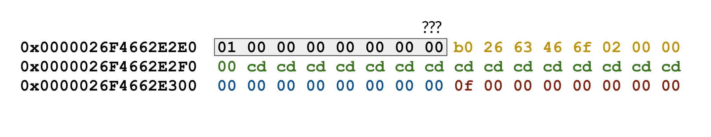

## Byte-Sized Updates
*   [Graphics](#graphics) Added in functionality to the texture class, so it now does more than just loading and can actually be used!
*   [Tools](#tools) Abstracted some previously developed tools into an editor component which is already proving valuable for development!
*   [Custom Dynamic Array](#Custom-Dynamic-Array) We were originally not planning on creating our own data structures and just relying on STL but we gave into the temptation and it revealed some dark secrets.
*   [Second Game](#Second-Game) We made our second game (which is not a twin stick shooter) and it works!
*   [Patch Notes](#patch-notes) There's typically not a header for patch notes, but this week we found some really interesting bugs, mainly involving memory, which we think were great learning experiences.


Progress may have slowed due to our trip to LA, but we can assure you it wasn't for nothing. Our initial plan to go out there was decided months back; we had a full lineup of industry professionals who agreed to do interviews and look at our engine progress. Of course, in the fast-moving game industry, the best laid plans don't always come together. A number of our planned interviewees had to drop out at the last minute, which left us in a bit of a panic. 

We reached out to about a dozen other contacts in LA to try and find some other people we could talk with. One of those contacts was at Sony's Santa Monica Studios, and he was able to get us in touch with [Jeet Shroff](https://twitter.com/theshroffage) and Florian Strauss, gameplay and technical directors on the latest _[God of War](https://godofwar.playstation.com/)_. What's more, we still had an interview locked in with Insomniac Games' senior engine programmer and ETC alumni [Elan Ruskin](https://twitter.com/despair). We also finally got to meet up and talk shop with Cort Stratton of Unity, who has been supporting us all semester long. Because these were all on-site talks, we were able to get a lot of clear answers to our questions and more direct feedback. 

While the extra downtime wasn't ideal, it did give us an opportunity to catch up with our classmates who were in LA on internships and new jobs. Ultimately, the trip was more productive for the team than expected.

In terms of development, be prepared to see talk about memory throughout the blog because we were leaking memory left, right, and center!


## Graphics
### Texture

Looking back at [week 5](week-5.md/#gui-and-textures) we realized we needed to be able to load textures outside just our graphics module, specifically for GUI images. As stated then, ImGui isn't an image loading library, so our images had to be loaded into our engine from another module. Horde3D has texture loading functionality, but how the functionality worked wasn't apparent or well documented. After struggling with Horde3D for too long, we had the texture in BGRA stored in a `uint8_t`.

The ImGui library still needed the image in the renderer's format. The renderer we're using is OpenGL, so the the texture needs to be loaded into OpenGL memory—ImGui provides an example of how to do this, however the sample code alone won't load the texture. Not knowing OpenGL well enough, we ended up spinning up a completely isolated project with a simple OpenGL scene to test texture loading. Following [this tutorial](https://learnopengl.com/Getting-started/Textures), we were able to get the textures loading right away but there was a lot of unneeded code, so we just had to find which parts of the texture loading were necessary.


After a quick bit of debugging, we figured out that the texture filtering line was what was stopping the image from being loaded into the engine. In other news, we made the brilliant decision to let our color-blind programmer work on the texture loading, so we almost missed the fact that our red and blue channels were getting flipped! Luckily, he got another developer involved and the bug was found before the code was committed.

The texture class originally was set a static loader, but was changed to hold specific file data, height, and width. This texture can then just be passed directly into the GUI system, rather than passing data and size separately. Here is a colored image loaded into the GUI of the engine!


Because we are using Horde3D to load the texture, it is storing it as a resource in its resource map and attempts to destroy the texture on Hored's destruction. We originally ran into an issue when trying to destroy the texture ourselves because we were trying to delete something we weren't the owners of. A simple call to Horde3D to release the memory allowed us to implement a `Texture::Unload` function, and we learned a good lesson on remembering to keep track of who really owns what.


## Tools

[Last week](week-9.md#console), we spoke about developing a console, and in the past we had developed smaller tools like an inspector and hierarchy. These tools were developed out of necessity, and we can see a game developer who uses our engine finding them useful, so we thought we should wrap all these tools in an `EditorComponent` available as an engine component.

When we went to do this, we realized the inspector and hierarchy code were embedded in the `Transform` and `Entity`, which meant the developer was always stuck with them. They weren't even wrapped in a preprocessor conditional statement! After some refactoring, we were able to pull each of those GUI code blocks into their own component, which also allows for additional flexibility in the future.

Honestly, though, the inspector, hierarchy, and console shouldn't be components but rather some type of editor code, because it doesn't make sense to attach them to entities within the scene. However, adding in an editor type to support this would certainly lead down a rabbit-hole of creating an editor, which we can't afford to do. So in the end, we really did decide to package the three components together into an `EditorComponent` with a menu and key commands to open.

> The key commands to open the windows prompted us to include [modifier keys](#modifying-input-with-modifier-keys) support for the keyboard.


## Custom Dynamic Array

This past week, we created a custom vector class labeled `Array` so as not to be confused with `Vector3` and our other math classes. The main reason for recreating `std::vector` was it is one of the most heavily used data structures in our engine yet it doesn't use our memory allocation, and that wasn't sitting well for us. Creating the basic functionality of the class was very straightforward, and using the STL vector as a guide for functions and naming, the implementation was completed relatively quickly. However, to fully mimic the functionality of the `std::vector`, we needed to implement iterators, which wasn't as straightforward as it seems. We didn't find any amazing resource on the subject, so it's still something we feel shaky on within our `Array` class. Learning from past mistakes, we tried to do a good unit test coverage of the whole class, and that helped us iron out the easy-to-find/fix bugs (like using prefix operators instead of postfix operators with sizing/capacity changes). This was also before the `Array` was integrated into the engine, so changes didn't cause massive recompile times—always a plus for rapid development!

Unfortunately, as you might expect, once our `Array` class replaced the STL vectors in the engine, we found _way _more bugs. Most of the bugs actually lead us to find bugs within our memory management, and for that, they deserve their own sections: [A Drawback to Preallocating All Your Memory](#A-Drawback-to-Preallocating-All-Your-Memory), [Initialization Timing and Memory Management](#Initialization-Timing-and-Memory-Management), and [Placement New for Arrays is Undefined](#Placement-New-for-Arrays-is-Undefined).

These were fairly involved bugs with our memory, so we are glad we ended up implementing the custom vector class. We also still have other memory issues that we weren't able to solve this week (or even understand yet) which we will be writing about in future weeks.

One of the issues we found from testing but wasn't resolved until actually running the engine was our move operator for the `Array`. We were testing the move assignment operator in the test suite which worked as expected; the contents were moved over and everything looked good. However, what wasn't being shown during tests was the move _constructor_ of `Array`. This function was actually performing a copy rather than an actual move with the memory, so the `Array` originally holding the contents still had access to the contents. This means that, when one object was being deleted, the other would also have its contents removed—they were linked! We discovered this when we would return an `Array` from a function. The local copy would perform a move operation to store the contents in the return statement, then it would delete itself, which would in turn delete the returned variable (which shared the same slot of memory) as well. Fortunately it was a simple fix, all we had to do was fix the move constructor, but tracking this down required a little more thought with regards to C++.


## Second Game

As mentioned in a [previous blog post](https://isetta.io/blogs/week-7/#first-game), one of our major milestones is that we made a "real" game with our engine. This allows us to validate the features we have implemented as well as to find missing features we need. Last time, we made a twin stick shooter that is quite similar with our target game, but this time we wanted to make something different. The major differences between our current engine and the old engine are the networked entities, the event messaging system, and the polished entity system. Based on these new features, we want to make a simple multiplayer competitive game that can utilize those new features best.

Finally, we decided to make a 3D fencing game like [Nidhogg](https://store.steampowered.com/app/94400/Nidhogg/). Here is the playthrough video of the game:

<div class="video-wrapper">

  <video playsinline autoplay muted loop>

    <source src="../../images/blogs/week-10/block_fencing.mp4" type="video/mp4">

Your browser does not support the video tag.

  </video>

</div>

Here are the game features that utilize the new engine features implemented in the last couple weeks:


*   We used `NetworkTransform` to sync the position of two networked players and their swords
*   We used network callbacks to send different messages across the server and the clients, including the player ready message, the game start message, the player switch sword position message, the player attack message, the attack result message, etc.


*   We used the event messaging system to decouple `W10NetworkManager` (W10 means week 10) and `W10UIManager`. The UI automatically changes when a "UITextChange" event is raised

The process of making the game again proved the fact that making demo games is a good way to test our engine's features. Though we are doing some in-engine tests when implementing different systems, the game breaks a _lot_ more than the in-engine tests do. Here are the bugs we found this time:


*   The order of rotating an object is not correct. In the API, we allow the game developer to rotate the transform in euler angles. We will then convert the euler angles into the quaternion. However, due to the left-to-right multiplication order of matrices, we thought the quaternion should also be left multiplied. It turns out that quaternions are not matrices, so the order should just be yaw * pitch * roll. Otherwise, you will see an artifact like this:

<div class="video-wrapper">

  <video playsinline autoplay muted loop>

    <source src="../../images/blogs/week-10/quaternion-bug.mp4" type="video/mp4">

Your browser does not support the video tag.

  </video>

</div>


*   `Entity::Destroy` is still not working properly. This time, the entity is removed from the entity list while its children are not destroyed, and those childrens' parent pointers are still pointing to the deleted parent entity. This is not fixed yet but again, we put it into our to-do list.
*   The prefix and postfix unary operations of our`Array` were reversed, which broke the priority queue of our event messaging system when we tried to queue multiple messages in the event queue.

Also, we found some missing features when making the game:


*   When we tried to change the parent of a `NetworkTransform` to another network entity on one machine, the changing of the parent didn't get synchronized through the network. Though the gameplay code can add more messages to notify all the clients, it is still a useful feature for the `NetworkTransform` since `parent` is a field of our `Transform` class.
*   There was no way to force the `NetworkTransform` to be synced. This was problematic at the beginning of the game because if two `NetworkTransform`s were spawned at different positions, the position wouldn't get synced until it moved (when the first position update message was sent to the server).
*   There was no way to "force-snap" the `NetworkTransform`. Sometimes in a game, we want to set the position, like pick-up behavior where you receive the item instantly or portals that teleport you across the map. However, with the networking module's interpolation mechanism, we would always be stuck with an interpolated position instead of a snapped one.


## Patch Notes


### Modifying Input with Modifier Keys

Modifier keys are keys on the keyboard which can be pressed alongside other keys to alter the received input. The four modifier keys GLFW supports are `CTRL`, `ALT`, `SHIFT`, and `SUPER`. The reason we saw the need to add these was for any type of developer feature, you don't want to lose gameplay functionality of your keys when debugging, so with modifier keys you can an easier time debugging. While developing the [`EditorComponent`](#tools) we thought it would be a good idea to have shortcut keys; other developers might find the same need or will want to use them in a game, and it's no skin off our back to add the functionality since it's already supported by GLFW.

This required us to refactor the `InputModule` to have key-modifier pairs rather than just keys, and then be able to search and remove based on those pairs. To keep things backwards compatible with the old system (the one without modifier keys), the `Input` class which holds the publicly available commands to access `InputModule` was changed to have a function for registering and unregistering keys with modifier keys and the old function definition, without modifier keys, was left unchanged with a `0` passed to the `InputModule` to signify no modifier key. Modifier keys can also be chained to form a mask with the bitwise-OR operator as well, to allow for even more possibilities!


### A Drawback to Preallocating All Your Memory

Way back in the second week of the project, [we talked about](engine-architecture.md#core) how our memory management would be all of our own and we would be keeping the dynamic allocations to a minimum. If we also want to avoid a whole bunch of context switches between user and kernel modes, then this means one thing in particular: We should preallocate a massive chunk of memory at startup that we use for the rest of our individual allocations.

This is generally a good idea if you're creating your own memory allocation system because you can avoid unnecessary runtime overhead and you can reason about the actual physical layout of your memory to effectively utilize the memory cache. Up until this point in development, we've only seen good results from this too (outside of probably grabbing more memory than we need), but we've just run into the first major problem that this method brings with it: _When accessing allocated memory, the system will not complain about your access privileges if you happen to overlap allocations_.

In our predicament, we were running the game like normal when all of a sudden, our free list memory would run out instantly! After about an hour of debugging, we determined that the last contiguous chunk of memory (or node) in the list was having its `size` field overwritten at some point. We used some data breakpoints to suss out the actual moment when `size` was being overwritten, and...it was when we were loading in audio clips. Yeah. You're probably as confused right now as we were at the time.

As it turns out, we were working on an `Array` class which has a `capacity` field that defines how big the actual array is in memory (the max number of objects it can hold), and a `size` field that defines how many elements are inside of the array. We had mistakenly not increased the actual `capacity` when an element was pushed into `Array`, so even though the object was touching and changing the Nth element in its array, it really only owned the memory for N - M elements and _it was changing the memory owned by another object or system without any warning or error_. Normally, this would give an instant exception at the exact place where you try to access the memory, but because we technically own all of the memory, the system thinks the access is kosher and lets it go through. This was also not found in our testing because since we owned all the memory and nothing else was using the memory, it was alright to access the next chunk because nothing else was in that space.


We won't be changing the foundational strategy to our memory management system anytime soon, but we will be more careful in the future regarding our memory accesses. This occurrence also gives us a pretty good reason to implement a memory tracking system such as the one C++ uses, but for now we're more wary of the performance hit that will cause us rather than the few times we'll run into this kind of bug again in the future.


### Initialization Timing and Memory Management

Having a memory manager is very nice for the reasons stated in the [portion above](#a-drawback-to-preallocating-all-your-memory), and we've already seen considerable performance gains from our manager over using the regular `new` operator. We've even begun to switch over from the STL data structures to our own custom data structures that use our memory allocators!

Not everything is peachy though, and even with a very robust memory management system, you won't quite get the flexibility of the `new` or `malloc` operations. Why? Because the C++ memory allocation system is always active. Our `MemoryManager` exists on top of a module within our game engine, meaning the game engine needs to boot up before we can do any memory management. This seems like it would be fine until you get to a pretty common concept in C++: Static variables.

Static variable allocation happens when the variable is first found, so for class static variables, that's upon program load, and for function static variables, that's upon running the function for the first time. Static variable deallocation happens at program unload, so after the `main` function has run and returned. Now, if you think about it, where does the memory manager fit into all of this? Unfortunately it starts _after_ program load and shuts down _before_ program unload (as one might expect!).

So if we want to clean things up nicely with our memory management system, then we can do two things:


1.  Add a `StartUp` and/or `ShutDown` function to every system with a static variable and handle the allocation/deallocation inside of those functions instead of inside of the constructors and destructors.
1.  Make our memory management system two phase, which would start up every globally needed system (like `Config`) before anything else gets started, then would continue on like normal.

Thing 1 deals with our static memory problem pretty nicely, whereas Thing 2 is mostly a nicety for keeping things in the correct order and might allow us to avoid using static for some systems. We've already started doing Thing 1 out of pure necessity, and if we find it convenient enough (i.e. more of our systems need to be started up "first"), then we may approach Thing 2 as well.


### Placement `new` for Arrays is Undefined

When we were implementing the `MemoryManager`, we provided a `NewArr` function to allow us to get a continuous memory chunk from our stack memory or our free list memory. The way we do this is by calculating the address of that memory chunk and constructing the array in that specific address by using [_placement_](https://en.cppreference.com/w/cpp/language/new#Placement_new) `new`. It worked well in most cases, but when we used it to allocate an array of strings, we found something very strange.

Before we look into the strange things, let's go over the basic properties of a string. A naive implementation would require three fields: The pointer to the allocated memory (the characters), the size of the string (how many characters are we storing), and the capacity of the string (how many characters could we store). On a 64-bit system, the total size of a string object should be 24 bytes. However, MSVC[^3721] does some [optimizations](https://shaharmike.com/cpp/std-string/) which expands the `sizeof(std::string)` to 40 bytes. The basic structure is some pointer (maybe pointing to the vtable[^1]), the pointer to the allocated memory, the size and the capacity.

[^3721]: Microsoft Visual C++ (**MSVC**) is an integrated development environment (IDE) for writing and debugging C and C++ programming languages.

[^1]: Virtual table (**vtable**) is a lookup table of functions used to resolve function calls. It's mostly used in C++ inheritance.

Okay, let's first see how placement `new` works on a normal `std::string` object.

```cpp

#include <cstdlib>

#include <string>

int main() {

  void* allocationPlace = malloc(4 * sizeof(std::string));

  std::string* str = new (allocationPlace) std::string{"Testing the normal string"};

  free(allocationPlace);

}

```

In this code snippet, we first allocate a chunk of "clean" memory to test, then we construct a string holding "Testing the normal string" at the beginning of that memory chunk. After the placement new, the memory layout is like this:


There's no overhead and no overflow. The string takes up exactly the whole 40 bytes. However, when we decide to allocate an array that only contains a single string, unexpected things happen.

```cpp

#include <cstdlib>

#include <string>

int main() {

  void* allocationPlace = malloc(4 * sizeof(std::string));

  std::string* str = new (allocationPlace) std::string[1];

  free(allocationPlace);

}

```

In theory, an array is the same as a pointer that points to the continuous data. It should have no overhead in memory. However, using the placement `new` statement, strange bytes are inserted before the string array.



After several tests, we figured out that these bytes represent the length of the array. It seems that the placement `new` statement is adding an additional guard in the front of memory chunk, so if this guard is added every time the placement `new` constructs an array, it kind of makes sense for us to add an additional 8 bytes to hold the length of the array.

Sadly, this doesn't make sense in C++-land. When we tried again to allocate an array of integers instead, there's no guard memory any more! 

Is there a way to tell whether the guard will be added or not? Not really. We asked Google for help, and from this [StackOverflow thread](https://stackoverflow.com/questions/4011577/placement-new-array-alignment?rq=1), we learned that the offset may be different for every invocation of the array, so we can hardly use this in our precisely controlled memory manager.

Is there a way to construct an array at the specific address without using placement `new`? Fortunately, yes, and the solution turns out to be very simple. All we need to do is manually iterate through the array and construct (or allocate) every single element! It's not the most elegant solution, but it's straightforward and doesn't have any undefined behavior hidden inside of it.

Debugging this memory issue was hard but very interesting. It also helped us to use Visual Studio's memory inspector to debug, which is a very good practice for us to keep up!


### Making the Network "Local"

Originally, our `NetworkTransform` class checked the world position, rotation, and scale to know whether or not it should be sending any messages over the network. This was due to us wanting consistency for our `NetworkTransform` behavior; an object whose parent is scaled to 100 units being moved .001 units in local space will move the same distance as an object whose parent is scaled to 1 unit being moved 1 unit in local space, and the straightforward way to keep those distances matching is to just work in world space.


Well, as it turns out, world space brings its own slew of messes. For some reason, we didn't test out our networked transforms on parented networked objects, and as you can probably now imagine, it was not just a disaster, but a very bandwidth-wasteful disaster! We decided to shift almost all of our calculations and data to local space afterwards, with the one exception being the case mentioned above; when we want to know whether or not we should be sending an update across the network, we quickly convert to world space and check that.

This also got us to realize that we need a more robust set of tools to be doing network features in games. The first is that we should definitely have some form of "parenting" functions that utilize network IDs and network messages for keeping parenting synced across the network. The second is that we should be able to force sending a message (i.e. send a transform message across the network regardless of the position, rotation, and scale deltas) in the case that we need to guarantee correctness across the network.

We're still iterating quite a bit on our network programming, so you'll no doubt see more things that we patch up in the coming weeks!


## Coming Soon

What's to come in the next few weeks? The engine ideally. We have 2 weeks left before our intended feature lock, and we still have a lot to do... We aren't _too, too _worried, but just like the game industry, we foresee crunch coming our way in the very near future.

We posted our interview with [Raymond Graham](../interviews/RaymondGraham-interview.md) this past week, and we definitely think you should check it out. We will posting our interview with [Jeff Preshing](../interviews/JeffPreshing-interview.md), [Elan Ruskin](../interviews/ElanRuskin-interview.md), and [Jeet Shroff and Florian Strauss](../interviews/JeetShroff-FlorianStrauss-interview.md) as soon as we can, which will be very soon because we will be releasing a small book of all of our interviews in the coming weeks!


## Resources

Not much was added in the resource section this week, but it still remains a great source. We even find ourselves going there to see what the others on the team are using, especially when debugging systems that aren't our own. If you have any resource that you think we should take a look at, please let us know!

_Originally Published November 13, 2018._

<br>

<!-- Begin MailChimp Signup Form -->
<link href="//cdn-images.mailchimp.com/embedcode/classic-10_7.css" rel="stylesheet" type="text/css">
<div id="mc_embed_signup" style="margin-top: -20px">
    <form action="https://isetta.us19.list-manage.com/subscribe/post?u=1d83cb806c55e205be26db856&amp;id=860c7d79cf" method="post" id="mc-embedded-subscribe-form" name="mc-embedded-subscribe-form" class="validate" target="_blank" novalidate>
        <div id="mc_embed_signup_scroll">
            <h3>Subscribe to our mailing list</h3>
            <p style="margin-bottom: -22px;">Get notifications about the upcoming blogs and interviews!</p>
            <br><br>
            <div class="mc-field-group">
                <label for="mce-EMAIL"> </label>
                <input type="email" placeholder="Email Address..." name="EMAIL" class="required email" id="mce-EMAIL">
            </div>
            <div id="mce-responses" class="clear">
                <div class="response" id="mce-error-response" style="display:none"></div>
                <div class="response" id="mce-success-response" style="display:none"></div>
            </div>
            <div style="position: absolute; left: -5000px;" aria-hidden="true">
                <input type="text" name="b_1d83cb806c55e205be26db856_860c7d79cf" tabindex="-1" value="">
            </div>
            <div class="clear" id="submit-button">
                <input type="submit" value="Subscribe" name="subscribe" id="mc-embedded-subscribe" class="button">
            </div>
        </div>
    </form>
</div>
<!--End mc_embed_signup-->