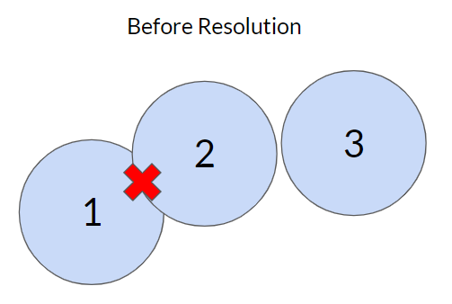
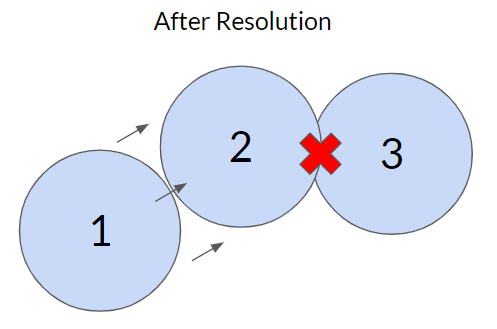
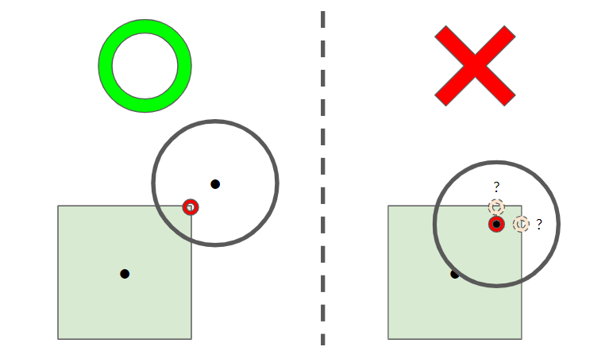
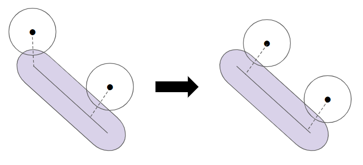
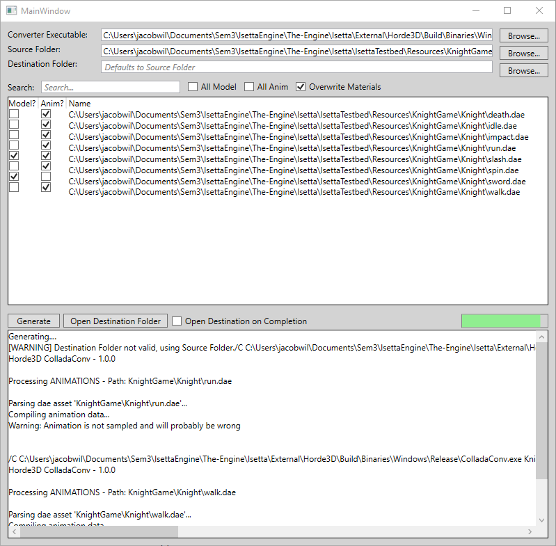
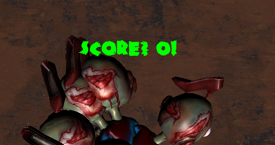

<!----- Conversion time: 1.633 seconds.

Using this Markdown file:

1. Cut and paste this output into your asource file.
2. See the notes and action items below regarding this conversion run.
3. Check the rendered output (headings, lists, code blocks, tables) for proper
   formatting and use a linkchecker before you publish this page.

Conversion notes:

* GD2md-html version 1.0β13
* Sun Nov 18 2018 12:51:55 GMT-0800 (PST)
* Source doc: https://docs.google.com/a/andrew.cmu.edu/open?id=1QafmELBHrrywEvfWc5ZYdRe9KeIGKtzT5A53nXhh2v0
----->

## Byte-Sized Updates

*   [Collision Solving](#collision-solving) Implemented rudimentary collision solving, but still have lots of distance to cover for a decent collision response system.
*   [Level Loading](#level-loading) Got loading from startup level to another prebuilt loader in the engine working. There were a few catching points, but overall went smoothly.
*   [Asset Processing Tool](#asset-processing-tool) Built an asset processing tool to process the Collada files (`.dae`) more efficiently, easier than in the past.
*   [GUI](#gui) Added more to the GUI system by fully integrating fonts, so font size and type can be changed per GUI function.
*   [Full-Feature Game](#full-feature-game) Started development of the target game that the engine is being built for, which forced some other smaller features.
*   [AI](#ai-pathfinding) Implemented an AI pathfinding system by combining vector flow fields and steering behaviors.

## Collision Solving

We started collision detection all the way back in (Week 6)[week-6.md], and it's been growing pretty nicely. At this point, we have fully functional sphere and box collisions and partially functional capsule collisions, which means we can trigger functions in the game in response to when some collider volume enters, exits, or stays inside of another collider volume, which is immensely helpful with a lot of game concepts like trigger points.

Unfortunately, figuring out that the collider volumes are intersecting is only half the battle. Now that we've got the collisions getting detected, we need to take it one step further and move colliders away from their counterparts whenever an intersection occurs. This is called _collision solving_, and it's a crucial concept in video games, where things don't physically inhabit space and so we can't rely on the convenience of physics to help us keep things real. Depending on who you ask, there are three distinct parts of collision solving:

1.  The detection. This is where you figure out that two colliders are intersecting with one another, and it's the part that we (mostly) already have figured out.
1.  The resolution. This is where you take the two colliders and figure out where exactly they should be moved to so that they are no longer intersecting. This takes the previous problem of collision detection and expands upon it, because we now need not just the fact that the colliders are intersecting but also info on where exactly they're intersecting.
1.  The iteration. Now, you technically don't need this one, but you probably don't have a very good generalized solution if you have no need for iteration in your collision solver. Iteration is used in collision solving to determine that your resolutions are acceptable. Let's illustrate with an example: Take three sphere colliders. Two of them start intersecting like this, and the other one is just barely off to the side: &nbsp;&nbsp; &nbsp;&nbsp;After we've resolved the first collision, this is what we end up with:&nbsp;&nbsp; &nbsp;&nbsp;We technically got the first collision resolved, but now we have another one! You could just do one solve every render frame and let this play out over time, but to decrease the number of intersecting colliders at the end of each frame, you can perform multiple iterations of collision resolution every frame.

Collision solving is going to be a difficult feature to implement. This is not only because it's a pretty difficult 3D math problem, but also because it's heavily reliant on our previous features, namely collision detection. Bear this in mind as we go on to build up this feature; this may be the first time we see serious compromise in one of our engine systems due to the feature being needed yet out of scope.

### Getting Started

While the 3D math is difficult, the conceptual organization behind collision solving isn't. The important tasks we need to accomplish are (1) figuring out which colliders are actually colliding, (2) figure out where they're colliding on each other, and (3) move them. The first one is very expensive if you perform an `O(n2)` check of all colliders against all other colliders, but fortunately as part of our previous collision detection work we implemented a (Dynamic Bounding Volume Tree)[week-9.md/#collisions-dynamic-aabb-tree], which is essentially a sorted tree of axis-aligned bounding boxes (AABB) that allows you to cull out most of your collision tests in sparse systems. Unfortunately once we've begun the collision solving process, our colliders will have moved so our Bounding Volume Tree will have been invalidated and we need to regenerate it, but for the time being we're going to ignore that problem. (We do plan to address that eventually)[#future-plans-with-collision-solving] with a neat little solution using a feature we've already implemented with our Bounding Volume Tree.

So with the first task already out of the way, we can focus on tasks number 2 and 3! Task number 2 is unfortunately still pretty daunting though. To get started, we broke up our collision solving into a case-by-case basis; every individual collider will generate its collision point based on its own shape (i.e. Box, Sphere, or Capsule) regardless of the other collider its intersecting with. This isn't terribly correct because it assumes that our other collider is radially symmetric and that's only true for spheres, but we should first focus on getting our collision points calculated in the first place.

For spheres, calculating the intersection point in this case is trivial—just find the direction of the other collider and get the point out at the radius.

For boxes, we need to check each axis individually to construct the correct intersection point. It seems pretty straightforward at first, but there's actually some tricky parts to it. The naive solution is to check if the point falls outside of the extents of the box on any of the box's local axes, and if so, clamp it to the extents on that axis. That works if our point is outside of the box, but if it's inside of the box, then our collision point doesn't get calculated on the surface of the box—it's calculated on the inside!

For the time being we don't have this corrected, but in the next week we'll be implementing a solution that will guarantee at least one of the axes is pushed out to the extents so that we have our intersection point on the surface of the box.

Lastly, for capsules, the problem of finding an intersection point may seem daunting since capsules look more complex than spheres or boxes, but in reality it's not that hard. First, we need to calculate the closest point on the "line segment" of the capsule (the inner axis of the capsule that caps off at both radial ends) to our point of interest, which we use our [CollisionsModule::ClosestPtPointSegment](https://github.com/Isetta-Team/Isetta-Engine/blob/master/Isetta/IsettaEngine/Collisions/CollisionsModule.cpp) function for. For the next part, we initially checked if that nearest point on either of the caps of the capsule and restricted the intersection point to certain areas if it was. As it turns out, you don't need to do this! With a line segment, the vector between your point and the line will always be perpendicular to the line if the nearest point isn't on one of its ends, like so:

> As a quick technical aside, we mentioned that our capsule intersection point calculation checked if we're on one of the caps of the capsule. If an `if` statement was used here, then we would possibly take the hit of a branch mispredict, which is no bueno for our performance. Fortunately, we could use a neat trick. `switch` statements in C++ are branch-free because they use the integral value passed into the `switch` call to calculate the jump to the next instruction in the assembly code, so if we used a `switch` statement instead, we wouldn't take a performance hit. How do we use a switch statement with a `float`, you ask?

> Cast it into an integer! Normally you cannot use a `float` in a `switch` statement because it is not an integral value, but in our case, we're only checking if the `float` is `0`, `1`, or something else. `0` and `1` are both integral values, which means we can guarantee what their corresponding `uint_32` value will be when cast from a `float` (it's `0x0` and `0x3f800000`, if you were curious). And for any other values, we can just use the `default` switch case to capture them!

That covers our first pass of work for task number 2; now let's take a swing at task number 3. A very naive solution for moving the colliders once their intersections are solved is to just take the difference vector between the two intersection points and split that between the two colliders (also accounting for any static objects that should be immovable). This indeed works, but (we'll discuss later)[#how-does-unity-do-it] why this isn't correct.

### AABB Disarray

With our three tasks done, our collision solving should now work, right? Well, earlier we mentioned that the collision solving system relies on our other systems, and here's where all of that came to light! Our AABB's had a few bugs that made the collisions pretty messy and hard to observe, such as accidentally checking against the `x` value of the AABB's twice instead of also checking the `y` values during the intersection test, or regenerating each AABB every frame and making our Bounding Volume Tree inaccurate and much more expensive. While we were doing that, we also optimized out some expensive function calls by just using cached data, which is a very common and typically effective optimization trick!

With all of that ironed out and out of the way, let's check our progress on that collision solving!

 <video playsinline autoplay muted loop>

   <source src="../../images/blogs/week-11/Sorta-Okay-Collision-Solving.mp4" type="video/mp4">

Your browser does not support the video tag.

 </video>

You know what? We'll take it as a win. But we clearly have more work to do.

### How Does Unity Do It?

Following the same pattern as we have before, once we realized that our system doesn't quite meet expectations, we did some field research. And by field research, we mean we opened Unity and tried to reverse engineer its own systems. With the following video, you can actually see some interesting behavior that we didn't consider before:

 <video playsinline autoplay muted loop>

   <source src="../../images/blogs/week-11/Unity-Collision-Solving.mp4" type="video/mp4">

Your browser does not support the video tag.

 </video>

For our collision solving, the box collisions are notably the poorest as every collider will push away from its face and into one of the corners. In Unity's case, the collisions behave as you'd expect for the most part; when something is being pushed by a box, that thing gets pushed away from the face of the box. What's more interesting is when the box is at an angle to another box—the box whose corner penetrates the other's face is pushed in the direction of the face. This case is annoying to account for because what exactly is the correct solution when a wedge is shoved into something? Do you push it on one side or the other?

This got us thinking about our "generalized" collision solving algorithm and why it was failing so poorly. Ours takes the difference between the two intersection points and displaces the colliders based on that, but that means that whenever colliders are not perfectly aligned with one another, they'll gradually push one another out of the way—even if they're two box colliders that are oriented exactly the same. So our solution for task number 3, moving the colliders, is incorrect. So what's the correct solution then?

Our investigation of Unity's collisions contains the answer. A box collider shoves all other colliders in the direction of its face _except for when its wedge is the part that is colliding with the other collider_. In the case that the wedge is colliding, then the box collider actually gets moved based on the other collider. This means that the collision resolution is performed on a case-by-case basis, and we need to figure in how the box colliders collide with other colliders to arrive at a proper solution.

### A Case-by-Case Solution

Our second stab at collision resolution is still not very elegant, but it's getting closer to a workable solution. What we know now is that our collisions should be resolved on a case-by-case basis, with the following ranking: (1) box face, (2) spheres and capsules, (3) box wedge. We only need to be concerned with box colliders for now; if another collider has some similar problem, we'll deal with it after getting some correct box collisions.

Our basic algorithm for the new solution is to check the types of the colliders involved in the collision first, and if either collider is a box, then we need to check whether or not one of the boxes collided on its edge. If they did, then the collision resolution is determined by the other collider. In the case that the box collider actually collides on its face, then we need to figure out which face it was that collided and push in the direction of its normal.

With that implemented, our solution actually isn't looking too terrible!

 <video playsinline autoplay muted loop>

   <source src="../../images/blogs/week-11/Current-Collision-Solving.mp4" type="video/mp4">

Your browser does not support the video tag.

 </video>

### Future Plans with Collision Solving

Right now, we're currently building up a better suite of tooling to test our collisions and collision solving. We just recently added some controls to our Bounding Volume Tree testing level so that we can more easily figure out what's going on when we have over 100 colliders flying around in one level.

 <video playsinline autoplay muted loop>

   <source src="../../images/blogs/week-11/BVTree-Level-Tools.mp4" type="video/mp4">

Your browser does not support the video tag.

 </video>

*Every second is a beautiful frame of expensively contrived behavior.*

For the next steps, we've got a few ideas. For one, our box collider intersection detection is incorrect because it can put the intersection point inside of the box, and we have a pretty good idea of how to address that. Our Bounding Volume Tree is also incorrect after the first iteration of our collision solver because we shift around the colliders without regenerating the tree; we _could_ technically regenerate the tree, but that's very expensive, so instead we plan on trying some heuristics for the AABB's to avoid having to ever recalculate the Bounding Volume Tree despite multiple iterations of collision solving. Lastly, our capsule collisions have always looks pretty bad, and the collision resolution for them definitely isn't right, so we'll probably be taking a look into that as well. We would love to do some optimization, but as it stands we can run 50+ colliders in our level at about 60FPS and our target game won't need that many colliders, so optimization isn't exactly a high priority task.

## Level Loading

Level loading as an engine functionality, is simply to be able to unload a level and load another level without the engine systems shutting down (or breaking, crashing, exploding...). Our implementation isn't sophisticated approach and limits the developer to only having one level loaded at any given point, nor can there be persistent entities, so could definitely be improved upon. The game developer can call `LevelManager::LoadLevel` at any given point during a frame, once it is called the frame will finish processing all variable updates, and at the end of the frame the level is unloaded and the next level starts to load. The unload level functionality was already established to prevent memory leakage when shutting down the engine, so we relied on that method heavily. The `Level::UnloadLevel` worked fine for shutting down the engine, however bugs were found in other components that weren't associated with leaking memory but functionality so couldn't be observed after the engine/application closed. The main bugs of the level loading system was GUI entities seemed to be infinitely drawn, debug drawing's view matrix was corrupted, mesh models not being removed, and ***. All of these pointed towards something to do with rendering, while debugging we found that resizing the viewport relieved the issue for awhile, but wasn't the source of the problem. We were able to deduce it wasn't just the GUI or rendering systems from testing different level loads, so what they share in common is the clear screen and camera. The clear screen didn't immediately seem to be the problem, so we watched how the camera was being set in the `RenderModule`. Here the `RenderModule` selects the first camera in the list, where in most levels there is only one camera to select from. When watching the breakpoint here, we found that each levels camera was stacking which made sense for the bugs we were seeing. In the `CameraComponent::OnEnable` the camera was being add to a render module list of cameras for the level, however `CameraComponent::OnDisable` wasn't removing it from the list. This could have also be found from deactivating the camera component which isn't something we tested.  Once this was fixed, all of those problems went away! The other problem we found was from input, input wasn't uniformly being removed for each level. When looking into some of the culprits is was clear that we weren't unregistering the keys from the input system, and because the entity was deleted was causing undefined functionality (another great side-effect of our own memory). We needed to clear the input for the next level.

> As a result of level loading, we realized we need to separate the engine input and gameplay input, so we could clear the input callback map on level changed, discussed in [patch notes](#separating-engine-and-gameplay-input).

 <video playsinline autoplay muted loop>

   <source src="../../images/blogs/week-11/Level_Loading.mp4" type="video/mp4">

Your browser does not support the video tag.

 </video>

**The output of loading and unloading the levels from the above video.**

## Asset Processing Tool

The current asset pipeline is focused around Horde3D's needs for models, animation and materials. The models are processed into `.geo` and `.scene.xml` files, the animations into `.anim`, and the materials into `.material.xml` files. The other file types aren't compressed or packaged in any other file format, although they probably should to be better processed by the engine and have a smaller memory footprint. Alas, we don't have time for that so let's just deal with Horde3D's formats. Horde3DUtil has built a collada converter executable which processes `.dae` (collada) files to these other file formats, but requires the command line for which file to process. In weeks prior we created a simple batch script that process _all _`.dae` files in the folder and subfolder of the script into model and animation files. The problem is regardless of if the collada file has mesh/animation data, it will produce a `geo`, `scene.xml`, and `.anim` file as well as processing _all _models regardless of if they have been updated/changed since last processing. This script is great to quickly get things done but isn't great for small changes/tweaks or keeping files/memory to a minimum.

We created a tool in WPF to select which file you want processed and what type of output the file should produce. It searches for the base 'Resource' directory, which is required by Horde3D, and everything is based off of that folder. This is what the tool looks like:

We realize that with larger engines and ones like the Arc80 Engine, require more tools for cooking assets so that they can have more control of the data. However, with such a small amount of time, we are just making small, quick tools that will provide us with the most benefit.

## GUI

### Fonts

After the awesome gameplay of our second game, something really popped out to us, the text was tiny and boring. The team had been contemplating on whether to put the effort into getting fonts working with the engine and seeing this game really hit the nail in the head, let's do it! We had integrated some font functionality already, or so we thought, but quickly into trying to get fonts working we realized the font functionality wasn't nearly good enough, or really even working... So we had to rework most of it. Originally the `Isetta::Font` was just a name for `ImFont`, however the problem with this implementation is the imgui header would need to be included in any file of the game which would like to do anything with font. This felt wrong, it's okay for our `GUI` to be included in these files, but we don't want our external library in these files. To bypass this, we created a "fake" class named `Font` which derived from imgui's `ImFont` as well as some static helper functions. The static helper functions help the fonts being stored, so not to be reloaded each/multiple times, as well as easier access between multiple classes wanting to use the same font. This fairly easy to implement task was well worth the effort, we were able to change the score display of our first game!

## Full-Featured Game

This past week we started implementing features of the game we set out to build from the [beginning](week-0.md#the-example-game). This game will have slight more polish than either of the previous games (or other games we end up building) because we'd like this to be a good demonstration of what the engine is capable. As explained in week 0, the gameplay itself won't be all that fun or exciting but it will be the capstone of the engine.

So far we've implemented the menu and the main menu and most of the UI needed for the game. The main menu needs to be able to transition the player into a single player mode, multiplayer mode, and exiting the game. The multiplayer mode needs to be able to allow the player to be able to opt into hosting the game or connect to another host-player. For the hosting option, this is when we will boot-up the server (which has yet to be done), but for the connection option the player must be able to input the IP of the host. The first iteration of the IP input went for looks over function approach. Using the idea that _all_ IP are 15 characters long (not including the null terminator), the IP could be formatted like: `xxx.xxx.xxx.xxx`. Then when the user types the "x"'s could be replaced with the number and the "." wouldn't change. Which turned out like this:

 <video playsinline autoplay muted loop>

   <source src="../../images/blogs/week-11/IP_input.mp4" type="video/mp4">

Your browser does not support the video tag.

 </video>

Then some of the team commented on that not all IPs are exactly 15 characters, the numbers are actually 0-255 and don't need to fill 3 numbers, ie `000` for 0. So even though the IP's could be represented as 15 characters, 4 sets of 3, it is inconvenient to ask players to type extra characters if their IP isn't in the hundreds place. So removing the nicitey of the "x"'s we just went back to the plain implementation. When the single player button is clicked, the game then loads the single player level which has the basic health and score UI. The game could have been done in one level, with just the UI turned off once the game starts, but then there would menu entities in the game level which is why we force the topic of level loading. Here is what we have so far!

 <video playsinline autoplay muted loop>

   <source src="../../images/blogs/week-11/Game_demo.mp4" type="video/mp4">

Your browser does not support the video tag.

 </video>

## AI Pathfinding

Typically, AI is not necessarily a part of a game engine. Instead, it's more like a replaceable gameplay system built above the underlying game engine, which is why we have AI almost at the top of our architecture diagram. But also, if a game engine is mostly designed for one game or one type of game, some of the AI code can be baked into the game engine. Since we are quite interested in implementing an AI system, and our game also needs a simple pathfinding algorithm to guide the enemies to avoid obstacles and move towards the players, we decided to implement the AI pathfinding system inside of our engine.

### A* Versus Vector Field

There are a bunch of pathfinding algorithms in the game AI field, from breadth-first search, Dijkstra's algorithm, to all sorts of A* derivations. How can we find one that fits our game best? Let's look back to what our game AI requires:

*   Our game is a top-down twin-stick shooter. Though the game is made in 3D, the players and the enemies can only move in the x-z plane.
*   Our game can have hundreds of enemies moving independently, and to reduce the pressure of collision detection and solving, the enemies cannot collide with each other.
*   Our game environment is fixed. The obstacles on the map will not move and there's no level streaming.

Based on these requirements, we make these conclusions:

*   Since the environment is fixed, we can process it before the game starts. One of the most common pre-processing methods is to make the map into a grid.
*   Because we can have quite a lot of units calculation their path simultaneously in the same frame, the computation complexity can be significantly higher when it's based on each unit, than when it's based on each grid cell.
*   Even enemies don't have collisions between each other, we still don't want them always following the same path and overlap with each other, so outputting a fuzzy path is better than one single best solution.

After these considerations, we found that the common A* pathfinding may not be the best one for our game, because it computes separate paths for individual agents, even \
though many paths may have similar sections and it always returns a fixed, heuristically optimized solution. With further research, we found an alternative method, which is to combine vector flow fields with steering behaviors. It can greatly reduce the computation complexity as well as efficiently simulate the hundreds of units on the map.

### Building the Vector Field

The concept of this pathfinding algorithm is quite straightforward. Since the navigation space is divided into a grid, our calculation is mostly based on the grid cells. The purpose of building a vector field is to calculate if a unit needs to go to the target position (or cell), what direction it should go along based on its position and cell. To do that, we generally need to build two matrixes: the cost matrix and the vector matrix.

The cost matrix is a matrix that stores the path distance from each cell to the target cell. It's not the Euclidean distance which calculates the distance regardless the obstacles. Instead, the path distance is how many cells one unit needs to go through to arrive at the target. We are using a wavefront algorithm to generate the cost matrix, which is basically a breadth-first search that updates its neighbors by its path distance plus one. After the cost matrix generation, we now have a grid like this:

 <video playsinline autoplay muted loop>

   <source src="../../images/blogs/week-11/cost-matrix.mp4" type="video/mp4">

Your browser does not support the video tag.

 </video>

The vector matrix is also quite simple. It is a matrix that each cell points to the gradient of the grid, which is to point to the neighboring cell with the lowest cost (be aware of the diagonal case). After this process, the navigation grid is like this:

 <video playsinline autoplay muted loop>

   <source src="../../images/blogs/week-11/vector-field.mp4" type="video/mp4">

Your browser does not support the video tag.

 </video>

One thing is quite interesting here is when we are adding the sides of the obstacles into the grid, marking the corresponding cells to un-walkable cells, we were actually using the line drawing algorithm we learned from the computer graphics course. This is really an unexpected way we found to relate the AI to subjects other than robotics.

### Integrating Steering Behaviors

Once the vector flow field is calculated, we can know the target direction of each cell by looking up the vector matrix. The last thing we need to do is to naturally steer the units to match the target direction. The algorithm here we used is the velocity matching algorithm[^1983] and the arriving algorithm[^9583]. It takes the acceleration, the velocity and the Euclidean distance from the unit to the goal into account and drives the unity smoothly. After the integration, we now have the units approaching the target like this:

 <video playsinline autoplay muted loop>game ai

   <source src="../../images/blogs/week-11/pathfinding.mp4" type="video/mp4">

Your browser does not support the video tag.

 </video>

There are still some minor features like multiple targets support we haven't implemented yet. They will be patched into the engine next week.

[^1983]: For more about velocity matching algorithm, please read _Artificial Intelligence For Games Page 66_

[^9583]: For more about arrive algorithm, please read _Artificial Intelligence For Games Page 66_

## Patch Notes

### Separating Engine and Gameplay Input

The original implementation of the `Input` and `InputModule` system was to have specific callback maps for each type of input: mouse, key press/released, etc. However, when `GUIModule` system was integrated the `GLFWwindow` parameter of the input callback was needed for the `GUI`. We were hiding the `GLFWwindow` parameter from the input callbacks for the gameplay developer, so we needed a second set of functions with the `GLFWwindow` as a parameter. This worked for awhile, however definitely added additional confusion of which function the game developer should be subscribing too, because they could technically subscribe to the GLFW callback functions. We were exporting the entire `Input` class to the dll, but we could have add the export to dll to only the needed functions but that would be annoying for each additional function.

When we introduced level loading, we were clearing all memory of the previous level but not explicitly input. If a developer had forgot to unregister their callback, then the callback would most likely cause a break because it would reference deleted memory. We had noticed even internally, that with some of our components/levels that even we, the masterful, all-knowing engine developers, were forgetting to unregister our input callbacks; so how could we expect the gameplay developers to remember? The answer was we couldn't, which is why we need to just clear all callbacks of the past level in unload level. We didn't want to clear the `GUIModule` connection to the `Input` however, and if a developer had used the GLFW callbacks we couldn't clear that callback. So the only way to prevent them from using the GLFW callback functions was to move those into their own class, `GLFWInput`, which wouldn't be cleared or destroyed until `ShutDown`. `GLFWInput` would then not be exposed to the game developer and only used for engine internal input; the added benefit is there is now less confusion for the game developer of which input callback to subscribe to.

<!-- GD2md-html version 1.0β13 -->
