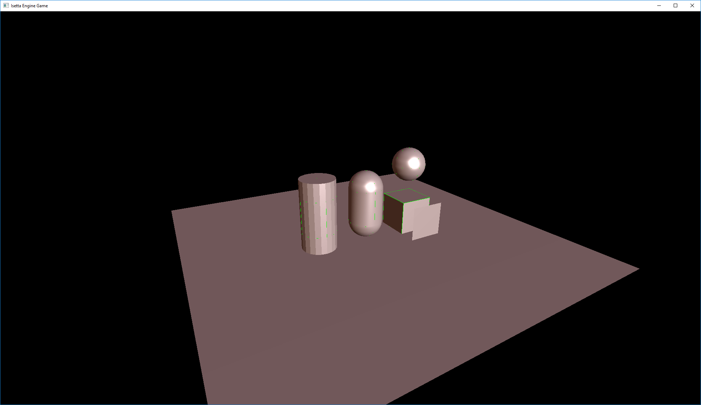
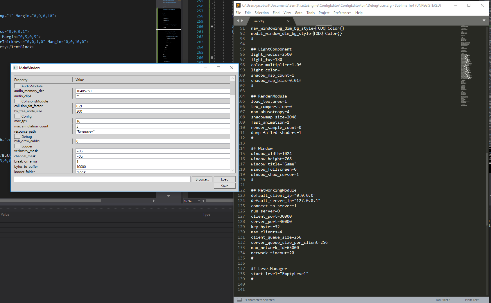
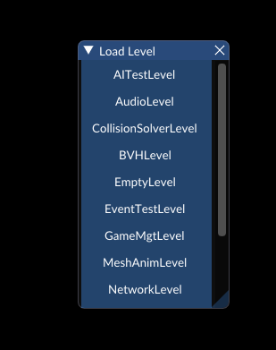
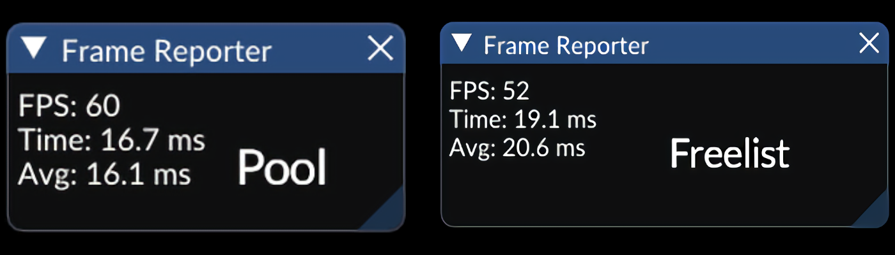

# Getting Ready for Game Jam!


## Byte-Sized Updates


*   [Audio](#audio): Refactored the audio system to be more versatile and usable, as well as added in 3D audio.
*   [Primitives](#primitives): Game entity primitives were created for the developer to be able to quickly instantiate a cube and other shapes, without having to make the models themselves.
*   [Config Editor Tool](#config-editor-tool): A tool was developed to help developers modify the configuration file, without knowing apriori what property they want to modify.
*   [Build](#build): We created a tool for exporting the header files of the engine, as well as other needed files and folders to be used in a standalone project.
*   [Patch Notes](#patch-notes): We have a lot. Turns out as you begin to use your engine features you will find many more bugs than your original tests.


For the past week or so, and particularly this week, we have shifted some of our focus from adding big systems/features to making some smaller style of life changes, better called fixes to API. In this week especially, you will read about how we changed some of our API not for performance but to help game developers better be able to use the engine. One of the main reasons for this shift in focus is because we are holding a _game jam_ on December 1st using exclusively our engine! It is going to be a short, short game jam only running about 8 hours because we are going to using our fellow students to see what breaks. We know things will probably, almost definitely, break but we are excited to see what some other developers can do with our engine, that's why you make an engine to begin with right?


## Audio

There was a much needed update to our audio module this week—the addition of positional (spatial) audio, which then triggered some other refactors. There are two components to spatial audio: The position in space where the audio is being played and the position where the "ears", the listening object, are. Starting with the listener, we added a new component named `AudioListener` which is almost an empty component that adds/removes itself from a listener list in `AudioModule` during its `OnEnable`/`OnDisable`. In `AudioModule`'s update then, prior to updating the `FMODSystem`, the transform of the first listener in the list is used to position FMOD's listener. If no listener exists, the 3D sound will be heard as 2D.

> _If a tree falls in the wood and there's no listener to hear it, in Isetta, it will be like you're standing right next to it._

Having multiple listeners is supported by FMOD in some sense; however, this could cause additional confusion for the game developer, so we decided not to support it. That was the easy part, now for the 3D positioned sources. Since the audio was one of the first modules and features implemented in the engine it had some legacy code that needed to be refactored to keep the engine more consistent. Implementing the actual 3D audio was as simple as telling FMOD that the audio was 3D and updating FMODs understanding of the position of each 3D `AudioSource`. However, there were also other FMOD features like muting the audio and setting the hearing minimum and maximum distance to implement so we can make the audio more versatile, plus how hard could it be to support that... It turns out implementing them isn't so hard but making sure that different configurations don't break the engine or FMOD isn't as easy.

Talking more about the legacy changes of `AudioSource`, all the audio was loaded by specifying the file paths in the config file from the resources folder which was then loaded on engine startup. To use the audio, the `AudioSource` then required the same filepath as specified in the config file. This was very limiting and tedious because every file had to be specified in two places: the configuration file and the place you wanted to use it, thus it's prone to issues. Our first change was to create a new struct, `AudioClip` which would house the loaded `FMODSound` which then could have additional audio files loaded from outside the config file. Each `AudioSource` would then hold a reference to an `AudioClip` rather than an individual `FMODSound`. However, the config files loaded on start up seemed unnecessary and added confusion for even just us so we just removed that completely.  `AudioSource` was also allowed to have a string on construction which would find the corresponding `AudioClip`, but this again wasn't intuitive and caused errors even internally, so we replaced that constructor with one that would only take `AudioClip`s. `AudioClip`s would be the only thing in our engine to know of the audio's file path, everything else would have an `AudioClip` reference. These are small usability changes, however we are finding as we are building more small tech demos and our feature demo, that usability is a larger concern on the user-facing components than it was for our low-level systems and needs more iteration not for bug fixing, although there is still a lot of that, for easier use.


## Scene Primitives

Rapid iteration is a hot-topic when developing a game, and while we are under no fallacy using our engine would be good for rapid development, we do want to make things easier for us and any possible users. One way for us to do this is making the instantiation of primitives such as cubes, cylinders, capsules, grids, quads, and spheres as easy as possible. All of these shapes make slapping together a prototype or testing a feature much easier. Prior to this endeavor we only had cube and sphere meshes available to use, and a user still needed to know where exactly those `".scene.xml/.geo"` files were in the directory structure. Since the `MeshComponent`s require a file path, typing a path out for each object would be annoying. Plus, these mesh files are in the engine resources not the game resources, and there isn't a good way for the developer to specify that. We spent some time getting reacquainted with Blender to make these simple shapes, and the only thing we focused on was shape size and vertex/poly count. We wanted the sizes to be similar, if not identical to Unity's, so that people who have used Unity would have an understanding of how to use the objects, these sizes are also versatile in use. In Unity when you create one of these objects there is also the assumption you want a collider attached. While that makes sense for Unity, our collision system isn't as robust so we didn't want a bunch of unused colliders to be attached, plus then a developer might delete it off the entity right after instantiation—what a waste of performance! So for our primitive system, you can optionally specify if you want a collider attached. The system also caused us to change our entity creation system, see in our [patch notes](#api-design-improvements).




## Config Editor Tool

With everyone on the team starting to use the engine to make mini games, more and more there's been this need to know what values are configurable. One of our developers has been itching to do some tool development for the engine, so when another team member asked for something that was all he needed. Knowing not much time could be spent towards creating tools versus engine development, the tool is fairly simple. 

The goal of the tool was to display all of the `CVar` variables in the engine, with their default values, and be able to load a config file as well as save a user-generated one. The main advantage to this tool isn't necessarily speed, because editing a text file will always be faster, but being able to see all the different options the developer has. First, it has the user specify the directory of the engine, and if none is specified it uses the current application directory. It then searches through all the files of the directory, using the command prompt, doing a `findstr`[^1], similar to a Linux `grep`[^2], for any `CVar` variable. It then groups the variables based on the file the variable was found, i.e. if found in `AudioModule.h` it will group it to `AudioModule`. Each group and its `CVar` property is then displayed with a value field for the user to modify. The value field defaults to the default value of the `CVar` so if the user decides to not change the value, they can rely on that the engine developer put a reasonable default value... The user can also load a configuration file of their choosing if they wish to only change a few of the values but keep the most of them the same. The properties and values can then be saved out to a filename and path of their choosing. Here is the application:

[^1]: **`findstr`** is a command for the Windows command prompt that searches files for a specified string, it has additional options for printing file names and line numbers among other options.

[^2]: **`grep`** is a command for a Linux command line that will search specific files for a regular expression or string. When compared with Window's `findstr` it is much more flexible in its capabilities.




## Build


### Exporting Headers

For people to be able to use the engine, without developing on the engine or building it through Visual Studio, the engine needs to have a downloadable folder/zip file containing the headers, dll files, and static library files of the engine. These files are scattered throughout the engine directory. Even worse, there are other files, .cpp files, in the same folders so we can't just copy the folders. The directory structure needs to be preserved as well, because the header files reference one another by path. With each change of a header file or build, the process needs to be repeated which could just be copying over the changed files, but we do a naive approach of exporting everything again. This isn't too bad for us since the files being copied are relatively small in size and number. Rather than having someone do this manually, we created a batch script (originally a shell script) to copy the files into a separate, identical folder structure. The batch file also copies over engine resources that are required for the engine such as the graphics pipelines, a default font, shaders, primitives, etc. as well as the external headers that are needed by our header files. It's a fairly simple script of copying files, but very necessary to ensure a game external to the main engine solution maintains an up-to-date version of the engine.


## Patch Notes


### Levels Menu

Last week we wrote about [level loading](https://isetta.io/blogs/week-11/#level-loading) and we created a simple component that would transition to a level specified in the constructor. Since we are students, we need to show our work off to our faculty soon, which we thought would be nice to have a level select menu. We currently have no system for persistent objects, which is something we would like to add and don't think it would be too difficult but just don't have the bandwidth, so currently all input and entities are deleted on level unload. To browse all of our levels, we could add a level menu to each level but then we would need to remove the level menu component when done. Rather than altering all of our levels to have a level menu component we wanted to do a quick hack... Since we clear game developer input on level unload, we couldn't use that, but we can use our uncleared input, `GLFWInput`. This input is only available to use within the engine and isn't built out to the dll for game developers to use. When the `GLFWInput` callback happens on the level menu, it checks to see if there is an instance of level menu in the level and if not, creates one. We had to make the input registration handle of the component static as well so the input could be unsubscribed, otherwise the callback would happen multiple times on a single click. This is definitely a hack, but we're the engine developers what we say goes right?




### Debug Drawing Optimization

We revisited our debug drawing code to see if we should bother adding in a shading model to our solid objects, the jury isn't out on that yet, but we noticed that a) we weren't taking full advantage of our transform system and b) the code had an easy optimization. First the optimization. As talked about with the original [debug drawing post](https://isetta.io/blogs/week-6/#debug-drawing), the vertex shader uses the model view projection matrix to transform vertex points in world space to camera space. The original implementation had the model, view, and projection matrices passed in as separate uniform variables to the vertex shader which would then perform the matrix multiplication for each vertex. This was clearly wasteful because the matrix doesn't change for each vertex and had 2 matrix multiplications for each vertex that resulted in the same final matrix. Rather than passing 3 matrices to the shader we calculated the matrix then passed the matrix. This is an example of when incremental/developing code just gets left in and forgotten about. For using the transform system, we were calculating the inverse of the camera transform matrix each call, however our transform class caches that value so we can just use that. There are definitely other optimizations, not only for debug drawing, throughout the engine that we would love to do, but probably won't get the chance to.


### Capsule Height Bug

When developing the primitives we found that the debug drawing capsule for the capsule collider was too large for the created Blender model. At first, we thought it was our bad Blender skills, but we then compared our model to a model in Unity and our scale was fine. We started by looking at `CapsuleCollider::Update` because the debug capsule on the primitive was coming from this component, but things looked fine there. But when looking into the debug drawing capsule draw, we realized the problem was in there -- we had never thought of checking the capsule size before! What was happening was the length of the capsule's centerline was being calculated with height and scale, then added and subtracted from the center point to get the two endpoints of the capsule. However, this would generate a capsule with double the height specified; the line length should have been halved then added/subtracted to get the endpoints with the actual height. This then scared us because how the heck was our collision code working with the busted capsule height... well that's because in the collision tests we had copied the concept of height from the debug drawing so that's why collision was working and we quickly replaced the code there too. 

We'd like to propose other solutions which would have stopped us from having to change the code twice. One would be to define a `Capsule` class which has no understanding of the debug drawing nor collisions then things could be passed along as needed. The other is from a [GDC talk](https://www.gamedev.net/industry/game-developers-conference/2018/a-tale-of-three-data-schemas-r67/) by Ludovic Chabant, where the schema used to define the capsules in the first place are defining the endpoints not a center and height; then expose it to the user as a height and center, this would avoid the problem from the beginning.


### Collider Debug Shearing

Another problem we found with our `Collider`s has nothing to do with the actual collision model or calculation but rather how they are drawn again. We understand that ordering of matrix multiplication matters, and the typical convention of with transformation matrices is: `translation x rotation x scale`. However in `Collider` we had done `translation x scale x rotation`, we think we did this to avoid shearing in the case of a weird rotation but actually this causes shearing! We are going to attribute this to a lapse of judgment and just made the fix, no one to be the wiser.


### API Design Improvements

As the game jam approaches, we are thinking more and more about the usability and API design of our engine. 

The first thing we looked at is the `GetTransform` method in both `Component` and `Entity` classes, the typical getter method that only allows the developer to read from the property. This seemed clunky, especially from our experience with C# properties. To change this, one option would be making a public `Transform* const` variable and let the users access it. It seems like a good option, but C++ requires that we initialize all const member variables in the constructor—meaning we need to pass a reference or pointer to Transform as a parameter into the constructor—which is impossible in our engine because the users will inherit our base `Component` class and define their own constructors. Which is why, at the time, we chose the straightforward implementation of having a getter with the `GetTransform` method. However, as we were making more and more games, we realized that calling that method each time we want the transform is pretty annoying.

So, we got rid of `GetTransform` in the end. We looked at our code structure and came up with a solution that's hacky but works great for now—we created a static `Transform*` variable inside the `Component` class, and every time before constructing a new `Component`, we set that static variable to the `Transform` that the new `Component` should point to. Then, in `Component`'s default constructor, it can just use the static transform variable and initialize it's const `Transform*` member (see the code snippet below). It will be propagated to all derived constructors due to the inheritance. With this solution, we can just write `transform->GetWorldPos` instead of `GetTransform().GetWorldPos`, so much cleaner! After this fix, we did the same thing for `Component`'s `Entity*`.


``` cpp
class Entity {
  template <typename T, typename... Args>
  T *Entity::AddComponent(Args &&... args) {
  // ...
    // Set the data so the next Component can pick them up in constructor
    Component::curEntity = this;
    Component::curTransform = transform;

    T *component = MemoryManager::NewOnFreeList<T>(std::forward<Args>(args)...);
  // ...
  }
}

class Component {
  Component::Component() : entity{curEntity}, transform(curTransform) {}
  static class Entity* curEntity;
  static class Transform* curTransform;
}
```


However, this solution has a big potential downside—it changes the shared states of the `Component` class which makes it not thread-safe. If we have multiple threads creating new components at the same time, they might write to the static variable together and override each other's value and cause some problems. Luckily, we are not doing any multithreading stuff in our engine now. But if we do in the future, we need to keep things like this in mind.

Another API design we fixed along the way is the consistency across different functions in `Component` and `Transform`. `Component::GetTransform` used to return a const reference which requires us to use the dot operator to access its members and methods, while `GetEntity` returns a pointer to the entity which requires the arrow operator for member access. It's a bad API design because it's hard to keep track which method is returning what and a lot of the times we need intellisense[^8152] to tell us what to do. Making them all just plain member pointer variables made our life a little easier.

[^8152]: **Intellisense** is an intelligent code completion feature in Microsoft Visual Studio that is capable of detailing information about the code and objects that the programmer is working with while coding.

The last change is that we changed the API of creating entities. We used to have both `Level::AddEntity` and an `ADD_ENTITY` macro that's both available for the user to create new entities. We first renamed `ADD_ENTITY` to `CREATE_ENTITY` because the word "add" means that the entity is being added to something that owns it but the user doesn't need to understand that. Then, we realized `CREATE_ENTITY` expands to `LeveManager::Instance().currentLevel->AddEntity`, which is essentially same as the function call, just available in different scopes. But it wasn't immediately clear when to use macro for a naive developer, and we might have a lot of them in our game jam! So, we killed `CREATE_ENTITY`, hid `Level::AddEntity` from the user by making it private, and added a static method to Entity as `Entity::CreateEntity`. It works perfectly conceptually, but as picky as us, we notice it has two "Entity"s in its name, so we renamed it to `Entity::Instantiate` (+1 score for team readability!). 

A thing to notice when making API changes like this is that it will touch a huge amount of files in the codebase and would thus cause merge disasters as we are using git for source control. We had to be very careful about that as excessive merge conflicts will "disarm" a team member for at least one hour and thus slow everything down. Internally, we call this kind of changes "4am changes" as that's the time when no one is making changes to their repo and thus less possibility for merge conflicts.

As we were making these API design changes (and updating our audio module), we ended up with some naive guidelines for good API design—they might be helpful to you too!


*   Expose  only one way to do simple tasks like creating entities
*   Keep API consistent across classes and methods
*   Ideally, let function and variable names explain itself without comments


### Memory Manager Upgrades

We implemented our memory manager pretty early on in the progress, but we really didn't touch it much since then. Now as most features have achieved minimum viable product (MVP) state, we got some time to go back and polish our memory manager.

The first long wanted feature we added is expanding the freelist allocator, which will give us a lot more flexibility when developing games, and running out of memory no longer means a crash—it can just grab another chunk from the operating system! Actually implementing this is pretty easy because the freelist allocator is set up for that, we just needed to create a list to keep track of the memory head pointers and free them all together in the destructor. What we found to be a bit tricky is that we don't know how much the freelist should expand each time. Luckily we have the config file, so we decided to add an entry to the config file and let the user decide. As we were working on freelist allocator expansion, we noticed that our poor pool allocator is sitting in the corner without expanding capability but has the potential. So we also implemented expansion feature on pool allocators too! Now we are no longer afraid of running out of memory (at the same time, we may still run out of system memory!).

Another upgrade in the memory manager is we refactored all the allocators to follow [RAII](https://en.cppreference.com/w/cpp/language/raii). 

The reason why we were not following RAII is that memory manager, who is holding all the allocators, need information like allocator sizes from the config file to properly initialize allocators. However, the configs are not available when the memory manager is constructed, so we had to run another method, `MemoryManager::StartUp` to properly initialize it after construction. This causes some performance waste as we are calling the copy assignment operator for each allocator in `StartUp`. We also had to call `Erase` methods in `MemoryManager::ShutDown` on allocators to free their memory and effectively end their lifetime, which we later realized should really be the job of destructors. Finally, we realized `StartUp` and `ShutDown` are the conventions of modules and memory manager is not really a module. So we refactored memory manager and allocators to all follow RAII. As for the config information, we made the compromise to have it read the engine configuration file prior to the modules being instantiated, so we just put it before the memory manager's construction. The drawback to this is that any `CVar` not static or part of a struct that is declared in config (or strictly declared in the config header file) will not be able to be read from the initial config.cfg. We are okay with this because we currently hold all of the `CVar`s in config, however if we want game developers to be able to define their own without declaring them as static, we will need to move the reading of user.cfg until after level load or have a different config file that is read at that time. This is something that we won't concern ourselves too much with for now. This change has no big effects on other systems but it made memory manager nicer and easier to manage.


### Performance Optimization

During the process of upgrading the pool allocator we realized that nothing is really using it, and that feels like a waste of work! So we looked at our systems and found two perfect candidates that can be refactored to be used pool allocators—entities and nodes in the [BV Tree](https://isetta.io/blogs/week-9/#collisions-dynamic-aabb-tree)—both are instantiated and deleted very frequently and are of fixed sizes. It's a pretty straightforward refactor. After changing it, we ran a simple benchmark that creates 250 entities and deletes them every frame and here are the results:



It may not be as huge as we expected, but it's still a solid 20% improvement!


### Exposing More Functionalities from Horde3D

We are having a better and better understanding of Horde3D as we have worked on it for almost one semester long. At this point when the engine is getting closer to be finished, we would like to expose more functionalities from Horde3D to help the game developers and ourselves as well. The two additional features we added (or exposed) to our game engine are particles and skeleton joints.

Adding particles wasn't a hard task. It was just like introducing the animation component, using the `RenderModule` to hold all emitters and update them every update. Exposing the joints in the skeleton was harder. There are two main reasons. One is that our engine and Horde3D have two different transform hierarchy trees. If we want to construct the same joint hierarchy tree, we need to recalculate the whole tree every update since it is Horde3D  that updates the transformation information of the joints. The second reason is that Horde3D provides `h3dGetTransform` function (paired with `h3dSetTransform`), but only in local space. If we want to take the world position of the joint, we need to use `h3dGetNodeTransMats` function, which returns a 4x4 matrix that is hard to calculate its world scale.

To deal with those problems, we made two decisions: one is to only provide joint transformation query without constructing the joint hierarchy tree, the other one is to assume that there's no scaling joints and calculate its position and rotation.

After all these decisions and implementations, we now have these two videos!

<div class="video-wrapper">

 <video playsinline autoplay muted loop>

   <source src="../../images/blogs/week-12/particles.mp4" type="video/mp4">

Your browser does not support the video tag.

 </video>

</div>

<div class="video-wrapper">

 <video playsinline autoplay muted loop>

   <source src="../../images/blogs/week-12/joints.mp4" type="video/mp4">

Your browser does not support the video tag.

 </video>

</div>


## Coming Soon

We are rapidly coming to a close on our engine development, which is exciting and sad. With only a few systems left (and who knows how many bugs) we are going to start putting more effort in replicating the feature game demo that we set out to have from the start. In addition to that we are going to start to wrap-up on our blogs by creating postmortems for our big systems and other aspects of our project.

This last week we published our interview with [Jeff Preshing](../interviews/JeffPreshing-interview.md), and he gave us some great insight in the skills that an engine developer needs to know (and how most of that comes from being forced into doing it at some point). We also published all of our interviews, 10 in total, in book format through our school's press. There is a free pdf available [here](http://press.etc.cmu.edu/index.php/product/behind-the-black-box/), or if you are interested in having a physical copy of the interviews with a badass front cover you can purchase it [here](http://www.lulu.com/shop/caleb-biasco-and-jared-ettinger-and-jacob-wilson-and-chaojie-zhu/behind-the-black-box-sessions-with-game-engine-professionals/paperback/product-23880229.html) (the cost is basically to cover printing).


## [Resources](/resources.md)

Since most of our systems are now more central to our personal implementation, our code may be a good place for you to check out and learn more about some of the features we are talking about this week. We are bound to have bugs and `TODO`s littered throughout the engine and welcome any help! We will try to make sure we publish all of our sources, including the small ones too, in the next few weeks!
