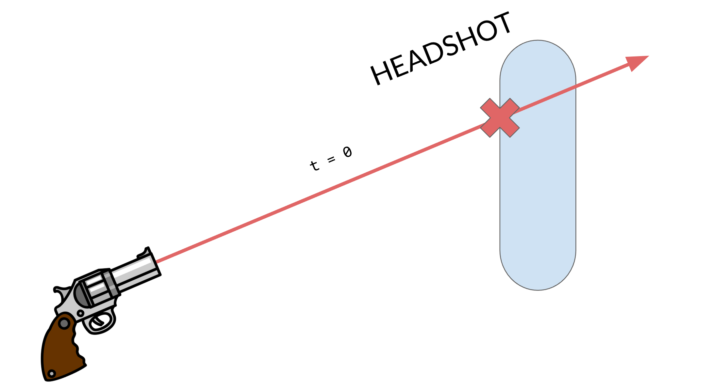
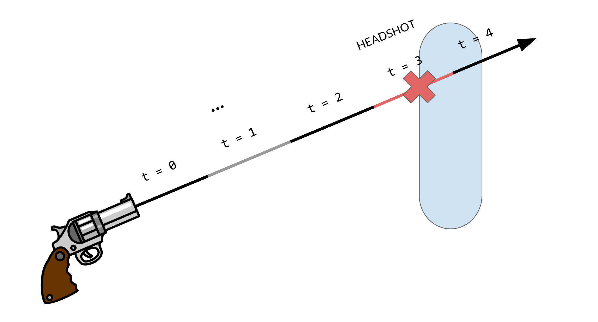
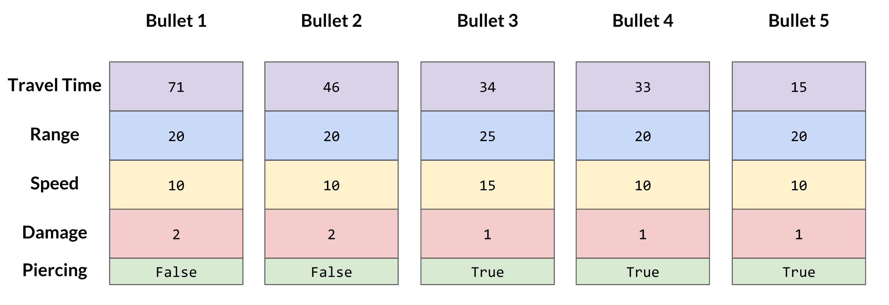
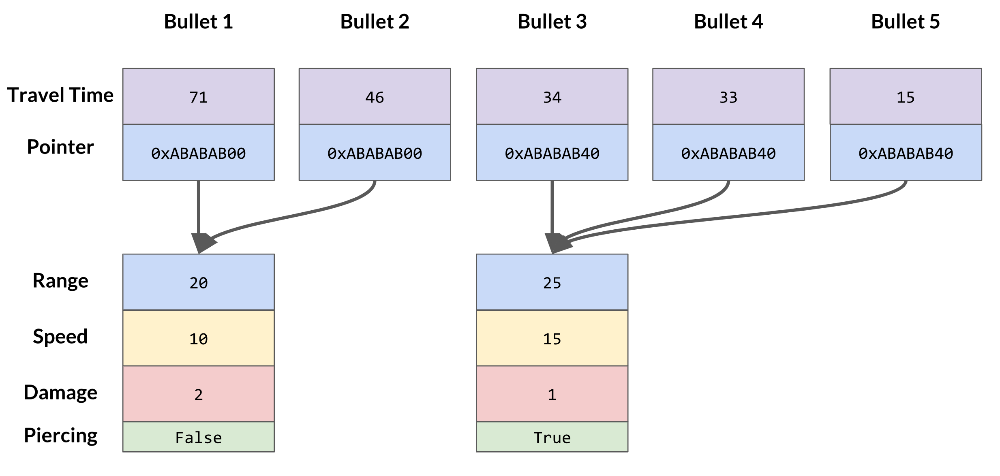

# Is This a Game Engine?

## Byte-Sized Updates

*   [Full-Feature Demo Game](#full-feature-demo-game): Implemented hitscan to be used in our feature game.
*   [The Knight Game](#the-knight-game): Developed another game that flexes some of our new components and our collision system that hasn't been shown in a game just yet.
*   [Collision Solving](#collision-solving): Wrapped up our collision solver by making it moderately more correct, and added a "mass" feature.
*   [Build System](#build-system): Set up a build pipeline for our engine after one too many rebuilds aggravated our programmers to no end.
*   [Networked Game Management](#networked-game-management): Added functions like start/stop server and client, added callbacks related to client connection status, and added networked level loading.
*   [Network Discovery](#network-discovery): Added LAN (local area network) broadcasting functionality so we no longer need to type in IP by hand!
*   [Monitoring Memory Leaks](#monitoring-memory-leaks): We added memory allocation/free tracking and let the user know what's leaking on our free list by object name and amount.
*   [Patch Notes](#patch-notes): As we get to the end we seem to be patching more holes than making an actual boat.


As you can see from the architectural diagram, the engine looks complete! We are still hunting bugs as we develop, but we are at feature lock (hopefully). This is actually harder for us than being still in development because there is so much more we would like to add and iterate on. We have accepted that we _have to_ stop development to ensure the final release isn't broken. We are really focused on three things this week: 

1.  Preparing for our game jam
1.  Starting our engine postmortems
1.  Finishing our full-feature demo game, including finishing necessary features for the game

Now the real question we are asking is:


## Full-Feature Demo Game

We're continuing to build our [feature game](week-0.md#the-example-game). We still needed a few engine features discussed in this blog to finish the game, so we used that as an excuse to do some more engine development before putting down serious work into the game's foundation. (That being said, we've already made a [basic version](week-7.md#first-game) of it, so it shouldn't be too hard to just expand upon that!)


### Hitscan

One of the features that we've begun work on is the shooting system. In our first game (and even in our Unreal example!), we effectively did collision checks on all of the enemies for each bullet. That's a really simple method for checking if bullets hit an object and it's easy to wrap one's mind around, but it's not terribly performant. How could you do this check faster, though? The answer is _hitscan_.

Hitscan is simply a method of checking whether or not a bullet hits an object. It's pretty simple conceptually; when a gun is fired, you create a line from the gun in the direction of the gunshot and you check if that intersects any objects. You take the nearest intersected object and apply the gunshot to that object. Simple, right?

When you go deeper into the feature, you might realize that there are more details that spill out of a hitscan system than you would think at first glance. For instance, what about bullet travel? Some guns shoot bullet more slowly than others. You can't just instantly check for an intersection if you want the bullet to have travel time, you need to simulate the travel time by only checking intersections with certain parts of the line segment depending on how long it's been since we fired the bullet.


*Instant hitscan travel*


*Hitscan traveling over time*


### Why Hitscan?

Above, we said that checking every object against every other object wouldn't be performant, but with a good collision system with spatial partitioning[^1], it would be pretty good, right? We can actually just reason about this to get a good answer, so long as we know what goes behind "entities" in an engine like ours.

[^1]: Spatial partitioning is defined by Bob Nystrom as a way to "efficiently locate objects by storing them in a data structure organized by their positions". If you are interested in learning more, refer to the [Spatial Partitioning chapter](http://gameprogrammingpatterns.com/spatial-partition.html) in his Game Programming Patterns book.

Each entity has a transform, and each transform needs to recalculate its own and all of its children's transformation matrices if it's moved, rotated, or scaled during the current frame. After doing all of that math, we still need to perform collision tests for every bullet object. But we're still not done! If a collision occurs and we remove the bullet from the scene, then we possibly need to regenerate our spatial partition in our collision system for the next frame. All of these operations aren't even including the overhead of data and runtime an entity might carry itself, being a generic object type that's used in our scene hierarchy.

If that's not a good enough reason for investigating a faster method of bullet detection for you, then you will probably want to skip this section! However, we like to squeeze what we can out of our engine in terms of performance, and hitscan also poses a pretty interesting problem, so we moved forward with implementation.


### Implementing Hitscan

Like we said earlier, hitscan is something that gets larger and larger as you add more features into it. Fortunately, it's also naturally upgradable if you're mindful of how you implement it initially. 

We won't delve into too many details here because it's not quite engine development, but it is still a pretty interesting system to develop. We started our `Hitscan` component with a few decisions:


1.  Each bullet should _not_ be its own entity (obviously)
1.  Each bullet should have its own properties, so if our gun starts shooting different bullets, our existing bullets won't change
1.  Bullets get blocked by any collider that is not a trigger

Since we're building up from these decisions, they're the least likely to change in our system now, so it's important that they're chosen correctly. The one that may still change is that our bullets could get selectively blocked by different layers of colliders, but after a certain in point in development, we'll likely have to cement that decision in or face consequences later.


### Hitscan is Easy (with an Existing Collision System)

For our first decision, we need a different method of simulating each bullet than giving each one its own `Entity` and (expensively) moving it using our scene hierarchy. Luckily, we've already implemented [raycasting in our collisions](week-7.md#collisions), so we can leverage that functionality with the `Ray` class for performing hitscans. We also need to keep track of the `travel` distance for each bullet as well. In all, it should look a little something like this:

``` cpp
// Check if the bullet collides with anything
if (Collisions::Raycast(bullet.ray, &hit, bulletRange) &&
		hit.GetDistance() - bullet.travel < bullet.speed * deltaTime) {
  bullets.remove(bullet);

  // … Get the hit collider and run functions on it
  continue;
}

// Propogate the bullet through the space
bullet.travel += bullet.speed * deltaTime;
if (bullet.travel > bullet.range) {
  bullets.remove(bullet);
}
```

It's pretty straightforward. We check a raycast in our scene with our bullet, and if it hits anything then we kill it and run the appropriate code, and if it doesn't hit anything then we keep propagating it through the scene. That's it! Granted, this relies heavily on our collisions system with its intersection testing code, but once that's in place, the gameplay code is pretty easy.


### Being Mindful of the Data

Our second decision is a bit more interesting of a problem. For every bullet to have its own properties, we _could_ store the bullet's properties in itself, and that would be easy. But think about that for a moment—how often will we be changing the properties of our gun? Maybe a few times in a game with power-ups? It's not zero, so we can't just forgo each bullet having their own properties, but since the number is so low, we need to think of something that will be less wasteful than repeating data way more than it needs to be.

This is where pointers are nice. We could use an `unordered_map` from bullet to property or something, but that's much more complex than we need. With pointers to property objects, we only need to store eight bytes worth of data in each bullet to have arbitrarily complex properties on them!


*Bullets that contain their own data*


*Bullets that contain pointers to their shared data*

It's so simple and straightforward...what's the catch? For those of you who were suspicious of this solution, you were right to be wary. One thing that we need to be mindful of is when we should "get rid of" the property objects. When we've destroyed all of the bullets that are using a particular property, do we just leave it for eternity? And if we destroy the property objects, how do we know that no other bullets are referencing it? This problem is solved with reference counting, where we keep track of the number of bullets using the property object and we decrement our count whenever one of those bullets is destroyed.

We also need to keep track of when properties on our gun change so that we can create a new property object for the bullets after that point. That's mostly just writing mutator functions for any of the properties on the gun, which is simply boilerplate. With all of that set up, the code boils down to this:

``` cpp
// If any properties changed or we don't have any property objects
if (propertiesChanged || bulletProps.size() == 0) {
  // Create our property object and assign it to the bullet
  bullet.props = &bulletProps.emplace_back(properties);
  propertiesChanged = false;
} else {
  // We can just use our most recent property object
  bullet.props = &bulletProps.back();
}

// Don't forget to increase the reference count!
++bullet.props->refCount;
```


### The Results

After these things, most of the work was iterative. The gun has more properties than the bullets do since we need things like fire rate, and we can implement more properties on the bullet in the monolith `Update` function like a `piercing` property.

The work on the hitscan system was quick and iterative, and we made a lot of improvements over time. This is one of the perks of having a built engine underneath our game code because we didn't have to deal with any engine rebuilding to iterate. That being said, we did have to revisit our engine code a few times to provide functionality that we were missing!

Check out some progress videos of our hitscan work!

<div class="video-wrapper">
 <video playsinline autoplay muted loop>
   <source src="../../images/blogs/week-13/Hitscan-1.mp4" type="video/mp4">
Your browser does not support the video tag.
 </video>
</div>

<br>

<div class="video-wrapper">
 <video playsinline autoplay muted loop>
   <source src="../../images/blogs/week-13/Hitscan-2.mp4" type="video/mp4">
Your browser does not support the video tag.
 </video>
</div>

<br>

<div class="video-wrapper">
 <video playsinline autoplay muted loop>
   <source src="../../images/blogs/week-13/Hitscan-3.mp4" type="video/mp4">
Your browser does not support the video tag.
 </video>
</div>

And here's a quick snapshot of the performance of our hitscan implementation. The top left contains frame rate info, and to its immediate right is our hitscan data. Over 4,000 shots at ~20ms is not bad, especially when you consider that 95% of the frame time is spent on the `DebugDraw` calls!


## The Knight Game

We've spent the last couple of weeks creating another game, or something that sort of resembles one... The gist of the game is an infinite runner where you, as the knight, run from a barrier (a collider) and slash training dummies (capsules) to rack up a high score. The focused-on engine features were colliders and animation as we had yet to really have a game focus on either (although we included animation in our first game). The development was relatively intermittent since we were just adding in features that we thought might be interesting and we definitely didn't have a design plan going into it.

The development started by gathering additional assets and reworking them in Blender, which as you would expect for a programmer, took longer than estimated. Our struggle with this was that the downloaded models were scaled at 100 times the unit scale of our engine and Horde3D's engine. Scaling a model in-engine isn't that difficult, but it is nice to have a model already at scale, so we attempted to scale in modeling software which broke the connection between the mesh/skeletal rig and animation. Initially, we had a model file which was a COLLADA (.dae) model with mesh and rig and we also had other .dae files which were purely animation with the same rig, no mesh data. Without scaling we were able to successfully import the mesh and animation into Unity, but once the mesh and animation were scaled, something about the .dae file format broke the connection, and so not even Unity could process the files this way. After a night of struggling with that, we decided to use animation files which contained the mesh (although only .anim files were being exported with the asset processor) which worked even after scaling. The biggest struggle of this was that we were at the whim of two things out of our control: 1) the .dae file format and 2) the Horde3D rendering engine. Although we could read the .dae file, once they were turned into Horde3D's .geo and .anim files, all bets were off for whether the file was being processed properly or if the actual rendering/animation code was breaking. Here is the knight moving at correct scale:

<div class="video-wrapper">

 <video playsinline autoplay muted loop>

   <source src="../../images/blogs/week-13/Knight_walk.mp4" type="video/mp4">

Your browser does not support the video tag.

 </video>

</div>

Once the actual animation was working in the engine, we wanted to "attach" a sword to the knight character which would follow a certain joint in its rig. Prior [`MeshComponent::GetJointWorldTransform`](week-12.md#expose-more-functionalities-from-horde3d) there was no way to do this. The functionality before wasn't sufficient because although the sword could have been parented to the knight, there is no way to get the hand's transform information. With this function, the sword can be attached to the hands and will move through an animation. We were then able to get the knight chopping with his sword!

<div class="video-wrapper">

 <video playsinline autoplay muted loop>

   <source src="../../images/blogs/week-13/Knight_sword.mp4" type="video/mp4">

Your browser does not support the video tag.

 </video>

</div>

With the assets set up, we wanted to focus on the collision of the sword with an "enemy". Keeping it simple, we just wanted to ensure we could align a collider with a mesh as desired. What we found out was, first, the pivot of the sword was in a terrible location, but more importantly, the collider drawn was displaying shearing as spoken about [last week](week-12.md#collider-debug-shearing).  After fixing that, we attached a `CollisionHandler` to a box to cause a splitting effect. This was a great exercise in using our own API. It had been a few weeks since some of us had touched collisions, so remembering how they worked took a minute. Because there weren't any examples of how to use the `CollisionHandler` before, it hadn't occurred to even use some functionality, such as the `IgnoreCollisionLayer`. Here is how it was looking:

<div class="video-wrapper">

 <video playsinline autoplay muted loop>

   <source src="../../images/blogs/week-13/Knight_shearing.mp4" type="video/mp4">

Your browser does not support the video tag.

 </video>

</div>

Well that obviously looks (and is!) broken. There were a few things with the collision system that needed small bug fixes. One of those fixes was with regards to a box and capsule, we had noticed that a simple case of box-capsule collision wasn't being detected. Going into the box-capsule code was a nightmare for us because this particular collision detection was just not performed the way we needed this particular collision detection to be performed. Luckily, the error was found quickly by using our debug drawing system to find where the contact and closest point were and stepping through the code. In the end, we got the collision working (hopefully the full-feature demo game won't need more fixes)! With all of the necessary capsule collisions working, the knight who had a capsule collider surrounding him could be killed, and the alive enemies who were represented as capsules could be cycled (basically a pool that would translate to a position on the other side of the screen once they went off-screen).

When we began cycling the enemies, the game started to feel like an actual game with a lose state and a goal! However there was something weird happening with when the capsules collided with the wall to reset their position. The collision would happen and be detected—everything working so far. The `CollisionHandler` callback would then set the position of the entity to the other side of the screen—that works. Then the object would teleport back to point of collision... wait what? The solution deals with the ordering of `CollisionSolver::Update` and when the collision callbacks occur; [read more below](#collision-solving-and-collision-callbacks). With all these bugs ironed out, the game took shape and although simple is slightly enjoyable to play. Here's what a slice of gameplay looks like:

<div class="video-wrapper">

 <video playsinline autoplay muted loop>

   <source src="../../images/blogs/week-13/Knight_game.mp4" type="video/mp4">

Your browser does not support the video tag.

 </video>

</div>


## Collision Solving

Collisions and physics, in general, is a deep field in video games, and beyond features and correctness, optimizations can always be done. As such, we decided to wrap up our collision solving system by getting it to be close to correct and leave it at that. One very convenient aspect of the collisions part of the field is that getting everything solved and good _eventually_ is usually good enough—it will just mean a couple rendered frames of jitter or so.


### The Math of a Box

[Last time](week-11.md#future-plans-with-collision-solving), we mentioned that we had a pretty good idea for how to make our box collision responses more...correct. Previously, our boxes would correctly detect the collision, but on most of the edges the box would shove itself and the other collider completely out of the way of each other if the collision point was far enough from the center of one of the box's faces:

<div class="video-wrapper">

 <video playsinline autoplay muted loop>

   <source src="../../images/blogs/week-13/Bad-Box-Collision-Solving.mp4" type="video/mp4">

Your browser does not support the video tag.

 </video>

</div>

The reason this happened is because our collision detection for box colliders would pass the collision point to the collision solver, which would then try to extrapolate the push direction of the collision from that point. This might not seem like a problem for things like spheres, but for boxes, it's a different story. When the collision point on that box is on a face instead of an edge, it's really easy to figure out which face of the box determines which direction the colliders are pushed in:


But what about when the collision point is on an edge? That is, when the point lies at the max extent of two faces as opposed to just one?


In our case, the box would get pushed to the side because code is run sequentially. When determining the furthest distance on an axis, our code always checks in the order of the x-axis, then the y-axis, then the z-axis. If the point is equally distanced on the x-axis and the z-axis, then the x-axis wins.

This can be solved by doing some of the collision solving work while we're detecting the collision point. The other collider is probably not perfectly distanced at the corner of our box collider; it's probably a little closer to one face or the other. While we're determining the collision point, we can also check for the furthest axis distance _without being constrained to the extents of the box_. We store that information for later, where the collision solver can then respond appropriately:


<div class="video-wrapper">

 <video playsinline autoplay muted loop>

   <source src="../../images/blogs/week-13/Correct-Box-Collision-Solving.mp4" type="video/mp4">

Your browser does not support the video tag.

 </video>

</div>


### That Epsilon Spice

We may have gotten some silky smooth box colliding now, but we're not devoid of troubles yet:

<div class="video-wrapper">

 <video playsinline autoplay muted loop>

   <source src="../../images/blogs/week-13/Sticky-Collisions.mp4" type="video/mp4">

Your browser does not support the video tag.

 </video>

</div>

As neat of a gameplay mechanic as stickiness can be, it's not exactly great as a game developer to have to make all of your games gum-themed. Fortunately, this problem is easy to solve. When collision solving, you shouldn't just put the colliders in the correct position depending on the collision—you should put them a little further, an epsilon amount, from the solved position. That way, you aren't colliding again after you solve the collision.


### "Mass" in a Collision System

One last small feature one of our developers convinced us to develop for the collisions system is something that's usually thought of more as a physics parameter: mass. Obviously, we're not developing an entire physics system for this one last feature, so what do we mean by "mass"?

Well, the way our collision solver currently works, everything is considered to be equally movable barring any static colliders. This means that a box that is 100x the size of another box can get shoved around by the tiny box as easily as by any other collider.

<div class="video-wrapper">

 <video playsinline autoplay muted loop>

   <source src="../../images/blogs/week-13/Box-Bully.mp4" type="video/mp4">

Your browser does not support the video tag.

 </video>

</div>

This happens because each collider receives an equal part of the collision response when wrapping up the collision solver calculations. Thankfully for us, having a system that calculates out a shared collision response that gets split between colliders is really convenient when we want to upgrade the system to unevenly distribute that response. By adding a `mass` field to the `Collider` class, we can now just check against the weighting of the colliders to determine how "heavy" certain objects should be!

<div class="video-wrapper">

 <video playsinline autoplay muted loop>

   <source src="../../images/blogs/week-13/Box-Anti-Bully.mp4" type="video/mp4">

Your browser does not support the video tag.

 </video>

</div>

> An interesting feature that this also adds to our engine is "negative mass". That effectively makes objects counteract any objects that push on them, which is actually something that could be useful for gameplay!


## Build System

[Last week](week-12.md#exporting-headers), we talked about how we needed to export all of our headers in order for people to use our built engine. This got us most of the way there, but we were quickly finding that we need to rebuild our engine DLL's often during gameplay development (so many bugs!) then re-run our export tool and do a bunch of file shifting. The cherry on top? We would need to update our Git repository with the engine and everything, which would usually involve annoying merge problems (our opinion of Git has steadily dropped throughout the semester).

Being programmers, we decided that this repetition was not worth our time and we started drafting up a build system for the engine. We've already been using [Jenkins](https://jenkins.io) on a shared machine in the room for building our website, so we've already got the pipeline there, we just need to automate the steps for building the engine. Thanks to our batch file that handles the exporting of the build and the header files, the main technical part that we needed to add was building each configuration of the engine, which just involved getting `devenv.exe` from the Visual Studio program files added to the PATH environment variable and running it with the correct parameters in order to rebuild.

Once that was working, we still needed the computer to push the built engine to a shared location. We decided on that should be our [feature game repository](https://github.com/Isetta-Team/Isetta-Game), and set off in the land of Git commands. Adding the newly built files to a commit and pushing that to the repo was easy, but getting the commit message to be our most recent engine commit message was a bit more annoying in batch script because we had to be mindful of escape characters (which is ^ in batch).

After we got a build pipeline working, we quickly realized that pushing up a new build regardless of whether we have built the engine at that commit is not a good idea. If we want to debug a problematic build, we'd have to look through dozens or hundreds of commits! So the last feature we built into our build system was an up-to-date verification system, which we already had a good reference for from a past Jenkins function, but it still caused quite a few headaches. The basic idea was to write our pushed commits to a build history file, which we then read on later builds to confirm that that commit hasn't already been built and pushed.  Unfortunately, Jenkins does not remember system variables across build steps, so we had to come up with a very janky solution of creating and conditionally deleting a file to determine whether or not we should be trying to build the engine again.

All in all, this whole process took about 12 hours worth of development time. Was it worth it? In the long run, it very likely would be; after all, we were already feeling pretty aggravated because of our build times. However, in the short term, we may not see too many dividends.


## Networking


### Networked Game Management

This week we finally got the chance to extend our networking module and add game management features. The features our game needs are pretty simple - clients and server just need to know when each other is connected and disconnected, so we added four callbacks:


*   `OnConnectedToServer`: a client callback called when a client successfully connects to the server, mainly for initialization right after the connection is established
*   `OnDisconnectedFromServer`: a client callback called when the client is disconnected from the server - either caused by losing connection or manually calling `StopClient`. Developers can use this to stop their networking features and keep track of networking state
*   `OnClientConnected`: a server callback called when any client is connected. To provide more valuable information like client's IP address, we also created a `ClientInfo` struct that's sent to the server when the client is connected.
*   `OnClientDisconnected`: a server callback called when any client is disconnected. Because the client may drop out any time without notifying the server about that, this event is monitored on the server every frame and is called when any client's state changed

The new addition of our [`Delegate`](#delegates) data structure made implementing these callbacks super easy! All we needed to do is create an interface for subscribing and unsubscribing from the events, finding the right places to invoke the callbacks and send network messages, and making several maps to track clients' state. Now, we can get nice messages like this by using the new callbacks (we were running host so we get all callbacks):


We then discovered that our API for creating server and client were not unified with one being called `CreateServer` while another called `ConnectToServer`, and we didn't have a function for "starting as host". We refactored those functions into `StartClient`, `StartServer`, `CloseClient`, `CloseServer`, etc., which we think will be more intuitive for the developers.


#### Network Role Monitoring

Another feature we need for the game is to easily get the network role of their instance, "am I running as host? Or server? Or client?" Luckily, yojimbo already exposes simple state querying functions like `Client::IsRunning` so we were able to easily make a wrapper on top of those for the developers to use. When debugging them, we also made a component that draws network information through our GUI as shown in the picture below. In the end, we thought this can also be useful for the game developers, so we refactored it and put it in our engine.


#### Updates to Network Messaging API

One of the things we left in our sea of TODOs is unifying `GenerateNetworkMessage` and `SendNetworkMessage` but we never found a good way to do it, neither did we have a better reason than, "so developers can write less code". Well, the need finally comes when we want to send a message from the server to all of the clients. If you remember our long journey of evolving network messages in the [week 7 blog post,](week-7.md#networking) each message generated on the server is only meant to be sent to a single client and `GenerateMessageFromServer` always take one parameter as client index. So when you want to send the same message to all clients, who do you generate it for? Here is the need in our API!

Therefore, we decided to change our `SendMessage` functions from taking a message pointer to taking an `Action<T*>` that initialize the message. Inside the function body, it will generate a new message and initialize that message with the given initializer. This also saves the developer from the tedious work of `reinterpret_cast` messages to their message type every time. By doing this, we effectively eliminated the need for calling both `Generate` and `Send` - they are nicely unified in one now!

``` cpp
template <typename T>
void NetworkManager::SendMessageFromServerToAll(Action<T*> messageInitializer) {
  for (int i = 0; i < GetMaxClients(); ++i) {
    if (!IsClientConnected(i)) continue;
 
    yojimbo::Message* newMessage = GenerateMessageFromServer<T>(i);
    messageInitializer(reinterpret_cast<T*>(newMessage));
    SendMessageFromServer(i, newMessage);
  }
}
```

However, we also realized we shouldn't remove the old method because there are still scenarios where we need to pass in already built messages. For example, a lot of times the client would send a message to the server and the server needs to then broadcast that message to all clients. So we decided to leave it in—however, this might be a potentially confusing API design for our users.


#### Network Load Level

The last feature we need in terms of game management is networked level loading. We thought about making it in the game and keeping it in the game, but this really seems like something many games need and would be good to have in the engine. However, to do that, we had to bring in `LevelManager` to our `NetworkingModule`. The `LevelManager` is used within a `NetworkModule` callback to signal all clients to also load the same level as the server, thus cannot be separated from the module. This can be seen as code pollution in some sense, but we decided to tolerate it at this stage. 

As mentioned before, we already have some other built-in network messages like `ClientConnectedMessage`, so it's easy to create another `LoadLevelMessage`. The rest of the task is again finding the right place to inject the code (like registering the callback for the message and sending the message) and making nice interfaces for game developers. 

A tricky part along the process is actually figuring out how to let messages hold and serialize strings. We initially created a `const char*` member variable in the messages without thinking too much about it but it didn't work! Because the string data we pass into the message is generated by another module and is a temporary object, and that temporary object deletes the data as soon as it's destroyed. We fixed it by changing the type to `char[]` so we can make a copy of that string to the message and let the message own that copy. Then the problem is how long do we want the `char[]` to be. For IPs it's easy - just make it 16 bytes long. But for things like level names we can never be sure how long they are, in the end, we gave it 64 cause we really don't think users will have level names more than 64 characters long… If they do, we give them an error for now.


### Network Discovery

This is probably the last new feature we are adding to the game so it's a little sad to write about. Our demo game is supposed to be played with controllers and thus players should be able to create and join rooms using their controllers. However, with our current setup the user always need to _know_ and _type in_ the IP address of the host they want to join with a keyboard. Based on our previous experience of playing LAN (Local Area Network) games and using Unity's networking system, we had the idea of making a `NetworkDiscovery` class, which allows the hosts to broadcast messages to all devices within the same LAN and allows those devices to respond to the messages.

The API design for this class is super easy: `Start/StopBroadcasting`, `Start/StopListening`, and `Add/RemoveMessageCallback` are all we needed. `StartBroadcasting` also accepts the message, broadcast duration, and interval as parameters. We again used our `Delegate` data structure to manage callbacks.

The actual implementation is, however, not as simple as the API. We looked through yojimbo and the two networking libraries it's using ([netcode.io](https://github.com/networkprotocol/netcode.io) and [reliable.io](https://github.com/networkprotocol/reliable.io)) for message broadcasting functionalities but surprisingly didn't find anything useful! So we had to get our hands dirty with some basic socket programming. As we don't care about reliability, sequence, latency, etc — because we are just broadcasting messages where losing messages is really not a big deal — socket programming is shockingly easy! We followed this [tutorial](https://www.cs.rutgers.edu/~pxk/417/notes/sockets/udp.html) from Rutgers University for basic sockets set up and communication, and referred to the two source files ([BroadcastSender.c](http://cs.ecs.baylor.edu/~donahoo/practical/CSockets/code/BroadcastSender.c) and [BroadcastReceiver.c](http://cs.ecs.baylor.edu/~donahoo/practical/CSockets/code/BroadcastReceiver.c)) by Baylor University on how to configure sockets for broadcasting — and we are done!

<div class="video-wrapper">
 <video playsinline autoplay muted loop>
   <source src="../../images/blogs/week-13/connectionless_broadcasting.mp4" type="video/mp4">
      Your browser does not support the video tag.
 </video>
</div>

With `NetworkDiscovery`, we no longer rely on specifying server IP address in the config because it's included in the broadcast message. This will definitely create a better experience for our demo game's players, and be useful for developers who want to implement similar functionality — even though it can be used for a lot more!


## Monitoring Memory Leaks

One of the side effects of having our own memory manager is that we never realized how much memory can be leaking on the freelist because it's just always silent. Good news is that we can easily track every single allocation and free! By doing that we can not only dump all of the memory leaks and blame the developers, but also provide valuable information for them to find and fix them! 

Even a small feature like this took us some iterations to get right. In the beginning, we were only tracking `Freelist::Alloc` and `Freelist::Free`. It does provide _some_ information, but I wouldn't say it helps much when all it presents is something like this:


> See the nice arrows?! Yeah, it took us a good 10 minutes to find their Unicode and figure out how to print them.

We wanted more information! So we also added tracking to our `Freelist::New`, `Freelist::Delete` utilities and their array counterparts. So we get something like this when we forget to free these things: 

``` cpp
MemoryManager::NewOnFreeList<SystemInfo>();
MemoryManager::NewOnFreeList<Math::Vector3*>();
MemoryManager::NewArrOnFreeList<yojimbo::Message*>(256);
MemoryManager::NewArrOnFreeList<Math::Matrix4>(512);
```


They are nicer! But it still took a while to figure out what's leaking, so we added some string manipulation to "translate" the leaked resources to something that we can recognize, and got this:


It's a lot of unexpected work, and the performance may not be pretty… But the work definitely pays off as it's much easier to identify who is leaking, and we wrapped memory tracking in `_DEBUG` preprocessors so they won't get run in release mode.

By adding this feature we not only fixed a bunch of memory leaks but also found some fishy allocations. For example, we once had several array allocations of size 0 - turned out they are from `Array<T>`s of capacity 0, which is a corner case we should have taken care of.

Last but not least, if you don't have memory leaks, our engine actually praises you!


> We should be doing more of this! Developers always love appreciation to their hard work, right?


## Engine vs. Game Resources

In the past week, we have been working on getting more and more ready for our game jam. Part of that has been moving our levels from inside the engine to the `IsettaTestbed`. The reason for this shift is because these levels aren't really part of the engine, but rather levels that we are using to test out systems and demo different features. We are also going to leverage these levels for our game jammers as examples of how to use different features of the engine. This shift also caused us to move resource files, like model and audio files, from the engine to the testbed. However, there are certain resources like the primitive meshes and lighting shaders that should just be packaged with the engine. Part of this change affected the [`ExportHeaders` batch script](week-12.md#exporting-headers) which needed to copy over the resources from the engine that are needed to use the engine in general.

This presented the problem of how should the engine know what path files should be loaded from, the engine or game? If we are packaging some of them with the engine while obviously the game developer will have their own files, how will we know? 

One solution, which we didn't think was a good solution, was to have the user "import" (copy) the engine resource files to their local game resources directory. There are a few problems we considered with this, one being it relies on the game developer to remember to copy files, which we had forgotten to do multiple times. The other is it muddles the game developer's folder with engine resources that they don't necessarily need knowledge of. 

So our alternate solution was to add an additional `engine_path` `CVar` to the config file, and similar to the `resource_path` which specifies where the game developer's resources are, the `engine_path` is the directory of the engine resources. Ideally, we would be able to know where the engine resources are relative to the game, however since our engine isn't something that is installed in the program files we can't guarantee its location and would rather allow the user the flexibility of moving it to where they would like. 

Our first idea with implementing the switch in the engine was to use `engine_path` as the path during `EngineLoop::StartUp` then switch back to `resource_path` before`EngineLoop::Update`, however, there were multiple problems with that. One of the problems was that `RenderModule` was caching the `resource_path` on its own startup (which would be `engine_path` at the time) causing the resources loaded after startup to be using the `engine_path` directory, even after reverting back to `resource_path` after startup so that wouldn't work. Also, another problem comes with components that are used by the game developer, such as during a level load, components like `LightComponent` should load its default light shader from the engine so the game developer doesn't _need_ to create their own, but can if they want. There are also the `Primitive` entities whose resources should also be loaded from the engine, every game developer doesn't need to create their own cube model. These systems won't work by setting the `resource_path` to the `engine_path` at startup. 

Ok, the next solution is to modify how the resources are loaded. Rather than caching `resource_path` and always prepending `resource_path` to the file path, it needs to be specified if it is "in engine" or "in game". For most components, this doesn't need to be exposed to the developer, and ideally it wouldn't be at all because anything the developer is specifying is "in game". However, for the `MeshComponent` which primitives rely on, we need to be able to specify within the constructor if it should load from the engine directory. For other components, like `LightComponent`, we don't have the option exposed to the user, however this is actually limiting features of the lighting in the case the game developer wants to specify their own default lighting (using the default constructor) they won't be able to because it will point to the engine path. This solution doesn't seem like the best and we think this is one of the systems we might put more time into when creating our next engine so not only is it easier to do something like this but easier to use in general.

> Woah! Hit the brakes, we can't wait until our next engine to put more time into this. After writing this we found there was a **huge** problem with this method and had to completely refactor, the refactored changes.

So there are two problems with this method: one occurs when running the executable and the other is associated with Horde3D's asset processing. For a while, we had been thinking about the consequences of our decisions when running the executable (.exe), however, until this week we hadn't really tried to. What happened was exactly as expected, a crash, because the resources weren't located in the same relative path as they were when debugging. So just get the resources in the build folder, right? Our first change was to perform a post-build copy of the resource files into the build folder. However, the engine path from the build folder wasn't guaranteed to be the same as for the project, thus would be wrong in the configuration file as well. This means the solution suggested above just wouldn't work, unless the engine path from the project was the same as from the build folder. That's a big if and big assumption. The other problem associated with Horde3D's asset processing is some shader and texture properties are just assumed to be in a certain folder directory, it is baked into the model description files during processing. We could dig into Horde3D to attempt to change this, but this is something we have told ourselves we don't want to modify Horde3D and would be better to work around. There is no way during load for us to know if this file is located in the engine or game resources. We could keep a list of resources in the engine directory, but that just doesn't feel right either. So _completely throw out the solution we had suggested above_.

After basically reverting the idea of an `engine_path`, which wasn't nice in its own right because specifying paths in a config file isn't very clean, we came up with two solutions. The first solution was to copy the resources of the engine into the game resources folder (which is what we were trying to avoid to begin with). The problem with this solution is that we are putting the engine resources in their own folder to abstract those details from a developer. A game developer shouldn't need to see the render pipeline, for example, if they aren't interested in it. Even copying the files during a build event is still messy because although the developer isn't physically copying them, they would still see the files while browsing their resource folder. Our other solution was to copy the engine resources and game resources to a resources folder in the build folder, which was already needed to run the executable, and change the working directory of the solution to be the same as the build folder. The solution solves most of the problems that we have and most importantly lets us run both the solution and executable. There are two big drawbacks to this solution: 1) engine resources can and will be overwritten if a game resource has the same path and name 2) copying the resources to the build folder is a little unreliable. We worked for awhile trying to come up with a better way of copying the resource files, and the best solution we were able to do was on an actual build all the files of the resource folder will be copied then when individual resource files change, so long as they were included in the last build, those will be changed and copied over. Files that are added won't be copied before an actual build is triggered. Filesystem management hasn't been one of our biggest priorities with this engine, especially with being stuck with Horde3D's choices and assumptions, so we aren't going to advocate for this approach. One problem was that we didn't know what the requirements of a good filesystem were almost until it was too late; we all have vocalized that next time developing an engine this is something that should have more thought with early on.


## Patch Notes


### Collision Solving and Collision Callbacks

As mentioned within [The Knight Game](#the-knight-game) section, the order of when the collision callbacks are called and the collision solving matters. Prior to any change, we were performing our collision checks which would then trigger any corresponding collision callback (OnEnter, OnStay, OnExit), then the collision solver would resolve the collisions so no two colliders were interpenetrating. The problem came from altering the position of a transform in the collision callback. The movement that would occur in the callback would basically be reverted/ignored because after the callback the solver would try to solve an outdated BVTree, it is outdated because the entity was moved but the tree wasn't updated. The solver would resolve the collision by shifting the collider out of the other with a closest point heuristic, this movement essentially overwrites any movement that happens in the callbacks. 

So why doesn't the callback update the tree? Why not just always have an up-to-date tree? The main reason is performance. The act of updating the tree would then require getting all AABB collision pairs and then intersections being recalculated, this is basically performing the `CollisionModule::Update` a second time. It already is a performance hog and now we have to do it twice! Well not quite. The just as easy, but not necessarily apparent solution, was to delay the callbacks for collisions until after the solver has solved,  so the callbacks are separated from intersection tests. This delay wouldn't affect which callbacks were being called because the callbacks could be cached until after the solver had finished, thus aptly labeled `CollisionModule::LateUpdate`. The new order is now update the `BVTree`, grab the AABB collision pairs, test for intersections, solve for collisions, _then_ perform the callbacks. Just another example of how much ordering matters in a game engine.


### Static Entities

When we were implementing our [collision solver](week-11.md#collision-solving), we added static attribute to the entities to mark whether the entity is moveable by the collision or anything else. However, we were not utilizing that attribute to manage the movement of the entity elsewhere. This week, we went back to fix this missing feature and to make the transform of a static entity unchangeable.

It sounds simple, right? The only thing we needed to do seems to be checking the static-ness before changing the transform, with any `SetXXX` in the `Transform` class. This is not necessarily true. The main reason of it is that we cannot assign the transformation information, including the position, the rotation and the scale when creating the entity. And with the static attribute, we can neither set the transform later. This causes all static entities to be instantiated at the  origin of the world with no rotation or scale, they all must be there! Poor statics!

We changed our definition of static attribute later to solve this problem. The transform of a static entity is no longer unchangeable throughout the lifetime of the entity. Instead, it can be moved wherever and however you want until the level finish loading. As we are using `Level::Load` to replace the level scene file, this makes so much sense when compared with Unity and Unreal Editor where static entities/GameObjects can be moved before we hit the play button!


### Revisiting `transform` in the `Component` Class

Last week, when we were replacing all `GetTransform` function to `transform` variable, we introduced two static member variables in `Component` class to deal with the const initialization issue: since we can only assign the value of a `Transform* const` in the constructor and we cannot pass in the transform for it to point to, we can just make a shared state in the `Component` class for the component to read in its constructor. It seems working well but, as mentioned last week, this method changes and exposes (not directly available for the game developer though) the shared state.

This code smelled so bad that it kept us awake at night. This week, we came up with another method that can remove the static variable in the class but is still relatively unsafe, internally. Since C++ doesn't have a strict management of constant variables, we can cast the variable to `Transform&` and assign our transform to it.

Before we removed the `GetTransform` function, the `AddComponent` was like this:

```cpp
...
T *component = MemoryManager::NewOnFreeList<T>(std::forward<Args>(args)...);
component->entity = this;
...

```

After last week change, the `AddComponent` is like this:

```cpp
...
Component::curEntity = this;
Component::curTransform = transform;
T *component = MemoryManager::NewOnFreeList<T>(std::forward<Args>(args)...)
...

```

And now, it's like this:

```cpp
...
T *component = MemoryManager::NewOnFreeList<T>(std::forward<Args>(args)...);
(Entity*&)(component->entity) = this;
(Transform*&)(component->transform) = transform;
...

```

We still cannot sleep like a baby. It was us who set the transform pointer to be a pointer that points to a constant value; it was also us who broke the law and casted it to a normal pointer. This behavior is so dangerous that if any game developer tries to use this trick and change the transform of a component, the game will break, most likely. Luckily, we know what we are doing here, so we might just leave it here, for now.

> This is where we would really love a C++ guru to save us. If you happen to be one, let us know how to fix it in the comments!


### Delegates

One thing we forgot to mention weeks ago is that we abstracted our [callback-handle structure](week-3.md#input-module) out. Originally, we only had callbacks in input module, so we used member functions like  `RegisterCallback` and `UnregisterCallback` in `InputModule` to handle them. Later we found that the game engine is much more event-driven than we thought. In addition to the event messaging system, which is designed for global events, we still need a unified structure to deal with point-to-point event subscription. Thus, just like what [Casey Muratori](../interviews/CaseyMuratori-interview.md#problem-2-the-complexity-explosion) said before, we wrote it out first, and then we pulled it out. This structure is called `Delegate`.

Implementing the `Delegate` is not hard. The interface is simple, with only four functions: `Subscribe`, `Unsubscribe`, `Invoke` and `Clear`. In the first two functions, we integrated the `HandleBin` we implemented before so that it can revoke the handles after it's unsubscribed. It was a little bit tricky when we were implementing the `Invoke` function. It iterates through all the handle-function pairs and invokes the corresponding functions. However, simply using a range-based for loop is not enough. When the callback function is unsubscribing itself, it will invalidate the iterator we are visiting and thus break the `for` loop in the `Invoke` function.

How do we deal with that? We decided to use a two phase strategy to invoke all the callbacks. In the first pass, we filtered all the callbacks out to a new array. We then called all callbacks in the new array in the second pass. Since unsubscribing only changes the original pair array, the array we are iterating through now is unaffected and safe.

The related code is like this:

```cpp

std::list<Action<const ActionArgs&...>> callbacks;
for (const KeyPair& callback : actions) {
  callbacks.push_back(callback.second);
}

for (const Action<const ActionArgs&...>& callback : callbacks) {
  cllback(args...);
}

```

There was another problem we needed to solve in `Delegate`. Due to the handle revocation, it's very hard to tell whether a handle originally owned by some object is still valid or not. Since the handle can be revoked during unsubscribing and be re-assigned when another object, the old owner can accidentally unsubscribe others' callback with the handle. The solution to that is we changed the starting number of the handle bin from 0 to 1 and defined that if a handle is 0, it is invalid. So now in every `Unsubscribe` function, we reset the passed-in handle to 0 to invalidate it.


### Move Assignment Operator for Arrays

When we were working on [hitscan](#hitscan) for the feature game, we heavily used our `Collisions::Raycast` function, and eventually realized that we could probably use a `Collisions::RaycastAll` function as well. The addition of this function was straightforward because we basically only had to take the `Raycast` code and make it utilize an `Array` for any hits. Our solution for this uncovered both an amazing performance boost and a massive memory leak! Doubtlessly, these things were related. As it turns out, our move assignment operator for `Array` was _mostly_ correct, except for the fact that it didn't free all of our previous array data. We set up the operator to compare the data of the current and moved array, and delete if they were different. No more memory leak! (Also this brought our performance back to where it was previously, so we had to pull some other tricks out of our hat to bring up the performance).


### Window

We've had a `WindowModule` since [week 2](week-2.md#the-window-module), but only the `RenderModule` and `GUIModule` had direct access to it. We've had some need for some window-like features but have been able to just shove them in other classes up until now. However, for our [knight game](#the-knight-game) we needed to use the actual window size but there was no good access to it. So we decided why not, like all our other modules, have an accessing class, appropriately named `Window`. The class is relatively simple acting as an access point to get width and height of the window as well as change some other GLFW properties. There are a few properties like the cursor sprite and visibility that we would like to change but ImGui is also managing those properties so it isn't as simple as adding in a function but actually getting it to function with multiple modules.

### Coming Soon
Not much is left to be coming soon. We have one last blog post we will make about our last bit of development as well as posting about our GameJam. We will be trying to add some additional maneuverability to our documentation by adding a compendium tab, which will chronologize each section of the engine week by week as well as roping in the relevant interviews to that topic. We will also have postmortems coming to wrap up our project as a whole, so be on the look out for that.

## [Resources](/resources.md)
Probably no one has added much to the page this week, since it has been more focus on refining and bug fixing over adding new features. Hopefully it will get one last boost in the next few weeks as we dumb any resources we've been hoarding on there!

_Originally Published December 3, 2018._
