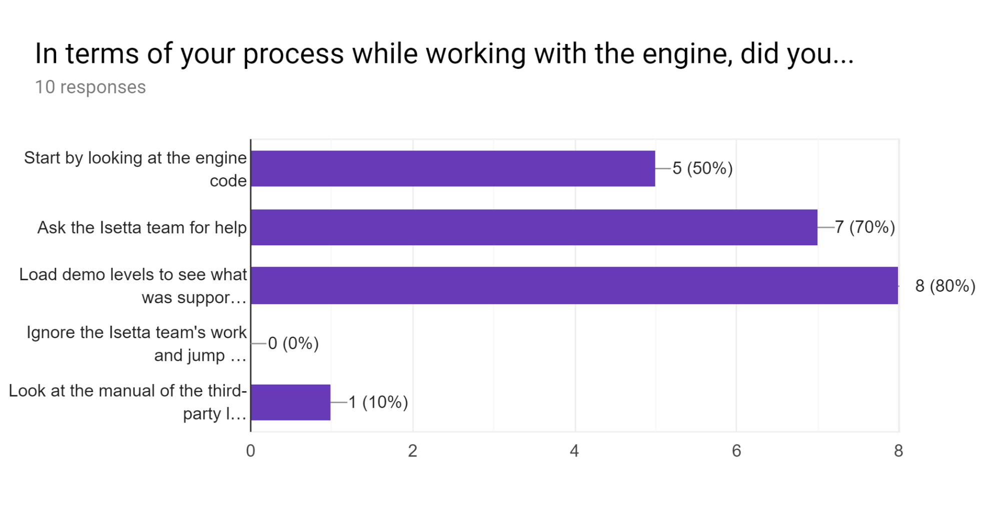
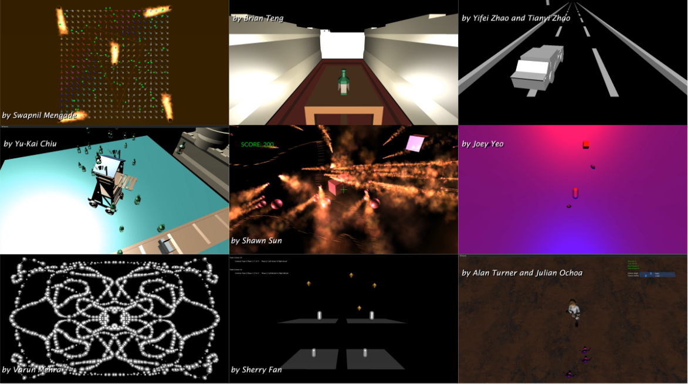
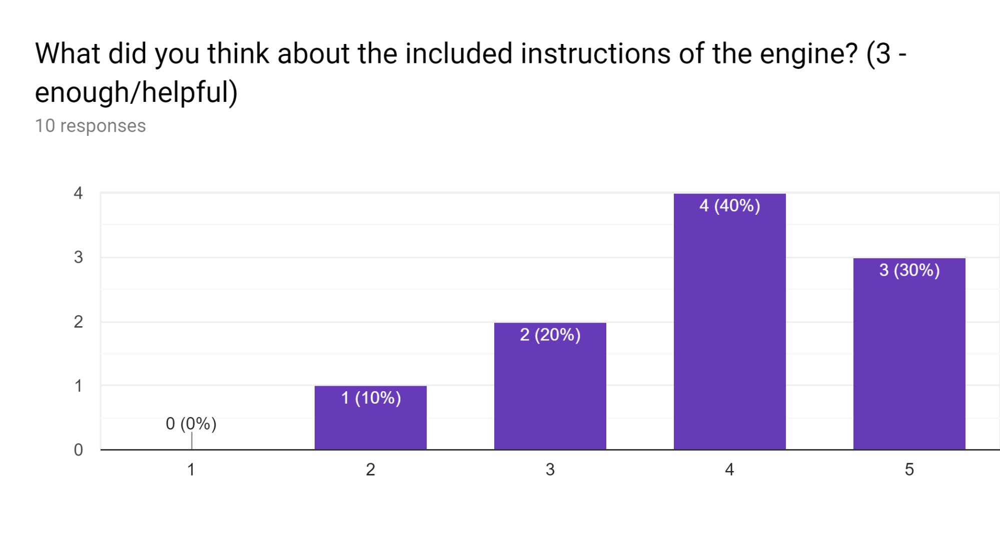
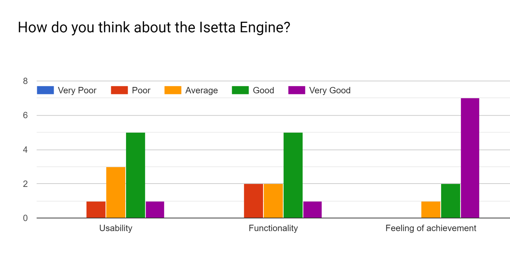
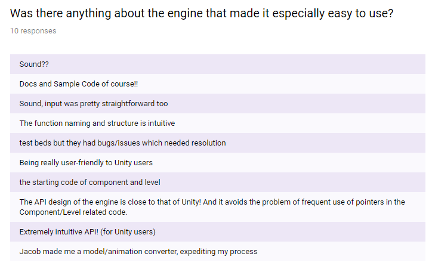
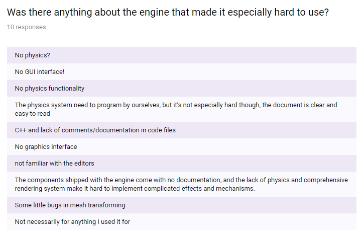
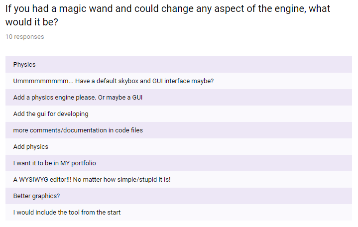
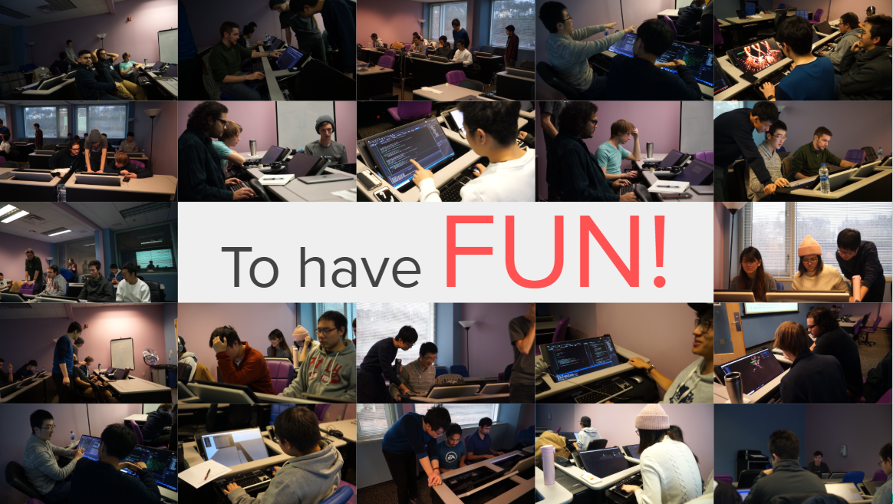
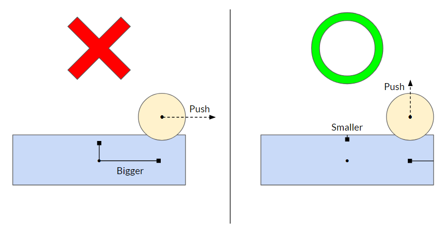
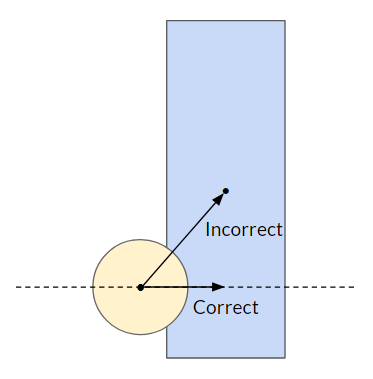

# The Last Blog.

## Byte-Sized Updates
*   [Documentary](#documentary): Our team producer filmed our journey and process of developing a game engine. We have a short trailer, and the full documentary is 10 minutes long.
*   [Game Jam](#game-jam): Held a short game jam with nine successful (non-crashing) games! Videos and downloads of those games below!!
*   [Full-Feature Demo Game](#full-feature-demo-game): Completed our target game, with all the features of the original one showed all the way back in [Week 0](week-0.md#the-example-game) (and a few more)!
*   [Engine Reflection](#engine-reflection): Reflected on our progress as engine developers and the development of the engine.

As the title states, this is the last blog post for the Isetta Engine project. We have spent the last 15 weeks building a game engine and documenting our decisions through these blogs, and now we have to say goodbye. This has been an arduous journey for us and we are glad to say, we've built a game engine. There are certainly bugs littered throughout the engine, but for us, having a bug free engine was never the intention—it was to learn the engine development process. We feel we have been able to do this, and we hope that those of you who have had a chance to read our previous blogs now think that engine development isn't as scary or mysterious as you may have thought before. But before we truly sign off, we have some last bits of updates you may be interested in reading.

## Documentary

As you might have seen on our homepage's timeline, we have been working on a documentary on top of all of the other things. While the developers on the team were trying to demystify the technical aspect of game engine development, our producer and resident creative was really pushing to help sell our work to the non-engine developers of the world. What we found was that most laypeople don't have an understanding of what a game engine is, and why would they? Most of them just care about the games made with the engine. However, there is a human side to game engine development that we think is valuable for people to see and understand, which the documentary attempts to portray. The documentary is 10 minutes summarizing our journey from developers to engine programmers.

For a trailer:

   <iframe width="1280" height="720" src="https://www.youtube.com/embed/RZJ2YMcJ4kg" frameborder="0" allow="autoplay; encrypted-media" allowfullscreen></iframe>

And if you are still interested, the full documentary is right here!

   <iframe width="1280" height="720" src="https://www.youtube.com/embed/c_3fq99Fc0E" frameborder="0" allow="autoplay; encrypted-media" allowfullscreen></iframe>

## Game Jam

As we've been mentioning in our past few weeks' blogs, we were planning, and now have, held a game jam. The game jam was never part of the plan for the 15 weeks of development on the engine, particularly because we never bought into the illusion that people would want to use our engine over any other option. However, as the weeks progressed, we often found our discussions gravitating towards the question of what a developer would be left with as a result of our decisions. We figured if we were talking about the hypothetical developer of our engine so much, why not put our engine to the test? We were also encouraged by our advisers and faculty to figure out ways to measure our project's success.
>>> Disclaimer: We aren't saying that this is necessarily the right way to do it.

### Preparing for the Jam

We spent a few weeks in preparation, which mainly focused on the API design of the engine and trying to test the features we thought the game jammers would use. In the days prior to the game jam, we converted our [Git repo's](https://github.com/Isetta-Team/Isetta-Engine) `README` into a webpage on our website, putting more emphasis into the accuracy, explanation, and readability of the content. And the night prior to the game jam, we thought it would be a good idea to comment the codebase that would most likely be peeked at by the jammers, like the scene header files and anything we made that inherited from our `Component` class.

We also made the bold (and dumb) choice of doing some refactors of the codebase that same night while we were commenting. How could we have thought that was a good idea? Well, it was about 2 or 3 in the morning, and we saw that a method name was misleading. So we fixed that. Oh, and that function should be private because it's just used internally. Oh, and this function doesn't seem to be used, we should remove it! And as you might expect, especially when doing this while tired and stressed, it ended terribly; our engine build began failing and many merge conflicts popped up that needed to be solved.

_We don't recommend changing your engine the night before any type of release, and this extends to "fixing" a bug._ Take it from people who unwisely did the opposite: You cannot guarantee that your bug fixes are truly fixes, and they may even be worse than the original bug was! In hindsight, we probably should have created a stable version of the engine a few days prior, then just performed bug fixing on that version so we could quickly revert in the case of a problem. But this also heavily relies on having a reliable testing framework and smoke tests to prevent regression, which are things that we did not have.

### How Did It Go?

To give context to our game jam, it was a six-hour event on Saturday, December 1st, 2018, where we invited all of our classmates at our Master's program, although we encouraged a more technical audience. We had over 25 people sign up during the weeks leading up to the event, with a total attendance of 12 developers. Of those 12 people, 10 were programmers and 2 were designers. At the beginning of the game jam, we had people filtering in every so often, so we didn't have a true start time or demonstrative walkthrough of setting up the engine. We just pointed to our GitHub repo and our starter documentation on the website, then set people loose!

By doing this, we were able to see where people were getting stuck during installation and real-time update our setup documentation to expand on those specific steps. Overall, everyone's setup went relatively smooth because once the jammers had loaded the `EmptyLevel`, we knew that the engine and template project were setup properly. After this, questions exponentially decayed for the rest of the game jam. Some of the early questions we were asked were:

*   Does your engine have physics? No.
*   Does your engine have an editor? No, that's out of scope.
*   How much of the graphics system does the developer need to be aware of? Hardly any of it.
    *   The question was asked about specific implementations of the graphics, which ended up not being terribly relevant once they started developing.
*   How do I create a [level/component/entity]? We've got some [nice documentation](../../engine_docs/home/) that covers that!

Each of the jammers had a different approach to learning about the engine since they had no prior experience with it. We had provided [usage documentation](../../engine_docs/home/) through our website, an executable of our tech demo levels, and the [engine source code](https://github.com/Isetta-Team/Isetta-Engine) through GitHub. We didn't give any direction for design or restrictions in what the jammers could use—the engine was simply their toybox. Our only "constraint" was the theme of the game jam: A game you could play drunk. Our selection of this theme was thinking that this would help keep implementations simple without worrying about too complex of mechanics, which would hopefully help the developers get things done in the short time we had.

In the end, we had nine successful games with only two games crashing on startup. Screenshots of those games can be seen below, and video capture can be seen in the [games video below](#engine-reflection). We were pretty stunned with what our jammers were able to accomplish with our engine in such a short period of time! The jammers also helped us find some pretty serious bugs, which you can read more about in our [Patch Notes](#patch-notes).

After the game jam ended, we showcased all the games and held an awards ceremony. The awards were as follows:
* Jammer's Choice: The game the jammers like the most
* Isetta's Choice: The game the team liked the most
* Best Themed: The game that matched the theme of "a game you could play drunk" the best
* Was That Made in Unreal?: The game that looked the prettiest
* And 0st Penguin: The game that tried something crazy but didn't fully succeed (named after a similar award given in our Master's program). In the days following the game jam, we created a survey to get some results about how the jammers felt about the jam and to answer some of our questions. We'll share the responses with you!

We'd highly recommend if you are making an engine to hold a game jam at least once during development, although the more jams you hold, the more usable your engine will likely become. It will test the usability, find bugs, and ensure you aren't making assumptions that only you can follow. Our two cautions associated with this are: 1) have solid setup and usage documentation, especially if you have sparse comments in your code, and 2) be at a semi-stable time of development—you don't want your engine breaking during the game jam—and establish what features your engine specifically supports so your jammers don't think they have the capabilities of some other engine that they're used to. If your engine is only for your game, we'd still recommend hosting a game jam (even internally if you have to!) because at worst, you find some bugs, and at best, you will have some cool examples of how people have used your engine. Our main reason to hold a game jam, though, is fun. It was a huge motivation boost for us as engine developers to see the cool things that we didn't imagine were possible to make with our engine!

You can download and play some of the games made by our jammers [here](https://drive.google.com/drive/folders/1nCSaYNJWU4axNC9VB5jNHimq9q277sOz?usp=sharing)!

## Full-Feature Demo Game

After implementing necessary networking features for our final game last week, we finally dove into gameplay programming for the game. As it turns out, our engine was still pretty easy to use, and we implemented the gameplay features in two days. We spent some more time adding sound and designing the level to make the game a bit more interesting. As this is the last part of our project and we wanted to get the game running as fast as possible, our gameplay code got really dirty! The `GameManager` ended up being like an almighty god who knows everything. (We also used singletons in the game excessively!)

However, as we went into the polishing phase, we started noticing more bugs in our engine. For example, box colliders would push other colliders in weird ways during collision solving. We talk more about how those were fixed in the [Patch Notes](#patch-notes) below.

After a bit of polish and a lot of sweat, here is our final game: _The Last of Isetta_!

   <iframe width="1280" height="720" src="https://www.youtube.com/embed/40KGj2rzqbs" frameborder="0" allow="autoplay; encrypted-media" allowfullscreen></iframe>

> *As a side note, the reason why we pushed the game to the final stage rather than making it earlier was because, at this stage, we are not really interested in making the game as it's basically writing code that we're all fairly used to already. But we made a enjoyable game anyway!*

## Engine Reflection

So what does it mean to be done with the engine? It certainly doesn't mean it's bug free, stable, or even feature complete. For us, being done just means we don't have any more time to dedicate to developing it. Then how can we say we are done? Well, because we were able to complete our [feature demo game](#full-feature-demo-game) and we've accomplished what we set out to do: Learn engine development.

What we would love to see happen is for the engine to become more stable by external developers issuing fixes. However, the engine being stable isn't an important factor for our project; in fact, the Isetta Engine being this novice, messy result is somewhat more important. Regardless of the bugs, the engine is still usable to create games. Those games might not be as complicated as a Unity or Unreal game, but they are games unrestricted by the toolboxes of Unity and Unreal.

Finally, since our goal was to help demystify game engine development or at least make it more approachable, we have created some additional documentation. You may have already seen our [Compendium tab](/compendium/), which threads together the blog posts from each week with the relevant interviews and corresponding postmortem for a specific subsystem of the engine. In these postmortems, we even list what went right and what went wrong (although we ran out of time to fully elaborate on each of them). We want the compendium to be a source that can be easily approachable for others because we recognize that our weekly blogs are not that. There is also an overall engine postmortem within the compendium pages, which is more akin to a regular game postmortem. It covers three of the key lessons learned and three of the most important things that went right and wrong in-depth. If you plan on developing any type of game engine, not just a twin-stick engine or a game engine to learn engine development, we think you may be able to get something out of [these postmortems](../../engine_postmortem/BuildGames/).

   <iframe width="1280" height="720" src="https://www.youtube.com/embed/qY91OtionBA" frameborder="0" allow="autoplay; encrypted-media" allowfullscreen></iframe>

## Patch Notes

### Collision Solving was Unsolved

We had a lot of problems left in our collision solving system, but most of them we were willing to ignore (for instance, our capsule-box collisions are horrendous and mostly unusable!). However, there were a few that were total blockers:

*   Boxes were really bad; we made the assumption of uniform scaling for the box colliders, which allowed us to compare distances _from the box's center_ to determine which face of the box should be pushing the other colliders. Obviously if one dimension of the box is scaled a lot larger than the other, then that dimension is way more likely to push the other collider! So we instead determined the correct face to push with by the distance _from the box's faces_.

*   Another problem with box colliders was that, when another collider would collide with the box's edge, the box would give that collider its center as the reference point to solve the collision with. This would cause spheres to shift up or down along the edge whenever it touched an edge because its force vector would point towards the center of the box! This was solved by constricting the box's reference point to the orthogonal plane of the colliding edge that also passes through the sphere's center point—this effectively restrains our collision solve to only push on that plane, which makes it correct.

### Debug Drawing Can Be Non-Helpful Sometimes

Simple problems thankfully have simple solutions, but when you don't see the simple problems, they can become very nasty, too. One instance of this was our debug drawing system. Our colliders were drawing their shapes in the incorrect position depending on how the `center` was offset from the actual center of the entity. This wasn't typically an issue, until we began to set up the level for our final game! Thankfully we found this problem thanks to our robust transform class and our nice in-game inspector.

## Coming Soon

Well...nothing, as far as engine development is concerned. We are still working on postmortems for the project and the engine subsystems that we'd like to share with you all. Where our project postmortem is similar to a postmortem from [Gamasutra](http://www.gamasutra.com/features/postmortem/) or GDC, the subsystem postmortems are more about us reflecting on a few of the big lessons we learned as well as listing all of the things we wish we knew before starting that particular subsystem.

There are few more pieces to the project we will be uploading just to wrap things up, but the engine will cease to be developed and we're done writing blogs for this project. Bear in mind, this project isn't dead or being left behind; we aren't continuing with it because we don't want it to become how to make your 5th engine. We want our learnings to still be inviting for the prospective engine developers who have yet to build their first. If we continued to iterate on the website, it would be disingenuous to continue calling ourselves novice engine developers.

## [Resources](/resources.md)

This page may be updated as we move on because it purely a source of external links, helping direct you to where you may want to look or read about a topic. We may find additional links that could be helpful in our other endeavors, that we want people to know about here. The page also has comments, so if you know of good resource for a topic we have listed please feel free to write about it in the comments.

_Originally Published December 11, 2018._
