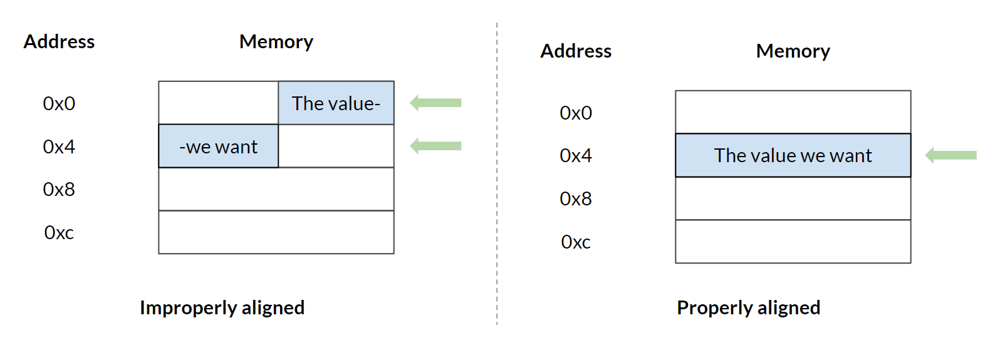
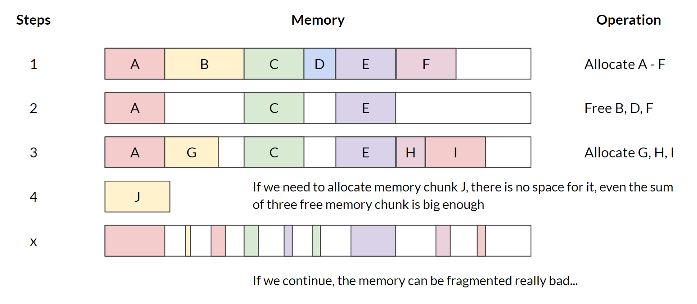
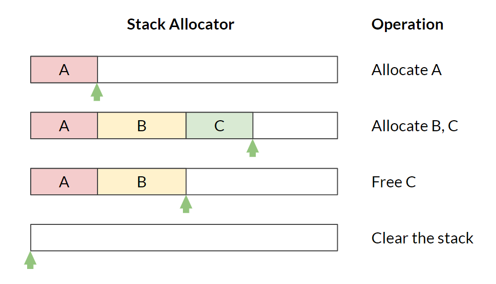
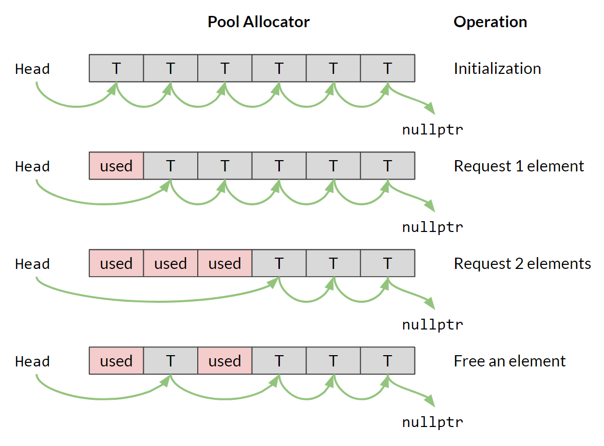
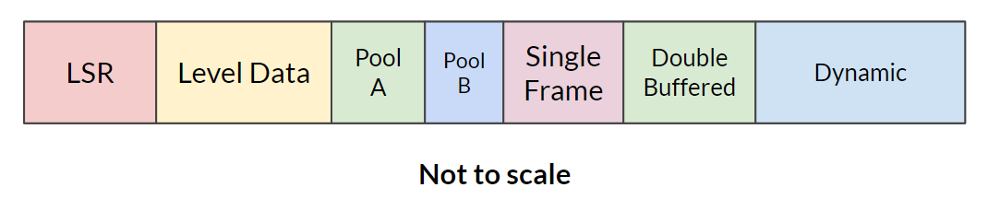
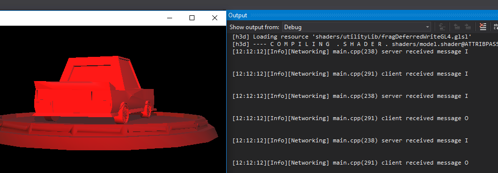

# Ramping Up
**Notice**: Since we were still finding our way with the post for week 1, we published without documenting our full process. We will do better in future weeks about this by more strictly pairing our blogs with our repo tagged code. This is the changelist for week 1:

*   Added section about [Byte Size Summary](week-1.md#byte-size-summary)
*   Added paragraph about our API design
*   Added section about [Module Management](week-1.md#module-management)
*   Added paragraph to end of [Audio](week-1.md#audio)
*   Added section about [Debug Logging](week-1.md#debug-logging)
*   Added section about [Error-Handling](week-1.md#error-handling)
*   Added section about [Math](week-1.md#math)


## Byte-Sized Updates

*   [Memory](#memory): Implemented memory allocation utilities, stack allocator, and pool allocator
*   [Graphics](#graphics): Wrapped Horde3D as `RenderModule` and GLFW as `WindowModule` and improved inter-module communication model
*   [Engine Config](#engine-config): Wrote a config file parser, storing values in console variables to be accessed by other systems and eventually an in-game console.
*   [Networking](#networking): Determined to move forward with [yojimbo](https://github.com/networkprotocol/yojimbo) and will be expanding our control of the network in the coming week.

Here is the updated architecture diagram with our progress. The code can be found on the [GitHub repo](https://github.com/Isetta-Team/Isetta-Engine/tree/week-2) tagged with week-2.


## Memory

As mentioned in many sources (like [Mike Acton's talk](https://www.youtube.com/watch?v=rX0ItVEVjHc), this [table of latency numbers](https://gist.github.com/jboner/2841832), and this [blog](https://www.gamasutra.com/blogs/MichaelKissner/20151104/258271/Writing_a_Game_Engine_from_Scratch__Part_2_Memory.php)), good memory management and memory access patterns are the reason why modern games can run so fast with such stunning visuals and complex systems. Thus, we decided to tame this beast early.

Let's look at the problems we are trying to solve:


*   **Speed:**`malloc`, `free`, `new`, and `delete` are actually pretty slow operations. Because they need to call into the Operating System to get the memory they requested, they involve the switch between user mode and kernel mode. 

    Also, the memory returned by standard memory allocation functions may not satisfy our **alignment** requirement. Improperly aligned memory can severely affect the speed when using objects stored there, because some modern CPUs can only read properly aligned data. For example, if our processor can only read 4-byte aligned memory, and we have a `uint32` (of size 4 byte) stored at memory address `0x2`, the processor will have to read both `0x0` and `0x4`. Then it will have to combine them to return the `uint32` value you want. While if the value is stored at a properly aligned address, the processor only needs to read one line.

    

    By preventing frequent `malloc` and `free` calls and aligning memory, we can increase our program's speed significantly.

*   **Memory fragmentation:** When we are doing dynamic memory allocations / de-allocations, we may leave small free memory gaps between used memory. In situations where the sum of those small gaps are big enough to satisfy a new memory allocation request, we cannot find a contiguous memory chunk for the new request. This situation is depicted in the following image.

    


These two problems can be solved effectively by managing memory by ourselves rather than leaving it to the operating system. We learned the concept of several different types of memory allocators by referring to Jason's book and a bunch of [other resources](../resources.md#memory). The most useful ones are: Stack Allocator and Pool Allocator. You can refer to the resources and our git repo for implementation details. We are going to focus on how they can be used in our engine here.


### Stack Allocator

A Stack Allocator works just like a normal stack data structure. When the allocator is constructed, it grabs a big chunk of memory from the OS, and returns small chunks of them when someone requests memory. It keeps track of how much memory is used by keeping track of the top of the stack. 

Stack Allocators can solve both speed and fragmentation issues very well, but aren't all that easy to use. As the objects' memory is organized like a stack, deleting an object at the bottom of the stack without deleting the ones at the top is impossible (meaning you always have to delete newly created object first). Also, when you delete an object, you need to pass in a "marker" to the stack allocator. This way it knows where to free its memory. However, passing a marker also requires you to keep track of each object's marker during their lifetime, which can quickly get tedious and ugly.



Fortunately, Stack Allocators can be extremely useful without causing annoying side effects. For instance, by using a Stack Allocator as a basis, we can make a Single Frame Allocator. The Single Frame Allocator is a special usage of Stack Allocator which clears itself at the end of each frame. You can allocate memory from it like crazy and not have to worry about freeing them; they are all safely cleared at the end of the frame! However, the fact that it clears every frame means that it tends to be used for passing information between different sub-systems during a single frame. Be careful not to point a pointer to such allocated memory from the last frame!

A more useful type of stack allocator is the Double Buffered Allocator, which allows you to pass information into the next frame. We will talk about it in our next blog once we get it implemented.


### Pool Allocator

The Pool Allocator solves the problems in a different way and is a great companion for the [Object Pool Pattern](http://gameprogrammingpatterns.com/object-pool.html). A Pool Allocator grabs a big chunk of memory from the OS. Then, it and separate the memory into a list of small chunks with identical sizes. Each small chunk is just big enough to hold a single element. The Pool Allocator then returns an element-- or the raw memory that can hold an element to you-- when requested, and adds it back to the list when the element gets deleted. So both allocation and deallocation take constant time because it's just deletion and insertion operations on a linked list. Also, as each element is of the same size, defragmentation won't happen for a Pool Allocator and `new`ing and `delete`ing can happen in any order.



The constraint, however, is that every allocation from a Pool Allocator is of the same size. You can, of course, request more than one chunk of memory from a Pool Allocator, but the returned memory chunks are not guaranteed to be contiguous. 


### Benchmarking

To make sure we are actually making our engine faster by using custom allocators, we run a benchmark to compare their speeds. Here is the test case we used: Allocate the memory for 10,000 `AudioSource`s and deallocate them.


*   In Debug
    *   malloc and free: 0.002306s 
    *   new and delete: 0.002499s
    *   Stack Allocator: 0.000647s (3.5 times faster than `malloc` and `free`)
    *   Pool Allocator: 0.001315s (1.7 times faster than `malloc` and `free`)
*   In Release
    *   malloc and free: 0.000536s
    *   new and delete: 0.000495s
    *   Stack Allocator: 0.000012s (44.57 times faster than `malloc` and `free`)
    *   Pool Allocator: 0.000048s (11.17 times faster than `malloc` and `free`)

As the data shows, custom allocators are indeed a lot faster, especially in release mode.


### Proposed Memory Management Patterns in Our Engine

After discussing as a team, we also decided on part of our memory management strategies.

We will allocate a big chunk of memory that's enough for the game from operating system when the game starts with a Stack Allocator, and all later memory requests will be satisfied within that big chunk. This is a relatively old-school approach, but it guarantees that once we can start up the game correctly, we are ready to go for the rest of the game. It won't crash midway because of insufficient memory.

For the systems that are "persistent"—those who are always there when the game is running [^1], we will put them at the bottom of the big stack. Then, we will have a part of memory for level specific assets, such as meshes, materials, etc. Next, we will have several chunks dedicated for individual Pool Allocators to hold game objects that need to be pooled (like bullets and mobs). Then, we will have a Single Frame Allocator and a Double Buffered Allocator. On top of everything, we will have the memory left for occasional dynamic allocation. The whole structure can be visualized like this:



[^1]: Jason Gregory refers to **persistent game data** as "LSR" data, Load-and-Stay-Resident, as seen in _Game Engine Architecture_ section 15.4.2

We are still discussing if we should introduce defragmentation[^2] into our engine. The results will be posted in later weeks.  And once we have the memory manager done, we will start refactoring our modules and other systems to use them for their memory management.

[^2]: Fragmentation is when a lot of memory allocations or files take up noncontinuous chunks of space, leaving awkward bubbles that can't be used by anyone. So **defragmentation** is the process of reordering those objects so that we can clear up a cleaner, bigger stretch of free space or memory.

## Graphics

Last week, we proved that Horde3D can satisfy our needs by making a simple demo. This week, we moved on to making a wrapper that would integrate it into our engine architecture and make it more accessible for our users. At the same time, we found that GLFW[^548] (the dependency brought in by Horde3D) can also handle input events, including those from game controllers, so we also started wrapping that into our game engine.

[^548]: **GLFW** is a library utility for creating windows and receiving input from the window.

In the original design of our modules, we assumed that each module should be self-contained and have no dependency on other modules. Thus, the constructor should be completely empty and the `StartUp()` function should take no external parameters. However, GLFW disproves this assumption.


### The Window Module

Inside `RenderModule`, GLFW opens a window and returns a handle of that window. The handle is supposed to be used by the `RenderModule` for operating the viewport, as well as, by the `InputModule` for receiving all inputs. In this case, instead of using `StartUp()` function (which is inherited from `IModule` interface), we need to find another mechanic to pass the shared variable.

The first solution that came into our mind was to extract the shared parts into a `WindowModule` (which implements `IModule` interface). From there, we'd put the original `RenderModule` and `InputModule` into the `WindowModule` as submodules. This would no longer implement the `IModule` interface. The `WindowModule` will manage the initialization, update, and deinitialization of its submodules and pass them the shared handle they need. This solution seemed to be a clean way to solve the dependency issue. What's more, it worked in the current version of our game engine.

However, this design has some potential downsides. It not only hides the two submodules from the module manager, but also binds the initialization and update processes of the two submodules together. Hiding submodules also negatively affects the readability—`RenderModule` and `InputModule` technically won't exist since they are _not_ managed by the module manager anymore. But we also need `InputModule` to update before everything and `RenderModule` to update after everything during the engine loop... This design won't allow for that, though, since the modules are bundled together by `WindowModule`!


### The Module Solution

To fix these issues, we finally decided to keep everything flat and managed by the module manager. To solve the dependency issue, we are allowing `StartUp()` implementations to take parameters on a per-module basis. This method also means we are better off saying "au revoir" to the `IModule` interface, which we aren't terribly sad about. This solution has the chance of breaking coherency, but for now it works fine and really improves our readability!


## Engine Config

The engine configuration (or config, as the cool kids say) is a file which contains variables with assigned values by the developer. It is initialized once the project is loaded. The information contained within these files is usually laid out like this: `variable=value`, with some type of comment system (# for our implementation). Having a configuration file prevents developers from hard-coding values into the modules themselves. In this way, they can be dynamically changed for different game requirements.

```
# A sample engine config file
# comments
bullet_damage = 2 # declaring a variable and value
player_health= 100 # spacing doesn't matter between '='
spawner_origin = (1,1, 10) # vector3 format
unused_string = string # undefined keys will not be read
```


### Requirements

The requirement of our engine configuration file/parser is to be able to: 


1.  Read lines as key=value, ignoring whitespace and comments
1.  Store the value as the typed value (not a string)
    *   Usable for types of `int`, `float`, `string`, and `Vector3` 
    *   Extendable for including other types
1.  Store the key/values within a specified variable to be used by other systems
1.  (Additional) Quickly read/write the `key=value` pairs at runtime
    *   Doing this allows for an easy integration of in-game console


### Design Decisions

The reasoning behind storing the key/value as a typed entity is to avoid users from converting the value from a string. This becomes important if the developer doesn't cache the configuration value, because a string conversion for each frame can become expensive and unnecessary. This also leaves the system open for use with an in-game console, so that values can be checked frequently without losing CPU time (another way to avoid this could be to have a callback on value set). 

Storing the key/values within a variable was another design decision to stop developers from doing a lookup on a map for the value, which could cause 2 problems:


1.  There is no way of stopping the user from doing this each frame, which can be expensive.
1.  Throughout the code, config parameters are referenced by strings. Strings can be easily mistyped and changed without a compiler error. This leaves them prone to super-errors, especially when the number of occurrences is high. By defining a variable within the `Config` class, and only allowing access through that variable, we can prevent the errors that come with using strings.  The compile will complain for bad references. 

These types of variables are called console variables, also known as `CVar`s.


### Problems with Configuration

The engine configuration development was broken into 2 problems:


1.  Create a file parser which can read the key/values as strings and remove whitespace, empty lines, and comments;
1.  Store the values as the typed value specified by the developer which are accessed by variable (not a dictionary look-up). 

Problem 1 is trivial, but the naive thought process of problem 2 can require runtime polymorphism[^3]. The naive thought process we had with problem 2 was, within the configuration parser, you have the key and value as strings. You also have string and type in the dictionary of key/value, so we thought you could just pair them. But you can't. Casting a variable to a type of another variable requires runtime polymorphism/reflection. Understanding that even though you can match key from the file with key in the dictionary, but can't store the value was tough hurdle for us to get over. Neither our engine or C++ supports reflection currently, so there must be another way.

[^3]: **Runtime** or **dynamic polymorphism** is when an overridden class or method is determined at runtime as opposed to compile time. This allows for us to change some behavior of our program depending on the data type it's operating with.


### Comparison with Other Engines

To confirm that's how `CVar` systems work (or more accurately don't work), we looked into the 3 largest open source engines: Unreal, CryEngine, and Lumberyard (although only a fork of CryEngine) for how they do configuration variables/parsing and for inspiration. First we looked into the developer-facing documentation to try to better understand the functionality and features of the open source engines. Then, we looked at the source code. The documentation confirmed that config variables were defined as console variables and defined with types (sometimes). Tracking down where the `ICVar` struct was created in each of the engines was a big task. However, it confirmed we had the right idea of what to do, albeit on a much smaller scale. The specific files we found useful have been linked in the [Resources](../resources.md#config-file-engine-config) page.

### What We Ended On

To store the map of keys and varying-typed values requires a base class for the types to derive from. This base class also can't be templated for the map. Each derived class needs to implement a method `GetType()` which returns the type of the derived value. Each `CVar` read from the configuration is defined in the engine config class as a typed `CVar`, which is registered within a dictionary of string-ids and `ICVar` pointers. When the config file is read, the dictionary is searched for the key and the `GetType()` method determines what type value is cast to through a switch statement. Additional `CVar`s can be registered in other modules, but since the configuration file is read prior to startup, these `CVar`s won't be stored from the file. However, these `CVar`s will be registered as keys in the dictionary and can be used exclusively as console variables.


## Networking

Last week for networking, we discussed how we were looking at two different 3rd party libraries to do our low-level packet management, [GameNetworkingSockets](https://github.com/ValveSoftware/GameNetworkingSockets) and [yojimbo](https://github.com/networkprotocol/yojimbo). The two libraries are actually pretty similar in functionality (as many networking layers are—there's only so much you can do with packets!), so our decision on which to move forward with fell to usability and support.

The GameNetworkingSockets library is functionally sound, as far as we know. Since it comes from Valve, we know it's been put to the test. However, Valve is still pretty new to open-sourcing, and it shows: The build process to create the library file has around five dependencies you have to manually set up! This also points to the fact they may have developed the library from Linux initially, because the setup involved for installing the dependencies is much easier on Linux than it is on Windows.  Another four points that weigh heavily against Valve are the scattered codebase (being pulled from Valve's own development pipeline will do that), the considerably frequent commenting-out of code, the lack of any recommended sample files, and lack of documentation.

What's more, yojimbo seems to be clear on all of those points! The documentation isn't superb, but there is indeed some documentation that we can build with [Doxygen](http://www.doxygen.nl/). The library also gives a good number of examples for using the API; they're mostly within a single, uncommented C++ source file, but hey! We'll take what we can get. Beyond that, yojimbo was written with open-source in mind, so it's a clean and organized job, and better yet, the build process is minimal. In fact, the author even [encourages users to pull pieces out and customize sections of the code to their needs](https://github.com/networkprotocol/yojimbo/issues/25#issuecomment-265082392).


### The Decision

On that note, the Isetta team is moving forward with yojimbo for now. The jury is still out on whether or not we're nixing networking from our feature list, but we'll be determining that within the next two weeks.

The first steps we've taken on networking have been simple ones, but we have results! Going beyond just using one of the testing functions packaged with yojimbo, we integrated said function into our Frankenstein-esque testbed to ensure that it would work correctly alongside the rest of our libraries and implementations. And it does! For now.



We only have a simple back and forth messaging system running on a solo machine so that we can wrap our minds around the data flow of the library. Our next steps will be to:


1.  Get that connection cross-computer, and 
1.  Make it do something a little more involved and...exciting. 

At that point, we suspect we'll know enough about the terrors of networking to make the call on keeping it in our engine.


## Patch Notes


### Logging

The Logger system's log functions were originally called through static functions, but we decided we wanted to know the file name and line number of the call site of the log. One method of achieving this would be forcing the `__FILE__` and `__LINE__` macros passed into each log call, which is repetitive and makes the logger hard to use. The macros couldn't just be placed within the logger file as they would always expand to be the same file and line number. The other option was to create a set of macros for the log which expanded to passing in the macros by default. The macro route removes the scope operator from the log. It could be argued this increases readability. We selected the macro route, so the log functions were removed and replaced with a `LogObject` which can be found in the [`Logger.h`](https://github.com/Isetta-Team/Isetta-Engine/blob/master/Isetta/Isetta/Core/Debug/Logger.h).


### Assertions

The original decision was to use Microsoft's `afx` headers as the library because it offered so many features. These headers required MFC[^400], which worked in isolated tests but caused issues pretty quickly with the audio system and logger. Rather than fighting the issues, we decided it would be quicker to write our own assert and the other features of afx were cool but ultimately extra and unnecessary. MFC was removed from the engine. 

[^400]: The **Microsoft Foundation Class** library is an object-oriented C++ library that contains useful macros for exceptions, run-time type identification, serialization, and more.

### ToString/FromString

One of the discussions we had this past week was about how to handle the methods `ToString`, which converts from object to string, and `FromString`, which converts from string to object. There were 3 thoughts we had on how to handle these:


1.  Have a pure abstract class `IStringEnumerable` which has `ToString`/`FromString` as abstract methods that classes inherit from have to implement
1.  Just put `ToString`/`FromString` as methods as needed without an interface
1.  Have a static converter class which holds the `ToString`/`FromString` methods for all classes needed. 

We liked the idea of having these methods attached to the classes themselves, which ruled out 3. In terms of the abstract class, we decided not to use one because the abstraction wasn't necessary. Having this abstract class at this point in time was for the sole reason to abstract. We had no immediate need or use for it, and may end up on the route of multiple inheritance if we choose to use it. So we decided to follow the advice of some professionals, like Casey Muratori[^6], and keep it simple. If we do end up needing it, we can refactor.

[^6]: **Casey Muratori** is a game engine developer and creator of [Handmade Hero](https://handmadehero.org/), a web series documenting his efforts in building a game engine from scratch. We interviewed him as part of this project, and his interview can currently be found [here](../interviews/CaseyMuratori-hmh-video.md).


### Git Flow

In week 1, we described our git flow as creating feature branches which were eventually merged into code-review. After code review, we created local hotfix branches and merged fixes into code-review branch. When everything was done, we merged code-review branch into the master branch and tagged it. However, we found that this can stop new development prior to pushing a weekly tag because they can't be pushed to the code-review branch. The code-review branch is the only branch where our individual work can converge. 

Therefore, we've adopted the [GitFlow](https://www.atlassian.com/git/tutorials/comparing-workflows/gitflow-workflow) system. We renamed code-review to "staging" and added a new develop branch. We will still have our individual feature branches, and can always merge our work into the develop branch. Right before we start the code review session, we merge all commits into the staging branch. After the code review session, we will push hotfixes to the staging  branch, and new development can be pushed to the develop branch. When everything is fixed, we will merge the staging branch into the master branch and tag it. 


## Coming Soon

This past Saturday, September 8, 2018, we interviewed Casey Muratori of Handmade Hero. There was a lot of great information about engine development, and we will be posting a concise, edited version soon. Right now, though, you can check out the full [video](../interviews/CaseyMuratori-hmh-video.md).

We would appreciate any feedback or questions you may have about our content or what we are doing in the comments.

## Resources

The [resource page](../resources.md) has been updated to include links we found useful this week, too!

_Originally published September 14, 2018._ 

<br>

<!-- Begin MailChimp Signup Form -->
<link href="//cdn-images.mailchimp.com/embedcode/classic-10_7.css" rel="stylesheet" type="text/css">
<div id="mc_embed_signup" style="margin-top: -20px">
	<form action="https://isetta.us19.list-manage.com/subscribe/post?u=1d83cb806c55e205be26db856&amp;id=860c7d79cf" method="post" id="mc-embedded-subscribe-form" name="mc-embedded-subscribe-form" class="validate" target="_blank" novalidate>
	    <div id="mc_embed_signup_scroll">
			<h3>Subscribe to our mailing list</h3>
			<p style="margin-bottom: -22px;">Get notifications about the upcoming blogs and interviews!</p>
			<br><br>
			<div class="mc-field-group">
				<label for="mce-EMAIL"> </label>
				<input type="email" placeholder="Email Address..." name="EMAIL" class="required email" id="mce-EMAIL">
			</div>
			<div id="mce-responses" class="clear">
				<div class="response" id="mce-error-response" style="display:none"></div>
				<div class="response" id="mce-success-response" style="display:none"></div>
			</div>
		    <div style="position: absolute; left: -5000px;" aria-hidden="true">
		    	<input type="text" name="b_1d83cb806c55e205be26db856_860c7d79cf" tabindex="-1" value="">
		    </div>
		    <div class="clear" id="submit-button">
		    	<input type="submit" value="Subscribe" name="subscribe" id="mc-embedded-subscribe" class="button">
		    </div>
	    </div>
	</form>
</div>
<!--End mc_embed_signup-->
