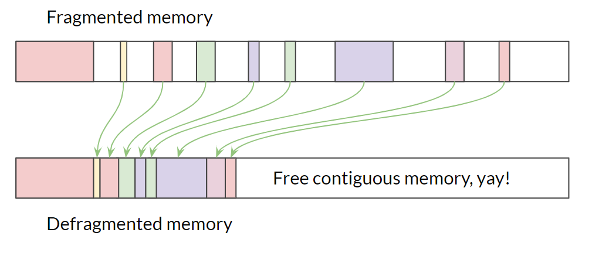
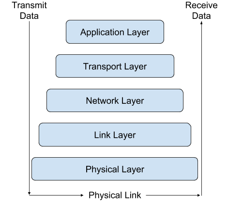

# "Completing" the Core
## Byte-Sized Updates

*   [Architecture Update](#architecture-update): We've made changes to our design as expected, systems were added and removed based on the criteria of the test game.
*   [Input Module](#input-module): Implemented the input module with polling and callback registration interface.
*   [Engine Loop](#engine-loop): Moved from a while loop in main to an engine loop with fixed update time step, variable rendering.
*   [Timer](#timer): Created a clock class to support multiple clocks in-engine.
*   [Memory Management](#memory-management): Implemented double buffered allocator and object handle, and currently halfway through defragmentation.
*   [Filesystem](#filesystem): System to create/read/write files synchronously and asynchronously using Microsoft's API. 
*   [Networking](#networking): Created the networking module and wrapper, made some rudimentary message objects, and connected our team from across the void (i.e., the space between our computers)


## Architecture Update


The engine systems are progressing smoothly (almost too smoothly...), but at this point, we are close to completing our Core systems. However, as expected, the architecture we planned at the beginning wasn't perfect and is changing:


### GUI

We added a GUI module to the module layer after finding out that Horde3D doesn't come with GUI support. Looking at the Horde3D community's extensions, we found a HordeGUI solution. However, it hasn't been updated for a few years, so we instead decided to use the industry standard [Dear ImGui](https://github.com/ocornut/imgui). We will be integrating it and creating a wrapper in the coming weeks.


### Profiler

For the past few weeks we have had the Profiler marked as complete, and although it is integrated, we decided it wouldn't be fair to mark as complete until the engine is actually using the profiler. We are waiting until we have a system complete to insert profiler code, so we don't have to refactor the code and the profiler macros. Expect profiling to happen in the next few weeks.


### Serialization

Serialization was originally marked as "Try to Make", and as we were about to start development we discovered our networking connections library, yojimbo, already had a sophisticated serialization system. Rather than attempt to decouple yojimbo's serialization and add our own, we are going to utilize what we already have imported and integrated. For the time being, we are marking serialization as complete; however, we may revisit this later down the line if we need a more advanced solution or just want to make our own.


### STL Wrapper

After the last few weeks of looking at the box labeled `STL Wrapper`, we aren't sure what we were thinking. We are just going to continue using the STL[^845] library without obstructing it anymore. We have created our own alias file to shorten some names of the types, such as `uint8_t` to `U8`, though we wouldn't go as far as labeling this as a wrapper.

[^845]: **STL** stands for standard library which is the C++ library containing most of the needed data structures. It is known to not be best for performance, however, will save us time not implementing them.


### Data Structures

As part of the network programming, we realized we would be encountering several similar data problems that can be solved by some basic data structures. That said, it's important for us to retain control over those data structures, have them using our own systems (e.g., memory management), and be correct for our needs. The first instance of this was our `RingBuffer` class, which sacrificed a tiny bit of memory for a boost in CPU performance by using one extra slot in the buffer that solely exists as the end slot.


## Input Module

As we mentioned in [last week's blog post](week-2.md), we are using GLFW[^8987] to receive and notify input events. Unlike other modules which are completely hidden from the game developer by scene entity data, the input module is one that not only processes low-level operations, like receiving inputs, but also directly interacts with them. The developers should be able to know when an input is triggered as well as run custom code to react to that event. This requires us to design a simple, friendly but versatile interfaces for game developers to use.

[^8987]: **GLFW** is a library utility for creating windows and receiving input from the window.

We divided the whole input system into two parts: an `InputModule` class to do the low-level operations, and an `Input` class to provide an interface for the game developers. For each input signal (like mouse buttons and keyboard keys), we found that providing multiple ways for the game developer to use is necessary and approachable. Unity provides polling methods like `GetKeyDown` so that the game developer can check if a key is pressed down in `Update`. In addition to that, Unreal provides callback binding, where game developers can bind custom callbacks to various input events.

According to those API designs, we decided to provide both the polling `Get` function and the callback registering function. GLFW natively supports these two methods, so adding the functions for each simplifies our backend in wrapping the GLFW library.

Since we have the register functions, we also need to provide corresponding functions to enable the game developers to unregister their callbacks. However, that task is not as simple as it seems. We are using `std::function`[^875] for callback functions, and there is no way to check if two `std::function` objects are equal or not. Thus, without any external identification, we can't remove the callback from a callback list (the list is used to maintain multiple callbacks bound on one single key). 

[^875]: `std::function` is a container for lambda functions, see [cppreference](https://en.cppreference.com/w/cpp/utility/functional/function). We have renamed `std::function` to `Action` in our aliases for simpler calling.

To solve that problem, we came up with three solutions:


1.  When registering a callback from users, ask for a unique name to index it
1.  Return a handle during registration and use that to index the callbacks
1.  Don't allow unregistering, only provide `ClearAll` function

After some discussion, we all agreed to apply the second solution. The first solution can be costly and the uniqueness of the function name isn't guaranteed because it is controlled by the game developers. In the third solution, the game developer totally loses control of their callbacks. Even though the second is adding an extra layer, using handles to store and find callbacks is still the preferred way.


## Engine Loop

As mentioned by Casey during our [interview](../interviews/CaseyMuratori-interview.md#problem-1-an-amorphous-system), a game engine is not like common software that always wait for user input, process it and then give the output. It's more like a self-contained loop that simulates the game every frame and reacts simultaneously to the user inputs. The engine loop is the core loop used in the engine to take charge of any submodules and update them in the rate they prefer.

When working with the engine loop, we needed to decide both how fast the loop should run and in what rate all the submodules should update. After reading several articles (especially the one from [_Game Programming Patterns_](http://gameprogrammingpatterns.com/game-loop.html)), we found that there are three major ways to update the game:


*   Run as fast as the processor can and simulate the game with delta time
*   Run the game in fixed delta time like 60fps
*   Run the simulation in fixed delta time and run the rendering in variable delta time

Running as fast as the processor can is the most straightforward way to simulate the game. It's simple to implement and you don't have to care about the interval time. However, it's important to calculate the delta time between the last update and this update then run the simulation with that delta time, otherwise, the game will behave differently depending on the computer's specs. Even with the delta time mechanics, the game still remains nondeterministic. On a good computer (one with lots of CPU), the update runs more frequently and the object's movement look smoother; while on a poor computer, the objects run less smooth, almost like with lag, and can even clip into other objects due to the low update frequency and high deltas in time.

Then, what about running the game at a specific rate? This can solve the issue that even on different computers, the update rate remains the same and the simulation loop will run as expected. However, in larger games with heavier rendering loops, there is still the potential for bugs. Let's say we keep the game running in 60fps so that each has a fixed timestep of about 0.016s. If we have too many objects to render, the render loop itself could cost less than 0.020s for every update. This will the break the assumption that the update loop can run every 0.016s. In this case, every four updates will cost 0.080s while five updates should be simulated during that time. This slows down the game and breaks the whole timeline.

The reason why it will get slower is that the simulation update runs alongside the render update and never has the chance to catch up with the timeline when the game is behind where it should be. The solution to this issue is to give the simulation a chance to catch up and let the rendering update go as fast as it can. This is called _Fixed update time step, variable rendering_. In every update, the loop will add the delta time onto an `accumulateTime` variable which indicates the amount of time the game hasn't simulated yet. It will then run the simulation update several times until the `accumulateTime` is lower than the fixed time step we set before.


## Timer

For Unity game developers and some other game programmers, getting a time is as simple as a function call like `Time.deltaTime`. However, the inner system of a game engine clock is more complex. The clock which `Time.deltaTime` function communicates with is only a game time clock, but a game engine has way more clocks than expected. For example, every animation may have its own clock and the networking module should also have an individual clock so that it won't get timed out if the game pauses. With that in mind, implementing a clock class is quite simple. C++ has a great `<chrono>` library with a high resolution timer to help us build our clock.


## Memory Management


### Double Buffered Allocator

As mentioned [last week](week-2.md#memory), the first thing we did this week was to implement a double buffered allocator. Different from a single frame allocator, a double buffered allocator only clears its memory at the end of the next frame. For example, memory allocated during frame `n` is cleared at the end of frame `n + 1`, and those allocated during frame `n + 1` will be cleared at the end of frame `n + 2`. This allows us to nicely pass information to the next frame without worrying about leaking memory long-term. It will come in handy for things like velocity calculations, which are things that require us to know the position of the object in the last frame.

For implementation, a double buffered allocator is actually a wrapper on top of the stack allocator. It holds two stack allocators (A, B) and marks one of them as an active stack allocator each frame. At the end of each frame, it swaps A and B and clears the newly activated one. For example, if A is the active allocator of frame `n`, all memory allocation requests will be handled by A during frame `n`. At the end of frame `n`, B becomes the active allocator and is cleared. So during frame `n + 1`, memory allocation will be done by B, and those pointers to memory in A are still valid. At the end of `n + 1`, A is again activated and cleared.


### Non-templated Pool Allocator

The pool allocator we implemented last week was templated, which means it only returns newly constructed objects when you call `Get` instead of raw memory pointers. One of our team members suggested it would be useful to have a more generic pool allocator that only keeps a list of raw memory chunks instead of objects, which is more accurately labeled the pool allocator, which has already proven useful.


### Object Handles

This week, we decided to implement a naive memory defragmentation system and see how it works for us. So we implemented object handles first, which is a prerequisite of defragmentation (for a review on what object handles are, see our [architecture post](engine-architecture.md#core)). 



Defragmentation works by removing "holes" of free memory between objects. This is achieved by moving objects in memory so they are packed nicely into a contiguous area, leaving enough contiguous space for later allocations. Maybe you've noticed that the address of the objects will change during this process, and will invalidate the pointers pointing to the old addresses. To fix this issue, we made a middleman between the game developers and the actual allocated memory of objects. This middleman is called the object handle.

In our system, the  `HandleEntry` is what holds the pointer to actual objects. It is structured like so:

``` cpp
class HandleEntry {
    U32 uniqueID;
    void* ptr;
    bool isEmpty{true};
};
```

We are keeping a static fixed-size array of `HandleEntry`s. Every time we need to create a new dynamic object, we search through the array and find the first available `HandleEntry`, construct the object, and set the three variables of that entry, where 'ptr' is the pointer to the actual object. This routine returns the `ObjectHandle` (finally!) to our newly created object, which keeps track of the index to our assigned `HandleEntry` and the `uniqueID`. `ObjectHandle` is defined like this:

``` cpp
template <typename T>
class ObjectHandle {
    T* operator->();
    T& operator*();
    U32 uniqueID;
    U32 index;
};
```

The usage of an object handle resembles that of a raw pointer - you access members through the operator `->` and dereference it through the operator `*`. When you call those pointers, the object handle is responsible for finding the corresponding `HandleEntry` in the static array and cast its `void* ptr` to `T*`. 

The best part is, when we move objects around in memory, all we need to do is to change the value of `ptr` in the corresponding `HandleEntry` to point to the destination address. The end user doesn't need to do anything - they can just use the object handle as if nothing happened!

Our implementation of object handle requires minimal changes from the game developers. The typical dynamic allocation routine will change from this:

``` cpp
auto ptr = new MyObj();
ptr->SomeMember();
ptr->someVariable = newValue;
delete ptr;
```

to this:

``` cpp
auto handle = OurNewUtility<MyObj>();
handle->SomeMember(); // same as the good ol' days 
// maybe defragmentation happens here, but we don't need to care!
handle->someVariable = newValue; // also the same!
OurDeleteUtility(handle);
```

The reason we keep track of `uniqueID`s is that they can help us prevent the _stale pointer_ problem and _double deletion_ problem. 

The _stale pointer_ problem happens when you try to access a pointer when it's already deleted. This operation would usually crash your application. But what's worse than that is if you access a pointer when the old object was deleted and a new object was constructed in its address in memory, you may corrupt your game silently. In our system, whenever someone accesses an object through `ObjectHandle`, we would first check if the corresponding `HandleEntry` is deleted (through `isEmpty`), if it's not, we check if the `HandleEntry`'s `uniqueID` is the same with the `ObjectHandle`'s. This way, we can make sure we never access a deleted object or an unwanted object.

The _double deletion_ problems happen when you try to delete an object twice - the 2nd deletion will cause undefined behavior or a crash. To prevent this, we do the same checking as for _stale pointer_ before deletion to make sure the `HandleEntry` is not empty and has the same `uniqueID`.

We also added interfaces in the `MemoryManager` class for accessing the various allocators, like single frame and double buffered allocators, to make them easier to use and hide implementation details. And this is all we have for memory management this week! We are also stumbling our way through defragmentation, and will share our progress next week. In addition memory management will need to be integrated into the rest of the engine. If you would like to learn more about object handles and defragmentation, we would recommend section 5.2 Memory Management and section 15.5 Object References and World Queries of _Game Engine Architecture 2nd edition_.


## Filesystem

The Filesystem, labeled `Async File I/O` in our architecture diagram, is the system that handles all creation, opening, reading, and writing files. The reason to make the filesystem its own system rather than having each module/file/system handle its own file I/O is to be able to have some platform independence. In our interview with [Tommy Refenes](../interviews/TommyRefenes-interview.md), he mentioned how he was able to port his games in just a few days because he segregated his core and modules so that the game only communicates with the wrapper. In this way, when porting to a new platform, only the core and graphics need to be replaced/re-written. The requirements of the system is to:

*   create/open/read/write files
*   close files when finished
*   read/write asynchronously (async) and have a callback to alert on completion

Initially, the engine was using the STL library's `fstream` and the streambuf was extended to be async for writing, not reading. Since reading files asynchronously was more important than async writing (textures, models, configurations, etc. all depend on loading; the logger is the primary writer), we went back to exploring our options. One option was to continue to extend the STL library for async read, but instead, we reconsidered and went with Microsoft's file API ([fileapi.h](https://docs.microsoft.com/en-us/windows/desktop/fileio/file-management-functions)). The reason to use Microsoft's API was that our engine is only being developed for Windows platforms so it eliminates the need for cross-platform compatibility, and we had also been told that the majority of the core system gets replaced when changing platform anyway. In addition, the Microsoft API is almost guaranteed to be faster than something we develop since it has a deeper knowledge of the OS than we do. 

The first part of using the Microsoft API was to understand how it works, which meant reading the documentation. In addition to the Microsoft documentation, we needed to read information about how async file I/O works and the typical practices involved— all of these links can be found on the [resource page](../resources.md#filesystem). The first attempt at file I/O was just using Read/Write calls which allowed for async file read/write, however when testing using multiple calls (even to the same file) the API returned an error of not being able to perform multiple I/O operations. Back to research, which led us to listen to a [Handmade Hero Q/A](https://guide.handmadehero.org/code/day015/#5111) when [Casey Muratori](../interviews/CaseyMuratori-interview.md) mentioned I/O completion ports which then took us back to Microsoft documentation. Basically, [I/O completion ports](https://www.google.com/url?q=https://docs.microsoft.com/en-us/windows/desktop/fileio/i-o-completion-ports&sa=D&ust=1537470336890000&usg=AFQjCNF5OMrjt4zC6sx3Anqb_nPyPRdGrg) allow for processing multiple async I/O requests which is exactly what was needed. After fighting against the Microsoft file API in trying to implement what was necessary, we were able to get something resembling a filesystem meeting our requirements.

What is currently implemented with the filesystem is async file read/write, synchronous file read, creating a file (as well as directories to the file), and completion system which deletes pointers. The synchronous file read was not originally in our plans, however, we found quickly that when reading a file such as the configuration file, you don't want the engine to proceed until it has the information to start-up the modules. The creation of directories was also a late addition because there was an assumption that the folders would be created if needed and not have to be done manually. The original projection for the filesystem was 1-2 days, but it ultimately took a full week of development. This was for two reasons:


1.  We didn't know the terminology associated with asynchronous file I/O, which made learning what we didn't know difficult.
1.  There was a learning curve to the Microsoft file API before anything could be implemented.

The filesystem is complete for now, though more could still be done. A cancel operation could be implemented because the naive one commented out causes memory leaks (not implemented because we can't foresee an immediate use). An easier task would be a synchronous write call, however, we don't see a use case where you would want to stall your update for a write. Another more advanced extension would be extending the filesystem for a different platform, like OSX or Linux, because this is a small step in porting the engine.


## Networking

Now that we've gotten into some actual network programming, we should probably introduce some of the concepts that we're building on top of. Much of what we've learned about network programming comes from[ Multiplayer Game Programming](https://www.amazon.com/Multiplayer-Game-Programming-Architecting-Networked/dp/0134034309) by Joshua Glazer and Sanjay Madhav particularly, and a good reference/example that you could use to learn networking independently from a game engine is [bshokati's C++ networking project](https://www.codeproject.com/Articles/412511/Simple-client-server-network-using-Cplusplus-and-W). Just like game engines, computer networking is built on layers, and the typical order (from bottom up) of those layers in game networking works like this: _physical layer, link layer, network layer, transport layer,_ and _application layer_. Each layer has a duty, but they can follow those duties in different ways, and the different implementations of a layer are called a _protocol_.



The game networking layers is a modified version of the OSI Model[^784].

[^784]: **OSI** stands for Open System Interconnection and is a standard for networking layers. 


*   The _physical layer_ is quite literally physical: The wires and radio waves used to physically transfer information across a network.
*   The _link layer_ is the lowest level of the software involved in networking. Very fundamental units of transmission are handled here (they're called frames, and are smaller than packets!) and protocols dictate the data transfer rates and frameworks.
*   The _network layer_ builds on the link layer by making connections and communications across the network more generally usable. The link layer _technically_ can do everything already, but it's inconvenient and rigid. The network layer provides a packet[^483920] framework and Internet protocol (IP) addresses to simplify the end-use of the network.
*   The _transport layer_ takes the network layer and extends it to individual processes on the computer. It implements ports and port binding to ensure the correct information is being sent and received. It's also the layer where the ubiquitous UDP and TCP live ( see below for details on these).
*   Lastly, the _application layer_ takes the generalized set of layers beneath it and uses them for your actual multiplayer game. Typically you will have some client-server[^909281] or peer-to-peer[^909282] handshake[[^909283] code here to finish out the network connection, as well as whatever network behavior your game actually needs.

[^483920]: A **packet** is formatted data that is sent over a network. Virtual objects are serialized and broken into these small chunks before being sent, and different protocols expect different formats for packets.

[^909281]: The **client-server model** in networking has one central server that all other machines (the "clients") connect to. This server is typically the authority on all important and possibly conflicting information.

[^909282]: The **peer-to-peer model** in networking connects every machine to one another, which requires more bandwidth per client and more complex data authority handling but avoids needing a dedicated server. Peer-to-peer is generally harder to implement than client-server.

[^909283]: A **handshake** in networking is an automated negotiation process for creating a connection between two machines, typically a client and a server. The process requires the machines to exchange special packets before the connection can be established.

At the transport layer, the two most used protocols are the _transmission control protocol (TCP)_ and the _user datagram protocol (UDP)_. TCP is what most of the internet uses, as it's reliable and guarantees correctly-ordered information (imagine if the email your boss sent you became scrambled on its way to your computer!). UDP, on the other hand, is what fast-paced, constantly changing applications use, including video games and video live streaming. Some of the packets may come into your computer out of order or they could be lost entirely! But this is okay, because we only care about the _most recent_ information, and it happens to come in quickly so losing things here and there won't hurt. If we had to use an analogy, TCP would be like requesting and confirming a drink of water from someone every time you need a drink, whereas UDP would be like someone spraying a hose of water at your face while you try to catch it in your mouth[^989898].

[^989898]: Giving credit where credit is due: [https://www.reddit.com/r/ProgrammerHumor/comments/9gcwgw/tcp_vs_udp/](https://www.reddit.com/r/ProgrammerHumor/comments/9gcwgw/tcp_vs_udp/)

By the way, much of our initial design of the networking module is informed by Ch. 6, Network Topologies and Sample Games, from _Multiplayer Game Programming_, if you want to learn more.


### The Actual Coding Part

The 3rd party networking library [yojimbo](https://github.com/networkprotocol/yojimbo) contains logic for everything through the transport layer essentially—even options for using UDP or TCP with the handshake. This makes the burden on us of making a networked game engine in less than three months _far_ less significant, although it's certainly still not insignificant. The furthest yojimbo goes is providing an abstract `Message` class that can be implemented to be serialized, and broken into packets to be sent across the server. We still have all of the logic on the application layer, which not only includes connection management but also any gameplay needs like object/world-state replication and serialized commands.

The first thing we did with yojimbo was taking its client-server test and put it inside our engine. It didn't use any of the engine components or modules, but is _technically_ in our project (we're done, right?). We used it as an opportunity to learn the yojimbo library at a high level before tackling problems with it. We then extended it to use user control from our Input module.

After we successfully brought the yojimbo test into our engine, we began to abstract the yojimbo functions into our own Networking module, which meant we could hide details about processing, sending, and receiving of messages.

The basic loop for an action game network is: Read in new packets, reconstruct them into messages, step the simulation forward one step, queue up new outgoing messages, then break them into packets and send those[^76589]. The ordering of that cycle could depend on what your game does, but that's the basic form of it. We only want to concern ourselves with the high level of the process, though. We want to put our letter in the mailbox and expect it to make its way to its recipient eventually.

[^76589]: yojimbo's creator [Glenn Fiedler](https://gafferongames.com/) goes into more depth about this loop in the context of yojimbo: [https://github.com/networkprotocol/yojimbo/issues/25#issuecomment-265082392](https://github.com/networkprotocol/yojimbo/issues/25#issuecomment-265082392) 

"Messages" can include information for anything—which we anticipate will be a big design problem for us in the future—but right now, they only include rudimentary types, like integers or strings. At a high level, we know that we may be sending lots and lots of messages every frame, especially from the server. For optimization's sake, we implemented a ring buffer[^8383] class to store our messages in so that we don't have to manually cycle elements through our arrays. We also modified small parts of the yojimbo codebase so that it better fits our code architecture, since specializing it to our own code would make it both easier to use and read and more performant.

The Networking module that we created has two sides: client and server. The client is every user who connects to the server, which is the machine with the authoritative definition of important game information. yojimbo doesn't support peer-to-peer networking, but we also knew that a client-server model would be much easier for us to do because peer-to-peer requires complex conflict resolution and significantly more bandwidth from every client. In fact, many factors of peer-to-peer networking essentially use the client-server model.

[^8383]: A ring buffer (or circular buffer) is a FIFO data structure which is broadly used for transmitting data between asynchronous processes. See more: [https://en.wikipedia.org/wiki/Circular_buffer](https://en.wikipedia.org/wiki/Circular_buffer)


### Making the Networked Push

Once we established our basic wrapper overtop of the yojimbo library, we set off to homebrew our own network test. This should have been fairly straightforward like a mirror of the yojimbo client-server test, but for some reason, it just wasn't working! Over the course of several days, one of our developers dug deeper and deeper into the yojimbo codebase to find the solution. This was a blessing and a curse. yojimbo is over 10,000 lines of unfamiliar code, and learning it could make the engine's networking component much more effective. But networked code can be intimidating to debug—even on a single, localhost[^535362] machine because of the physical and link layers.

[^535362]: A **localhost** address in networking is specifically addressed 127.0.0.1. Packets that are sent here are not technically sent anywhere, they're just sent up to the next layer for processing.

The journey came to an end when he mangled our wrapping code beyond recognition. He managed to disable a default parameter in the construction for the `Address` class, which contains both an IPv4 value and a port. As it turns out, yojimbo's `Address` objects can be instantiated with some default port value so long as an IP address is given! And if the other networked machine happens to be using a custom port, then the packets get lost at the transport layer. Once that was corrected, everything worked! And our developer went on his way to cleaning up the mess he made…


### Game-like Networking

The simple tests were cool, but if it's just on the same machine, then you could cut out all of the middleman and have a more efficient and far less confusing system. No, we needed to take the next step before we were satisfied with our progress. Amazingly, this was much easier progress to make than the simple single-machine test, and this is largely because of yojimbo. By inputting our local network IP addresses instead of localhost addresses, we connected two of our computers (over the same connection) almost immediately after finishing the single-machine test. It was amazing! We could say "Hi!" to each other with just the press of a single key.

We didn't stop there. We wanted it to at least _look_ more like a game, so our other developers pitched in and utilized our basic network module to send rudimentary signals across two machines to play an audio file along with playing and stopping an animation. To top it all off, we quickly refactored the backend of the networking module to run more than just one client per server, and we all got into one session spamming these audio and animation messages over the network!

At this point, it's looking like we're going down the networked game engine route, and we're mentally prepared for that. yojimbo has been a great shortcut regarding the link through transport layers, and now we have our real big obstacles to tackle now: state synchronization and a more comprehensive system of messages that could be used somewhat generically.

## Coming Soon
Released today was Casey Muratori's, developer of Handmade Hero, [interview](../interviews/CaseyMuratori-interview.md). We are working on editing the interview Tommy Refenes of Team Meat for next week.

We would appreciate any feedback or questions you may have about our content or what we are doing in the comments.

## [Resources](../resources.md)

The [resource page](../resources.md) has been updated to include links we found useful this week, too!

_Originally published September 21, 2018._
