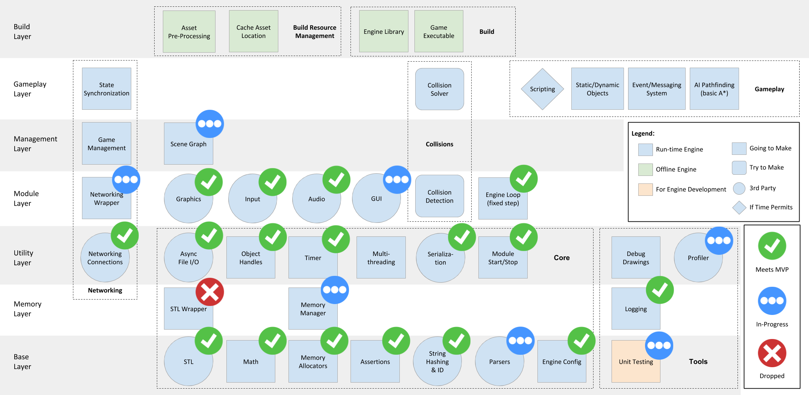

# Buried in Comments

## Byte-Sized Updates

This past week, progress has slowed down significantly for a few reasons. We are at a point now where we are starting to integrate the engine systems together more heavily, which has stopped the development of new features. For example, we are beginning to integrate the memory manager with the other subsystems, but don't have enough to talk in-depth about this week. Also, our GUI system is heavily reliant on the window system and has its own built-in input, which needed to be abstracted out so we could feed in our own. More to come on that next week. 

The biggest road bump  this past week was going back through the code and adding [Doxygen](http://www.doxygen.nl/) comments for all of our public facing functions and member variables. This took each of us much longer than expected and we can definitely understand why many developers suggest waiting until a feature is settled to comment on it. We also did a large-scale code review with our faculty and spent a considerable amount of time fixing things. Finally, we have created a demo of the engine's functionality at this point, which includes: Networking, Audio, Rendering (with animation), Configuration file loading, etc. The demo is located on the demo branch and, at the time of writing, is this [commit](https://github.com/Isetta-Team/Isetta-Engine/tree/8e6507405bea29ab79af42e79e793ca94f60b844).

Check out these sick shots.

<iframe display="block" text-align="center" width="560" height="315" src="https://www.youtube.com/embed/LT3XdIKP_08?rel=0" frameborder="0" allow="autoplay; encrypted-media" allowfullscreen></iframe>

## Memory

### Our Naive, Naive Defragmentation

Last week we laid down the foundation for defragmentation, and this week we implemented our first version, naive defragmentation, with simple algorithms.

This is how we did it:

1.  Everything we discuss here is managed by our [`MemoryArena`](https://github.com/Isetta-Team/Isetta-Engine/blob/week-4/Isetta/Isetta/Core/Memory/MemoryArena.h) class.
2.  When creating a new object with `OurNewUtility<T>()`, add the new object's address and its handle index into an ordered map, `addressIndexMap`, which is always sorted by objects' memory address
    1.  We are also using this map when finding empty memory for the new object to  see if there's enough space after the last existing object
    2.  When deleting an object, remove the corresponding pair from the map
3.  Have a utility function that looks at the `i`th object and `i-1`th object, and see if there's empty space (referred to as "holes" in our last blog) between them. If so, move the `i`th object left to fill the hole and update its address in the `addressIndexMap`. The object's `size` information is stored in its `HandleEntry` and can be looked up through the index stored in `addressIndexMap`
4.  Starting from `i = 0`, every frame, we execute the above utility on the `i`th object to the `i + n`th object, where `n` can be set to any number. This means we are defragmenting `n` objects every frame. Before entering next frame, increment `i` by `n`.
5.  If we keep doing it, the `MemoryArena` will stay defragmented.

As you can see, this linear technique kinda works, but is inefficient and definitely not the industry standard. If we look at the time complexity:

1.  Step 2 is O(logn)
    1.  Step 2.a is O(logn)
    1.  Step 2.b is O(logn)
1.  Step 3 is O(logn) plus time for moving memory

There are many O(logn)s going on, when what we want is O(1). And space-wise, the `addressIndexMap` is also incurring 16 bytes of memory overhead for each object.

However, this naive implementation works for now, and we're not even close to dipping below 60 frames per second! (Ignore all of the systems we don't have running yet)

The public interface is also defined well, which allows us to swap our defragmentation algorithm without touching anything outside of the memory manager. So we decided to keep it for now.

In the future, if we have time, our plan is to update our defragmentation to use a customized free list[^24920] data structure. Again, we are not 100% sure about it for now and will update in the future.

[^24920]: A **free list** is a memory management data structure that uses a linked list which points to successive free regions of memory that can be utilized for allocation individually.

## Patch Notes

### Math Library/Unit Testing

We recently received a [pull request](https://github.com/Isetta-Team/Isetta-Engine/pull/1) for our repo suggesting a fix on our math library. For our Matrix4, we had copied most of Matrix3 (since they are mostly the same), though we forgot to change the 9 to 16 in the for loops. Also, since they were similar in functionality, we hadn't written unit tests for Matrix4 which caused us to have a bug. This is a great demonstration of why unit testing is important, but won't change too much on how we are testing because of time.

## Coming Soon

Sometime this next week we will publish our interview with Team Meat's [Tommy Refenes](../interviews/TommyRefenes-interview.md). He was able to give us great advice on creating portable architecture as well as how to best work with others as an engine developer.

We would appreciate any feedback or questions you may have about our content or what we are doing in the comments.

## [Resources](../resources.md)

The [resource page](../resources.md) has been updated to include links we found useful this week, too!

_Originally published September 28, 2018._

<!-- Begin MailChimp Signup Form -->
<link href="//cdn-images.mailchimp.com/embedcode/classic-10_7.css" rel="stylesheet" type="text/css">

    <form action="https://isetta.us19.list-manage.com/subscribe/post?u=1d83cb806c55e205be26db856&amp;id=860c7d79cf" method="post" id="mc-embedded-subscribe-form" name="mc-embedded-subscribe-form" class="validate" target="_blank" novalidate>
        

            <h3>Subscribe to our mailing list</h3>
            
Get notifications about the upcoming blogs and interviews!

              
            

                <label for="mce-EMAIL"> </label>
                <input type="email" placeholder="Email Address..." name="EMAIL" class="required email" id="mce-EMAIL">
            

            

                

                

            

            

                <input type="text" name="b_1d83cb806c55e205be26db856_860c7d79cf" tabindex="-1" value="">
            

            

                <input type="submit" value="Subscribe" name="subscribe" id="mc-embedded-subscribe" class="button">
            

        

    </form>

<!--End mc_embed_signup-->