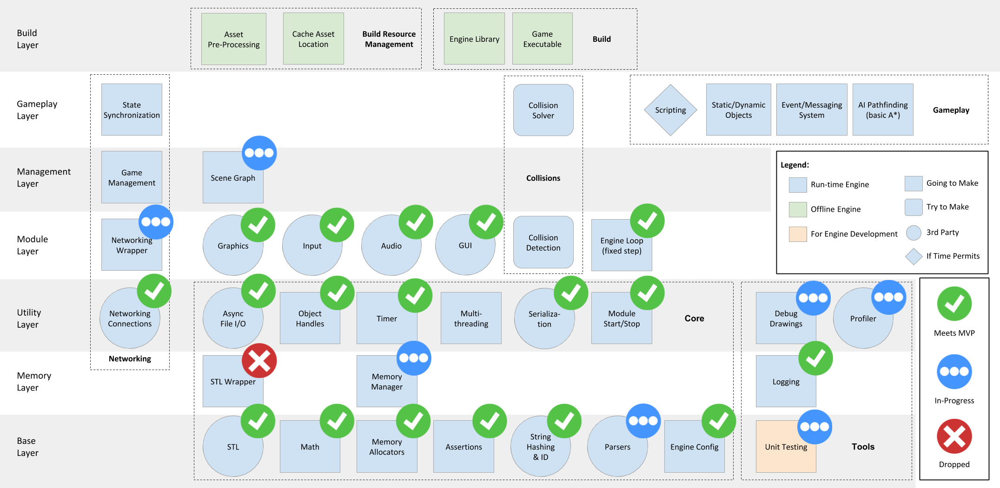
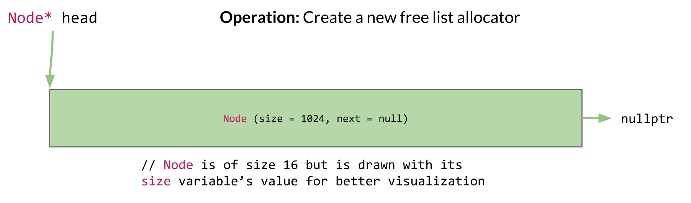
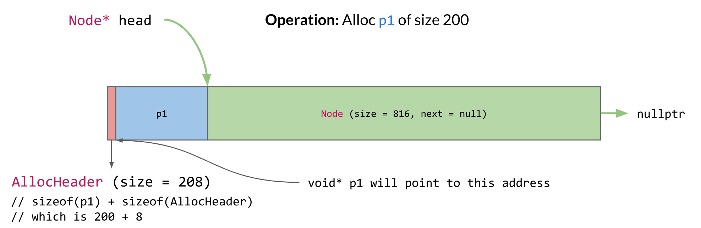

<!----- Conversion time: 3.564 seconds.


Using this Markdown file:

1. Cut and paste this output into your source file.
2. See the notes and action items below regarding this conversion run.
3. Check the rendered output (headings, lists, code blocks, tables) for proper
   formatting and use a linkchecker before you publish this page.

Conversion notes:

* GD2md-html version 1.0β13
* Fri Oct 05 2018 15:12:58 GMT-0700 (PDT)
* Source doc: https://docs.google.com/open?id=1WeXeOeEGnqhZZofcapgrY388ZXS3gYpYk8YdlLUepLs
----->
# Back in Business!

## Byte-Sized Updates

*   [Goodbye Module Manager](#goodbye-module-manager): Removed the manager that handled the lifecycle of all of our modules because redundancy.
*   [Scene Graph Object Model](#scene-graph-object-model): Determined to use a blend of data-oriented and object-oriented design for our scene graph object model for the rest of development (or until we change our minds).
*   [GUI](#gui): Created a module for the GUI system, and learned why having a sample game is important for engine development.
*   [More on Horde3D](#more-on-horde3d): Fixed the issues that Horde3D's lightweight-ness brought back to us.
*   [Memory](#memory): As the team is integrating memory manager to their modules, we got a better sense of how to do it and made some updates. We added a free list allocator, abandoned our "all static" fantasy and is updating our `alloc` API design.
*   [Networking](#networking): Replaced the memory management with our own system and discussed some big design decisions for the networking backend coming down the line.

Although things look like they are not changing much, most of the current work is stemming from the need to rework systems after integration. The dependencies of a system are driving additional development on that system, almost like feature requests. We are pushing forward with an increased focus on the game's needs, and we're planning to start the game as soon as possible to find more cracks in our system.




## Goodbye Module Manager

You will not be missed. What `ModuleManager` became was a container that held all of the modules and dictated their lifecycle. It was originally meant to act as a protective barrier for the game developer, as described in [week 1](week-1.md/#module-manager), to stop them from "accidentally" starting or stopping a module.

So why _are_ we removing something that is at the center of our engine, holding all of the module's lifecycle? Well, that's exactly the reason we are removing the manager. We could easily see the module manager becoming the central hub of the engine, i.e. everything needs to go through the module manager to work, which doesn't make sense.

This decision stemmed from our conversation about the needs of the `SceneGraph`. The `InputModule` needs to be updated prior to the `SceneGraph` update, and the `AudioModule` needs to be updated after (see code below); the game developer should be able to use the input in their gameplay code and trigger audio that is played on the same frame as its triggered. 

``` cpp
ModuleManager::Update() {
  inputModule->Update();
  // Need SceneGraph.Update() here
  audioModule->Update();
}
```

Since `SceneGraph` isn't a module, it shouldn't be part of `ModuleManager` and `ModuleManager` only has the `Update` function, so then how do you get `SceneGraph` update between them? There are numerous hacky ways:

*   Pass functions as parameters to `ModuleManager`'s `Update` and `RenderUpdate`
*   Have `PreUpdate`, `Update`, `LateUpdate` functions in `ModuleManager`, and the same three for the `RenderUpdate`

Neither of these felt right and it kept begging the question: What was `ModuleManager` providing us that we couldn't just get by having the modules as member variables of the `EngineLoop`? The answer was nothing. It was protecting them no more than the `EngineLoop` could, so we cut out the middleman.

The decision also made us reconsider our update loops. Firstly, we were calling the 2 update functions `SimulationUpdate` and `RenderUpdate`, but realized those are inaccurate names. We've since renamed them and will be referencing them in the future as `FixedUpdate` and `VariableUpdate`. These names better portray the functionality and remove the misconception that `RenderUpdate` should only have rendering functions inside. With this out of the way, we started considering why we have our input, audio, gameplay, and all other update functions except network and physics inside `FixedUpdate`. By having these updates within `FixedUpdate`, the gameplay will appear to be stuttery and input won't be captured as frequently as rendering occurs. Networking and physics are the only 2 systems that are dependent on deterministic behavior[^877], everything else can use a variable delta time. So now our new update loop looks like:

[^877]: **Deterministic behaviour** is a process whose resulting state is determined by the initial state and inputs. It is heavily reliant on having a fixed-time so each step is performing the same amount of "work".

``` cpp
EngineLoop::Update() {
  while(...) {
    for (...) {
      FixedUpdate(intervalTime);
    }
    VariableUpdate(deltaTime);
  }
}

EngineLoop::VariableUpdate(deltaTime) {
  inputModule->Update(); // should happen prior to gameplay updates
  sceneGraph->Update();
  sceneGraph->LateUpdate(); // happens after the regular gameplay, but not after anything else so gameplay can still affect the current frame
  audioModule->Update(); // happen after gameplay to play triggered audio and positioned based on gameplay
  renderModule->Update(); // happen after gameplay for positioning and visibility
  guiModule->Update(); // happen after rendering so it is displayed ontop of render
  windowModule->Update(); // happen after render, gui, input to swap buffers because each depend on window handle
  memoryManager->Update(); // happen at the end of the frame to clear single frame allocator and swap double frame allocators
}

EngineLoop::FixedUpdate(intervalTime) {
 networking->Update(); // happens first to receive, process, and send packets
 sceneGraph->FixedUpdate(); // happens before physics so collisions can still be solved if one occurs
 physicsModule->Update(); // after all gameplay to solve any collisions
}

```

Laying out our updates this way also let us reconcile some other conversations we were having. One of those conversations was how `MemoryManager`'s single and double frame allocators "frames" were peculiar. They were updated based on the simulation tick, but typically you associate a frame with rendering; this felt wrong. Since we weren't using the frame allocators at the time, we ignored the peculiarity. However, now the `MemoryManager` updates in the same frame as rendering, thus the frame allocators correspond to actual frames. 


## Scene Graph Object Model

Now that we're getting to our high-level systems like the scene graph, we decided to sit down and determine what our object model would be. At its most basic, object models for game programming can be split into roughly two schools of design: data-oriented and object-oriented.


### It's All in the Data

Data-oriented design is a [very](http://aras-p.info/texts/files/2018Academy%20-%20ECS-DoD.pdf) [strongly](https://www.youtube.com/watch?v=rX0ItVEVjHc)-[touted](https://www.youtube.com/watch?v=NTWSeQtHZ9M) [and](https://www.dice.se/wp-content/uploads/2014/12/Introduction_to_Data-Oriented_Design.pdf) [thoroughly](http://bitsquid.blogspot.com/2010/05/practical-examples-in-data-oriented.html) [discussed](https://www.youtube.com/watch?v=ZHqFrNyLlpA) philosophy that is essentially built around one concept: everything is data, and turning that data into something else is the end goal. More specifically, this manifests itself into a lot of thinking about data locality[^32402] and minimal branching[^74893], and how to process similar data all together quickly. It came into the public eye around the seventh game console generation because CPUs began to be more powerful than necessary and memory was still slow, so game programmers did what they do best and ~~yelled at the artists~~ figured out how to best operate around the machine's memory accesses and data caches.

[^32402]: **Data locality** is essentially accessing data in as nearby of code as possible to utilize caches most effectively. Robert Nystrom covers it really well in [this chapter from Game Programming Patterns](http://gameprogrammingpatterns.com/data-locality.html).

[^74893]: **Branching** in code is when the processor needs to evaluate something in order to determine what code to run next. It tends to be very wasteful of processing time because of the typical [instruction pipeline](https://en.wikipedia.org/wiki/Instruction_pipelining) on a computer.

If you don't come from video games, you very well may have never heard of data-oriented design. That's fair—it's not really necessary unless you have a running-time limited system like video games. But in the video game world, data-oriented design has only gotten more and more popular, especially now that GPUs are becoming more generally programmable and CPUs are getting enough cores that they're effectively GPU-lites. And as game developers, we do want to use the best options available for our systems, but we face a conundrum: data-oriented programming tends to be very difficult and brittle in big, messy systems like a _game engine_.


### To OOP or not to OOP

This is where object-oriented programming (or OOP) comes in. Everyone knows it, and programmers who have had as little as one programming class are already "indoctrinated" with OOP practices. It's very simple to think about conceptually, and its abstractions  tend to make code cleaner when you having communicative or shared systems. However, OOP is almost on the opposite side of the spectrum from data-oriented programming, and it tends to prevent optimization at a high level. So you can imagine why game developers don't particularly like OOP.

So which one do we go with? Data-oriented or object-oriented?

Turns out, it's not a binary choice! Data-oriented concepts such as keeping similar data packed together or minding the data cache can still be put into practice with an object-oriented architecture, and the most significant blemish with OOP is inheritance ([this covers some of the misuses](https://softwareengineering.stackexchange.com/a/260354)), which we can specifically avoid while we're using other OOP concepts like composition and interfaces. We acknowledge that we don't have the time or experience to handle the difficulty of fully utilizing data-oriented design, and as a short yet ambitious project, we want to keep moving at top speed! So we settled on an object-oriented composition approach, where we can try to utilize data-oriented practices in cut-and-dry cases that won't cause more complication.

Essentially, this means we're going to have objects very similar to Unity's GameObjects with their Components. Is it derivative? Slightly. But you know what? Convenient object models are used for a reason!


## GUI
### Why do we need GUI?

GUI, or Graphical User Interface, is one way a player is able to interact with the game and also allows the developer to display important information to the player. As mentioned in the [week 3 blog](week-3.md#gui), Horde3D isn't packaged directly with a user interface. However, our sample game needs some basic UI features. We had assumed any rendering library wouldn't be complete without a programmable GUI, which was our naive assumption from looking at [Ogre3D](https://www.ogre3d.org/) as the tentpole.

So with that, let's look at the demo to see what we need:


The gameplay needs are fairly basic: _static text_ for "Health" and "Score", _dynamic text_ for the score value, and a _filled rectangle_ to display the health bar. However, we realized that the gameplay demo isn't a complete picture of what the game needs (especially in the case of multiplayer). The actual game flow is depicted below, with needs of a menu to select single player or multiplayer and, at the very least, to be able to select whether the game client will be hosting or which host to connect to. These type of decisions require something like a _button_ for selection.


While thinking of the UI flow of the game, we did a quick mock-up of what the menu may look like. The menu would probably require a title and (as mentioned) buttons, as well as some way of choosing single player or multiplayer. For multiplayer, if you are a host, there would need to be feedback to alert you of the number of clients in your lobby as well as an additional button to start the game (the host holds all the authority in our game, because they will be acting as the server the clients communicate with). If connecting to a host, the most basic solution would be to have an _input field_ for the host's IP address (a more complicated one would be to have a list of lobbies to connect to, which we may try doing with local addresses).


"But why stop here?", we thought. What we have listed is only ~5 GUI features and most engines have way more than that. If we are already taking cues from Unity, why not have the full functionality of their [GUI system](https://docs.unity3d.com/Manual/GUIScriptingGuide.html), especially because we have found some of their features very handy in making games? Plus, a "real" game engine would have much more than this to accommodate their developers, we don't want to just do the bare minimum.

> And although doing slightly more than the bare minimum is a good idea, we quickly realized this was a very poor mindset to have.


### So Many GUI Options

So even before laying out the needs of the game, we went shopping for a library. Although Horde3D doesn't have GUI by default (we were realizing how Horde3D was able to remain so lightweight), we found a [Horde extension](http://horde3d.org/wiki/index.php5?title=GUI_Extension) that added 3D and 2D GUI to the rendering engine. When doing the initial research into the extension,  we found a few Horde3D forums that pointed to an extension. To our dismay, there were replies stating that it wasn't the best solution. In addition, the extension was written in 2010 (8 years ago at the time of writing) which we thought didn't bode well since Horde3D has changed a lot in that time. The lack of maintenance of the extension could cause a serious headache.  

We then directed our attention to 2 other libraries: [Dear ImGui](https://github.com/ocornut/imgui) (ImGui) and [Qt](https://www.qt.io/). We swiftly made a decision to use ImGui because Qt has an open source/commercial policy that we didn't want to accidentally break. ImGui also had the added benefit of looking simple to integrate with only a few files, and there were ample resources for the library. Both the FAQ on the Github page and the repo owner are currently very active. Another benefit is it is in C++, which meant we wouldn't need an interface with another language. We also looked at Unity's GUI system to see what features a "typical" engine has which acted as a baseline of what we thought we needed. ImGui has overlapping functionality with Unity, so it passed that check.


### GUIModule

Like our other modules, the GUI module was broken into the module class, `GUIModule` and an interface class, `GUI`, for the game developer. Using ImGui's GLFW OpenGL example, We were able to have ImGui and our demo running simultaneous, but not really fully connected. When deciding our `StartUp` hierarchy, we decided to keep it as a flat structure. This meant the window module needed to be started prior to the rendering/input so the window handle[^321] could be passed to those modules. This decision proved to be the right one when implementing the GUI system, because the GUI also needs the window handle which was easy to provide. The other benefit of doing the explicit ordering of the module's `StartUp`/`ShutDown`/`Update` is the GUI should be started after the window but also needs to be rendered (updated) after the render update otherwise the render module will clear what the GUI just displayed. The only hurdle which required redesign when integrating ImGui was that of the input system. ImGui handles its own input by setting the GLFW callbacks, however, our own input system also sets the GLFW callbacks. So depending on the startup order, one of the modules would clobber the other's callbacks in GLFW. ImGui was designed such that the callbacks could be optionally set on initialization, which allowed us to be able to add ImGui's callbacks to our own input system rather than on startup.

[^321]: The **window handle** is a GLFW construct can be passed to objects and functions to allow them to hook into a particular window from the operating system.


### Immediate vs Retained Modes

With ImGui minimally integrated the main discussion became on how we would like to use the GUI system (and in turn how the game developers would use it). We evaluated 2 options: _IMGUI_ (not to be confused with ImGui) and _retained-mode_ (although not knowing that's what it was called). _IMGUI_ stands for immediate mode GUI which is a code-driven GUI system where on each rendering frame the application needs to issue the draw commands of the GUI (the GUI is not stored for multiple frames); where _retained_, also known as canvas/scene graph/object-based UI (this is how we originally labeled it), is where GUI is registered once and is displayed, "retained", on screen until it removes itself from rendering[^100]. An IMGUI system relies on the developer placing GUI code within something like an OnGUIUpdate method which is called each render frame, where retained-mode requires the developer to hold references to objects created such as `new Window`, `new Button`, etc. IMGUI is known to be good for developer tools and usually quicker to develop, however, it isn't as nice for doing something similar to Unity's canvas system which is a retained model. Initially we thought of implementing both, however, we could see that this could cause confusion for developers using the GUI, as well as our retained-mode would be more akin to a wrapper over immediate mode because the library we are using (it wouldn't really be retained). Although the retained mode is nice to use and what we are used to with Unity, we knew we wouldn't be using a designer tool to create our GUI (nor have the time to implement one) and prioritized speed of development over designer ease to design. In addition, Dear ImGui is set up for immediate mode (as per the name) and we knew fighting the library would cause more headache than actual benefit. This decision was reaffirmed in our interview with [Amandine](../interviews/AmandineCoget_interview.md), who said for a small scale/scope projects that immediate mode was the way to go. We also received similar advice from our conversation with [Walt Destler](../interviews/WaltDestler-advice.md), where he said that a retained-mode would be nice, but it wasn't worth the time to develop the tool to edit the UI (and he is making a game that will actually be published!).

[^100]: For more information on [Retained Mode versus Immediate Mode](https://docs.microsoft.com/en-us/windows/desktop/learnwin32/retained-mode-versus-immediate-mode).


### Wrapping All the Features

With the mode decided on how game developers will interact with the GUI module, we then needed to develop a wrapper to wrap ImGui so ImGui code wouldn't infect the game's codebase. The reason this is useful is so you have the ability to replace ImGui with another GUI renderer of your choice without changing the game codebase. And although this was the aim, doing this isn't a trivial task because our GUI system was set up to imitate ImGui's; not a generic GUI. ImGui was the readily available example that we had to model after. Plus, our sample game may be devoid of ImGui, however, we didn't completely replicate all functionality of a GUI, only the features needed for our game, so another game that uses the engine (if GUI isn't expanded) may need to use ImGui functions/functionality. For developing the wrapper, again we looked at Unity's system where all GUI functions were positioning absolutely from the top-left corner, use `Rect` for positioning and size, as well as for what features were available and what features we have used in our development. We then combed through the ImGui demo, picking out the features from ImGui that we thought would be useful to have in our engine, which as you could imagine ballooned our GUI system (way beyond the listed needed features). Reading through the ImGui demo allowed us to learn ImGui, though it was ultimately a waste of time to collect features that weren't necessary to our game and we wouldn't have time to wrap. 

Instead of trying to wrap all functionality, even ones we wouldn't use, we simplified to be only the functionality we knew we would use as well as a handful of additional functionalities. We suggest _starting with creating functionality that you need for this game._ If your next game needs more functionality you can add it then, we aren't creating Unity and if you are, you are still better off iterating features as they emerge rather than trying to fully cover the system. In our `GUI.h` you will find commented out functions and `TODO`'s scattered throughout, which are remnants of trying to fully wrap ImGui and aren't required for our game. If you would like to try your hand at creating wrapper functionality, you can easily add functions throughout this file (even make a pull request, we'll most likely accept it). To go even further would be to combine/expand ImGui features in a single `GUI` feature that you would want to use in a game.

When implementing our wrapper, the functions and functionality of ImGui didn't map one-to-one with how we would like to do our GUI. This is another reason to have a wrapper. For each ImGui function that we had decided was needed, we merged some of those functions together and replaced the ImGui classes (ImVec2/ImVec4) with the Isetta classes (`Math::Vector2`/`Math::Vector4`/`Color`). The biggest difference from our wrapper to ImGui (and Unity to an extent) is each GUI function requires a position and size for the element as well as an anchor pivot location and a element pivot location to determine where the element is located on the screen (by default, ImGui positions GUI in rows/columns and groups). Because our GUI and ImGui position elements differently, this is one of the reason we don't want to restrict the use of ImGui in the game code; they have different functionality which a game developer may want to take advantage of. Another difference between ImGui and our GUI implementations is the "container" windows (ie. window/modal/popup). Whereas ImGui relies on the game developer to remember to end the window context after beginning window, our GUI wraps this functionality with lambda functions. We made it this way because we think this wouldn't be as taxing on the developer.


### Sort of Related Lessons

To reiterate the lessons from developing the GUI wrapper:


*   Don't try to create/wrap all functionality for a system if it isn't needed for the game you are immediately making → make only what your game needs.
    *   For us: Buttons/Labels/Text/Input/Drawing Quads
*   Don't think that what Unity or another engine has is what your engine needs.
*   When you or a game developer needs a new feature, you can go back and add functionality.

After completing the wrapper, or more accurately, while developing the wrapper, we continued to add functionality to the main engine loop as example code prove the features work and provide examples for everyone to see implementation. Here is a example of the UI running in the engine, with all implemented functionality displayed simultaneously.


## More on Horde3D

In our [week 1 blog](https://isetta.io/blogs/week-1/#rendering), we mentioned that we chose Horde3D over Ogre 2.1 based on the fact that Horde3D has better documentation, is easier to build and is more lightweight. We thought it would give us good enough graphics with less cost importing the Horde3D library as our rendering engine. However, four weeks later, with integrating more modules into our game engine,  we found that Horde3D might have been less than ideal than we initially thought. It is lightweight for external function calling (the reason why it has fewer and clearer API in the documentation), but hides too much detail for a deeper integration.


### GUI and Textures

As mentioned before, as a part of graphics, we wanted to draw 2D overlays as in-game UI. However, Horde3D itself is such a "pure" rendering library that it isn't packaged with a UI utility. An extension can draw some UI, but because of the reasons listed above, we had to introduce one more third-party library. Stitching another library is not an easy task. We later found ImGui doesn't have its own texture loader, so we sought help from Horde3D since it can read an image from the disk as a texture. However, to our surprise, the texture decoding is hidden inside its `TextureResource` class instead of extracting it as a texture decoding[^8383] utility for reuse, since it is not supposed to be used by external users. Luckily, we later found `h3dMapResStream`, so that we can let Horde3D load and decode the texture for us and map the pixel stream[^838383] out later.

[^8383]: Typically, textures are stored in compressed formats like .png, to read the pixels from the image file, we need to decode the texture from compressed to pixels.

[^838383]: A **pixel stream** is a stream of pixel data, typically as four floating point numbers or integers representing red, green, blue, and opacity/alpha.


### Loading Nested Resources

Loading rendering resources like meshes and animations is a time-consuming part of a game. To hold this resource loading by ourselves, we implemented a filesystem that directly calls Windows API. This week, we started on integrating it into the rendering module. Horde3D provides an `h3dLoadResource` API which allows us to read the resource file by ourselves and send the data to Horde3D. However, this API hides a lot of details which caused a bit of confusion. 

Horde3D supports `.scene.xml` file to specify a scene node with mesh, material and its shader. A simple example of it is like this:

``` xml
<Model name="sphere" geometry="models/sphere/sphere.geo">
    <Mesh name="Sphere01" material="models/sphere/stones.material.xml" 
    batchStart="0" batchCount="2880" vertRStart="0" vertREnd="587" />
</Model>

```

As you can see, this file has nested containers and has multiple resources. This load resource function call will only load the "meta" file, and "secretly" add all nested resources into Horde3D's own resource manager but keep them unloaded, without notifying the developer. Even in its documentation, there is no mention about this:

> This function loads data for a resource that was previously added to the resource manager.  If data is a NULL-pointer, the resource manager is told that the resource doesn't have any data (e.g. the corresponding file was not found).  In this case, the resource remains in the unloaded state but is no longer returned when querying unloaded resources.  When the specified resource is already loaded, the function returns false.

As a user, we have to manually check if there are any unloaded resources remaining in a while loop. The way to achieve that is to do a query by `h3dQueryUnloadedResource`. After we dug deeper into this function, we found out the internal implementation of this function wasn't ideal. 

```cpp
ResHandle ResourceManager::queryUnloadedResource(int index) const {
  int j = 0;
    for( uint32 i = 0; i < _resources.size(); ++i ) {
      if( _resources[i] != 0x0 
          && !_resources[i]->_loaded 
          && !_resources[i]->_noQuery ) {   
        if( j == index ) return _resources[i]->_handle;
        else ++j;
      }
    }
    return 0;
}

```

What we want is a function that returns the newly nested resources added to the resource list (or the next unloaded resource in the list), while `queryUnloadedResource` goes through the whole list and returns the first one. It will be significantly slower if we have lots of resources to load. To fix this issue, we decided to assume that the resource handle is always increasing so that we can check the next resource by `h3dGetNextResource` and `h3dIsResLoaded` repeatedly until the handle reaches the end.


### Memory Anarchism

After loading the resources, we also want to manage the memory taken by the resources by our own memory manager. However, Horde3D 1.0 doesn't support custom memory allocators (they do have it as a feature for Horde3D 2.0 which is still not released yet, if it is—[check here](https://github.com/horde3d/Horde3D/releases/tag/v1.0.0)—at the time you're reading this it can be an exercise for you to replace Horde3D 1.0 with 2.0 and use custom memory allocation!). All the memory allocations are done by Horde3D internally with `new`s. We can't bring our own memory manager without heavily modifying the source code of Horde3D which is near impossible for our semester-long project (it would counteract the reason why we chose Horde3D before). 

It's unfair to say choosing Horde3D was a bad idea, but the lightweight-ness we expected from Horde3D to be a benefit is putting the burden onto us since we have so many customized systems, like filesystem and memory manager. This week we are implementing the scene graph and hopefully, we can still use Horde3D organically.


## Memory

Starting from the last week, our team started integrating our own memory manager into the subsystems and 3rd party libraries (yay!). It's a very exciting task, but it exposed many issues and limitations of our memory manager. As others were busy integrating the memory manager, one of our developers spent time gathering and analyzing incoming requirements so that we could make some updates to our memory manager. 


### Freedom from The Free List Allocator

The first thing is that the existing memory allocators are very limited and can't cover all of our usage scenarios. 

For example, our `GUIModule`'s `StartUp()` process involves a lot of dispersed allocation and deallocation of random sized memory, and is managed by ImGui so we can't easily change it. All we can give ImGui is an allocation callback and a freeing callback. As a stack allocator can only handle sequential alloc/free; pool allocator can only handle same sized alloc/free; dynamic arena can only be used with `ObjectHandle`s, there is no way to make this work without just wasting memory.

In addition, the networking module needs to allocate memory for each client connected to the server at runtime for receiving messages, etc. That means the memory needs to be persistent, so the single frame and double buffers are out. Memory arena (refers to our defragmentated memory area as [in last week's blog](week-4/#our-naive-naive-defragmentation)) sounds like a good candidate for this, but the networking module needs to allocate memory for its [ring buffer](https://isetta.io/blogs/week-3/#data-structures) data structures, which holds an array buffer. Uh oh! Our `ObjectHandle` is not well-prepared to work with arrays. 


All of these signals are suggesting that we need a more versatile and flexible allocator. After some research, the _free list allocator_ seems to be a good solution. Unlike stack allocators and pool allocators, free list allocators give flexibility to the user in terms of the size and order of allocations/frees. It works by:


*   Keeping a linked list (sorted by memory address) of free memory chunks. 
*   Each time memory is requested, it goes through the linked list, find a large enough chunk and returns it to the caller. 
    *   There are also options like find first fit (loop through the list and find the first big enough node, prioritize speed) and best fit (loop through the whole list, find those big enough ones, and choose the smallest one among them, prioritize low fragmentation) for free list allocators for different scenarios. 
*   When a memory is freed, the free list adds that chunk back to the free list for further requests and tries to consolidate it with adjacent chunks to reduce fragmentation. It doesn't try to defragment like the memory arena, because the chunks which are being used cannot be moved (the pointers remain static).

As you can tell from the description, a free list can solve our speed and fragmentation problems to some degree. It's a bit slower than stack and pool allocators as we'll need to find memory chunk from the linked list and it may still cause some defragmentation, but the flexibility it brings is worth the tradeoffs.

And here is how it works (you can take a look at the code if interested [`FreeListAllocator.h`](https://github.com/Isetta-Team/Isetta-Engine/blob/week-5/Isetta/Isetta/Core/Memory/FreeListAllocator.h)):

The class and `Node` struct are defined as below. We won't include alignment here so things are easier to explain.

``` cpp

class FreeListAllocator {
  void* Alloc(Size size);
  void free(void* memPtr);
  Node* head;
  void* memHead;
};

```

``` cpp
struct Node {
  Size size;
  Node* next;
};

```

First, a free list allocator will be initialized like this when constructed.



Here is what it looks like after allocating an object of size 200:



The steps happened behind the scene are:


1.  Starting from `head`, find the first `Node` that's big enough to hold `p1` and an `AllocHeader`
1.  Create a new `Node` after this allocation (in this case, at address 208)
1.  Remove the original `Node` from the linked list
1.  Construct an `AllocHeader` at the original `Node`'s address, this info will be used when freeing `p1`
1.  After the `AllocHeader`, construct `p1` and return this pointer

The `AllocHeader` is defined like this:

``` cpp
// sizeof(AllocHeader) is 8
struct AllocHeader {
  Size size;
};
```

Notice we just buried an `AllocHeader` in memory and didn't keep a pointer to it, it will be used during the freeing process. Then allocating another chunk will be similar to this one.


Here is what it looks like after freeing p1:


The freeing process is more interesting as here we mine out the `AllocHeader` buried before and use it to determine the size of the object to free. Here is what happened behind the scenes:
1.  Starting from `p1`'s memory address, find the `AllocHeader` we buried before it
1.  As we know the size now, create a new `Node` with that size and add it to the linked list (remember the linked list is always sorted by memory address)
1.  Try to merge with the next and last `Node`. In this case, the new node is head and not adjacent to the next node, so we can't merge

Let's see an example where we need to loop through the list to find a chunk that fits, and an example where we can merge the freed memory.


^ We used the second node to satisfy this request as the first node is not big enough


^ We are halfway through freeing p2, the new node is just created here. It's adjacent to the node on its left so we can merge them, like shown below.


Our current implementation of the free list allocator is by no means optimal. Allocation and free are both of O(n) time complexity because of searching and keeping the list sorted. If time permits, we will optimize the underlying structure from using a linked list to a tree, so we can reduce the time complexity from O(n) to O(logn).


### The Almighty `Alloc` - Updates on Memory API Design

We also updated our API to make it easier for the team to use. During the process, we had a big discussion on how to design one of the most fundamental APIs: How to alloc on the LSR and level data area (look at our [week 2 memory section](https://isetta.io/blogs/week-2/#proposed-memory-management-patterns-in-our-engine) for a review!). As a recap, the difference between this two memory areas is that, level data memory will be cleared at the end of each level, and LSR will only be cleared when the game shuts down. We have two choices.

One is to make things _explicit_ and have both `AllocOnLSR` and `AllocOnLevelData` functions. These two functions will take care of their respective areas of the stack, and assert if called incorrectly. For example, if you try to allocate something on LSR after the level starts, it will pass an exception, as the main "big stack" is already in the stage of allocating level memory or other things. Similarly, if you try to allocate on the level before the level starts. This method prevents misuses of both functions by creating errors to ensure the developer knows what they are doing and when they are using a function incorrectly. However, the downside is that in the future, we may have more allocation types other than just LSR and level (sublevel for example) and it will be taxing for programmers to remember when to use each as well as tedious for module upkeep.

The other way is to make things _implicit_ and only have one `Alloc` function, which by itself determines where the new memory request should go. Different from our explicit approach, `Alloc` won't cause errors in any scenario. If a programmer allocated something in level data memory but assumed it's was located on LSR, then tried to use it in a later level, the game will probably crash. The advantage is that the API will be super clean and future additions of allocation types will be handled elegantly by this method. However, this approach assumes we have a team of programmers who know the API and understand the memory layout, if not, bugs would be very hard to catch.

We chose the implicit solution for several reasons. First, we only have 4 programmers working in the same room so everyone is aware of how to properly use this API. Second, LSR memory allocation requests are mostly made in the `StartUp` methods of each module, and level data request will be made in the level's initialization function. The probably of misusing is low, if you are in `StartUp` you will be using LSR and if not you will be using level is simple enough to remember. Almighty `Alloc` for the win!


### Abandoning the "all static" fantasy

In our [week 2 blog](https://isetta.io/blogs/week-2/#proposed-memory-management-patterns-in-our-engine), we said we wanted to achieve zero memory allocation after game `StartUp` and satisfy all memory requests with our memory manager. However, as fantastic as that sounds, it's been giving us a lot of headaches. We find it hard to predict how much memory we will need throughout the entire game, and how to make sure all systems run with enough memory. The audio system is a great example of this: there is no good way to determine its memory demand other than relentless iteration.

Fortunately, we have our free list allocator now! Although not implemented yet, the free list will grow in size when it requires more memory. This method isn't as detrimental as new/delete or malloc/free because instead of getting more memory each call and switching between kernel and user mode, the free list will allocate chunks of memory to be used. Therefore, it naturally became our ideal solution to the problems mentioned before for the systems whose memory usage is hard to predict before runtime, we will use a free list allocator. This decision surely breaks our "all static" fantasy, but it seems to be more practical and still keeps us away from our two problems, again, they are speed and fragmentation. 


## Networking


### An Overview of the Future

Network programming has taken the back seat to other development recently, mainly because we hadn't nailed down our game object model yet. After all, unless we want to bake all of our systems code inside of our network code, then we need to have some sort of messaging protocol to make sure the right objects and functions are receiving the right packets. We also depend on object serialization and replication, but fortunately, [yojimbo](https://github.com/networkprotocol/yojimbo) handles some of that for us and we can solely focus on the data flow through our engine. If you aren't using yojimbo or another networking library for your game, you can learn more about object serialization and world state replication in Chapters 4 and 5 of _Multiplayer Game Programming_ by Joshua Glazer and Sanjay Madhav.

With our final product being a game engine, it's important to abstract the network code as much as possible so that it's applicable across many games made using the engine. Some of the obvious use cases that our [sample game](https://isetta.io/blogs/week-0/#the-example-game) highlights are object spawning, object destruction, object behavior change (targeting a different location), and data updates (changing health and score), just to name a few. Other potential needs might come in the form of remote procedure calls, where we can invoke functions across the network.

Bearing those thoughts in mind, we've nailed down more of our game object model and have begun work on our scene graph system, so you'll see the network code of our engine start to build out these concepts more in the coming weeks.


### Reworking the Networking

In the meantime, many of our systems are out of sync with each other, so we took the time this week to update our memory management within the networking module. Up until now we have been using the standard dynamic memory allocation of C++ with `new` and `delete`, but having full control of memory allocation, defragmentation, and access (as well as avoiding context switches!) is too great a benefit to a high-performance system like a game engine. Much of the networking system uses significant chunks of memory, such as the messaging buffers[^832988] and the socket-level packet queues[^34902]. And if you're hosting a server, then you need that much memory for each of your clients!

[^832988]: A **messaging buffer** is just a queue of messages that are buffered prior to being sent. Sending can be expensive and complicated, so buffering messages eases the messaging process.

[^34902]: A **packet queue** is a queue of packets, which are small chunks of an original, bigger message. These are sent out in-batch because of packet size limitations over internet networks.

As with some of our earlier development, we needed to alter the yojimbo library in order to comply with our own systems. This was only a couple of tweaks from pass-by-reference to pointer types instead, as our engine uses a lot of pointers so we can delay object initialization to our own execution order. Beyond this, we also got some more exposure to the packet serialization and streaming backend to the yojimbo library, so we may be more prepared to make adjustments at the low-level in the future if we need to.

Beyond that, we need to allocate memory for a client and possibly a server on a single machine, plus the `RingBuffer` objects for queuing up messages with both. Everything within `NetworkingModule`'s `StartUp` function is allocated using the `MemoryManager::AllocOnStack` function, but it's less straightforward than if we were an entirely homebrew engine. yojimbo uses custom `Allocator` classes to divvy out memory to its `Client` and `Server` objects, so we are effectively pre-allocating a bunch of memory then passing pointers around until everyone is satisfied and on their merry way. One reason why it doesn't sound more complicated is that it, very luckily, isn't; yojimbo has a TLSF[^837294] allocator implementation that it uses for packet-level allocations, and that allocator can be restricted to the memory defined by our own custom allocator! So in the end, our memory management is only at the high level for the module, but we still get efficiency. We can have our cake and eat it, too!

[^837294]: **[Two-Level Segregate Fit](https://github.com/mattconte/tlsf)** (TLSF) is a memory allocation scheme meant for use in video games because of its fast and efficient memory usage.

One of the quirks that we had to deal with when swapping out the memory allocators was how we are currently handling our memory chunks. We have a config file in which we specify how big our stack and list memory allocations are for each category of allocation, which is good when we want to do some regression testing[^3902832] on our memory systems but bad for any type of general usage whatsoever! For instance, while we were refactoring our client and server memory to the new memory system, strange errors came from within the yojimbo library. After digging into it some more, we discovered that yojimbo was simply doing its best to allocate more memory for packets but we didn't give it enough memory! Everything was fine after updating the config file, but it took quite a bit of time to realize that the config held the solution. Afterwards, we had some discussions about allowing free growth of some stacks and heaps, but we running into this problem actually highlighted a bigger architecture problem for us to tackle.

[^3902832]: **Regression testing** is the process of testing changes in software to make sure functionality is not broken when updating the software.


### Mo' Players, Mo' Problems

A lot of this memory is currently what we call LSR memory, so we allocate it onto our lowest level memory stack and just keep it there until we're done running the engine. Unfortunately, there are two problems with this:


1.  Game developers should be able to determine if they are running a server or not _during runtime_. Right now, since we are allocating the server memory at the lowest level of the stack, we need to know if they're running the server at startup.
1.  Game developers should be able to have single player modes and multiplayer modes within the same game. Our initial design was strictly online multiplayer, but it's not a stretch to think we could make a single player game with our engine. However, what if the developer wanted to allow gamers to go online after playing a single player mode? We currently assume that the developer always needs client memory (let's not even think about running a headless server), so that's allocated on the stack, but if they aren't receiving any networked messages then they shouldn't have to waste that memory!

These problems exist solely because we're trying to be coy about our static memory allocation at startup. That's indeed a noble goal to shoot for, but there are appropriate cases and inappropriate cases. For networking, it's not unreasonable to expect the game developer to allocate and prepare the networking system during "downtime" in the game as opposed during important runtime when context switching and dynamic allocation would really pose a problem.

This means that our solution is the simplest one: Just allocate any of our networking memory in our free list, a.k.a. our own custom heap space. This will give game developers the freedom to determine if they even need any networking memory at all, and if so, when it gets allocated. We expect to not have any significant memory fragmentation issues with this method either, since we just ask for a couple of large chunks of memory and will only ever remove the entire chunks.


## Patch Notes


### Explicit `StartUp`, `Update`, `ShutDown`

Earlier this week a member of the team was merging code and ran into a problem. The build successfully compiled and worked until the window was closed but then it crashed. The crash was involving the `AudioModule`, but wasn't clear why it was broken. By stepping through the call stack, we saw the bug occured in the `ShutDown` function and the error was almost immediately noticeable. Here see if you can see the error:


Were you able to? The `AudioModule` is attempting to `ShutDown` twice, which obviously won't work. This is just to show the added benefit of having the modules listed in this fashion rather than being put into a stack or list. To be fair this example might not have happened with a list because of the merge, but there is a likely scenario where a module gets added twice. Then you have the headache of searching and debugging rather than being able to visually spot it.


### Memory Updates

We also made some other minor changes to the memory manager, and they are:


*   Create new utilities for creating objects and arrays in different memory areas with [variadic templates](https://en.cppreference.com/w/cpp/language/parameter_pack). For example, you can use `MemoryManager::NewSingleFrame<MyObj>(param1, param2...)` to create a new `MyObj` object on the single frame area, and use `MemoryManager::NewArrOnFreeList<MyObj>(100)` to create an array of 100 `MyObj`s.
*   We used to have some "magic numbers"s in the memory manager to specify the default alignment of memory allocation. Those magic numbers are now abstracted out and shared by everyone using it. This will allow for easy changes in the future and prevent inconsistency.
*   We used to have a slot in the config file that specifies the size of our LSR and level data memory area. We now allow each submodule to have a function that calculates their memory need. And the memory manager just call each of the functions and determine the total size needed. Some modules will need to read something from the config file in their calculation function, but our start up sequence perfectly supports this: the config file is read before anything else starts. The main reason why we did this was because it's very hard and tedious to calculate memory usage of each subsystem by hand and modifying the corresponding entry in the config file. This also makes each module's memory usage more transparent.

Enough with our additions and patches. Now let's switch to one of our memory manager users and see what they have to say about our latest changes!


> **RingBuffer gets Homegrown**

> One of our anticipated tasks after fleshing out the memory module was to go through the rest of our systems and update their memory allocation to use our own memory allocators. The best place for us to start was, of course, our data structures!

> Our RingBuffer uses big contiguous chunks of memory for array allocation, so we swapped out any of our array `new` calls with `MemoryManager::NewArrOnFreeList` so that we could also avoid trying to defragment the big pieces of memory. This mimics the standard `new` way of doing things, but instead, we now get full knowledge and control of the memory. Our method also prevents half-baked usage of our system, because any memory of ours that is free'd using `delete` will crash the engine!

> Would recommend!


## Coming Soon

Go check out our interview with [Tommy Refenes](../interviews/TommyRefenes-interview.md) from Team Meat!

Last week we had a great conversation with [Alice Ching](../interviews/AliceChing-advice.md) from Funomena and will be publishing the advice she gave us soon as well! We are still working on editing [Amandine Coget's](../interviews/AmandineCoget-interview.md) interview, stay tuned for that. And this past week we also spoke with Martin Middleton, co-founder of Funomena, and will be working on transcribing and editing that in the coming weeks! Subscribe to our mailing list to get updates on all of these interviews as well as our blogs (we won't spam you, we promise)!


## [Resources](../resources.md)

From development we are acquiring a lot of great resources from where we learned certain topics, and as much as we try to synthesize things in our blogs you may be interested in the originals, which is why we have a page full of links for you to browse.

_Originally Published October 5, 2018._


<!-- GD2md-html version 1.0β13 -->


<br>

<!-- Begin MailChimp Signup Form -->
<link href="//cdn-images.mailchimp.com/embedcode/classic-10_7.css" rel="stylesheet" type="text/css">
<div id="mc_embed_signup" style="margin-top: -20px">
    <form action="https://isetta.us19.list-manage.com/subscribe/post?u=1d83cb806c55e205be26db856&amp;id=860c7d79cf" method="post" id="mc-embedded-subscribe-form" name="mc-embedded-subscribe-form" class="validate" target="_blank" novalidate>
        <div id="mc_embed_signup_scroll">
            <h3>Subscribe to our mailing list</h3>
            <p style="margin-bottom: -22px;">Get notifications about the upcoming blogs and interviews!</p>
            <br><br>
            <div class="mc-field-group">
                <label for="mce-EMAIL"> </label>
                <input type="email" placeholder="Email Address..." name="EMAIL" class="required email" id="mce-EMAIL">
            </div>
            <div id="mce-responses" class="clear">
                <div class="response" id="mce-error-response" style="display:none"></div>
                <div class="response" id="mce-success-response" style="display:none"></div>
            </div>
            <div style="position: absolute; left: -5000px;" aria-hidden="true">
                <input type="text" name="b_1d83cb806c55e205be26db856_860c7d79cf" tabindex="-1" value="">
            </div>
            <div class="clear" id="submit-button">
                <input type="submit" value="Subscribe" name="subscribe" id="mc-embedded-subscribe" class="button">
            </div>
        </div>
    </form>
</div>
<!--End mc_embed_signup-->