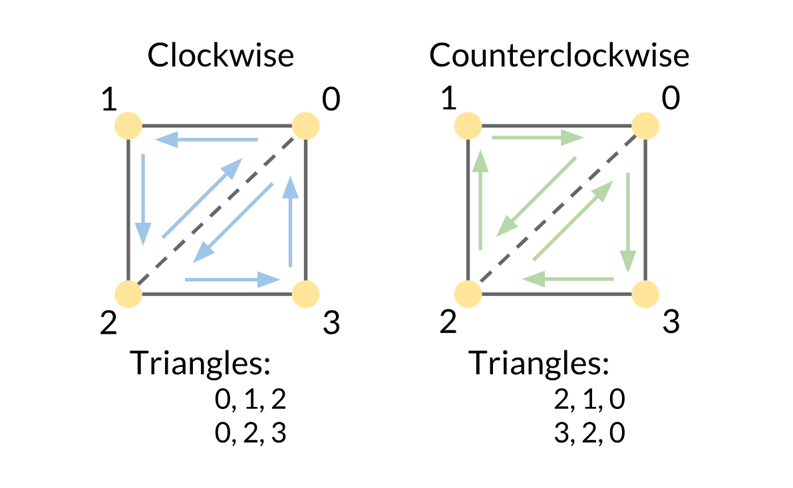
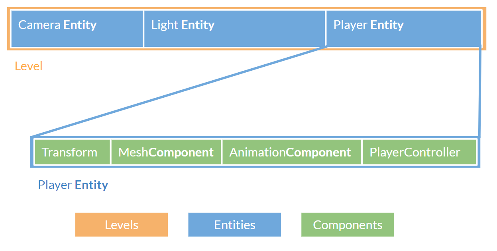

<!----- Conversion time: 2.822 seconds.


Using this Markdown file:

1. Cut and paste this output into your source file.
2. See the notes and action items below regarding this conversion run.
3. Check the rendered output (headings, lists, code blocks, tables) for proper
   formatting and use a linkchecker before you publish this page.

Conversion notes:

* GD2md-html version 1.0β13
* Fri Oct 12 2018 15:26:02 GMT-0700 (PDT)
* Source doc: https://docs.google.com/open?id=16EBhDw19I0YVhw-B5VSHMtznLFcDy_rKFYWb9yHubRY
----->


# I Think It's Playable

## Byte-Sized Updates
* [Debug Drawing](#debug-drawing): Implemented our entire visual debug drawing system, which has already revealed a mistake!
* [Level (Scene Graph)](#level-scene-graph): Designed the scene graph architecture as Level-Entity-Component, and created a reflection system for loading user-defined levels.
* [Transform](#transform): Began development on our transform hierarchy, and implemented some gameplay features with it like a flyby camera.
* [DLL](#dll): The engine was built into a DLL (well, sort of), and we were able to run the engine in another project.


## Debug Drawing

Debug drawing is the visual equivalent to a print statement, and it is a good immediate check on whether a system you've programmed "looks" right. It is much easier to debug something through drawing than it is through text output; in fact, it even helped us discover a problem with our assets! (We'll cover this in a bit)

What we want is some primitive types: lines, rays, planes, cubes, and spheres. We initially looked into Horde3D's capabilities for drawing these primitives, but we thought it made no sense to import models for these simple drawings—how would we even render a line _model_?! As in the past weeks, Horde3D's lightweightedness gave us no immediate way of doing this. The Horde forums offered solutions for generating procedural geometry and using OpenGL[^101] with Qt[^97], but they each had their own flaws, either using legacy functionality or bringing in libraries that mostly replicate our existing libraries. What we really wanted was to be able to write raw OpenGL code.

[^101]: **OpenGL** is an open source graphics library for rendering 2D and 3D vector graphics.

[^97]: **Qt** is a framework for creating retained GUI applications.


### Foray into OpenGL

Getting OpenGL working with Horde required a decent understanding of Horde's render loop. Firstly, any OpenGL drawing needs to happen after Horde's `h3dRender` and `h3dFinalizeFrame`. In `h3dRender`, 'glClear' is called to blank the screen (clearing any drawings done prior to the functions), and between these two functions, OpenGL's state is being changed, and any changes between the two function calls could tamper with Horde's rendering. To begin using OpenGL, we followed some simple OpenGL [tutorials](https://learnopengl.com/Getting-started/Hello-Triangle) on setting up a camera, viewport[^70], and rendering to the screen using vertex arrays and buffers[^12]. This was done in isolation of the engine project as a primer to the updated OpenGL4.0. When bringing this into our engine, we removed the `RenderModule` and `GUIModule`'s `StartUp`, `Update`, and `ShutDown` so the only class utilizing OpenGL would our new system. With only the new system calling OpenGL code, we were able to get a triangle rendered in screen space in our engine relatively quickly. And it looks magnificent!


[^70]: A **viewport** is the "window" which the camera will render content to the screen, it is specified with an (x,y) offset from the top-left in OpenGL and a width and height.

[^12]: **Vertex arrays** and **buffers** hold the vertex information such as vertex positions, normals, color, etc and are stored within the OpenGL state.

Well, it's a start. From there, we implemented the element buffer[^39] so that we could reuse the vertices, because although we are generating simple primitives, we want 2 versions: a solid and a wireframe. An element buffer allows us to avoid creating different lists of vertices for our primitives because we can just specify the ordering in which the same vertices are used to draw the primitive. The order of the vertices is particularly important for solid objects because it determines which "side" of the primitive is drawn, one of which is typically invisible! This vertex order can be clockwise or counterclockwise, so it's known as the _winding order_ (kind of like how you wind a toy).



[^39]: **Element buffers** hold additional information regarding the vertices, specifically what index the pertinent information is located within the vertex array.

With an understanding of OpenGL 4.0, proof that it was working in our solution, and a triangle in hand, we decided to break everything by reintroducing the `RenderModule` but not the `GUIModule` just yet—we aren't that crazy! The reason to remove GUI to begin with was because it has OpenGL calls which could change the OpenGL state. We wanted to ensure the only system interfacing with OpenGL was DebugDraw. Although GUI happens after the `DebugDraw`, so the debug drawings don't appear over the UI, it was reintroduced to keep the errors only associated with debug drawer and not possible integration bugs. As you'd expect if you've done graphics work before, the screen was black, and our triangle was totally gone. After rigorous debugging (i.e. commenting things out to determine the source of the problem), we figured out that the element buffer was the source of the problem! The vertex buffer was able to render both wireframes and solid primitives, but the element buffer only rendered wireframes, as with the quad:


Initially, we thought we didn't need the element buffer for debug drawing because it was so simple. However, being engineers, we also had the frustration of not knowing why it didn't work.  After hours of more debugging, the answer was relatively simple: a reversed winding order. Rather than using the same winding order that the OpenGL test scene was using (clockwise), Horde had a reversed winding order (counterclockwise). So really, the back of the object was being "rendered", which actually means it was culled[^49] instead of drawn! From here, implementing all the debug drawing just required accurate counting of vertex indices and lots of hand-drawn pictures with counter-clockwise swirls on the shapes.


[^49]: **Culling** is the early rejection of objects being passed through the [render pipeline](https://en.wikipedia.org/wiki/Graphics_pipeline), because they don't contribute to the final image.

Our next problem was rendering things _beyond_ the screen, in the 3D world. With our modest understanding of graphics, we knew we needed a model-view matrix[^440] to translate the drawings. But before we got to that, we recognized that our row-major[^9021] array order could cause a problem because OpenGL is column-major[^9021]  (which can be less intuitive initially to think about) and programmers typically create arrays as `[row][column]`. Looking at our `Matrix4` class, we had done just that.  This fix is to transpose[^1123] the matrix when we pass our information to OpenGL or Horde—and we dodged a major bullet by figuring that out first!

[^440]: **Model-view matrix** refers to the matrix which transforms a position in local space to world space, then to camera space.

[^1123]: The **transpose** of a matrix is when the entries on the diagonals are flipped about the center diagonal.

The drawings were now being placed at the right position (well, it was fairly hard to tell with not much of a frame of reference. Oh, the woes of initial graphics!). However, the squares on screen then became oddly rectangular, and by that we mean they were rectangles and not squares. The vertex positions are hardcoded, so we did a quick sanity check against the numbers and found that we do indeed have the vertices for a unit plane/cube. However, to move the hardcoded drawings throughout the scene, the vertex positions are shifted via a vertex shader[^9098]. The shader multiplies the vertex's homogenous[^932] position with the object's local to world matrix, known as the _model matrix_, which allows the developer to specify position, rotation and scale. Then the shader multiplies the resultant `Vector4`by the _view matrix_ (that is, the position, rotation, and scale) of the camera. What was missing was the _projection matrix_, the matrix that defines the camera's frustum[^324] and thus what the camera sees. This fix was as simple as grabbing the projection matrix from Horde (set by us on when initializing the camera) and passing it into the shader. The rectangle became square and is now positioned in the 3D world, rather than directly on the 2D screen!

[^9098]: A **vertex shader** is a graphics program that alters information associated to the vertices, it is one of the first stages in the graphics pipeline.

[^932]: **Homogeneous** coordinates differentiate points from vectors by expanding the traditional `Vector3` to a `Vector4` and placing a 0 in the 4th element for vectors and 1 in the 4th element for points.

[^324]: **Frustum** is the portion of the world which is viewable by a camera. It is typically shaped like a pyramid with near and far planes clipping the volume. What is rendered is the volume between the 2 planes.


### Model Asset Pipeline

The rendering of the debug objects was nearing completion, but when the `RenderModule` reintroduced the "pushing man" animated model back to our scene, it gave us some pause. The camera had been put out at `Z=600` and the man at `Z=-100` just so that the man was properly rendered on the screen. Our initial thought was the model had an offset pivot[^587], so we imported him into Maya to check, but the pivot seemed okay. Luckily, we were smart enough to import him into Unity and compared him with a cube— and turns out, he was _massive_! Pulling in an experienced artist to help us shrink the model without breaking the rig and animation, we were eventually able to export him at an appropriate scale (closer to the size of a unit cube and not a skyscraper). This also re-exposed us to our asset pipeline that requires the models to be pre-processed by Horde into .geo[^4533] models, which we expedited with a batch script. We brought the "normal"-sized man back into the scene and compared him to the other sized model we had originally:


The one on the left is actually the giant, because he was pushed out to `Z=-600`, the camera is at `Z=2`, and the new model at `Z=0`. The fact that the left model is visible at that distance depicts how large it really was. And so, our debug drawing was already proving to be valuable, as that problem could have taken much longer to solve if we didn't have something to immediately compare our model with.

[^587]: **Pivot** refers to the local position of the model which is the zero position. When transforming the model in the world space, all changes are relative to this point. An offset pivot is when the pivot is placed in a position that isn't about the model, for example offset in `X=100` from the model.

[^4533]: **.geo** files are Horde3D's processed file for model and animations, optimized for more efficient rendering. The file is processed through the Horde3DUtil library and done prior to runtime.

For convenience, we also implemented a grid, point, axis and gimble (3-orthogonal circles). Using debug drawing also revealed some error in our logic. Firstly, without `RenderModule`'s `Update` function, `glClear` was never being called. Therefore, once an object was rendered, it remained on the screen even when we rendered a new frame. The simple fix: reenable `RenderModule`. Next, once this was put into one of the other developer's hands to use within an actual level component, it became apparent that the debug drawing needed to be refactored. The original debug drawing code would draw the primitive, and if a duration was passed into the function, it was added to a list to be rendered in future frames. This worked with the debug drawing demo, which was only executed after the `RenderModule` in our execution order, but any debug drawing called before then such as within a `Level`'s `Update` function wouldn't be drawn. As we mentioned before, the `h3dRender` function in `RenderModule`'s `Update` function clears the screen before any drawing in `Level`'s `Update` function could appear. We refactored this to chambering all draw calls until after `RenderModule`'s `Update` function is called, then we execute each of the draw calls within `DebugDraw`'s `Update` function. Here is a sample of the debug drawings in action!


<div style="width:100%;height:0;padding-bottom:56%;position:relative;"><iframe src="https://giphy.com/embed/3PzfXCegCDzAPMPRht" width="100%" height="100%" style="position:absolute" frameBorder="0" class="giphy-embed" allowFullScreen></iframe></div><p><a href="https://giphy.com/gifs/3PzfXCegCDzAPMPRht"></a></p>

Although this wrapped up nicely, getting debug drawing to work was taxing because debugging the drawing code wasn't easy (no pun intended). There was always an uncertainty of whether the object wasn't being rendered because of a Horde snafu or because it was 100 light years behind the camera. We relied on checking the error messages from OpenGL and making incremental steps so that the source of a problem was quick to suss out. As part of this development, we fleshed out the `Matrix4` and `Vector4` classes more, as well as added C++ `union`[^2354]s to them which caused issues when binding multiple elements to an array (turns out, you must wrap them in a struct within the union).

[^2354]: In C++, a **[union](https://en.cppreference.com/w/cpp/language/union)** is a special class type that can hold only one of its non-static data members at a time. Similar to a struct, you can declare multiple variables in a union, but only one is available at the same time. Another distinction is that the size of a struct is the sum of all of its members, but the size of a union is the size of the biggest member. The way the author understands it is that union gives you different ways to interpret the same memory values.


### Good Things to Know with regards to Horde3D/Graphics


*   Check the winding order of your drawings
*   Horde3D and OpenGL use column-major[^9021] matrices, our Matrix4 is row-major[^9021], this distinction is important
*   Horde3D renders down the negative Z-axis, as do many computer graphics programs, but this isn't intuitive for developers used to Unity which is the opposite. This is something we may also decide to "change" by offsetting the camera's rotation by 180° always, so it would effectively be looking down our positive Z-axis.
*   Have a good understanding of transformations (matrix and vector math)

[^9021]: Every Matrix4 has 16 numbers is it, and the 16 numbers are usually stored in a big array in a specific order. **Column-major** and **row-major** are two different orders of storing them. In Column-row matrices, numbers are put in the array "column by column", i.e., the 4 numbers in the first column occupy the first 4 slots in the array. While row-column matrices store them "row by row" - the first 4 slots in the array correspond to the first row in the matrix.


## Level (Scene graph)


### Level-Entity-Component Design

Since all of us agreed on object-oriented composition[^90865] approach for our scene graph object model, this week we began development on the scene graph system. We designed the structure of the scene graph to be Level-Entity-Component (similar to Unity's Scene-GameObject-Component).

[^90865]: In Object Oriented Programming, object composition is a way to combine simple objects or data types into more complex ones. The [_Component_](http://gameprogrammingpatterns.com/component.html) pattern in _Game Programming Patterns_ book describes this in detail.



`LevelManager` manages all the entities in this level and updates them one by one (the order depends on when the entity is spawned in this level) in its `Update` function. An _entity_ is an object that exists in the current level. It's more like a data entry which only includes a name, pointers to its components, and a transform object (we spent a long time debating if transform should own the children or the entity should own them; see this [later section](#the-small-step) for details). `Entity` also has some lifetime-related functions like `OnEnable`, `Update`, and `LateUpdate`. Any user-declared component or built-in component (like `MeshComponent`) inherits from `Component` class and will be activated, updated and destroyed by its entity.

### Loading a Level

We are making this engine to support a twin-stick shooter, but we also want other game developers to be able to use it for other genres, so the engine definitely needs something for developers to customize the level for the game to load. Modern game engines all have their own level data files for the game developers to edit (by using the editor) and for the game to load, like `.scene` files for Unity and `.umap` files for Unreal. Knowing this, how should we load level in our engine?

Sure, we can follow what modern engines do (again!) and design a formatted text file to hold all the information we need to load the level. However, it involves a parser and RTTI[^215]  (at least the ability to instantiate an object or a member variable from a string), which we think are quite costly to implement or find an appropriate library to import. Also, hooking the classes with RTTI can be very tedious (have you used `UCLASS()` and `UPROPERTY()` in Unreal Engine?).

[^215]: RTTI stands for **Runtime type information**, which is a language feature that exposes information about an object's data type at runtime. For example, if you want to get the type name of some object as `string`, you would need RTTI.

We decided to let the game developers write C++ startup scripts to load the level (similar to [GameMode](https://docs.unrealengine.com/en-US/Gameplay/Framework/GameMode) scripts in Unreal). Game developers need to create a class that inherits the `Level` class and implement the `LoadLevel()` function. The `EngineLoop` class will run the load level function after all module managers have started up and then run the actual game loop. This allows us the flexibility to be able to implement an actual scene file down the road, given enough time, without significant technical debt or concern for breaking older level files of the engine.


### Template Black Magic!


#### Level Auto-Registration

But this begs the question: now that we have a bunch of user-defined levels, how can the `EngineLoop` or the `LevelManager` know which class or which instance it should instantiate and load? Of course, we can have a string in the config file to specify which level to read, but it will still require some sort of RTTI. Luckily, we don't need the full information for the whole class including its member functions and member variables. All we really need is the name of the class and how to instantiate an instance of this class, so we can just use a static map with the name and the corresponding creating function inside of the `LevelManager` and let all user-defined levels register themselves. 

But we still haven't answered our question of how! How can we run a register function without having the instance of a class? Well, use static variables and static functions! The static variable initialization can call a static function which seems to be the best place to put our code for registering levels. Then, since each class needs some additional code, is there a way that we can handle it quietly and neatly? In fact, there is! Use macros and templates! Thanks to this [article](https://www.bfilipek.com/2018/02/factory-selfregister.html#templates), we are finally able to expose the whole automatic registration with a single macro[^1238]: `CREATE_LEVEL(NAME)`.

[^1238]: **[Macros](https://en.cppreference.com/w/cpp/preprocessor/replace)** are a way of automatically substituting text for some other during the compiling process. In C++, they are defined as `#define TEXT_IN_CODE TEXT_TO_COPY OVER`. For example, if you define `#define SPEED 5` and write `mySpeed = SPEED`, SPEED will be substituted by 5 during compile time and the compiler will actually see `mySpeed = 5`.

``` cpp
namespace Isetta {
CREATE_LEVEL(ExampleLevel)
  void LoadLevel() override {
    InitializeCamera();    
    SpawnPlayer();
    ...other level code
  };
};

```


#### Fake "Concepts"

Just like _The Boy Who Cried Wolf_, ["concepts"](https://en.cppreference.com/w/cpp/language/constraints) have been delayed from C++14 again(released in 2014) and are still not yet released with our version of C++17. However, for `AddComponent<T>`, we really need a way to constrain the template parameter to be a child class of `Component`. In Java, this is called [Bounded Type Parameters](https://docs.oracle.com/javase/tutorial/java/generics/bounded.html). In the example from Oracle's[^85213] official tutorial (shown below), the template `U` is restricted to be a class that implements the `Number` interface.

[^85213]: **Oracle** is a computer technology corporation headquartered in Redwood Shores, California, who acquired Java from Sun Microsystems and is now maintaining it.

```java
public <U extends Number> void inspect(U u){
  System.out.println("T: " + t.getClass().getName());
  System.out.println("U: " + u.getClass().getName());
}

```

The good news is, now in C++17, we can use the built-in RTTI and `constexpr if` to achieve similar feature.:

```cpp

template <typename T, typename... Args>
T* Entity::AddComponent(bool isActive, Args&&... args) {
  if constexpr (!std::is_base_of<class Component, T>::value) {
    throw std::logic_error("%s is not a derived class from Component class", 
      typeid(T).name);
  } else {
    ...
  }
}

```

As we can see in this code snippet from [`Entity.h`](https://github.com/Isetta-Team/Isetta-Engine/blob/week-6/Isetta/IsettaEngine/Scene/Entity.h), the `if` statement is checking if `Component` class is the base class of the template `typename T`. Since all of the information can be calculated during compile time (templates are unfolded during the compilation), we can use the new `constexpr` keyword (`enable_if` in C++14) to specify different behaviors in compile time.

> [@mike_action](https://twitter.com/mike_acton): Templates are a slippery slope of insanity. Plus compile times are horrid.

It's true that templates can largely increase the compile time. For a three-month project, though, templates are a convenient and handy tool to generate more code for special cases. To control the power of the templates, we should always be clear why we need a template and what the template is doing in our code.


## Transform

As our scene graph and entity-component model take shape, we finally got the foundation for implementing our transform class and hierarchy. The transform class in game engines is pretty well established, so we didn't have to do a ton of research on how to do it—we just need to implement a plain old transform class that supports hierarchy, translation, rotation, and scale. Oh, and we need to make sure it's not terribly slow or eats up 10 gigs of memory. If you want a review of vectors, matrices, and coordinate spaces, _Game Engine Architecture_'s chapter on 3D math and [this book](http://mathfor3dgameprogramming.com/)'s chapters 2-4 are good references. If you are not experienced with 3D math in game engines, here are some good APIs to look at as references: [Unity's Transform API](https://docs.unity3d.com/ScriptReference/Transform.html), [Unreal's FTransform class](https://api.unrealengine.com/INT/API/Runtime/Core/Math/FTransform/index.html), [CryEngine's Entity class](https://docs.cryengine.com/display/CPP/IEntity#a11ad017533c8aa8ea8b2161737153e08) (different from Unity and Unreal, CryEngine doesn't have a dedicated `transform` class, its `IEntity` class takes care of transformation functions), and [Godot Engine's transform class](http://docs.godotengine.org/en/3.0/classes/class_transform.html).


### The Functionality

Since the birth of the first "true 3D" game, requirements for transform classes haven't really changed much. So this time we are not looking at our game to see what we need, rather, we extensively referenced the APIs listed above and added things that we think would be nice to have (like the `ForChildren(Action<Transform*>)` function that accepts a lambda and executes it on each child of a transform). Basically, we support:


*   Setting and getting world position and local position
*   Setting and getting world rotation and local rotation
*   Setting and getting local scale, getting world scale (tentative): Local scale is pretty intuitive but world scale is kinda tricky, because if the parent is rotated arbitrarily, the "world scale" of the child is actually not well defined. We are still looking into it.
*   Keeping track of hierarchy
*   Setting and getting parent
*   Looking at a certain point
*   Converting a point/vector from local space to world space and the opposite


### The Matrix that Knows Everything

Matrices are extremely helpful when representing transformations in 3D space, especially when you have a transformation hierarchy - when you want to transform a point from local space to world space, just multiply it with the parent's "local to world matrix 4x4" and tada! You've got the point in world space. 

Matrices also pack some other information in it, like world position of the object and its three basis vectors. Our implementation is following _column-vector_ convention (explained [down below](#the-conventions-to-respect)). So the world position of a transform is easily accessible by extracting the first three elements of its fourth column, and the first three elements of the first three columns are the local direction x, y, and z vectors respectively. The three direction vectors happen to be pointing to the left, forward, and up from the direction of the object (we are using a right-handed coordinate system, again, see explanation [below](#the-conventions-to-respect)). Once you normalize the vectors, you can get the unit basis vectors, which are super useful when doing gameplay programming! This information can be visualized as below:


*Matrix for an object at world origin with no rotation and uniform scale of 1*


### The Conventions To Respect

In 3D math, we have the boon (or bane?) to arbitrarily define and follow two conventions that are capable of making a huge difference in the code base: the _handedness_ of our coordinate system, and whether or not we represent vectors as _row vector_ or _column vector_. They don't change the underlying mathematical meaning of things, but we need to be aware of them to make things right.


#### Handedness

The _handedness_ defines where the world basis vectors are pointing to, and affects the result of vector cross product. In a left-handed coordinate, the x-axis points to the right of the screen, y points up, and z points into the screen. Using your left hand, your pointer finger points in the direction of x (to the right of the screen), your middle finger points in y (to the top of the screen), then your thumb points into the screen. Well, on the other hand (literally!), keeping your index and middle fingers pointing in the same directions your thumb will point in the direction of the screen. By rotating your index to point to the left of the screen, rather than the right, your thumb (z-axis) now points into the screen again. See image below for a visualization.


This convention also has implications on our gameplay code. In local space, let's define the z vector to be the _forward_ vector, and the y vector to be the _up_ vector. In a left-handed coordinate, the x vector will turn out to be the _right _vector. While in a right-handed coordinate, the x vector will be the _left_ vector. This is why in the last section we said the first three elements of the matrix's first column is the _left_ vector - it's always "the x vector", but the "left" or "right" is some meaning we impose on it.


#### Column/Row Vector

This is another convention we can arbitrarily define and follow and call it a day. The difference is that when we are multiplying a matrix and a vector together, we're not sure how to represent the vector in matrix form. We can either represent it with a `1xn` matrix known as _row vector_ or `nx1` matrix known as _column vector_. 

This decision will impact which side of the equation we put the vector on when we multiply it with a 4x4 matrix. Recall that the multiplication between matrix A and matrix B is only defined when A's number of rows is equal to B's number of columns. Thus, column vector goes left while row vector goes right.


Furthermore, this convention changes how we store data in a matrix. For example, for the elements that represent translation in a `Matrix4` to be picked up properly during multiplication, they need to be put on the fourth row if we are using row vectors, and on the fourth column if we are using column vectors. You can do a multiplication manually to prove this. This is also why in an earlier section we explained how the first three elements of each column carry some meaning (base vector directions, and translation). If we choose to use column vectors, their meaning would change, as shown in the picture below.


Another implied impact would be how we chain matrix multiplication together. If using row vector, matrix should be chained in the order in which transformations are applied, i.e., if we do Transformation #1 first, then Transformation #2 and Transformation #3, the way we express that in formula is `V x M1 x M2 x M3`. While it's the opposite way if using column vector, which would be `M3 x M2 x M1 x V`. 


### The Dirty Flag

This section is about optimization rather than functionality. Dirty flag is trying to solve two problems with transformations:


1.  We need objects' latest "local to world" matrices every time we render those objects. To keep those matrices up-to-date, we can simply recalculate them every time we need them. But the recalculation can be expensive, especially when the object has a parent as it involves matrix multiplication. Also, a lot of the objects in the scene don't move at all or very seldom during their lifetime, like walls and terrains. Therefore, recalculating matrices every time can be a huge performance waste. 
1.  Components of the matrix, like local position, local rotation, and local scale, may be updated very frequently, but the world matrix may be needed once a frame. For example, a developer can modify an object's local position, scale, and rotation in a single `Update` function, but the `RenderUpdate` only needs it once when it tries to draw the object. Therefore, if we recalculate the matrix everytime something changed, we may end up doing useless work (the matrix is only needed once but we recalculated it _three_ times, the cost could be worse if doing multiple local updates in a frame).

To solve these problems, we can introduce a "dirty flag" (which is simply a bool variable). The flag is set to dirty when something local is changed and the matrix needs to be updated. When the matrix is needed, if the dirty flag is set, it will perform the recalculation and clear the flag, otherwise just grab the matrix—the fact that the dirty flag is not set implies that the matrix is up-to-date.

By doing this, the matrix of those non-movable objects would only be calculated once in their lifetime versus calculated every frame. This can bring us a big performance boost. But the downside is that we need to keep a `Matrix4` on each instance of the transform class, which obviously increases our memory usage.

For a more in-depth view of dirty flag, you can read [the chapter on it](http://gameprogrammingpatterns.com/dirty-flag.html) from the _Game Programming Patterns_.

We had a stupid bug with dirty flags in the following code (modified for better display), can you spot it?

``` cpp

void Transform::SetParent(Transform* transform) {
  if (parent == transform) return;

  if (parent != nullptr) parent->RemoveChild(this); 
  if (transform != nullptr) transform->AddChild(this); 
  parent = transform;
  isDirty = true;
}

```

Only this transform's `isDirty` flag is set to true, while its children's are not! When you set the parent of an object, its children's matrices will also become outdated, cause their hierarchy changed! So, what we should do instead, is something like this:

``` cpp
ForSelfAndDescendents([](Transform* trans) { trans->isDirty = true; });
```


### The One who Owns All Children

We had a discussion (well, more like a war) on who should keep track of the hierarchy—the `Entity`, or the `Transform`. The reason for letting `Entity` keep it is that the `Entity` needs functions like `GetComponentsInChildren` and `GetComponentsInParent`. The reason for letting `Transform` keep it is that it needs the hierarchy information more frequently as they are calculating matrices, and the `Entity` should really just keep a bunch of different components (including the `Transform`) and let the components bring functionalities.

For now, we decided to let the `Transform` class have it. This might be a wrong decision, but we'll figure that out down the line.

> There is actually another argument involved in this: Should the `Transform` class be just a data class? As in, it would just hold the data but not provide any functionality, and the `Entity` class would handle the functionality. This approach is actually adopted by CryEngine, but we decided to let `Transform` also hold the functionality. We really don't have a super strong reason for this, other than "the entity should just be a component container". It's more like a philosophy question.


### The Small Step!

We implemented a fly camera control with our component and transform system, for both demoing and testing (and of course it's super buggy!). Here is what we got (**the gif is motion-sick prone, watch with caution**)!

<div style="width:100%;height:0;padding-bottom:79%;position:relative;"><iframe src="https://giphy.com/embed/x4c08LvgMo25dWoBGS" width="100%" height="100%" style="position:absolute" frameBorder="0" class="giphy-embed" allowFullScreen></iframe></div><p><a href="https://giphy.com/gifs/x4c08LvgMo25dWoBGS"></a></p>

That's all from `Transform` this week. We will spend the next week debugging and adding to it when we discover missing features.


## DLL

So before this point, it might be fair to say we didn't really have an engine because all of our tests and code was hardcoded into the engine. With the scene graph (`Level` and `Transform`) updates to our engine, we are technically ready to start building a game! We could continue to build within the engine, but that doesn't seem like any fun. Instead, we want to make a DLL; that way, other people can just use the engine's DLL without needing to modify the engine source code.

To build a DLL was fairly straightforward, we created a new configuration strictly for the DLL because we wanted to be able to still run/debug the engine from within the engine project without having to switch to the game project. Then within the engine, we defined a macro to export specific functions to dll which import the functions with the DLL. The only snag was with regards to starting the engine: The `EngineLoop` variable needs to be declared and the `Run` function must be called. So although the developer can declare variables and classes prior to calling `Run`, there is no way to hook those declarations into the engine, so we are fine with this for now.

The game development can now officially begin in a separate project to the engine, but there is the added benefit that this also lets us start having more persistent test harnesses[^675]  (labeled IsettaTestbed within our engine). The tests can occur in different levels thus don't need to be removed to keep the main scene from becoming cluttered. Although this will be useful, there is a catch similar to how we had to go back and add comments to our code. We need to go back and add our new macro to all of the public functions that we want to be usable and exposed to the game developer! So in all honesty, the testbed is not ready to be tested in quite yet.

[^675]: **Test harnesses** is a test framework which can ensure the progression of the software. In the Isetta Engine case, they will act as sample levels to demo features of the engine and as versioning happens to ensure old features aren't broken on accident.


## Patch Notes


### Unit Testing Just Got a Bigger "Unit"

This week, we decided to run our unit tests once again.

...two weeks after the last time. You might be able to guess the results:


After some digging, we found that the failures were not because we're terrible engineers and broke an entire module, but rather that every unit test attempted to do something it could not: use the game engine. Particularly, we've begun refactoring all engine code to use its own utilities like memory, so for us to run unit tests on it, _we need to run the engine first_.

We quickly looked online for a solution, and found that you can indeed run some code before each testing module by using the `TEST_MODULE_INITIALIZE` macro from the [CppUnitTestFramework](https://docs.microsoft.com/en-us/visualstudio/test/using-microsoft-visualstudio-testtools-cppunittestframework?view=vs-2015) namespace. Our fix is literally about 30 lines:

``` cpp

#include "CppUnitTest.h"
#include "EngineLoop.h"
using namespace Microsoft::VisualStudio::CppUnitTestFramework;

namespace Isetta {
class TestInitialization {
 public:
  TestInitialization();
  static void TestClassInitialize() { engineLoop.StartUp(); };
  static void TestClassCleanup() { engineLoop.ShutDown(); };

 private:
  static EngineLoop engineLoop;
};

TestInitialization::TestInitialization(){};

EngineLoop TestInitialization::engineLoop;

TEST_MODULE_INITIALIZE(ModuleInitialize) {
  TestInitialization::TestClassInitialize();
}

TEST_MODULE_CLEANUP(ModuleCleanup) {
  TestInitialization::TestClassCleanup();
}

}  // namespace Isetta

```

Once that was added, we ran the tests again and got flying colors!


Unfortunately, this has left some heavy implications. From here on out, our unit tests will be dependent on the engine running beneath them unless we spent a lot of time on separating out that code. And because we use the engine, we need to bring in _all_ of our engine code into the unit testing project, which can be a headache to maintain when we rename and move things around.

As a result, we've decided to leave unit testing for something to consider further down the project timeline if we want to try it at all during the 15-week period. We'll still be developing testing harnesses to make sure our engine features don't regress, but a unit testing system is beginning to require an investment that we just can't provide.

Hey, at least our current tests still pass! The jury may still be out on us not being terrible programmers, though...


## Coming Soon

This week we released our conversation with Alice Ching of Funomena as well as the great advice she was able to give to us! We interviewed Aras Pranckevičius ([@aras_p](https://twitter.com/aras_p)) from Unity's build team (as well as many other accomplishments) this week, and had a great talk about Unity's history and evolution.


## [Resources](../resources.md)

There were lots of great resources gathered this week that we've chronicled on our resource page. If you're building your own engine and have deeper burning questions you may want to start there!


_Originally Published October 12, 2018._


<!-- GD2md-html version 1.0β13 -->


<br>

<!-- Begin MailChimp Signup Form -->
<link href="//cdn-images.mailchimp.com/embedcode/classic-10_7.css" rel="stylesheet" type="text/css">
<div id="mc_embed_signup" style="margin-top: -20px">
    <form action="https://isetta.us19.list-manage.com/subscribe/post?u=1d83cb806c55e205be26db856&amp;id=860c7d79cf" method="post" id="mc-embedded-subscribe-form" name="mc-embedded-subscribe-form" class="validate" target="_blank" novalidate>
        <div id="mc_embed_signup_scroll">
            <h3>Subscribe to our mailing list</h3>
            <p style="margin-bottom: -22px;">Get notifications about the upcoming blogs and interviews!</p>
            <br><br>
            <div class="mc-field-group">
                <label for="mce-EMAIL"> </label>
                <input type="email" placeholder="Email Address..." name="EMAIL" class="required email" id="mce-EMAIL">
            </div>
            <div id="mce-responses" class="clear">
                <div class="response" id="mce-error-response" style="display:none"></div>
                <div class="response" id="mce-success-response" style="display:none"></div>
            </div>
            <div style="position: absolute; left: -5000px;" aria-hidden="true">
                <input type="text" name="b_1d83cb806c55e205be26db856_860c7d79cf" tabindex="-1" value="">
            </div>
            <div class="clear" id="submit-button">
                <input type="submit" value="Subscribe" name="subscribe" id="mc-embedded-subscribe" class="button">
            </div>
        </div>
    </form>
</div>
<!--End mc_embed_signup-->