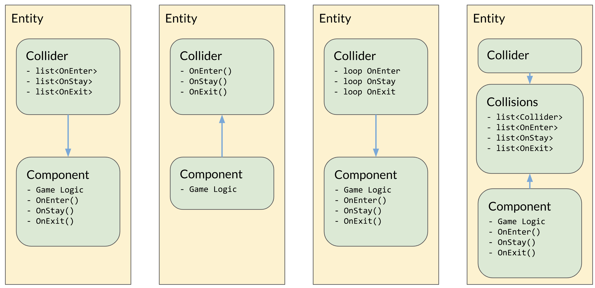

# A Real Game Engine

## Byte-Sized Updates

*   [Collisions](#collisions): Collision system is taking form, and the most basic intersection tests have been implemented, but there is still a lot of work to be done.
*   [Networking](#networking): Tons of things happened, including user-defined network messages, a new static initialization system, and network IDs for synchronizing objects across the network.
*   [Serialization](#serialization): We discuss the state of serialization within our engine, and some problems we've faced with it.
*   [First Game](#first-game): We made a game with our engine and it's not crashing and it's not dropping frames and it's fun to play!


## Collisions

Collisions happen when an object touches, or intersects, another object. But bear in mind, there is a distinction between collisions and physics; physics is the interaction and reaction of objects by applying forces, such as gravity. Collisions are typically used in a physics system, but the opposite isn't true, so when books or developers mention a physics system they typically mean a physics-collision system. There is mostly no need to develop a physics engine nowadays (coming from the ones developing an engine—ironic, right?), since even AAA companies are using 3rd parties like [Havok](https://www.havok.com/), [PhysX](https://developer.nvidia.com/gameworks-physx-overview), [Bullet3D](https://github.com/bulletphysics/bullet3), and [ODE](https://www.ode.org/). 

In our target game, we only need some basic collision detection but don't need physics. Also, since physics are fairly computationally expensive and don't play well with networking, we decided to only implement collision detection in our engine.

The cases in our game which need collisions are: player's bullets hitting enemies (may instantly hit or have some travel time), enemies attacking the player, and walling in the player. The responsibilities of our collision system then take shape from those features.We need detecting collisions between colliders of primitive shapes (sphere, box, and capsules), raycasting against colliders in the scene,  collision callbacks for enter, stay, and exit, and collision-solving (determining where to place objects when they have collided). 

The collision-intersections for primitive shapes is a mostly solved-science within the games industry, and they cover most if not all use cases. And the primitive shapes of spheres, boxes, and capsules cover most game simulation needs pretty well, and very rarely would someone need a more advanced collider shape. The capsule may stand out since it isn't a primitive shape in some other contexts, such as computer graphics, but games usually include it because it wraps a humanoid character much more cleanly than a sphere or box would.

The way our system was developed is similar to audio, in which there is a component class `Collider` that gets attached to entities, and a module class `CollisionsModule` which does management. The `Collider` class is just an abstract class that holds data and helper functions, and the actual colliders are `BoxCollider`, `SphereCollider`, and `CapsuleCollider`, which each contain three things:


*   Parameters that define the shape
    *   For debug only: Update methods to draw the wireframe shape of the object
*   Raycast method, since raycasting against different shapes is different
*   A helper method for the intersection tests

The actual intersection tests are on the `CollisionsModule` because an intersection test requires 2 colliders, which could be of differing types, so putting detection code on colliders would result in duplicating code in both colliders or letting one collider hold the method and the other call that method. Neither of those options seem clean or logical, so we took the data-oriented approach where the components only hold the data and the `CollisionsModule` holds all intersections tests. The intersection tests of primitives are fairly straightforward vector math, so we aren't going to try to explain that here. The most valuable resource on this subject was _[Real-Time Collision Detection by Christer Ericson](https://realtimecollisiondetection.net/)_, the book covers collisions much better than we can ever do. Some of our takeaways from it are:


*   Box intersection tests in general are harder to understand than spheres or capsules
*   Box-Capsule intersection test aren't simple, and at the time of publishing is the only test we have yet to complete (hopefully next week we'll have something for it...)

Back to the `CollisionsModule`, again at the time of writing we are taking a naive approach to collision testing, which is to have an array of `Collider`s check against all other colliders in the array, and that ends up as an `O(n^2)` approach. We have a slight speedup by only checking dynamic entities against the static and other dynamic entities, but this speedup is probably negligible when compared to using a proper data structure for holding colliders, like a dynamic bounding volume tree (DBVT, see chapter 6 of the above book for details). The DBVT is a balanced tree that holds some primitive type, either axis-aligned bounding boxes or bounding spheres, that encompasses all elements held in the tree. As the tree is constructed, the parents expand to encompass its children and only the leaves are actual elements inserted into the tree. The typical balancing heuristic[^3829] is based on increasing the surface area of the parent as little as possible. It can also be based on volume. An example BVT is constructed below. 


[^3829]: A **heuristic** is a technique for solving a problem more quickly, often utilized in optimization problems for computer science.


### Speeding it Up

Constructing a tree allows us to split collision detection into multiple phases, rather than just iterating over the entire list. In the most basic cases you only have one phase—the narrow phase—and in the next step you'd have a broad phase and narrow phase. The narrow phase is checking individual colliders for intersection, such as checking if a sphere and capsule are colliding. The broad phase is used to pare down the number of objects to do collision tests with by adding more intersection tests.

> Wait what, more checks?

Kind of. By walking the tree and checking for collisions against each node (i.e. a group of collisions), it can be determined which nodes to check against. As we haven't implemented this yet, we won't try to explain too much more of the implementation. You'll have to come back next week to find out how we did it!


### Sending Collision Events

The main discussion our team had regarding the collision system was about how a game developer would be notified about the event of a collision. We knew we wanted to have callbacks for collision enter/stay/exit that could be on any component, but once the collision system has detected the collision, how do all the collision events get called? In addition, how do we avoid performing intersection tests on colliders attached to the same entities? There were a few solutions that we came up with, but none were perfect. 

One option was to have collision callback lists on each collider, and when the collider intersects with another, its callback list is iterated through and called. This allows for any component on any entity (including the collider's children) to subscribe to the collision callbacks, but that doesn't fix the problem of two colliders on the same object. It actually makes things slightly more confusing because now tracking which callback is called could become difficult, because it could be anything in the scene, not just the collider entity or its children. In addition, if an entity has two colliders, which list should other components subscribe to? Should it be both? Or just the first? It isn't clear.

The next option solves one of these issues by having the collision callbacks be functions on the colliders themselves, so tracking bugs would be relatively straightforward. However, this is far too limiting and would cause tight coupling of the collider and other game logic.

A third option would be that when a collision callback event is to occur, we loop through all components and call their collision callbacks. This is very performance-heavy because we would need to get all components currently on the entity and call the collision functions. The collision function would be declared virtual in the base `Component` class, so regardless of whether the component implements them, they would be called. There are some things we could do to stop this from being such a performance hit, similar to `NEEDS_UPDATE` in `Entity`.

The final option would be to have a `Collisions` component which holds a list of colliders on the entity and a list of collision callbacks. Other components could then subscribe to the `Collisions` components list and the callback would be called for intersection of any collider within its list. This forces the addition of an additional component which ends up only being a container for lists, so it's not quite ideal. It also has the same problem as the first solution of allowing any entity to add to the list.



We don't have a solution that we are confident in picking yet, and there is probably a better solution out there that might be a combination of these. Next week will talk about what we actually selected and why. 

No matter how we decide to do the collision callbacks or walk through the tree, the collision-intersection tests still need to occur. Here is our first test by looping over all the colliders in a vector:

<div class="video-wrapper">
<video playsinline autoplay muted loop>
  <source src="../../images/blogs/week-7/box-collision.webm" type="video/webm">
Your browser does not support the video tag.
</video>
</div>

You'll probably notice the colliders remain red even after the colliders are no longer intersecting. This is because, at the time, there was no way to determine whether the colliders had exited yet; that required knowing they had collided before and were colliding the last frame. The solution to this is to have a collision pair set, where the IDs of the colliders (just the index in the vector at this point) are hashed into a set. It is important the hash ignores the order, since a collision of entity A with entity B is identical to a collision of entity B with entity A, so we can avoid doubling our collision checks. With a simple unordered set of pairs and the intersection test for most (excluding box-capsule), you'll get a result like this:

<div class="video-wrapper">
<video playsinline autoplay muted loop>
  <source src="../../images/blogs/week-7/collisions-test.webm" type="video/webm">
Your browser does not support the video tag.
</video>
</div>

There is still obviously a lot to do with the collision system such as testing raycasts and fixing the box-capsule intersections. More to come next week!


## Networking

This has been a big week for the network! And this time, it's not from refactoring our memory allocators! (In fact, we haven't switched `NetworkingModule` over to using our free list allocator yet like we said we would two weeks ago, so it's definitely not that)

To test our network previously, our messaging system was hard-coded into the engine loop. We didn't think much of this when we wrote it, but we were forced to take another look at it when designing a generic network message system that a game developer could use with our engine, and this is what we found:

``` cpp
void NetworkingModule::ProcessClientToServerMessages(int clientIdx) {
  const int channelIdx = 0;
  for (;;) {
    Message* message = server->ReceiveMessage(clientIdx, channelIdx);

    if (!message) {
      break;
    }

    switch (message->GetType()) {
      case HANDLE_MESSAGE: {
        // … more code here ...
      } break;
      case STRING_MESSAGE: {
        // … more code here ...
      } break;
    }

    server->ReleaseMessage(clientIdx, message);
  }
}
```

As if this wasn't bad enough, in order to utilize these messages, the game programmer would need to fill out entries in an object factory[^28392] using some macros like the following (which also is not exposed to the game developer, being in our engine and all):

``` cpp
MESSAGE_FACTORY_START(IsettaMessageFactory, NUM_MESSAGE_TYPES);
DECLARE_MESSAGE_TYPE(HANDLE_MESSAGE, HandleMessage);
DECLARE_MESSAGE_TYPE(STRING_MESSAGE, StringMessage);
MESSAGE_FACTORY_FINISH();
```

It feels like we were thinking the game developer could just use our crappy generalized network messages for any of their networking needs! Unless the game programmers had access to our engine code, this would be impossible to work with (and even if they did have access to it, there _has_ to be a more appropriate way to design network messages!). The first thing that we needed to do was to abstract out our messaging system so that someone could still use it without writing code directly into our `NetworkingModule` class.

[^28392]: An **object factory** is a programming pattern where you decouple object creation and destruction with the actual usage of the object. An object factory typically creates objects based on passed parameters, which you would then receive and use.

### The Way Messages Are Made

The basic problem we face is that we need to add references to each of our message types to some message object factory. There are a few other problems that we need to solve out of the gate as well:

1.  These message types also need callback functions for the client and the server that get run when a message is received.
1.  The memory used to instantiate the message objects needs to be managed by our low-level network library.
1.  The message object factory needs to know the total number of message types that it can send. This is so that we can send the minimum number of bits possible for encoding the message types inside of the message packets.

Number 1 is fairly straightforward as far as C++ is concerned, since we just need to pass a function pointer around wherever we have to deal with messages. Number 2 is also straightforward because our networking library, [yojimbo](https://github.com/networkprotocol/yojimbo/), already has a standard for allocating its memory, which we can just use when we instantiate a message object. So as you might guess, Number 3 is the real issue here.

If we were making a single game with our code and we maintained access to all of the source code, Number 3 wouldn't be a big deal.  We would probably handle it for quite some time in the same way we were originally handling it by hardcoding the message types in our message object factory, which would guarantee the number of messages we'll be sending. However, we're not just making one game with this code, and more importantly, we're trying to create a separation between the user code (a.k.a. game code) and the actual engine code, but good network messages tend to be highly customized and optimized for the relevant game's specific needs, and that can only happen if the game developer can create their own message objects. Creating custom message objects isn't a difficult problem in and of itself either if you utilize inheritance and typecasting[^352252], but the custom message objects need to be known before we initialize our message factory, which happens during the initialization of our `NetworkingModule`.

[^352252]: **Typecasting**, also known as **type conversion**, is a method of changing one data type to another. It helps ensure that variables are processed correctly by functions, but can also be dangerous with the way they handle the conversion.

Our solution: A little bit of "macro magic." Macros in C++ are very powerful tools, and one of the things that they excel at is automating boilerplate code[^3954920]. The `MESSAGE_FACTORY_START` macros above are an example of that. But the question remains, how do you get a developer's code to be run by _your_ code? Macros can't exactly take code from some part of code and inject it into something else. Or can they?

[^3954920]: **Boilerplate code** is a section of code that has to be included in many places with little to no alteration.

Well, no, they can't. Macros are just named fragments of code that expand at compile time. However, the C language's love of pointers _does_ allow us to essentially "inject" user code (functions, really) into our own code, it just tends to be convoluted and require a lot of copied code. And hiding all of that is what macros are good at!


### RPCs

Before we go any further, let's make sure everyone's caught up on the newest lingo. In real-time networking, you have two basic types of networking: networked data and networked functions. Networked data is objects and data primitives that you sync across a network; one example of networked data would be an object's position being simulated by the server and sent out to every client. This data is much more appropriate for unreliable streamed network data because we can typically just forget about old, lost packets and take the newest ones as ground truth.

Networked functions are also known as _remote procedure calls_, or _RPCs_. An RPC function is effectively just an integer handle and some data that is sent once from client to server or server to client, and once the receiver gets the message, they run a function that corresponds to the integer handle using the data that was sent as parameters. This is easier to keep track of in games because you can define the processing on either side of the delivery chain and you get to call it as frequently or infrequently as you want. However, you also have to be more careful about this data. Obviously if you lose the packets of an RPC call, you either need those packets to get sent again or you're losing out on whatever the other side was trying to tell you. An RPC is usually something like a "pause menu" event in a multiplayer game like _Super Smash Bros._ When one person pauses, the other screens also pause, but this is obviously a one-time event and not some synced variable (although it probably could be!).

On the Isetta Engine team, we had a lengthy discussion about what we should use in our engine. These two types of networking aren't exclusive in any way, but with our inexperience with network programming, we wanted to ground ourselves with one implementation before extending into more use cases. The side that eventually won out was the RPC methods because RPCs can effectively emulate synced variables, just with some runtime and network bandwidth wasted, and RPCs are also a more straightforward API to design than a serialization standard that game developers would need to abide by in our engine!


### First Pass at RPC Messages

The following implementation of RPC networked messages draws heavily from Tamás Szelei's blog [Emulating the static initialization blocks of Java in C++](http://szelei.me/cpp-static-init-block/), so if you're interested in the idea feel free to take a peek at his article (we also go beyond this implementation in our second pass similarly to how our [LevelManager](https://github.com/Isetta-Team/Isetta-Engine/blob/9ff4a996d6da5e382f48b1b4b17e029c7be004ac/Isetta/IsettaEngine/Scene/LevelManager.h) now handles static initialization).

The main idea is that we can leverage C++'s `static` keyword along with a "registry" class to register our message types to the object factory at startup. If you do it right, this can be very effective, but the first implementation we landed on was pretty naive and didn't help very much. We created a macro for starting and ending a message object declaration, and inside of that macro we also packaged a special static "helper" class:

``` cpp
#define RPC_START(MessageClass)                  \
  class MessageClass : public Message {          \
   private:                                      \
    static MessageClass* Create(void* memory) {  \
      return new (memory) MessageClass();        \
    }                                            \
    friend class RPCMessageFactory;              \
    static RPCRegistryHelper MessageClass##_RPCRegistryHelper;
  ;
```

The `RPCRegistryHelper` is a class that registers a given message type's information when its constructor is called. ...if you're at all familiar with C++, then you probably know that these static objects can't just be declared—they need to be initialized. And the way that you do _that_ is to define that variable somewhere in some other code, perhaps in `NetworkingModule`'s `StartUp` function maybe? In any case, we still have what should be external, user-defined code within our engine code at the end of the day, so more work will need to be done on that.

Obviously this only got us halfway there as far as functionality goes, too.  If we're sending RPC message objects, then we also need to define RPC message functions to be run when the objects are received! Just like with the object type declaration macro, these macros essentially just define a name that can be used throughout the code:

``` cpp
#define RPC_CLIENT_FUNC                                      \
 public:                                                     \
   static void RpcClient(Client* client, Message* message)   \
 #define RPC_SERVER_FUNC                                     \
 public:                                                     \
  static void RpcServer(int clientIdx, Server* server,       \
                        Message* message)                    \
#define RPC_MESSAGE_FINISH(MessageClass, Tag)                \
 public:                                                     \
  VIRTUAL_SERIALIZE_FUNCTIONS();                             \
  }                                                          \
  ; 

 #define RPC_MESSAGE_INIT(MessageClass, Tag)           \
  NetworkRegistry::RegisterMessageType(                \
      sizeof(MessageClass), MessageClass::Create, Tag, \
      MessageClass::RpcClient, MessageClass::RpcServer);
```

With that, we technically had an RPC message system running, even if it still required a bit much with jumping through hoops. Once a message class had been defined like `HandleMessage`, the user could then generate those messages by calling a function on the `NetworkManager` and giving it the appropriate string tag, which in the case of `HandleMessage` was `"HNDL"`. With the generated message in-hand, the user can then populate its data however they like then send it on its merry way through the `NetworkManager`—and on the other side of the network, someone would receive that message and run a function defined inside of the message class itself that has no scoping and no parameters! Sounds useful, huh?


### Second Pass at RPC Messages

With what we had implemented essentially enforcing the use of global variables and poor scoping, we knew we had to do something better. There were several places for us to improve upon, but the first was simple: Why in the world did we need a `NetworkRegistry` static class and a `NetworkManager` static class? It turns out, there is no reason! We had originally implemented the `NetworkRegistry` as a globally accessible form of using messages, but the `NetworkManager` already effectively serves that purpose, so we just went ahead and combined those two things.

> (It was also at around this time that one of our developers refactored our codebase to use multiple projects, such as IsettaEngine, IsettaTestbed, and IsettaTest. Turns out, this can be a massive headache for anyone who was changing code when this happens! It really messed with our git commits and was an overall bad time. Would not recommend.)

Another improvement that we strove to get this time around was an actually usable message callback system. The previous one forced the developer to pair the functions that would be run when the RPC message object was received with the actual class of the message object itself, which obviously has very limited capability. Our immediate solution was to make a subscription-based callback system, much like our how `Input` class handles callback functions. Any message that is defined would get its own associated list of function pointers, and anybody in the world (who has the correct function parameters) can add their own function to that list. When that message object is received, every function in that callback list is called using that message object's data.

This method does have a few drawbacks. Namely, you get more overhead either from having to check at runtime inside your callback functions whether you really want to be run due to a particular message that was received, or you get more overhead from creating more message objects that would be linked to sparser sets of callback functions. You also need to keep track of integer handles for every function that you link to the message objects, otherwise you won't be able to unsubscribe functions. However, as you might also imagine, this is an extremely user-friendly way of defining callback functions, and its usable anywhere in our code if you know the corresponding string tag! (Like `"HNDL"` for `HandleMessage` from before)

To contrast the macros showed earlier that generate the singular message callback functions, this is an example of how a user might register a callback function at this point in development:

``` cpp
 exampleClientHandleId = NetworkManager::RegisterClientCallback(
      "HNDL", [](Message* message) {
        HandleMessage* handleMessage = static_cast<HandleMessage*>(message);
        // … use the handle somehow ...
      });
   exampleServerHandleId = NetworkManager::RegisterServerCallback(
      "HNDL", [](int clientIdx, Message* message) {
        HandleMessage* handleMessage =
            reinterpret_cast<HandleMessage*>(message);
        // … use the handle somehow ...
         NetworkManager::SendAllMessageFromServer("HNDL", handleMessage);
      });
```

Isn't that so much more refreshing? Also, since we're using C++ lambda functions for registering the callbacks, we can include any scoping that we want to be used by the function as well. So even if our only input parameter is essentially the message object itself, we can still influence the world outside of that callback function's scope!


#### Aside on Message::Copy

The `NetworkManager::RegisterServerCallback` example shows another cool feature that we implemented at this point. Before now, you would have to iterate through every single client and manually send them a message if you created a server callback function whose message you wanted to broadcast to all clients. This was sort of okay when the function was tied to the message object, but now that the functions can be defined anywhere, it gets a little more awkward to have to know about the individual clients that we're sending to. So we implemented a "SendToAll" type function instead, but we ran into an issue with our networking library: Every message that gets sent from the server to a client needs to be generated _specifically for that client_. It's wasteful, but it also allows us to track whether or not our messages have been received (which can be important!). But that was making message objects difficult to broadcast because we couldn't just send out the exact same message we received, we would have to copy its data to a bunch of new message objects and send those instead!

And so our solution was to extend the requirements of an RPC message object. Now, not only do you need to define a serialization function, but you also need to define a _copy_ function that can fill out its own data based on another message of the same type. With that one quick addition, we can now hide anything to do with connected clients or client numbers from the game developer!


### Network Identities

So RPC networking is effectively implemented, what else is there even to do? We basically have everything we need, right?

Not quite! Although RPC messages can account for most of the functionality of our engine (although we probably don't want to use them for _everything_), there's one more very important piece that we need before this can actually be utilized: _network identities._ A _network identity_ is an ID that can be attached to individual objects that will be correctly mapped across the network to the corresponding object on the other client and server machines. Typically the way that game programmers reference other objects is via their pointers, which works fine and dandy when you're on a single machine, but do you think those pointers will conveniently line up on someone else's computer? Without these IDs, the game would have no way of directing its message data to the correct objects!

Now technically this is something that could be implemented on the game level and not the engine level if we stopped right here and only left our networking system as a bunch of RPCs, but we actually do need to have at least a networked transform in order to keep our characters in sync with one another on people's individual computers, and that's impossible to do without some sort of identifier that will point the transform data to the correct object. Fortunately, we've recently built up our component system and tested it out in the demo game, so we can implement our `NetworkIdentity` class as a component that will be held by individual game objects (or "entities") within the game. This way, the game developer can specify which objects in their game they want to have synced across the network so that they don't have to waste a bunch of networking bandwidth keeping a bunch of immobile, uninteresting things synced up with each other.

Currently, the `NetworkIdentity` component is pretty much just a wrapper around some `NetworkManager` functionality that generates an identifier and maps it to the component that asked for it, but because we're developing a game engine and everything needs to be abstracted _just enough_ to annoy the programming team, we also want the `NetworkIdentity` component to dictate the sync rate and authorities of the networked data that is associated with it. This will be more important when we talk about networked transforms though, so we'll leave that discussion for another day. 


### Testing It All Out

So now that we've mapped out a pretty robust system for sending networked messages, you can imagine our excitement to see some synced behavior between two computers across a network. When it came time to test, however, we faced a frustrating bug. For some reason the network IDs would not sync up! We thoroughly vetted the rest of our serialized data and saw that all of that was being correctly sent, but it seemed the network ID would never be properly sent from the client. With even more digging, we discovered that the ID _was_ being properly sent from the client. So what in the world was happening between the two computers?

As it turns out, we were storing the received network ID in the wrong place. The network IDs that we've implemented are unsigned integers for obvious reasons, but we don't have a serialization function for unsigned integers and the developer here was too lazy to implement that. So instead, we casted the unsigned integer to an integer and passed that to be serialized. The following is the macro from our networking library yojimbo that we use for serializing integers:

``` cpp

int signedNetId = static_cast<int>(netId);

serialize_int(stream, signedNetId, 0, 256);

```

This expands to something like this:

``` cpp

#define serialize_int(stream, value, min, max)   \
  do {                                                   \
    yojimbo_assert(min < max);                           \
    int32_t int32_value = 0;                             \
    if (Stream::IsWriting) {                             \
      yojimbo_assert(int64_t(value) >= int64_t(min));    \
      yojimbo_assert(int64_t(value) <= int64_t(max));    \
      int32_value = (int32_t)value;                      \
    }                                                    \
    if (!stream->SerializeInteger(int32_value, min, max)) {   \
      return false;                                      \
    }                                                    \
    if (Stream::IsReading) {                             \
      value = int32_value;                               \
      if (int64_t(value) < int64_t(min) || int64_t(value) > int64_t(max)) {  \
        return false;                                    \
      }                                                  \
    }                                                    \
  } while (0)

```

Depending on whether we're reading or writing from message data, the value either gets read or written to the variable that we're passing to the macro. Which means that, when we're reading from the stream (i.e. receiving a message), we write that data into the temporary `signedNetId` variable! And our `netId` variable is left at its initial value, 0.

Acknowledging that we're very likely not to face the problem of too many network IDs, we changed our unsigned integer to a signed integer and left it at that. If we need to expand it to be unsigned, we can always write a serialize function.

Oh, and one more bug popped up that we should note: As we alluded to above, each message object declaration requires a `Serialize` function. This function is where that `serialize_int` macro example comes from and is also what is used by yojimbo to generally serialize any subclass of its `Message` class. Well, one thing that we forgot when implementing the `NetworkIdentity` test messages was that _you must return true at the end of the _`Serialize`_ function._ That's how yojimbo knows that the serialization succeeded. Unfortunately, the macro makes forgetting this piece of information non-fatal to the compile process, but then whenever you try to send a message that doesn't return true, your client will disconnect! So this is an incredibly important piece of tribal knowledge that we have to document somewhere to keep all of our future developers from tearing their hair out at our network messaging system.


### ...And a Third Pass at RPC Messages

Oh, did you think we were done? We're just getting started! (Just kidding, don't worry, you're in the home stretch!)

So after we finished the pre-code review version of our networking system, we had a bad taste left in our mouth. Why should the developer have to remember some weird string tag in order to send messages of a particular type, like `"HNDL"`? And what happens if we have conflicting string tags or need longer strings? Well, as it turns out, we already utilize a system similar to this tagging but by using actual _object types_ somewhere else in the code: Our component system!

Specifically, inside of [Entity.h](https://github.com/Isetta-Team/Isetta-Engine/blob/7cbc43d4b3df5cea830ceacc3c58724685aa5ab7/Isetta/IsettaEngine/Scene/Entity.h) we have a vector of component types that we use for checking whether or not the current entity has a component that's requested using the `GetComponent` function. Since the function is a template function, it can utilize C++'s `std::type_index` class which essentially enumerates the classes. By a similar method, we can just enumerate our user-defined messages by their type if we turn all of our message-based functions into template functions[^290252]!

[^290252]: **Function templates** are functions definitions that, at compile time, generate individual function definitions for any types used with the template. This can be very useful for cutting out duplicate code, but greatly increases compile time and code size.

Now, if you've watched any of Mike Acton's talks, you'll probably have a critical eye of templates. And we acknowledge that they do drive up compile time and wreck iteration speed, but in such a short notice, they can be a nice step around a lot of code that could be much harder to maintain. And because we're using it, we can get rid of our gross string tag method and do a very simple type check:

``` cpp
template <typename T>
int NetworkManager::GetMessageTypeId() {
  return typeMap[std::type_index(typeid(T))];
}

```

So clean! This also gives us the added benefit of knowing our message types for several of the other message-based functions. Some of them already perform casts on the messages in order to access their data, and this would let us conveniently skip that step.


#### Static Initialization 2.0

We're not done quite with the networking yet—hang in there! There's still one more undesirable quality to our RPC message creation system. Remember the "static initialization" solution from before? Well, that technique hardly helps since the game developer is still required to initialize the static variables _somewhere_, and forgetting to do so can lead to a rabbit hole of debugging.

Fortunately for us, we've already used an ever better system elsewhere in our code. In [LevelManager.h](https://github.com/Isetta-Team/Isetta-Engine/blob/7cbc43d4b3df5cea830ceacc3c58724685aa5ab7/Isetta/IsettaEngine/Scene/LevelManager.h), we define a static boolean variable whose initialization is also in the header file but is guarded by being a template function! So we don't have to worry about a multiple-definition error but we can also hide away the registration process from the game developer. You can read more about this technique in the section [Template Black Magic!](https://isetta.io/blogs/week-6/#template-black-magic) of our Week 6 blog.


### Making a Level

As a nice bow to wrap around this whole week of intense networking development, we also took all of our networking code out of the engine loop (where it was hard-coded) and put it into [NetworkLevel.cpp](https://github.com/Isetta-Team/Isetta-Engine/blob/44a5c12abc6e03b6a3f6cc22540bc2a831634ad9/Isetta/IsettaEngine/Custom/NetworkLevel.cpp). In doing this, we were able to test a complete separation between the engine's networking logic and the game's, and guess what? It works! Check out that spawning and despawning synced up!

<div class="video-wrapper">
<video playsinline autoplay muted loop>
  <source src="../../images/blogs/week-7/network_spawning.webm" type="video/webm">
Your browser does not support the video tag.
</video>
</div>
*This trippy zombie dance experience brought to you by the devs being too lazy to space out the spawns.*

That's it for this week! It might seem like a lot, but really we only worked through the fundamentals of a good networking system. In the next week or two, we will be introducing networked transforms into our system, which will let us have legitimate multiplayer going in our games!


## Serialization

We realized during the writing of the networking section above that we haven't discussed serialization at all yet. Part of the reason for that is because we haven't really done any serialization ourselves; for the networking, we're simply using the networking library [yojimbo](https://github.com/networkprotocol/yojimbo/)'s own serialization functions, and beyond that we haven't really needed serialization because we're writing our game levels in C++ instead of encoded files.

Serialization is the process of taking some object from our program into a stream of bytes that can be written somewhere, whether it's a file, a database, or even a network packet. It's a very important subject when looking at the big picture for game engines. It's not discussed very often because it's pretty disconnected from the game side of the engine, but a game engine's job is to move a lot of data through itself and process that data in some way. And when we say a lot, we mean _a lot_.

Without serialization, your game engine would be at the whim of whatever other software saves out your resource files, and you would probably only write out simple text files that take ages to read and waste a lot of space.

That being said, serialization itself is a difficult feature to tackle. How do you generate the serialized data in the first place (especially if you don't have good reflection data like in C++)? How do you guarantee backwards compatibility with the serialization, or do you even have it at all? These are all questions that we completely avoided by using big 3rd party libraries for things like audio and graphics! And for the time being, we don't have to worry about serialization with our .cpp level files, so we won't worry about it.

If you're interested in the topic, [Jeff Preshing](https://preshing.com/20171218/how-to-write-your-own-cpp-game-engine/) has a good introduction to the topic including links to several good resources to learn from.


### Serializing Our Own Data

Our plan is to not serialize our level data, but we were still interested in serializing our basic data types to avoid rewriting code, such as for Vector3 and Matrix4x4. The main thing that this serialization would be used for (i.e. the only thing it would be used for) is networking, so we thought we could utilize yojimbo's `serialize_object` macro and write `Serialize` functions for each of our data containers that could then be sent across the network.

But there's one big problem that we hit. The `Serialize` function used by yojimbo must be templated or else it won't work. Why is that an issue? Aren't we using a bunch of templates already? Well, the problem isn't the template itself per se—it's the fact that a templated function must be defined inside of the header file. This means that, if we want to serialize a single class with yojimbo, we have to include the entire 6,000 lines of code in yojimbo.h to utilize the serialization macros. And including that much _network_ code in our _math_ data structures just didn't seem like a good idea.

So for the time being, we'll leave serializing the data types to the game developer! We wish we could do more there, but it's currently not worth the time investment.


## First Game

A major milestone is that we made a real game with our engine! It's running smoothly at ~60 fps with sound, gamepad input, models, lighting, textures, animation blending, movement, score counting, tweakable variables, an in-game entity inspector… All the beautiful things you can imagine in a game engine. The game is also built in a whole new project! That means we can now bundle our entire engine into a DLL[^669403] and pass it around for people to use. How exciting!

[^669403]: A **DLL** is a dynamic-linked library which is Microsoft shared library concept which can be transported around easier than a project and contains information about the compiled project.

Now, let's calm down and talk about how we did it. 

First, we built the entire engine into a DLL. Visual Studio is very helpful with this process by providing this [document](https://docs.microsoft.com/en-us/cpp/build/walkthrough-creating-and-using-a-dynamic-link-library-cpp?view=vs-2017) which covers the process. Basically, we just needed to add a new configuration, set its format from `.exe` to `.dll`, and add a bunch of modifiers like `__declspec(dllexport)` and `__declspec(dllimport)` to the classes we want to export and import to the game project. We made a macro for this, so we can easily get different behavior in different environments:

``` cpp

#ifdef ISETTA_EXPORTS

#define ISETTA_API __declspec(dllexport)

#else

#define ISETTA_API __declspec(dllimport)

#endif

```

The tricky thing is, the game project needs not only the DLLs, but also the following (if you are not sure how to do any of these, please refer to the document linked above):


*   The header files in the engine. This allows the game project to include classes and functions from the engine and know what functionality they provide.
*   The [`.lib` files](https://docs.microsoft.com/en-us/cpp/build/reference/dot-lib-files-as-linker-input?view=vs-2017). They are generated together with the DLLs and tell the compiler where to find specific functions in the DLL.
*   The header files and `.lib` files from external libraries, if needed. We are currently including everything from external libraries, which is certainly not optimal. We will try to find the cleanest way to include them, and post the update in a future blog

If you see giant lists of "unresolved external symbols", don't panic! We had those too, so just check the above three things and make sure you have the appropriate ISETTA_API modifiers.

Second, we downloaded some assets from [Mixamo](https://www.mixamo.com/) and made some game assets with Blender (programmer art, yay!), and converted them into a format that our engine can read. Luckily, this step is also not very difficult—Horde3D comes with a ".dae to .geo converter"[^41235] that, apparently, convert `.dae` files to `.geo` files, which is the file format Horde3D needs. But there are still two tricky things with it:


*   The path to generated resource files still needs to be hard-coded into the game, so if the file structure changed, the game developer must remember to change those hard-coded value, too. Otherwise, the game will throw an exception.
*   The units used by different software could be different. For example, in Maya, 1 unit is 1 centimeter by default, and in our engine, 1 unit is 1 meter. If we don't change the scale before exporting, the models will be huge in our engine. This can be fixed by changing the default scale in Maya, or by manually setting the object's scale in the game. If you don't, you may get a _giant_ soldier, like we did:

<div class="video-wrapper">
<video playsinline autoplay muted loop>
  <source src="../../images/blogs/week-7/scale_problem_giant_soldier.webm" type="video/webm">
Your browser does not support the video tag.
</video>
</div>

By the way, if you pass some code to DLL-imported function to find resources, it will try to find the resources relative to the game project, not the project where the DLL is from. This is pretty obvious, but took us a while to make it clear.

[^41235]: The content pipeline of Horde3D is detailed on [this page](http://www.horde3d.org/docs/html/_contentpipe.html). Long story short, .dae, which stands for Digital Asset Exchange, is the file format that COLLADA (COLLAborative Design Activity) uses. COLLADA, in turn, supports portable representations for 3D assets. ".geo" is the file format that Horde3D uses to load in assets at runtime.

Third, we started making the actual game and found out a ton of bugs in the engine, and fixed/worked around them. This experience firmly states that, **making small test games is really a good way to test the engine**! Here are some bugs we found out:


*   `Entity::Destroy` is not working properly. It does call the `OnDestroy` functions, but the entity itself is not removed from the entity list of the scene after that (we had a TODO there but no one remembered to fix it). Therefore, the `OnDestroy` function is called again and again and again, and the entity is never really "destroyed".
    *   This also revealed another issue in our free list allocator. As the `OnDestroy` functions release memory in the free list allocator, when the same memory is freed the second time, our allocator would freak out and throw an exception. We improved our free list allocator to make it safer.
    *   To avoid this issue, we chose to not dynamically delete anything in the game. Instead, we pooled all of them.
*   The animation won't work correctly after turning the entity off and on again with `Entity::SetActive`. It's caused by our interface with Horde3d. We fixed it and it's working properly now, and we also added animation blending during the fixing process. You can see the version with broken animation [here](https://youtu.be/VYwG8cBHxb8).
*   As mentioned before, we had scaling problems with imported models, and we chose to set their scale in the game. This choice revealed a problem in our `Transform` class: when an entity's scale is small, calling `TranslateWorld` (the function that we use to move objects in world space) on the entity is very ineffective as the world translation is somehow affected by the object's local scale. We dug into the code and realized the reason is that when we were constructing the object's matrix from the local position, local rotation, and local scale, we applied local position before local scale. This would cause the local position to be "scaled" by local scale, which should not be. So we simply changed the order of constructing the matrix and it worked fine.

We also found out some missing features during the making of this game: 


*   When we were implementing our GUI module, we only created some interfaces with ImGUI and left out some other that we thought wouldn't be used. Well, it turned out we didn't perfectly predict what we need. When making this game, we wanted to tweak some values at runtime with in-game GUI, and a "float slider" would be the best option for that. However, we didn't have that in our GUI interface, so we went ahead and added it to our engine.
*   The list of audio files to be used in the game was hard-coded into the AudioModule. It's certainly not desirable and would **destroy** iteration time. So we moved that to the config file, thus allow specifying audio files to be used in the config.

Finally, we got the game working! Yay!

<div class="video-wrapper">
<iframe src="https://www.youtube.com/embed/Th-JUNuTtZ4" frameborder="0" allow="autoplay; encrypted-media" allowfullscreen></iframe>
</div>


## Patch Notes


### Editor

After making our transform and GUI system, we spent 20 minutes hacking together a "programmer UI" in-game editor that's capable of displaying entity hierarchy, transform information, component list, gizmo drawing, and has a "reset transform" button. Being able to see the list of entities and their information made it so much easier for us to debug the game and engine.


*Our simple in-game inspector*

### `FreeListAllocator` Alignment

When we were working on the networking system this week, we attached `NetworkIdentity` components to game objects to synchronize them across the network. After doing this twice, we would get a memory reference error inside of `FreeListAllocator`! The free list essentially tracks available nodes of memory in our own managed heap and tries to merge them if they're adjacent, so we looked into its allocation directly by stepping through the debugger to see what was going wrong. This is what we found:

``` cpp

// … node = a custom data structure containing a size and a pointer to the next node

  intptr_t rawAddress = reinterpret_cast<intptr_t>(node);
  rawAddress += headerSize;  // leave size for header
  intptr_t misAlignment = rawAddress & (alignment - 1);
  uint64_t adjustment = alignment - misAlignment;
  intptr_t alignedAddress = rawAddress + adjustment;

  size_t occupiedSize = headerSize + adjustment + size;
  intptr_t headerAddress = alignedAddress - headerSize;

  if (node->size >= occupiedSize + nodeSize) {
    // enough space to put a node here
    auto* header = new (reinterpret_cast<void*>(headerAddress))
        AllocHeader(occupiedSize, adjustment);

    InsertNodeAt(node, new (reinterpret_cast<void*>(alignedAddress + size)) Node(node->size - occupiedSize));
  } else // ...

```

The problem in this code stems from one spot: Where `auto* header` is allocated using `headerAddress`. If `headerAddress` happens to be only 8 bytes away from the `rawAddress` of `node`, then the `next` pointer of `node` will be overwritten by the new `header` allocation! (This is one of the problems you may face when you write your own memory allocation system!)


But when is `headerAddress` only 8 bytes away from `node`, especially when our default alignment is 16 bytes? The answer lies in where we started. If `node` happens to be misaligned, then the first block of code is _not_ actually aligning our next address, it only puts it 8 bytes after our address because it's "aligning"! To fix this, we can increase our adjustment so that it always "rounds up", so to speak. This can be done in a short math expression:

``` cpp
  uint64_t adjustment = alignment - misAlignment;
  adjustment += ((~alignment & adjustment) << 1);
  intptr_t alignedAddress = rawAddress + adjustment;

```

There, no memory errors!


### "Camera" vs. "CameraComponent"

Regarding our engine's naming conventions, the Isetta Team is usually pretty lax. But for our components, we decided to turn it up a notch and argue over which is better: "Camera" or "CameraComponent." It remained an unresolved debate because one of our programmers was out at an interview over a couple days, but when he came back, we decided on a compromise. The component should include the word "Component" when the name of the component itself is only one word (e.g. "CameraComponent"), and it should not include "Component" when it already contains more than one word (e.g. "NetworkIdentity").


## Coming Soon

Go check out our interview with [Amandine Coget](../interviews/AmandineCoget-interview.md), where we talk about the Frostbite engine, developing good usability, and the pros and cons of different UI models.

We also interviewed [Raymond Graham](../interviews/RaymondGraham-interview.md) ([@wadarass](https://twitter.com/wadarass)) this week, so expect his interview along with [Martin Middleton's](../interviews/MartinMiddleton-interview.md) and [Aras Pranckevicius's](../interviews/ArasPranckevicius-interview.md) ([@aras_p](https://twitter.com/aras_p)) in the coming weeks.


## [Resources](../resources.md)

From development we are acquiring a lot of great resources from where we learned certain topics, and as much as we try to synthesize things in our blogs you may be interested in the originals, which is why we have a page full of links for you to browse.


_Originally Published October 19, 2018._


<!-- GD2md-html version 1.0β13 -->


<br>

<!-- Begin MailChimp Signup Form -->
<link href="//cdn-images.mailchimp.com/embedcode/classic-10_7.css" rel="stylesheet" type="text/css">
<div id="mc_embed_signup" style="margin-top: -20px">
    <form action="https://isetta.us19.list-manage.com/subscribe/post?u=1d83cb806c55e205be26db856&amp;id=860c7d79cf" method="post" id="mc-embedded-subscribe-form" name="mc-embedded-subscribe-form" class="validate" target="_blank" novalidate>
        <div id="mc_embed_signup_scroll">
            <h3>Subscribe to our mailing list</h3>
            <p style="margin-bottom: -22px;">Get notifications about the upcoming blogs and interviews!</p>
            <br><br>
            <div class="mc-field-group">
                <label for="mce-EMAIL"> </label>
                <input type="email" placeholder="Email Address..." name="EMAIL" class="required email" id="mce-EMAIL">
            </div>
            <div id="mce-responses" class="clear">
                <div class="response" id="mce-error-response" style="display:none"></div>
                <div class="response" id="mce-success-response" style="display:none"></div>
            </div>
            <div style="position: absolute; left: -5000px;" aria-hidden="true">
                <input type="text" name="b_1d83cb806c55e205be26db856_860c7d79cf" tabindex="-1" value="">
            </div>
            <div class="clear" id="submit-button">
                <input type="submit" value="Subscribe" name="subscribe" id="mc-embedded-subscribe" class="button">
            </div>
        </div>
    </form>
</div>
<!--End mc_embed_signup-->