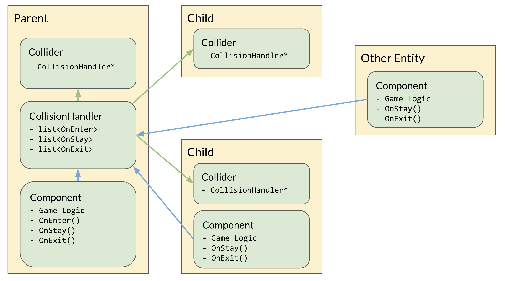

# Patching Holes

## Byte-Sized Updates

*   [Component Registry](#component-registry): To add component inheritance support, we added a component registration mechanism for the components to store their type hierarchy.
*   [Collisions](#collisions): Third week working with collisions and things seem to be wrapping up, main focus was on how to handle collision events when one occurs.


*You may not notice a difference from last week...as it turns out, high-level architecture diagrams aren't great at showing progress after the early stages of development!*

## Component Registry


### Why Do We Need a Component Registry?

When we were implementing the entity class, we saved the `std::type_index` for every component added to the entity by a array to allow the game developer to call `GetComponent<T>()` without dynamic casting the type each call (which is quite expensive). This meant that inside of an entity, we had two array to save the information for a component: an array for the `type_index` as mentioned, and another array for the pointers to the components themselves. 


When the game developer calls `GetComponent<T>`, the function first searches through the type index array to see if the array contains this specific type index. If so, it returns the corresponding component pointer (sharing the same index). However, it became problematic when we were implementing the collider components.

We are supporting multiple types of colliders, like `BoxCollider`, `SphereCollider`, and `CapsuleCollider`. Being different shapes, these colliders require different operations and calculations, but they have the same interface as colliders; they all have functions like `RayCast` or `CollisionCheck`. To avoid repeating ourselves, we created an abstract `Collider` component for the specific types of colliders to inherit from. For the same purpose, whenever we call `GetComponent<Collider>`, we also expect the function to return either a `BoxCollider`, a `SphereCollider` or a `CapsuleCollider` since they are all children classes of the `Collider` class. However, the `std::type_index` of those classes are different based on the fact that they are actually different classes. Thus, the `GetComponent<Collider>` function cannot find its corresponding type index from the type index array, since no exact `Collider`component is ever attached to the entity. This will happen for any type that inherits from another class of component. We tried to convince our collision programmer that this was fine, but he wasn't having it—we had to find a way to fix it.


### Approaching a Solution

After lengthy discussion, we decided that we want to make a similar system like the level registration. If you remember from [Template Black Magic! in Week 6](../week-6/#template-black-magic), we used a template with a static variable that calls a static register function to register the level into the engine so that the level could be loaded by name later. We wanted to use the same technique to save the components' hierarchy metadata before the engine is started. To do that, we need a key-value map[^8383] whose key is a type index of a component and the value is a list of type indices that indicate the subclass components (including itself) of the key component. We are using a linked list instead of an array here for two reasons: one, we don't need random access for the list, and two, we can simply use `push_front` to make sure the component itself is always the first one of its subcomponent list.

[^8383]: A **key-value map** (or a dictionary) is an abstract data type composed of a collection of (key, value) pairs. 


The registration process seems straightforward, since it's just adding the type index to the corresponding list. But how do we call the register function before the engine/game starts? Again, we wanted to make use of the static initialization phase.


#### First Try: Another Registration Pattern

```cpp
template <typename Curr, typename Base>
class ComponentRegistry {
 protected:
  static bool registered;
};

class MeshComponent: public Component, public ComponentRegistry<MeshComponent, Component> {
  static bool IsRegistered() { return registered; } // required
  ...
}

template <typename Curr, typename Base>
bool ComponentRegistry <Curr, Base>::registered =
  Component::Register(std::type_index{typeof(Curr)}, std::type_index{typeof(Base)});
```

Just like what we did for the level registration, we created a template to run the static initialization process. Each component inherited from the template will have a static `registered` variable which registers the component to the type hierarchy map. It works perfectly well with levels and most components. However, it breaks when a component is inheriting an existing component like this:

```cpp
class Collider: public Component, public ComponentRegistry<Collider, Component> {...}
class BoxCollider: public Component, public ComponentRegistry<BoxCollider, Collider> {...}
```

Yes, it can still register the type to the type hierarchy map, but the `BoxCollider` now contains two `registered` variables— one from its base class `Collider`, and one from the template class `ComponentRegistery<BoxCollider, Collider>`. There's no way to tell the compiler which is which, and this results in a compilation error!


#### Second Try: Manual Template Specialization

So let's recap the problem: Every template specialization has the same variable name, `registered`, and this leads to the problem of having an ambiguous symbol. Since we were using macros in level registration, why not utilize macros further to provide a unique variable name for each component? Or specifically, for each template specialization?

```cpp
#define CREATE_COMPONENT_BEGIN(NAME, BASE)                    \
  template <>                                                 \
  class ISETTA_API_DECLARE                                    \
      ComponentRegistry<class NAME, BASE> {                   \
   protected:                                                 \
    static bool NAME##Registered;                             \
  };                                                          \
  class ISETTA_API_DECLARE NAME                               \
      : public BASE,                                          \
        public ComponentRegistry<NAME, BASE> {                \
   protected:                                                 \
    static bool isRegistered() { return NAME##Registered; }   \
                                                              \
   private:

#define CREATE_COMPONENT_END(NAME, BASE)                                 \
  }                                                                      \
  ;                                                                      \
  bool ComponentRegistry<NAME, BASE>::NAME##Registered =                 \
      Component::RegisterComponent(std::type_index(typeid(NAME)),        \
                                   std::type_index(typeid(BASE)));
```

Now we are manually specializing the template and defining different `registered` variables with different names by macros. The ambiguous symbol issue should be all good and ironed out now.

But actually, it brought us another issue! When defining the value of the static variable of a fully specialized template, the definition statement [^9583] should actually be written in the .cpp file instead of the header file. However, this would requires game developers to write two different macros in two different files, which is easily forgettable and could cause quite a bit of headache if forgotten. So we had to find a way to keep the definition statement in the header file.

[^9583]: Since `typeid()` doesn't work with incomplete classes, we had to declare this function first in the class and define it after the component class is completed.


#### Third Try: Introducing "Dummy" Template Parameter

Since the problem is mainly caused by fully specialized templates, we thought, "What about adding a dummy parameter to keep the templates partially specialized?" As long as the template is not _fully_ specialized, the definition statement can be kept in the header file with the other macros!

```cpp
#define CREATE_COMPONENT_BEGIN(NAME, BASE)                    \
  template <typename Dummy>                                   \
  class ISETTA_API_DECLARE                                    \
      ComponentRegistry<class NAME, BASE, Dummy> {            \
   protected:                                                 \
    static bool NAME##Registered;                             \
  };                                                          \
  class ISETTA_API_DECLARE NAME                               \
      : public BASE,                                          \
        public ComponentRegistry<NAME, BASE, void> {          \
   protected:                                                 \
    static bool isRegistered() { return NAME##Registered; }   \
                                                              \
   private:

#define CREATE_COMPONENT_END(NAME, BASE)                                 \
  }                                                                      \
  ;                                                                      \
  template <typename Dummy>                                              \
  bool ComponentRegistry<NAME, BASE, Exclude, Dummy>::NAME##Registered = \
      Component::RegisterComponent(std::type_index(typeid(NAME)),        \
                                   std::type_index(typeid(BASE)));
```

This idea might just be stupid enough to work...and it does! With this trick, we can now declare a new component like this:

```cpp
CREATE_COMPONENT_BEGIN(GUIComponent, Component)
private:
...

public:
...

CREATE_COMPONENT_END(GUIComponent, Component)
```

As we move forward with our engine development, we're becoming more and more of C++ Magicians™!


## Collisions


### Collision Handling

So, as promised, we can provide an update on the collision system's development! Unfortunately, it isn't quite as exciting as what we promised [last week](week-7#collsions). We are still working on the BVTree (see last week for more details); since it's just an optimization (although a necessary one!), we put it off again this week to work on other bug fixes that were needed more immediately. The other decision we left from [last week](week-7#sending-collision-events) was how to handle the collisions once they happen, and we will be answering that this week.

The collisions system architecture that remains unchanged from last week is how we determine the event from collisions, i.e. the collision just began, it's continued, or it just ended. After the broad- and narrow-phase[^65] determine a intersection between colliders has occurred, the collision-pair is searched for in a hashed collision-set to determine whether the colliders just entered one another, are still intersecting from a previous frame, or, in the case the pair exists in the set but are no longer intersecting, the collision has ended. What wasn't clear from last week, however, was how the collision callbacks (on enter/stay/exit) were called in the respective event. For details on the options we considered, you can read [last week](week-7#sending-collision-events)'s blog, but our actual implementation now is a variation of having a collisions handler component. The collisions handler component, labeled `CollisionHandler`, holds the callbacks which other components can subscribe/unsubscribe from. Rather than the handler holding a list of collider pointers like suggested, the `Collider` component now holds a reference to the `CollisionHandler`. This is advantageous as compared to a list of colliders because, when checking intersections, the `CollisionModule` explicitly has `Collider` pointers, not `CollisionHandler` pointers. And in comparison with the solution proposed last week, where the list was publicly available for colliders to subscribe to, this system stops colliders that aren't on the same entity or its children from subscribing to the `CollisionHandler`. So no weird sibling-entity colliders. The `CollisionHandler`, when enabled, walks down the hierarchy tree looking for `Collider` and `CollisionHandler` components; when a `CollisionHandler` component is found, the depth-first search down that path of children is stopped, and in the case a `Collider` component is found, that collider's handler is assigned to be the collision handler that was just enabled. When the `CollisionHandler` is disabled, it walks up the tree to get a reference of some ancestor `CollisionHandler`, which is then assigned to the children colliders in the same fashion as we describe above for enabling.

[^65]: The **broad-phase** detection is performed by constructing a tree of simple primitives (either sphere or box) where the complex collider shapes are simplified into these shapes. Then iterating through these checks to determine if the simple shapes are colliding (this is a quicker calculation). The **narrow-phase** happens after the broad phase by checking the exact shape of the collider which are typically more complex shapes, such as capsules and object-bounding boxes (obb).

A couple of other decisions had to be made regarding the collision handling design, as well. When the `CollisionModule` is iterating through the list of colliders for intersection tests, it now needs to check the `CollisionHandler` for each collider because detecting collisions between colliders of the same handler seems like a bad day just waiting to happen! This also allows for child colliders to create a complex collision shape with only the basic primitives, which is a pretty neat benefit.

While writing about this topic, our team actually broke out into an in-depth discussion about the behaviour when a collider's ancestors are changed. In the case that an entity above the root `CollisionHandler` (the collision handler that the collider has reference to) in the scene hierarchy was moved, no additional behaviour is needed because the collider reference to the collision handler remains unchanged. But in the case the handler isn't moved but the collider is, the collider now holds a reference to an invalid handler, one not in its ancestor tree! To fix this, we have a callback event for when a parent is changed, `OnHierarchyChanged`, that the `Collider` components subscribe to. When that event is fired, each of the colliders walks up the hierarchy tree looking for a `CollisionHandler` to store a reference of. We even got some early optimizations going with this solution, too: this process can be short circuited by also looking at `Collider`s while we're walking up the tree and using their reference to the `CollisionHandler` instead. This system is also still in development because it is tied with the event-messaging system.




### Box-Capsule Collisions Will be the Death of Us

On another note, the box-capsule collision intersection test was iterated on this week. This particular test was by far the most complicated to rationalize in 3D, and is the scariest with regards to performance. All intersection tests were done geometrically rather than using an algorithm like GJK[^1324], which might have been a mistake on our part. Most of the intersection tests had readable/followable code, however some like box-box and box-capsule quickly became large and difficult to follow. By trying to brute-force the box-capsule test with geometry rather than with an algorithm (or maybe just a better understanding of the topic), we were only able to produce a intersection test that works when the capsule line-segment is perpendicular to at least one of the local axes of the box. If none of the three axes of the capsule line-segment are perpendicular to any of the local axes of the box, the test simply doesn't work. This was left as an exercise to the reader…well that's not really fair, but we decided that wasting additional time right now on this case isn't worth it, especially because we don't expect to have this case appear in our target game. It's pretty disappointing for us and you might write off this engine as unusable now (it took you _this_ long to figure that out?), but because of strict time commitment we have to keep moving. It mostly works (see below!) and will work for our game, because the show must go on.

[^1324]: Gilbert-Johnson-Keerthi (**GJK**) is a distance algorithm method of determing the minimum distance between convex sets. It is used heavily in collision detection systems. [Casey Muratori](https://twitter.com/cmuratori?ref_src=twsrc%5Egoogle%7Ctwcamp%5Eserp%7Ctwgr%5Eauthor) has a great blog on [Implementing GJK](https://caseymuratori.com/blog_0003).

<div class="video-wrapper">

<video playsinline autoplay muted loop>

 <source src="../../images/blogs/week-8/box-capsule.webm" type="video/webm">

Your browser does not support the video tag.

</video>

</div>

*This was when we finally got the capsule with 2 non-perpendicular axes working!*

<div class="video-wrapper">

<video playsinline autoplay muted loop>

 <source src="../../images/blogs/week-8/all-collisions.webm" type="video/webm">

Your browser does not support the video tag.

</video>

</div>


### Raycasting Functionality

The other system developed this week was raycasting. A benefit of doing this after the intersection testing was a lot of the code used in testing intersection was able to be reused for the raycasting system. Something that also arose from the raycasting system was the need of a way to convert a mouse click point (or any point on screen) to a ray, which got us sidetracked from actually adding in raycasting functionality! (Some `TODO`s for other features were also added to the `CameraComponent` that would be nice) This wasn't necessary in the basic sense, but it made testing the raycasting functionality much easier and is a nice feature that can be used in other places as well.

<div class="video-wrapper">

<video playsinline autoplay muted loop>

 <source src="../../images/blogs/week-8/raycasting.webm" type="video/webm">

Your browser does not support the video tag.

</video>

</div>


### Ignoring Collisions

The final feature we started working on this week regarding our collisions system was ignoring collisions and collision layers. Ignoring collisions was a straightforward addition to the `CollisionModule` by adding a hash set of collider pointers. The rationale of keeping the hash set on the `CollisionModule` versus the `Collider` components themselves was to avoid having to search on the components. Since we already have the pair, it is simpler to store on the module. We will also have a collision layer system used to allow groups of entities, or "layers", to ignore collisions of entities on another layer rather than having to specify and store collisions of all the other colliders. The actual implementation of layers is still in the works, so before we say too much more, we'll hold off for future weeks for additional updates.


### Wrap-up

This was the third week developing the collisions system, and the rationale to choose an existing collision/physics system is becoming more clear. This is a mentally complicated system which can have a serious impact on performance; it's not that just the math that has difficult and complicated parts, but the entire system that can be a complex mess (we are trying our best to avoid this). We can already tell that this system will require more profiling than other systems in the engine. We will be able to better tell once its integrated into our game—more to come in future weeks!


## "What [TODO](https://thatwritinglady.files.wordpress.com/2012/07/tongue-twisters1.pdf) to die today, at a minute or two 'til two"

Well, we are over halfway through the project and have no plans on slowing (even if we are a _little_). We were talking as a team about how we are leaving a lot of work behind to keep things moving forward, sticking with the motto: If we don't need it now, don't do it now. At some point, we are going to need to go back and revisit our `TODO`s and fix/clean things up as well as add that functionality because why not. Some `TODO`s are naturally getting resolved because we needed the functionality, whereas others, as you will see, aren't. We did a `grep`[^239402] for `TODO`s to see how much we are going to have to do later. Here are the stats:

[^239402]: **grep** is a command-line utility for searching plain-text data sets for lines that match a regular expression. Very useful for searching an entire codebase for certain things.


We also did some lines-of-code analysis for a recent presentation, and we have to say, the numbers aren't too shabby:


...well, this is if you also take in the external libraries. It looks a lot more like an actual engine when you consider this much code. Ours looks a little more like this:


There, that's a little more accurate. We have to admit, 15,000 lines of code isn't all that many for eight weeks, but what's more remarkable about this number is that _this is actually an appropriate amount for a legitimate game engine_. Like, one that could be used by an indie studio. A pretty significant chunk of what happens in commercial engines nowadays is external libraries and software, and there isn't an exception at the smaller scale. So if you're ever wondering if you should be "writing your own engine" when you want to make a game, or just go and use Unity again: Maybe give brewing one up a shot!


## Patch Notes


### Exiting the Engine Loop

Inside of our engine loop, we hard-code an input binding of the Escape key to setting an `isGameRunning` flag to `false`. This allows us to exit games by simply hitting the Escape key. However, this also means that if we remove the InputModule from our engine (or possibly even change it), our engine crashes immediately! (And more importantly, the game developer is stuck with an Escape key that exits their game)

We removed that hardcoding and obviously found ourselves unable to close any of our games. We anticipated that would happen. But what we didn't anticipate is that the we didn't have any interface for closing our games via the game developer code, and that's a bit of a problem. The solution was straightforward: Add some functionality that the game developer can use for shutting down the engine loop. But as programmers, it's often not the solution that we debate about—it's the implementation.

We had a heated debate about the architecture of our engine loop exit interface, in which we covered two options. Option #1 was to make `EngineLoop` a singleton with a twist; the singleton would not be given to anyone but the first thing that asked for it. Anything that requested the singleton after the first access would receive nothing, almost like a "first-come first-serve" methodology. Option #2 was to make `EngineLoop` a globally accessible singleton[^23842], but do validation checks against the functions being run like `Start` in order to prevent the user from double-starting the engine.

[^23842]: The **singleton pattern** is a software design pattern that restricts the instantiation of a class to one object. This is useful when exactly one object is needed to coordinate actions across the system.

To go beyond a simple static singleton class, we added another layer of separation to the problem. You see, our engine developers (i.e. us) need straight-to-the-source access to information about our engine loop. But our game developers (i.e. also us but with arbitrary restrictions) should only have a limited range of "engine-level" control, such as starting the entire engine and shutting it down. So following [Unity ](https://docs.unity3d.com/ScriptReference/Application.Quit.html)and [Unreal](http://api.unrealengine.com/INT/API/Runtime/Engine/Kismet/UKismetSystemLibrary/QuitGame/index.html)'s examples, we created a class `Application` that has static class functions for this game developer functionality. We then chose Option #2 for our `EngineLoop`'s implementation due to the fact that running a DLL's main function is much more annoying than just exposing some "start" function in that DLL's header files.


### Hunting Memory Leaks

Our project has had a small chunk of persistent memory leaks for the past couple of weeks. We never bothered to suss them out due to being too busy with other parts of the project, but recently we gained a bit of time to investigate the issue. Our most recent memory leak patch involved some new learnings about how our memory management system was freeing memory—that is, our memory allocator only _frees_ the memory you tell it to free, it does _not_ call the destructor. So anything in our system that allocates memory within itself needs to be destructed before the memory is freed, otherwise those inner memory allocations will never be released!

> This could have been fixed by making the memory freeing function a template function, but even in our template frenzy, we could recognize that that would balloon our compile time astronomically, so we decided to just be explicit about object destruction instead.

And so, we began our hunt for memory leaks as one typically does: by pulling systems out of our engine until a memory leak disappears! This was actually very effective to a point, and it even got us to realize that we had an insufficient engine exiting scheme, which you can [read above](#exiting-the-engine-loop). We found that upon exiting a level, the `Level` object was not getting destructed, and within that `Level` object, we also have a `levelRoot` object for the uppermost transform in the scene graph hierarchy that was also not getting destructed. That cleared up most of our memory leaks, but there were still a couple left.

Via more extracting of systems in our engine, we discovered that our networking module contained the rest of our memory leaks. The first chunk was straightforward to fix; we simply didn't destruct our custom networking allocators (used by our networking library) before shutting down `NetworkingModule`. But we still had 80 bytes of memory leak going on _somewhere_, and we couldn't find out where. Our code was clean, as far as we could tell.

Well, it actually was. The memory leak was found within our networking library [yojimbo](https://github.com/networkprotocol/yojimbo), and in the most ironic place possible: yojimbo has memory leak detection functionality, and enabling it caused the memory leak. That functionality has not been useful to us yet, and the fact that it actually caused a problem made it pretty easy to just disable it permanently and rely on our own devices. So we learned a pretty important lesson that day—the programmers behind your libraries aren't perfect either!

## Coming Soon

We just released our interview with [Aras Pranckevicius](../interviews/ArasPranckevicius-interview.md), where we had a great talk about the history and design of the Unity game engine.

This past week we interviewed with [Jeff Preshing](../interviews/JeffPreshing-interview.md) ([@wadarass](https://twitter.com/preshing) and talked about some key skills for engine developers, so keep your eye out for that and the other interviews coming soon.


## [Resources](../resources.md)

From development we are acquiring a lot of great resources from where we learned certain topics, and as much as we try to synthesize things in our blogs you may be interested in the originals, which is why we have a page full of links for you to browse.


_Originally Published October 26, 2018._

<br>

<!-- Begin MailChimp Signup Form -->
<link href="//cdn-images.mailchimp.com/embedcode/classic-10_7.css" rel="stylesheet" type="text/css">
<div id="mc_embed_signup" style="margin-top: -20px">
    <form action="https://isetta.us19.list-manage.com/subscribe/post?u=1d83cb806c55e205be26db856&amp;id=860c7d79cf" method="post" id="mc-embedded-subscribe-form" name="mc-embedded-subscribe-form" class="validate" target="_blank" novalidate>
        <div id="mc_embed_signup_scroll">
            <h3>Subscribe to our mailing list</h3>
            <p style="margin-bottom: -22px;">Get notifications about the upcoming blogs and interviews!</p>
            <br><br>
            <div class="mc-field-group">
                <label for="mce-EMAIL"> </label>
                <input type="email" placeholder="Email Address..." name="EMAIL" class="required email" id="mce-EMAIL">
            </div>
            <div id="mce-responses" class="clear">
                <div class="response" id="mce-error-response" style="display:none"></div>
                <div class="response" id="mce-success-response" style="display:none"></div>
            </div>
            <div style="position: absolute; left: -5000px;" aria-hidden="true">
                <input type="text" name="b_1d83cb806c55e205be26db856_860c7d79cf" tabindex="-1" value="">
            </div>
            <div class="clear" id="submit-button">
                <input type="submit" value="Subscribe" name="subscribe" id="mc-embedded-subscribe" class="button">
            </div>
        </div>
    </form>
</div>
<!--End mc_embed_signup-->