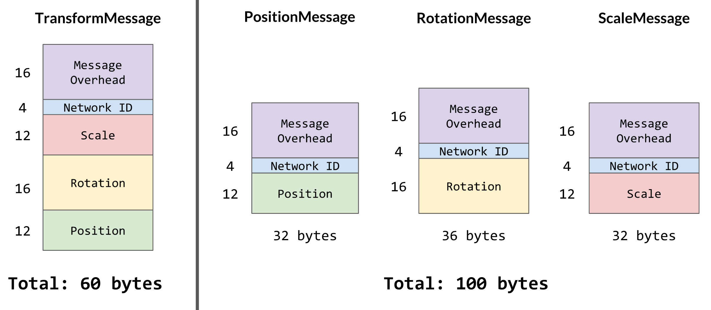
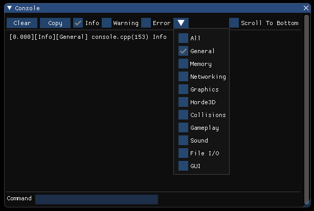

# Hello from the West Coast

Before we get started, we apologize for the delay with publishing Week 9. The Isetta Team was in Los Angeles this past week trying to wrangle some engine developers for interviews and meetings, so we naturally fell a little behind on our usually strict schedule!

That being said, we got a couple of interviews while we were out galavanting in LA, and we hope you anticipate them in the coming weeks! Special thanks to [Cort Stratton](https://twitter.com/postgoodism), Sunil Nayak, and Jibran Khan for helping us figure things out while we were out on the west coast!

## Byte-Sized Updates

*   [Network Transform](#network-transform): Built up the entire `NetworkTransform` class, including client authority and transform interpolation.
*   [Event Messaging System](#event-messaging-system): Implemented the event messaging system with both queued callbacks and immediate callbacks.
*   [Collisions - Dynamic AABB Tree](#collisions-dynamic-aabb-tree): Finally got to work on optimizing the collision tree, and the speed up on the detection was better than expected!
*   [Console](#console): Developed a console window for easier debugging and information display.
*   [Components](#components): Added several more features to our `Component` class family, including much of what Unity has for theirs (which is beginning to make sense to us).


## Network Transform

We may have finished our generic network messaging framework, but being able to send messages across the network is only half the battle. The other half is doing cool things with those messages—and in our case this week, synchronizing game state.

Networked transform data is just like any other data that you send across some network, except it needs to be sent quite frequently and also happens to be needed on practically every networked object in a game. So with that in mind, we need to focus on a few things when we implement networked transforms in our engine:


*   How much data are we sending?
*   How frequently are we sending that data?
*   How do we keep the right people in control of their own objects, e.g. player characters?

There are a few other things to think about, like how do we make all of the data we receive seem smooth (e.g. characters aren't just jumping around all over the place) and what do we really need to send at any given moment, but those are optimizations for the above three questions, so we can consider solutions to those once we already have solutions for the big three.


### Sending Our First Transform

Now that we have our snazzy new components system and our network messaging system, why not use them to our advantage? We can create a message called `TransformMessage` that carries four things: the position, rotation, and scale of the object, and the object's network ID.  The reasoning for the first three should be obvious, but the reasoning for the ID might not be. A couple weeks ago in [Network Identities](../week-7/#network-identities), we created a `NetworkId` class (previously named `NetworkIdentity`) that could be used to identify objects that correspond to one another between two separate computers, since you can't really use pointers over the network. We had only used `NetworkId` for a contrived spawning/despawning example, but networked transforms were the real motivation behind the network IDs. By sending that across the network along with the transform data, we can figure out who should be receiving the data once the message is received by the other computers.

Using our components system, we can also generate a component for our networked transforms, conveniently called `NetworkTransform`. This will be what's responsible for updating the entity's actual transform with whatever we receive from the network, or on the flip side, sending out the most recent transform to the network. To do so, we need to register some network message handlers that will handle any incoming `TransformMessage` traffic—we can register these message handlers within the first `Start` function that runs for any `NetworkTransform` components, and doing so will create a couple of callbacks:

``` cpp
// Client callback code

Entity* entity = NetworkManager::Instance.GetNetworkEntity(
  transformMessage->netId);
if (entity) {
  Transform t = entity->GetTransform;
  t.SetLocalPos(transformMessage->localPos);
  t.SetLocalScale(transformMessage->localScale);
  t.SetLocalRot(transformMessage->localRot);
}

// …

// Server callback code
NetworkManager::Instance.SendAllMessageFromServer<TransformMessage>(
  transformMessage);

// ...
```

Pretty basic, right? This is essentially all you need to get started with networking transform data (although you might notice a problem in this code that we'll [delve into later](#who-owns-what)). The final bit is sending out the actual `TransformMessage` objects. We could just send a new `TransformMessage` every time we update the component, but we need to start thinking less about the functionality and more about the data now. Each of these `TransformMessage` objects contains two `Vector3`s, one `Quaternion`, and an `int` for the network ID. That amounts to 4 bytes per float and int, and 11 floats/ints in total, which is total of 44 bytes. Messages will typically also have some amount of overhead in them, which we can say will be 16 bytes for a round 60 bytes total per message (the actual overhead depends on your packet and message implementation!). Now imagine, if we're sending a `TransformMessage` every update and our game updates 60 times every second, then we're sending 3.5KB of data every second _for every networked object in the game_. That doesn't seem like an incredible amount of data, but network bandwidth is a shared resource not only in the game, but across entire local networks. Also, the amount of data you send across the network can often correspond with the latency of the response on other player's machines.

With this in mind, we should always try to be practical with the data that we send. The first simple way to do this would be to only send `TransformMessage`s every N updates, because let's be honest, most of our game objects are not all that important to the feel or activity of the game, and only a couple key objects may ever need fast-as-possible updates for their transforms. An assumption our team makes here is that we won't want to control the network update frequency of individual networked components, so our `updateInterval` is a class variable of `NetworkId` which can then be referenced by everything else that uses the networking. Fortunately, this assumption is easy to fix refactor later if we actually do need different update frequencies.


### Who Owns What

Above, we mentioned that there was a problem with the code for the `TransformMessage` handling. Did you spot it? We'll give you a hint: What happens if everyone sends `TransformMessage`s for every one of their networked objects?

Answer: Nothing good, that's for sure. One of the problems that you can pretty much ignore with just the generic RPC[^13425] messages is one of _client authority_, which is the idea that certain clients should have authority over certain networked data. This has multiple levels to it, too. The most basic form is what we'll be doing, where one client gets to "own" a particular object and send messages related to that object. Another form of client authority is for information contention, where one player might have successfully shot another player on their local machine, but on the other player's machine, the shot was a miss. Usually what you can default to is that the server is always right (unless you're doing peer-to-peer connections), but in some games you may want to defer to the shooter or the shootee, depending on the game design.

[^13425]: A **remote procedure call** or **RPC** is a function that can be called on a computer by another computer across a network.

Our client authority is very straightforward; every time a networked object is instantiated (i.e. it has a `NetworkId` component), the `NetworkId` is also assigned a client index. That client index can then be used to affirm whether or not some machine is the authority over that object before we apply any of the data. That can be done on both the client's side, where the client can check against their own index, or the server's side, where the server can validate the index of the client requesting that the action be performed.

This is a trivial check when handling messages:

``` cpp
NetworkId* netId = NetworkManager::Instance.GetNetworkId(transformMessage->netId);
if (!netId || netId->HasClientAuthority) {
  return;
}
```

To keep ourselves from sending way more data than is needed, we also perform this check inside of `NetworkTransform` to ensure that we own the networked object and we should indeed be sending this object's transform to the server.

With that, we've answered the big three questions and our `NetworkTransform`s are ready to go!

<div class="video-wrapper">

  <video playsinline autoplay muted loop>

    <source src="../../images/blogs/week-9/network-transform-simple.mp4" type="video/mp4">

Your browser does not support the video tag.

  </video>

</div>

...it's a little choppy, isn't it? Uh, does this mean we need to increase the number of `TransformMessage`s we send?


### Interpolation, or Doing a Lot with a Little

Enter interpolation. _Interpolation_ is when you take some data, for example two endpoints, and extrapolate the data between that, such as creating a line with the two endpoints. With interpolated data, you can effectively "smooth" out whatever data you have without increasing the amount of data you're receiving or processing. In the two endpoints example, we can smoothly walk from one endpoint to the other thanks to the line that we created.


Interpolation is used everywhere in game development because computers are machines of a discrete, 1-or-0 nature but humans operate more continuously (only technically—[humans are more like machines than most of us think](https://en.wikipedia.org/wiki/Frame_rate#Human_vision)). Graphics and animation use it, audio uses it, and of course, networking uses it. Interpolation is the first optimization that we are going to apply to our solution of the big three questions from above.

There are multiple kinds of interpolation that we'll need to know about because of the nature of our data. Most data can be nicely smoothed by _linear interpolation_, or _lerp_, which is pretty much the same as the line example from above. Another kind that we'll need to use for our rotations is _spherical linear interpolation_, or _slerp_. We won't get into the math ([reference](https://en.wikipedia.org/wiki/Slerp) if you're interested), but it's effectively a constant speed movement like lerp but along the edge of a circle's arc.

Functions for getting a data point along that range have already been dealt with all the way back in [Week 1](../week-1/#math), though. What we need to do for our `NetworkTransform` is the "over time" part.


### The Heftiness of Network Interpolation

An important thing to remember is that oftentimes optimizations are really tradeoffs. For speed we may sacrifice space via caching, or for readability we may sacrifice performance. Network optimizations are no different. When we decided to only send infrequent transform data across the network, we also decided to do the work of faking a smooth network experience, and that comes with a significant price.

In order to properly interpolate the transform data over time, we need to keep track of additional information. Particularly, we need the previous _and_ target transforms of our networked object. The reason why we need both of them is because our actual transform will be somewhere between the previous and target, and getting rid of one makes it impossible to know where the actual transform should go in that range.

For the time being, we'll only focus on positional interpolation as that's the most obvious and straightforward of the trio. We can update our `TransformMessage` client handler to register these previous and target positions:

``` cpp
// … client callback boilerplate here
Transform& t = entity->GetTransform;
targetPos = t.GetParent->GetWorldPos + transformMessage->localPos;
prevPos = t.GetWorldPos;
```

And we can add another section to the `NetworkTransform`'s `FixedUpdate` function that uses a new `interpolation` float value to determine how far along it is between the previous and target positions:

``` cpp
if (netId->HasClientAuthority) {
  // … send out the TransformMessage
} else if (interpolation < 1) {
  Transform& t = entity->GetTransform;
  interpolation = max(interpolation + 1.0 / netId->updateInterval, 1);
  t.SetLocalPos(Math::Vector3::Lerp(prevPos, targetPos, interpolation));
}
```

Every frame, `interpolation` is being incremented (in this case, by enough that it will be finished with the interpolation by the time the next `TransformMessage` should be due), then the entity is set to some corresponding position based on `interpolation`'s new value. If we receive a new `TransformMessage` but we haven't finished our interpolation, then we simply reset the previous position to exactly where we're currently at and interpolate from there!

With this, we can immediately see an improvement in the networked movement (although you may notice the latency being a bit higher):

<div class="video-wrapper">

  <video playsinline autoplay muted loop>

    <source src="../../images/blogs/week-9/network-transform-interpolated.mp4" type="video/mp4">

Your browser does not support the video tag.

  </video>

</div>

> A little developer strife to note here: When we were testing network interpolation, we eventually got to interpolation rotation and ended up hitting a ton of bugs. We thought this was the network code behaving strangely with quaternions, but as it turns out, our `Quaternion` class was heavily bugged! You can read more about this in the [What's Wrong with Our Quaternions](#whats-wrong-with-our-quaternions) section of the Patch Notes.


### Fewer Messages, Fewer Problems

Now that our results are looking pretty good, let's make it more optimal. A flaw with our update frequency optimization is that we're just blindly updating every N frames and asking no questions. Sometimes, this is desirable behavior! But if network bandwidth is precious (and for a lot of gamers, it is), then we should try to make our updating a little more intelligent.

An important question to ask ourselves is, how precise do our transforms really need to be across the network? If you're running a networked physics simulation game (God help you), then high precision might be very important. But for most cases, things can be off a little bit and nobody will be the wiser—especially if you factor that into your gameplay code and correct anything that's off when it becomes important (like the direction a character is shooting).

A very common and significant network optimization is to add an _update distance_ to your networked transforms. An update distance is just like an update frequency, but for space. If we know that 0.1 units of spatial precision is all we need, then we can check if our current position is 0.1 units away from the last position that we sent across the network, and if it's not, then we just don't send a message yet.

On the opposite side of an update distance, there's another tricky fault to consider. What if our game interpolates an object slower than it's receiving `TransformMessage`s? By our interpolation scheme described above, the object will perpetually fall behind its target position, eventually being egregiously far away from where it actually is on the server. This can be solved by introducing a _snapping distance_. Whenever we receive a `TransformMessage`, we check if our current position is further away from the target position than the snapping distance, and if so, we just snap right to the target position. It's not graceful, but it prevents accumulative error in case the interpolation isn't quite fast enough.


### The Band Breaks Up

We reduced the frequency of our `TransformMessage`s, but they're still kind of big. And by that, what we really mean is that we're sending a lot of useless data with each message. Sure, we could do some technical optimizations like [dropping a value in the quaternion since we can reconstruct that part of it](https://gafferongames.com/post/snapshot_compression/#optimizing-orientation), but that's for the hardcore network programmer. No, we're novice network programmers, so we're gonna solve novice problems. For example, breaking up our `TransformMessage` object.

Within a transform, you have the three components of position, rotation, and scale. Each of those is important in representing anything visually, but they don't necessarily change as often as one another. In some games, you may be changing position constantly but never rotation and scale, and in others, you could be changing position and rotation pretty consistently (like a twin-stick shooter—hint, hint). The problem child in almost every game, though, is scale: When is that even _changed_?

If we remove scale from our `TransformMessage` object, the message's size now becomes 48 bytes. That reduces our bandwidth usage by 20%! But what do we do about the scale? We can't just leave it the same all the time, because sometimes games really do need to change scale. In this case, we can create a new message class for it called `ScaleMessage`, which only contains the `Vector3` for the scale and an int for the network ID, and all it updates is the scale.

Wait, so if our `TransformMessage` is now only 48 bytes, why don't we also separate position and rotation into `PositionMessage` and `RotationMessage`? Well, we _have_ done that for convenience sake, but it's not necessarily a good idea. Don't forget that every message we create adds a (blindly estimated) 16 bytes of overhead to the total plus any other necessary information, so our `ScaleMessage` object isn't just the 12 bytes of the scale's `Vector3`, it's 32 bytes (because of the message overhead plus the network ID). And if you're developing a twin-stick shooter and you know that position and rotation are almost glued to the hip, then by separating the position and rotation messages, you're adding almost 20 bytes of extra data to the network stream for every two messages! Not to mention you'll have to perform extra processing for each individual message as well.



*This gets even worse when you need more information in every message!*

So in the end, we did indeed break `TransformMessage` into three different message classes to keep things simple, but it's important to consider the usage of these messages and try to optimize by packing things together.


### Out-of-Order

In the midst of all of this serious network interpolation work that we did, we faced some stuttering issues when the networked objects would update their positions; objects would mostly move like they were supposed to, they would sometimes go slightly back for a hot moment then continue as usual. While the interpolation code did still need some work, the stuttering wasn't of the same sort that we were facing there.

As it turns out, keeping track of message order can be pretty important. Our assumption was that the most recently received `TransformMessage` is the most recent message. However, if a `TransformMessage` is delayed by a second or so due to router magic, and then the local client finally receives that message, that "new" message would send our character waaay out of place! So we need to identify which messages were _sent_ later rather than what was _received_ later.

Our networking library [yojimbo](https://github.com/networkprotocol/yojimbo/) does this with its ordered-reliable messaging, but that messaging system is really meant to be used for things that you need to receive in the correct order so that you can properly process the information. We just need to know whether or not we should be ignoring a given message, so our solution can be simpler and lighter-weight. Each of the transform message classes now contains a `timestamp` float that indicates when the message was sent last, so all we have to do is check that against our most recently used timestamp to see if it's valid:

``` cpp
// Inside the client position callback code
NetworkTransform* nt = entity->GetComponent<NetworkTransform>; \
if (nt && positionMessage->updateTime < nt->lastPosMessage) {  \
  return;                                                      \
}
// ... go on to process the message if it's valid
```

This does introduce an extra 4 bytes of size to each of the transform messages, but it's important for correctness. Another thing that can be done to prevent bogus transform messages (which we did do) is to keep track of the most recent timestamps for each networked object and throw out any messages that fail before even sending them to the clients. This can take a good chunk of memory on the server depending on how many networked objects you have, but it will reduce unnecessary network bandwidth even further.


### Interpolating the Whole Three Yards

So we've covered almost everything when it comes to basic networked transforms, but there's one more detail that we haven't gotten to yet. So far, we've only discussed positional interpolation and how that plays out in the code. Rotational and scalar interpolation aren't all the much different when it comes to the math, but a question comes to mind now that we have three different values to interpolate: Who dictates the interpolation?

The most simple interpolation scheme would be to keep one `interpolation` float value and interpolate all of the transform components by that. That's straightforward and lean, as far as memory is concerned. Unfortunately, that poses a problem when you want to "restart" the interpolation. Recall from above that when we receive a new transform message, we reset `interpolation` and then interpolate between the current transform and the received transform. What if we were 80% of the way through interpolating the position, then we got an updated rotation? If we were to reset `interpolation` and go from there, the last 20% of the positional interpolation would take longer than the first 80% did!

To avoid this, we need to track interpolation on a piecewise basis. Again, that makes the `NetworkTransform` class even heftier, but heftiness is sometimes okay in the name of quality. Now, we have three different interpolation float values that are all completely independent of each other, so if we receive a late rotation update, our character will just do the rotation while its completing its translation in due time:

<div class="video-wrapper">

  <video playsinline autoplay muted loop>

    <source src="../../images/blogs/week-9/network-transform-full-interpolation.mp4" type="video/mp4">

Your browser does not support the video tag.

  </video>

</div>

And so, `NetworkTransform` is finished! We're sure that it will still take a lot of refinement and iteration, but it works as well as we need it to in order to start making true online multiplayer games. We actually have one more note that we actually neglected until the end of its development as well. The speed at which the transform interpolates doesn't have to match the frequency of the messages being sent out, and in fact, sometimes you don't want this to be the case. For that, we have the `interpolationFactor` variable on our `NetworkId` class. If set to greater than 1, the interpolation will happen faster, and less than 1 will make it slower. Less than or equal to 0 really should make the interpolation instant, but we can update that next week!


## Event Messaging System


### What is an Event Messaging System?

> Games are inherently event-driven. — Jason Gregory, _Game Engine Architecture, 3rd Ed._

When we are playing games, the progress is often driven by events like killing an enemy or collecting coins. Once the event is raised or triggered, multiple game entities need to respond to that. For example, after you kill an enemy, your score will increase and enemy AI will locate your position. Since there is clearly  a variety of in-game events, it's near impossible to keep them as function APIs in the base class like `OnExplosion`. This _Statically Typed Late Function Binding_ introduces inflexibility by baking the event types into the engine code and by creating an enormous base entity class which contains all possible callbacks, even most entities only override a few of them. The former one also leads to the failure of data-driven design, since events are not extendable.

To deal with this problem, we need a more flexible solution, which can dynamically add new events and register corresponding events to them. This is what an event messaging system is meant to be. It is a hub that contains all the events, maps them to the callbacks and handles the raised events together.


### Storing All Event Data

Since it is a hub that stores and handles the data centrally, the first question is: How do we store the data? From our experience, an event is more like a behavior than an object that can be stored somewhere for later queries. Luckily, in the programming world, we can make a behavior like an object. The Command Pattern comes to rescue!

In the [Gang of Four](https://www.amazon.com/Design-Patterns-Elements-Reusable-Object-Oriented/dp/0201633612/), the authors describe the Command Pattern as encapsulating a request as an object, thereby letting users parameterize clients with different requests, queue or log requests, and supporting undoable operations. To contextualize it, the Command Pattern is a technique that we use to encapsulate the event behaviors as event objects so that we can store them, queue them, and log them.

The two basic factors of an event are its name and its parameters. The name is quite straightforward; it's a `string` used to tell which event is raised, such as an "Explosion Event" or a "Collecting Event". The parameters are the tricky part. They can be of various types and the amount is also changeable. Usually, people use `union` to handle the various types and use a `string` to indicate which type is this parameter:

```cpp
struct EventParam {
  std::string type;
  union {
    int, float, ...
  } value;
}
```

This old technique is no longer encouraged by modern C++, mostly because of its un-safeness, where safeness is referring to type safety[^98761]. Any developer using this `EventParam` can get messy values if they try to read the value as an different type than it is. C++17 provides a safe alternative to use—`std::variant`—which will generate a compile time error if the developer fetches data of the wrong type. So now, we have all the data we need to encapsulate an event object, what about the command behavior? This is an easy answer: We are also introducing Observer Pattern into the event object.

[^98761]: **Type safety** is when the compiler can check whether the written code is using the right types and whether the language prevents or discourages type errors, errors from mismatching types.

As mentioned above, one single event can affect a lot of game objects. Due to the need to decouple the massive game objects from the event object, we have to use the Observer Pattern. Also, the nature of this pattern fits the event-driven system perfectly. Because we have already extensively used the Observer Pattern in our game engine, such as with the input, network, and collision modules, we won't talk too much about it again. If you want to know more about this pattern and how it works in the game engine, this [article](http://gameprogrammingpatterns.com/observer.html) will be very helpful.


### Queued Callbacks vs Immediate Callbacks

After an event is raised, we can easily look up all the callbacks observing this event. But when should we handle the callbacks? Should we handle the event immediately and call all the callbacks, or should we put it into a queue so that we can handle all the events in a specific phase?

We can see the use for both of them. For the immediate callbacks, they are simple and responsive. It runs the expected code right after something happens. For queued callbacks, they are less responsive than the immediate ones, but allow for the frame to complete so all objects have a chance to update before the callbacks are called. There is a special queue called a priority queue (or heap) which sorts all of the elements that are inserted into it. This sorting property allows us to add two more parameters: The priority and the frame count when the event is triggered. When the "Main Character Dies" event comes with an "NPC Goes to Sleep" event, we definitely think the former one is more important to handle. In this case, we should have different priorities for those two events and let the priority queue sort the events for us. Also, with the frame count parameter, we can now say "raise this event ten frames later". Since we are not implementing true multi-threading or coroutines, this can help the engine with some asynchronous[^76] features. We could do something similar with delaying based on time, however because our update is variable there is no guarantee the event would be raised exactly N seconds later. With this type of inconsistency we decided to hold off from implementing events based on time and to just use the frame count instead.

[^76]: **Asynchronous** is typically associated with parallel programming, and is when a task runs and completes separately from the main application/thread.

After all that, we have both queued and immediate callbacks in our engine. We provide two different API's so that the developers can choose whatever fits their needs best.


## Collisions - Dynamic AABB Tree


### Introducing the Tree

In [Week 7](../week-7/#speeding-it-up), we talked about accelerating our collision system using a DBVT (Dynamic Bounding Volume Tree; this will be referred to as BV Tree in the blog). This week, we finally got the chance to implement it in our engine and the improvement is phenomenal!

 

<div class="video-wrapper">

  <video playsinline autoplay muted loop>

    <source src="../../images/blogs/week-9/Dynamic_AABB_Tree_1104.mp4" type="video/mp4">

Your browser does not support the video tag.

  </video>

</div>

Without BV Tree, having 80 sphere colliders in the scene results in an average frame time of ~35 ms, or 28 FPS, which is okay but certainly not enough given that we will have lots of zombies in the game. With BV Tree, we can handle more than 200 dynamic colliders in ~15 ms. Alright, alright, enough bragging—how did we do it?

First, let's make clear what we are trying to do. Detecting collisions by comparing each possible object pair results in `O(n^2)` time complexity, but in reality, the chance that all pairs collide with each other is really close to zero. As it might be too hard to reduce the time of each single collision detection ("Although definitely possible with our implementation," says the person who programmed them), what we want is to efficiently find those pairs that *can* possibly collide with each other. Basically, we want determine if a pair could collide before doing a math intensive check. Our dear friend, BV Tree, can help us with it. With a BV Tree, when we want to find all the other colliders that are colliding with collider A, we just need to walk down from the tree root where we can possibly find another collider that collides with it—more specifically, where collider A is spatially located in the tree. We will talk about how we can do this in detail later. In theory, it reduces time complexity from `O(n^2)` to `O(n logn)`.

The BV Tree uses bounding volumes to do this, as stated in weeks prior, so we need to decide on the type of bounding volume we wanted to use for the tree. The choices are usually between axis-aligned bounding boxes (AABB) and bounding spheres. An AABB is the smallest box whose edges are lined up with the world's X, Y, and Z axes and can enclose the specified object (in our case, collider primitives). A bounding sphere is similar, just being a sphere instead of a box. They are both pretty easy to construct and detect collisions between, but bounding spheres require additional volume when encapsulating oblong shapes, such as humanoid characters, which we will have more of than anything in our game, so we chose AABB's as our bounding objects. We also found AABB's to be more widely used than bounding spheres through our research (You can look as our references [here](../../resources/#collision-detection)!


### Making the Tree

The next step is to design our BV Tree and decide the operations it should support. 

First, of course, we need to construct the tree. When we were looking at online resources, two of the most common tree construction techniques were the top-down method and the bottom-up method. They apply the best to scenarios where the colliders are known before runtime and won't change a lot. But in our case, the colliders will change their positions a lot, and we won't know where the colliders will be before they get instantiated. So we chose the third popular method: Constructing the tree by inserting colliders into it one by one when their respective `OnEnable` function is called. And this leads us to the second operation—insertion. 

Before we dive into how insertion works, let's look at the two most important properties of a BV Tree:


*   Only leaves can contain actual colliders
*   Every branch is guaranteed to have two valid children

And so a BV Tree node looks like this:

``` cpp
struct Node {
  Node* parent;
  Node* left;
  Node* right;
  
  // we know a node is leaf when the collider is null,
  // or the left/right is null
  Collider* const collider;
  
  // The leaves' AABB are just the AABB of primitive colliders, 
  // and the branches' AABB are the AABB of both its children. 
  AABB aabb;
};
```

These two properties make it so easy for us to add and remove colliders from the tree. And thanks to these properties, the logic of adding a collider to the tree is the following (you can refer to our [Github repo](https://github.com/Isetta-Team/Isetta-Engine/blob/c92e0223d1db0841343edc1a5bddfb4c052c14b6/Isetta/IsettaEngine/Collisions/BVTree.cpp) for actual implementation):


1.  Walk down the tree along the direction that causes minimum surface area change (as mentioned in [Week 7 blog](week-7.md#collisions), we should keep the tree balanced, and a typical balancing heuristic[^83] is surface area). Each step is done by *trying* to enclose the new collider's AABB with the left and right children, and comparing their surface area change after the enclosing operation. 
1.  After arriving at a leaf, construct a new branch node at that leaf's position, and set the original leaf and the new collider as the two children of the new branch node. Also do some other pointer bookkeeping to make the tree valid.

[^83]: A **heuristic** is similar to a rule that an algorithm or program follows as an optimization technique; it is used to arrive at the result with fewer iterations.

We also need to remove nodes from the tree when collider components are removed or disabled. Removing is also a pretty straightforward operation—just find the node's sibling, and pop it up to the position of its parent. A thing to note is that everytime we modify something at the leaf level, we should pop up level by level to make sure the parent's AABB still contains both children.

The last operation for us to cover is updating the tree. When a collider moves, its AABB will also change. We can keep the collider where it is in the tree, in which case the tree still works, but would become unbalanced pretty quickly. Therefore, we remove a collider from the tree when its AABB gets invalidated and then add it back, so we can always have a balanced tree. However in a game where everything is moving all the time, doing this means we need to basically remove all colliders and add them back every frame, because their AABB's get invalidated frequently. To solve this problem, we introduced margins in our AABB, or called with a cute name, "fat AABB's". Fat AABBs don't tightly enclose the collision primitive, instead, they leave some margins around the collider. This allows the colliders to move within their fat AABB's for a while before the fat AABB's get invalidated, and thus reduces the need of re-adding colliders. It's worth noting that there is usually not a "silver bullet" margin value for AABB's, and we should experiment with it to get the best performance. So we made the margin (or "fat factor") a config value.


### Using the Tree

Finally, we have a BV Tree we can use! The final step is to just generate a list of pairs that can possibly collide with one another, and pass that list to our "narrow phase" to detect actual collisions.

We did this by looking at every collider, walking down the tree, and adding possible collisions to a `unordered_set` of collider-collider pairs. However, if we do this naively, we may end up having duplicate pairs in the set—for example, we may have both `<Collider A, Collider B>` and `<Collider B, Collider A>`. The way we solved this problem is to have a customized hash function for the set like this:

``` cpp
struct UnorderedPairHash {
  template <typename T>
  std::size_t operator(std::pair<T, T> const& p) const {
    return (std::hash<T>(p.first) ^ std::hash<T>(p.second));
  }
};
```

So `<Collider A, Collider B>` and `<Collider B, Collider A>` will be hashed to the same value and the set will help us prevent the duplicate. 


### Hooking into CollisionModule

The clean setup of `CollisionModule` allowed us to easily integrate the BV Tree into our engine. We just created a BV Tree member variable in `CollisionModule`, so it can take care of calling the `Update` and `GetPossibleCollisionPairs` on the tree. On the other hand, the colliders can add/remove themselves to/from the tree easily as they are already friended to the `CollisionModule`. So yeah! We got a working dynamic AABB tree!

In summary, the operations we needed on the tree are:


*   Add colliders
*   Remove colliders
*   Update colliders
*   Get possible collision pairs


### What's Next

As the tree is integrated into the engine and has a well-defined interface, we can easily iterate on it to improve performance and provide more functionality. We did a little bit of profiling on the tree, and to our surprise, *updating* the tree took a very small percentage of the time, while *getting possible collision pairs* took around 80% of the `CollisionModule`'s update time. Therefore, the next step for us is to optimize the "getting pairs" process by either reducing the constant time of each operation or even improving our algorithm to reduce the big O time complexity[^283892].

[^283892]: **Big O** notation is a mathematical notation that describes the limiting behavior of a function when its argument approaches a value, typically infinity. It's usually used to evaluate the performance of an algorithm.


## Console

A console, in-game command-line, logger...the system has many names, but none of them can be seen on our engine architecture diagram. That's because it (sort of) isn't a system in the engine. The console is a great _editor_ tool.

> Wait, I remember you said you weren't going to write an editor!

Well, we still aren't, but as alluded to back in [Week 2](week-2.md#engine-config), the console is something that will be easy to develop and speed our debugging process. What the console needs to be able to do is output the same messages that are sent to the Visual Studio output window, and filter those messages based on verbosity level (info, warning, error) and channel (general, graphics, networking, etc.). So as part of this first requirement, since all the log messages pass through the `Logger` class, and we don't want to change how we do the logging, the `Logger` needs knowledge of the console.

But this doesn't seem right, since the `Logger` is one of our core systems and the console is just a feature; our solution, which is admittedly probably not the best, is to store a function pointer[^39] which is called each time the `Logger` write method is called, and with the same string that is given to the `Logger` write method. It doesn't use the event messaging system because that requires the `Logger`, so in the case that nothing is listening to the event, a warning message is sent; this creates an infinitely recursive loop, which is a commonly known allergen for most programmers. It also isn't using a registration system like our input system because we weren't sure any other system would need to be listening to the `Logger` messages, and why over complicate something when we could just keep it simple? The function pointer stops the `Logger` system being coupled with anything else, such as the console.

[^39]: A **function pointer** is a 4/8 byte pointer, depending on your computer architecture, that points to a virtual table holding a reference to a function; instead of pointing to a variable the pointer points to a function.

So with that, we set off in building out the GUI of the console, which ended up looking like this:


The console started as another way for us to flex our abstraction of the GUI system, and in the end it required adding in an additional implementation, `GUI::ButtonDropDown` (displayed below), that wasn't included with the imported GUI library. 


Getting the functionality we wanted for filtering messages required us to use the variables already set up in the `Logger`, verbosity and channel masks. First, when displaying a message, the verbosity level is searched within the string to alter the color of the text, and the index of the message's verbosity is stored. The channel name is searched and stored as well, so based on whether the mask allows that channel and verbosity, the message will be displayed. The console component itself also alters the state of the `Logger` through config variables, so if info messages aren't displayed in the console, they also won't be displayed in the output window of Visual Studio. However, unlike the output window, whose history can't be changed, i.e. messages that were filtered out at an earlier time cannot be inserted into the output window, messages within the console can. So the entire history of messages can be seen as well as filtered based on the two criteria. As shown:




The other functionality of the console is to be able to change configuration variables during runtime. Because of how we had done our `CVar` system from [Week 2](week-2.md#engine-config), this implementation was far easier than we had expected. The names of all the `CVar`s were already stored in a map which can be grabbed on initialization of the console, which happens long after the `CVar`s have been registered into the `CVarRegistry`. Then on pattern match, if anything is found followed by an equal sign (`cvar_name=1`), the configuration system can be called to set the variable. This variable is then changed throughout the game, wherever referenced!

But why stop there? We could make it even easier for the developer! 

To start, let's list out all the commands available with an additional command. This requires the ability for users to define their own commands and callbacks for the console, so the user can create a command by having a keyword associated with a callback function that takes the console instance and string that follows their command, which in turn can be used as input parameters and parsed based on function need. So a command followed by a user delimiter[^230495]  (the pipe symbol "|" for the Isetta Engine) denotes a user command and a command followed by a config delimiter "=" denotes a config command—this stops users from overriding config commands with their own. The reason to also pass an instance of the console to the callback is so the console's `AddLog` function can be called within the callback, which will only display information on that console in the case the developer has multiple consoles.

[^230495]: A **delimiter** is a sequence of one or more characters used to specify the boundary between separate regions in text or other data streams. An example would be the comma character for comma-separated values.


The history of the commands are also stored, so a developer can cycle back through old commands with the Up Arrow key.


Okay—all of this is neat, with config and user commands and all, but there are so many commands, and even with the feature to list them all out, they can just be tiring in general. So we added an autocomplete feature on pressing the Tab key!

The autocomplete works by comparing the characters since the last space with the same number of characters in all the commands. Once all the possible matches are found, the callback then determines if it can fully complete the word in the case of only one match, or it can complete a few more letters until the input word matches all the possible candidate commands, for example the commands "help", "hello" would be matched up to "he" if "h" was typed. The commands are currently stored in a vector and map, but the best data structure for this type of comparison would be a trie[^683892], so we may think of a way to use that for storage. Luckily, the console isn't a runtime feature so optimization isn't of the utmost importance.

[^683892]: A **trie**, also known as a radix tree, digital tree, or prefix tree, is a kind of search tree—an ordered tree data used to store a dynamic set or associative array where the keys are usually strings.


## Components


### Awake Myth

When we were designing the functions of the engine loop, we decided to have `OnEnable`, `Start`, `Update`, `FixedUpdate`, `OnDisable` and `OnDestroy` functions for the entity and the components. This is the smallest number of functions we thought we would need at that time. The reason we have `OnEnable` and `Start` is that some code should be run every time when a component is set active, while some should only be run once throughout its lifetime. Same logic applies to the `OnDisable` and `OnDestroy` functions. If you've used Unity before, you will find that it's quite similar with Unity's `MonoBehaviour`, but with one function missing: The `Awake` function. We didn't understand before why both `Awake` and `Start` are needed. Is that simply because of Unity is providing one additional phase for you to control?

The answer is yes and no. This week, we finally got to the point that we thought we should add an `Awake` into the entities' lifecycle. It's all because of how the `Start` function works. As discussed in a [previous post](week-6.md), we are using a loading script to load the level, in which it creates the entities and attaches components. In that case, all the components attached on one single entity are not attached simultaneously. This leads to the fact that the `GetComponent` will largely depend on the attachment order if it is called in a function that is called when the component has just been added to one entity, since the component you are querying might not have been added yet. To avoid that ambiguity, we didn't call the `Start` function when the component is added; instead, we just marked it as `NeedStart`. After all the components are added, in the beginning of next frame, the engine loop will check if the component needs to be started. If so, the `Start` function will be run.


It works perfectly! Well, it does in most cases. It still introduces delaying frames when we try to add more components inside of the `Start` function. As the graph shows above, every time we are adding a component in the `Start` function, it will be brought in one frame late because the `Start` function can only be called by the `CheckStart` function, which is only called at the beginning of next frame.

How do we deal with this issue? On one hand, we need a function called uniformly after all components are added so that we can correctly call `GetComponent`, but on the other hand, we want to eliminate the unnecessary `AddComponent` delay. We also cannot just use the `OnEnable` function, since it will be called every time the component is set active. The solution, surprisingly, turns out to be the missing `Awake` function!

With the `Awake` function, we can now easily use the functions to achieve the two features we listed above. In addition, we also understand what might be the reason why Unity has these two "redundant" functions!


### `Start` Your Engines!

Originally, our component startup ordering was this: A component is added to an entity, then when `Update` is called on the entity, our system checks if `Start` needs to be run on the component. It's not a terrible waste of time to check that before every `Update`, so it hasn't been an issue until now.

However, when we were working on our `NetworkTransform` component, we were adding the component to an entity and immediately getting an exception. Digging through the code revealed that one of the other components that we grab within `Start` was not getting grabbed, and some more digging showed us the error of our ways: The check to call `Start` was not being run in `FixedUpdate`.

We could have just put the start check at the beginning of `FixedUpdate` and called it a day, but at that point we would be checking every component if it was added to its entity many times _per frame_. So we came up with a new scheme where components no longer check to be started inside of `Update`, but instead are added to a stack of `entitiesToStart` on the current `Level` object that is popped from every `Update` and `FixedUpdate`. This way, we gain two benefits: We are no longer checking every component if they need to be started every frame, and the entity's `Update` function no longer controls the `Start` of components because the `Level` handles it instead.


### Preprocessing the Component Hierarchy Tree

[Last week](week-8.md#component-registry), we registered the components' hierarchy tree by a static registration function. After the registration, we have the `unordered_map` that maps every component type to its direct children component types (like mapping `Collider` to `BoxCollider`, `SphereCollider`, and `CapsuleCollider`). When `GetComponent<T>` is called, we do a lookup into the map and find all descendant component types by digging down into the tree and matching the types of components already attached to current entity. This is straightforward but quite expensive, because digging down involves multiple function calls. Since the type hierarchy tree is constructed during the static initialization time, we can always preprocess the tree to meet our needs after static initialization and before it is actually used. 

The way we optimized the hierarchy tree is to flatten the tree so that the parent component is not only mapped to its direct children components but also mapped to all the descendent components. This preprocessing can greatly reduce the lookup time to find all the descendent while it also increases the space the tree takes up. Thanks to our experience in using Unity, we know that functions like `GetComponent` are called quite frequently, so we finally decided to sacrifice some of the memory space to contain the type tree.

``` cpp
void Component::FlattenHelper(std::type_index parent, std::type_index curr) {
  std::unordered_map<std::type_index, std::list<std::type_index>>& children =
      childrenTypes;
	  
  std::list<std::type_index>* parentList = &children.at(parent);
  std::list<std::type_index>* componentList = &children.at(curr);
  
  for (auto& childList : *componentList) {
    if (childList != curr) {
      parentList->push_back(childList);
      FlattenHelper(curr, childList);
    }
  }
}
```

The algorithm we are using is depth-first search. The helper function iterates through the direct children list and appends it to its parent component's  children list. Then it calls the helper function recursively with itself as the parent component. The result is like this.

<div class="video-wrapper">

  <video playsinline autoplay muted loop>

    <source src="../../images/blogs/week-9/flatten-hierarchy-tree.mp4" type="video/mp4">

Your browser does not support the video tag.

  </video>

</div>


### Checking Components' Uniqueness

When we were working on the collision handler, which contains all the collision callbacks and is queried by the collision module for collision tests, we realized that it should be a unique component on each entity. This means that if one single entity has multiple collision handles, it might behave strangely. It's not a good rule to be enforced by the game developer, since it will be hard to debug if the developer happens to have multiple collision handlers on one entity. Thus, we want to enforce this uniqueness requirement from our engine by providing one more option when creating a new component. 

With that `unique` option parameter in the template, we now check if the component should be unique on an entity in the registration function. If so, we add said component to a set that contains all the unique components. We also changed the `AddComponent` function so that it now checks whether the component to be added is inside the unique component set or not. If so, it will do a `GetComponent` call to see if this type of component has already added to the entity. This uniqueness check can prevent the game developers from having unexpected behavior.

Some might ask, "`GetComponent` not only returns the template component itself but also its descendent components, so how should the uniqueness work with this inheritance situation?" To simplify this question, let's say components B and C both inherited from component A; then, in theory,  can components B and C both be on the same entity? What about components A and C? Does our solution work for this case?

The main point to think about here is, what is inheritance in computer science? It's a `is-a` relationship! Every child component is of the same type as its base class, but not the same as its sibling class. Now, if we revisit the question, the answer should be straightforward. Since component C `is-a` component of the same type as A, they should not appear on the same entity, while component B is not `is-a` (it's not quite as graceful this way) component of the same type as C, so they can both exist on one entity. Does the solution I described before work for this case? You bet it does. If you can go over how we construct the type hierarchy tree and how we check the uniqueness, you will see it works out naturally!

The downside of providing this uniqueness check is that it's kind of expensive when there is a deep type-hierarchy tree. This is something that is inevitable, even though we are still trying keep the performance acceptable. The solution for now is to use the parallel algorithm[^832] from C++17. The way we are checking if any component attached to the entity has an equal type with the component adding to the entity is to use `any_of` function. Since the predicator is read-only, it's quite safe to use a `parallel_policy` to execute this algorithm.

[^832]: **Parallel** **programming** is when code can be run on multiple threads rather than a linear process, therefore speeding up the execution. A **parallel algorithm** is an algorithm that can be executed as multiple pieces at a time, being split among multiple threads, then joined at the end to get the result.


## Patch Notes


### What's Wrong with Our Quaternions

While we were doing our `NetworkTransform` work this past week, we needed to do some quaternion math in order to interpolate rotations. When we started that part of the work, we were befuddled; the interpolation was always ridiculously broken, to the extent of having NaN[^234892] and non-unitary values!

[^234892]: **NaN** (not a number) is a numeric data type value that represents an undefined or unrepresentable value, especially in floating-point calculations.

Well, as it turns out, it had nothing to do with our networking code and had everything to do with our `Quaternion` code. You see, when people say that you should unit test, you don't need to necessarily unit test _everything_—but you really should unit test your most basic classes! This week, we fixed most of our `Quaternion` math functions because they were incorrectly ordering their elements (`w` was placed inconsistently throughout the code), as well as fixed the `Quaternion::Slerp` function to properly handle interpolations between the exact same rotations. We also had to fix the `AngleDeg` function due to it calling itself recursively and overflowing the stack. A while ago, we also fixed the `AngleAxis` function which was using radians instead of degrees.

Lesson learned: Test your math libraries!


### Logger File I/O

This week, when one of the team was looking into their log file, they noticed an issue: The log files were all 0kB. Most log files ended up being empty, and very few had actual log lines in them. The answer to why this was is fortunately fairly straightforward. When "optimizing" the `Logger`, the system waits for a config-specified number of bytes to be written to the buffer prior to writing the information to a file. This is to avoid flushing the buffer, opening, and writing to a file each and every log message, which is most certainly costly.

However, what this didn't take into account is what happens if you don't reach that buffer limit before ending your session, or worse, before you crash. The fix was to add a shutdown function to the `Logger` which, regardless of bytes in the buffer, writes to the respective output file. This is then called at the end of our shutdown sequence to ensure each system is able to write to the Logger as needed. The shutdown solved this particular issue, but we admit isn't perfect. The log file still won't be written to when the game crashes the log file won't be written to. We suspect that we can solve this by using a master try-catch statement in our engine loop, but we'll report on that in the coming weeks.

## Coming Soon

This past week we were out in Los Angeles, California interviewing with [Jeet Shroff](https://twitter.com/theshroffage), [Florian Strauss](https://twitter.com/likamutha?lang=en), and [Elan Ruskin](https://twitter.com/despair?lang=en) which we will be posting as soon as we can! This also leads perfectly into our other deliverable during this period, which is publishing these interviews into a book through CMU's ETC Press. More details to come soon!

With regards to future work, we are coming close to the final moments of the project but still have a lot of work to do... Luckily, we only have 2 major systems left to develop as well as the final sample demo game we showed back in [week 0](../week-0/#The-Example-Game).


## [Resources](../resources.md)

The resources page is still going strong, we are trying to link any resource we have found useful throughout our time in development. This can be a great resource to better understand any of the topics we are discussing or a jumpstart to help with your development. Let us know if there is anything with this page we could better organize to help you!


_Originally Published November 7, 2018._
