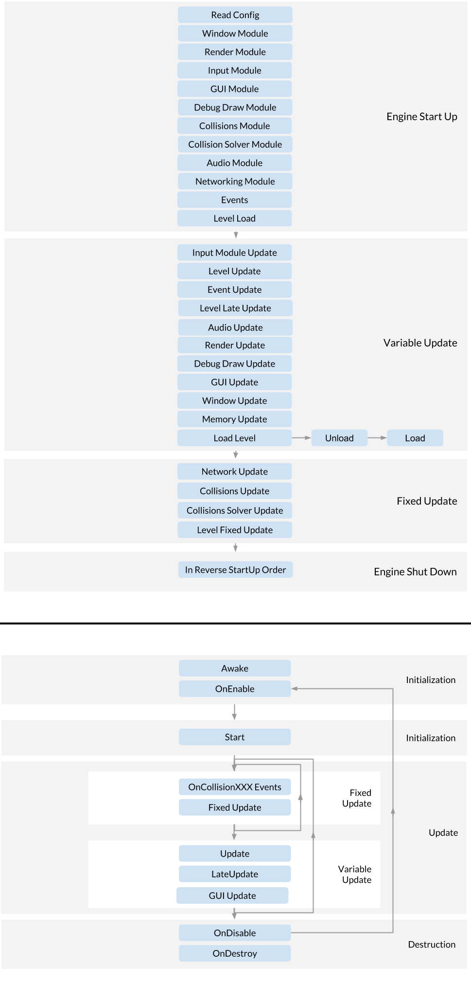

disqus:
# Basics
The Isetta Engine uses an entity-component-system, comparable to Unity's GameObject-MonoBehavior system.
For anything math-related, you need to use the `Math` namespace. For instance, for a 3D vector, you would use `Math::Vector3`

## Assumptions/Conventions
- Coordinates are right-handed (`Vector3::left = (1, 0, 0)`)
- Matrices are row-column (`Matrix4 mat[ROW][COLUMN]`)
- When using the built-in `MemoryManager`, it does not protect you against yourself (in general the engine does 
not protect a naive user from shooting themselves in the foot)

## Execution Order
