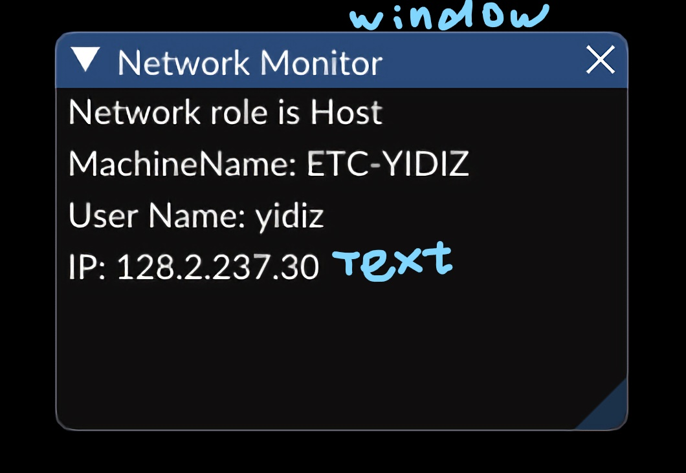
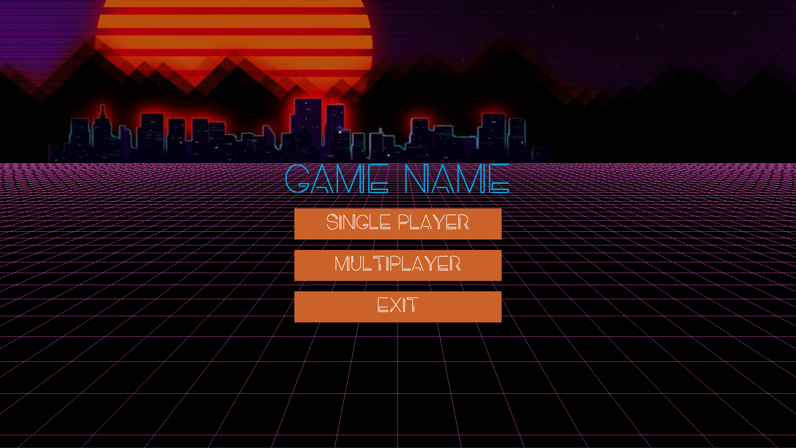
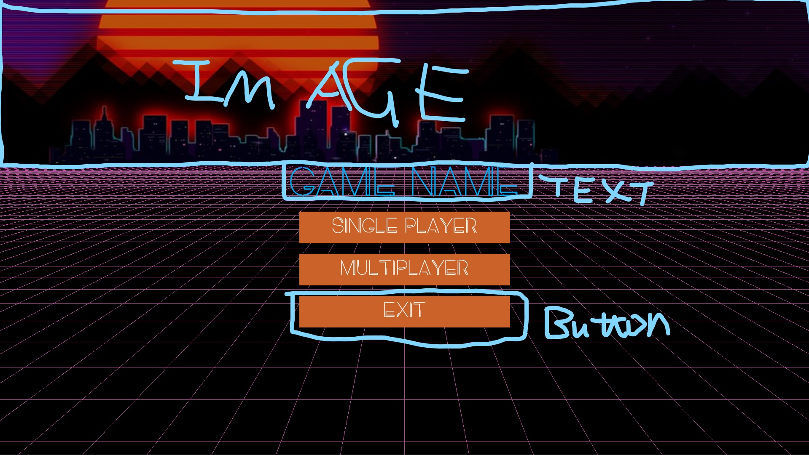

disqus:
# GUI
For a good overview of GUI see the [`GUILevel`](https://github.com/Isetta-Team/Isetta-Engine/tree/master/Isetta/IsettaTestbed/GUILevel).
We ran out of time on this one, so if you need additional help ask Jacob or Yidi!

## Essential API
### Loading Font
- `Font::AddFontFromFile(const std::string_view& filename, float fontSize,
                              const std::string_view& fontName)`

### GUI
- `GUI::Text(const RectTransform& transform,
                   const std::string_view format, const TextStyle& style = {})`
- `GUI::Button(const RectTransform& transform, const std::string& label,
                     const ButtonStyle& style = {}, bool repeating = false)`
- `GUI::Window(const RectTransform& transform, const std::string& name,
                     const Action<>& ui, bool* isOpen = NULL,
                     const WindowStyle& style = {},
                     const WindowFlags flags = WindowFlags::None)`
- `GUI::SliderFloat(const RectTransform& transform,
                          const std::string_view& label, float* value,
                          float min, float max, float power = 1,
                          const char* format = "%.3f",
                          const InputStyle& style = {})`
!!! warning
    All GUI function calls must be contained with `Component::GuiUpdate`.

### Texture
- `Texture::Texture(std::string_view pathToFile, bool load = true)`: Load in the texture at the given file path and returns a `Texture*`
- `GUI::Image(const RectTransform& transform,
                    const class Texture& texture, const ImageStyle& style = {})`: Draw GUI image using the texture loaded before

## Code Snippets
See [`GUIComponent`](https://github.com/Isetta-Team/Isetta-Engine/blob/master/Isetta/IsettaTestbed/GUILevel/GUIComponent.cpp)

## Example UI

*Network Monitor*

*Main Menu*
*Main Menu*
