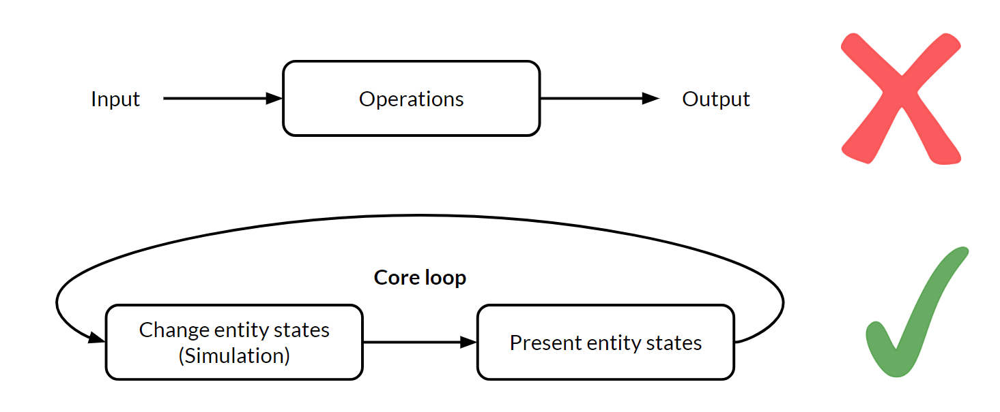

<h1>Why Game Engine Development is Worth Learning</h1> 

_**Casey Muratori** is the lead programmer on_ [1935](https://molly1935.com), _an upcoming interactive story engine project, and the host of_ [Handmade Hero](https://handmadehero.org), _an instructional series for game engine programmers.  His past projects include_ [The Witness](http://the-witness.net/), _the_ [Bink 2 video codec](http://www.radgametools.com/bnkmain.htm), _and the_ [Granny Character Animation System](http://www.radgametools.com/granny.html).

(The following is the edited transcription of a [conversation we had with Casey Muratori](CaseyMuratori-hmh-video.md).)

## The Shortage of Engine Programmers

I won't pretend I have the data to support that there is a real shortage of engine programmers, but if today you told me I needed to staff up a modest ten-person engine team, I would have almost no idea where to get eight of those people. And the two that I maybe _do_ know where to get, I'd have to hire from some other team. So I'm strictly talking about this from personal experience in the game industry. It is an anecdote, not a statistic, when I say I just don't find that people know where to hire engine programmers. I know plenty of people who have hired people who they really don't think are even that good at engine programming, but who were definitely the best they could get.

Similarly, I know plenty of people who would hire another engine programmer right now if they could find one, but there's no one who meets their cutoff. Some of that is - especially on smaller teams -because you can't afford to hire lots of junior people. Maybe there's some raw talent out there and it just needs to be developed. Data-wise, I don't want to make claims about this that I can't substantiate, but real engine programming experts are very hard to find, and I can't offer you a reason for that. I just assume the reason is that even something as simple as using Unity kind of requires you to understand 3D math at a pretty decent level if you're not gonna ship one of these games with tons of obvious bugs. 

Being a game engine programmer is just a hard profession. It demands that you know a lot of things, so it's not for the faint of heart. It requires a lot of expertise, a lot of time spent learning even to just be a competent engine-side programmer. You need a lot of skill to modify Unreal Engine in a small way, or even to competently program a motion controller. These are just skills that people don't seem to have in abundance. Even today when you can just go get an engine so you don't need to build it from scratch, we still haven't gotten to the point where we have enough people with expertise. 

We don't have enough expertise versus how much we could be using to make games better. I suspect if you talked to other people in the game industry, they would have similar opinions about how hard it is to find good engine programmers. I don't want to put words in their mouth, but it's not the kind of thing that you can just go find someone to do. I think we're getting better at pipelines for finding artists thanks to social media and online tutorials about what goes into making a game asset. Perhaps also because of school curricula that was not around in the old days. 

What I have not seen change is the number of engine programmers. The last three engine programmer hires I know about - or was in any way involved with - all came from Handmade Hero. If it wasn't for Handmade Hero, who knows if they even would have done it? That was the reason for Handmade Hero: **because I believe this way of life is worth preserving.** It's talking specifically about a practice and a discipline and a mental model. I never said I want to show you how I make a game. I said "this way of life" specifically. I feel like making a game is covered well enough elsewhere.

## The Confusion with Game Engines

### Problem 1: An Amorphous System

There are two fundamental problems in game engine development that I think set it apart from a lot of other types of development. The first one is that it is not a stateable problem in any way. Half of everything that programming does in the past or today looks a lot like stdin /stdout [^1]. You can phrase it as "here are the set of inputs, and here are the set of outputs that come out of it." So most of the things that programmers are used to thinking about are "I'm working on deep learning[^2]. Here's a set of input images and a set of output tuned neural net parameters. How do I make the best translation between these two things?" Or, "I'm a natural language processing person, here's all the corpus[^3] I want in and here are the noun tags I want out, or the sentence tags I want."

[^1]: **stdin** and **stdout** are the functions that handle program input/output in the standard library of the C programming language

[^2]: **Deep learning** is a machine learning technique that teaches computers to do what comes naturally to humans: learn by example. Deep learning is a key technology behind driverless cars, enabling them to recognize a stop sign or to distinguish a pedestrian from a lamppost.

[^3]: In linguistics, a corpus or text corpus is a large and structured set of texts.

I think one of the biggest challenges for an early game engine programmer is making the leap from input-output thinking to this amorphous system. It's very confusing how that happens at first, because even though you're not necessarily aware of it, everything you've ever done prior to that looks a lot more like this input-output phrasing. One of the really good things that you can do at first is to try to figure out the "core loop" of a game engine; the golden differentiator of a simulation. In a flight simulator or a game, they look like this real-time loop where I have a set of entities (each with their own states) and I go through a simulation to change those states. That's a certain process. I then go through a way of presenting those things, and then I return to the beginning. 

Just getting yourself comfortable with that and the fact that everything you build has to build out of that is just the first big step. It's not input-output anymore. It doesn't look like a web program; it doesn't look like the neural network; it doesn't look like a parser; doesn't look like a server; doesn't look at any of these things. It looks like that—a "core loop". 

### Problem 2: The Complexity Explosion

The other thing is the complexity explosion. So again, it's not input to output where things are very clean. You now have all of these systems that are all happening at the same time. They all interact, they all overlay on top of each other. The physics and the rendering and the blob, etc. All this stuff comes together. 

You really need to be able to do discoverable architecture in order to do these things correctly. Most people are just not familiar with that process—I called it [Compression-Oriented Programming](https://caseymuratori.com/blog_0015) in the past. I would define that as the technique of starting with the simplest way possible. I think this is [Jonathan Blow](https://twitter.com/Jonathan_Blow)'s term that he uses often: Write whatever is obvious to you. Don't even think about the rest of the game engine. Focus on the one thing you need to do at the time. Think about it more like the standard in, standard out (stdin, stdout) that we're all used to. How do I it to just get the input and the output; to do the thing I need to do in isolation? No code design, no cleanliness, no nothing. You need to be able to clear everything from your head and just do that, and then pull that out into the architecture. 

One of the biggest mistakes I think even experienced game programmers will make is they go the other direction. They try to start with the architecture and drill down to the thing they want to do. Never in my entire life have I seen a good result from that. It almost always has to be "refactored" at the end. That's because when you start from a conception of how something will plug together, you don't see all the details. You don't know all the things that you're gonna have to do when you go to solve the problem, so you always forget some of the details. On the other hand, if you just implement the real thing first and then pull it up into the architecture, you almost always end up with better results. I like to think about those problems. 

### The "Boundary Value Problem" Architecture Method

There's this thing called boundary value problems[^987] in mathematics, and there are different ways of solving them. There's the shooting method: I start here, I see where I end up. There's also the method of solving backward, where I look from the endpoint and try to see what I could do differently. Building up a skill set of how you work on code that allows you to work from either side of the problem ends up being really valuable. Like I said, you usually want to start with an isolated solution and loft it up into the architecture. But then, when you get to a certain level of that lofting you want to think from the other side down. You want to determine what a good API for this should look like, what are some things you maybe didn't think about while implementing it. And things that you should maybe change, that wouldn't break the algorithm, but that would let it work better with this integration. 

[^987]: A **boundary value problem** in mathematics is a problem whose solution that satisfies boundary conditions that act as constraints for the solution. More can be learned on [its Wikipedia page](https://en.wikipedia.org/wiki/Boundary_value_problem).

_You almost want a ping-pong development process where you start at the solution, work backward a little, go to the architecture side, work forwards a little, and come back. The best programmers at doing this sort of thing are able to make it fit really nicely at the end, so both sides can be happy._ I'd like to give a shout out to [Allen Webster](https://twitter.com/allenwebster4th)[^5] for that, he works at [RAD Game Tools](http://www.radgametools.com) now. I've talked about those two things separately before, and he pointed out that I need to connect them.

[^5]: **Allen** is an entrepreneur and engineer interested in working on the tools that drive digital creation. He is currently working on "4coder", a programming environment targeted at the problems of real-world high-end C/C++ problems, under the Handmade Network.

## Competence, Coding Style, and Working in Teams

### Casey's Definition for a Competent Programmer

Part of developing a good programming style has very little to do with things that people normally focus on, which are minor things like "Did I overload operator=[^777] to prevent a copy". They focus on all of these rules that they never even tested. They ignore the most important thing which, in my opinion, is how easy is it to read your own code later and know exactly what it does. This is also why I tend to not comment code until it's "done done," because I find that the comments end up being out of date and counterproductive. Since the comments are describing the thing that was before the latest one, it's actually worse than having a no-comment. 

[^777]: **Overloading** an operator replaces the functionality of that operator for a given class. For example, you could overload the assignment operator + on a list object to instead add the given other object to said list object.

So that's I think what keeps Handmade Hero so flexible and easy for me: To not have to worry when I come back to it on a weekend to start doing a stream. I know part of being a competent programmer is writing code in a way that doesn't require me to keep it all in my head. I can easily go look at the function names and I just know what they do. 

This is doubly easy if I'm the programmer, because I know what assumptions I make and if I just always make those same assumptions then I know I don't have to investigate those things further. I know I'm not gonna call "new" in the middle of a thing because I never do that. If you develop a programming style that you find is effective, simply leaning on that style in your own code will allow you to keep it flexible and easy to remember. 

I think those are the two aspects. One of them is about becoming a good programmer, which is making sure that your style actually pays real benefits and not hypothetical unproven things. The other one is keeping the code small and straightforward. I think people overstate the difficulty of Handmade Hero; it's not that hard when the code is that small. If I tried doing that on the Unreal Engine codebase, I would not be coming back to it and know exactly where I left off. I'd be completely lost, and have to step through it in the debugger for six hours before I really knew.

### Everyone's Own Coding Language

In a similar way, working with different peoples' coding styles is probably one of the biggest problems in programming today. If you imagine that programming is a two-part process, there are two things that are going on at any time. One is coming up with a "language", and the other is speaking in that "language". 

In the industry, we talk about having a programming language, but we really don't have one that we use. What we have when we talk about a programming language is the building blocks for the actual language that we will use. It should probably be called a "programming alphabet" or "programming phonemes" if we're honest. Because what happens in a game engine is that first you take the language that you have, like C++, and you build your own "language" on top of it. This will be a sort of functional language of core things that everyone will use. It'll be used to talk about things like how the memory is managed and how to implement the render pipeline and how do we pass things back and forth, what is the job control[^666] story, and so on.

[^666]: **Job control** is the control of multiple tasks on a computer system that may be "in-flight" at the same time. It requires proper allocation of resources and locked access to prevent deadlocks and failures.

Those specifics form a secondary language. It's a very recursive process. You could think of it as making lots of languages on top of each other. Some programming languages and projects are so poorly thought through that they end up with languages on top of languages on top of languages. If you think of each programmer as having their own ideal language they would like to see, that's the substrate that's right on top of the regular language that they all had to conform to. They're all fluent in that, presumably their own one. So when you bring two programmers together you essentially have a problem where they need to write a book together but one speaks French and the other speaks Spanish. They have to figure out how to come together to write the book, which would have to be in a Latin style typography but not actually in either of their languages. 

So I think that the jury is still out. I might even say that the appellees and the plaintiffs and defendants are still out on what the right way to do that is. There's certainly procrustean[^300] approaches where companies will demand everyone have this many tabs and every class looks like this and there's a file for every block. It's like everyone must conform. There are other places that use a more laissez-faire approach, and they hope that everyone will figure out what to do at the boundaries. 

[^300]: Definition: enforcing uniformity or conformity without regard to natural variation or individuality

I think that we don't know the answers to what's right about that and I would be absolutely lying if I said I thought I had a good solution to it. 

### Fluency, Efficiency, and Cooperation

There is no question in my mind that there is a loss of speed, efficacy and quality of code that comes from shifting from your native language to another one. Shifting from your native programming style into somebody else's costs you. You have to balance that cost against the fact that if we have more competent programmers on a project, assuming each of them is capable of writing something useful for the project, we can get more done. 

While working on _[The Witness](http://the-witness.net/)_, I took a pretty massive productivity hit working in that codebase compared to my own. There's nothing you can do about that. I did build some of my own language in there. I put some of my own tools in there over time so that I can be effective, but it was on an on-demand basis. There's an entire article I wrote about a time when I had a bug, which only came up because I made a wrong assumption about the math library. And that's the reason that I and Jon Blow are both able to write certain types of code quickly - because we both make assumptions about what our math libraries do. If we couldn't make those, we'd literally have to read the code for cross-product[^301] or something, every time, to figure out whether it was right-handed or left-handed. The process would be much slower and there'd be way more bugs.

[^301]: **Cross-product** is the 3D math operation where the input is two vectors and the output is one vector that's perpendicular to both input vectors. However, the direction of the output vector depends on whether the space is defined as left handed or right handed.

It's really hard to overstate just how important that is. I think a lot of people don't necessarily realize it, because when you program your first engine, you're usually not a very mature programmer. If you've never written an engine alone after you've had a lot of experience and are more self-confident in your skills, you may not realize how fast you actually are when everything is done the way you expect, because you've only ever done it at Valve or something where everything works maybe a little bit differently than how you would want it to. And so it's a very important thing to be aware of. 

On that front, I think working with an existing engine would be really good for engine programmers to start with. In an engine that's made a bunch of decisions, whether they're right or wrong, you have to live with them. Because that's probably going to be your job when you're first starting out. For example, the Unreal Engine does different things wrong but you can't change those because they're baked in the architecture. So it would be important for new engine programmers to learn how you make these improvements, or how you make this one part better. 

## Handmade Hero as a Learning Tool

The goal of [Handmade Hero](https://handmadehero.org/) was to stream it, because I wanted to have that complete record. I thought there were things people would learn by watching an engine programmer just do what they do, rather than just telling them the result. I think it's been really good at that because I've had many people actually tell me that that was a big breakthrough for them. They would say, "Seeing what you actually _do_ totally makes me feel more comfortable about doing this." So that, I think, was the main thing I was trying to do with Handmade Hero. 

That's what I hope people get out of it. Everything else I have no idea, because the goal wasn't to teach people, say, 3D math. I just do that because I wanted people to see an explanation of those things as we used them. I don't know if it's a good way to learn it and I don't know what other things would be valuable. If I was gonna make a course for people to learn 3D math for engines, it wouldn't look like Handmade Hero. So there's definitely a lot of room for more learning materials, regardless of whether or not  such resources are available right now. 

So I don't think that Handmade Hero is the best we can do for learning specific, individual topics. I can say that for sure, because if I sat down to make something like that myself, it wouldn't look like Handmade Hero.

_I don't think you ever want to use any one programmer's ideas or code as your sole resource._ The reason for that is because everyone's brain works a little differently. That means the most efficient way to think through a problem is not the same for everybody. Unless your brain literally works exactly the same way that mine does (and there may be some people out there whose do), then the chances that my streams are telling you literally all the things you might want to know about programming is zero. There are going to be very valuable approaches and things that I might not be aware of that you will find effective. So I think it's important for a programmer's brain to be able to distinguish between those styles in a concrete way. That's the way you can find the primary styles that work for you. 

As I got better at programming, I found myself actually thinking, "How do I figure out what elements of programming style are good and bad for me?" I don't care what people write in these books. I've realized that they don't really know what they're talking about a lot of the time. I want to come up with ways I can evaluate this stuff for real, and I want to see how it works when I do it.  I felt like I became a much better programmer when I realized there was a really big divide between the prevailing theories and actual programming practice. I think it's important for programmers to try to cross that divide for themselves. They're not going to cross it by watching a series like mine and assuming that everything I do is right. Even if everything I did _was_ right for them, they still wouldn't have developed the critical faculties necessary to know why. I also suspect that for most programmers, not everything I do in the exact way I do it will be the way that they should do it, because they will go on to find different techniques that are better for them.

## It's the Process, not the Product

If I had to start from square one on [Handmade Hero](https://handmadehero.org/), obviously there are things I would do differently, but that's because the point of Handmade Hero and for recording the process was that I wanted people to see me go down a few avenues before picking the one I wanted. I wanted them to see how an amorphous, unstructured piece of code resolves into a structured one.

For example, one thing we did over the past three weeks was we made the renderer into a standalone DLL[^635]. Now anyone can use it to make a renderer that does all the things that Handmade Hero's does. So the depth peeling[^988], sprites, and the camera code... all that stuff is in a separate library now. So if you wanted to make a game that has an instant 3D-hybrid sprite block renderer, you just have one.

Those are exactly what I wanted people to see in Handmade Hero. So if I lost the whole thing, I almost would say I would start a different project. If I was going into Handmade Hero with the knowledge of how everything worked out, it would totally ruin the entire point of the series. Watching me type in code I already know how to do isn't worthless, but that's what a blog or GitHub repo is for. On Handmade Hero, it was critical that I not have a solution in mind when I started. 

[^635]: A **DLL** is a dynamic-linked library which is Microsoft shared library concept which can be transported around easier than a project and contains information about the compiled project. 

[^988]: **Depth peeling** is a method of order-independent transparency when rendering 3D geometry. It determines what should be drawn on top by rendering multiple passes of a scene and comparing depths.

## Reusing Past Subsystems

Utilizing code from past projects is not something I'm an expert on. I'm only 42 years old! Maybe when I'm 82 I'll be able to tell you if I had a piece of code that was worth reusing. There are a couple of things I can say along those lines. For the very first time, on _[1935](https://molly1935.com/)_ [^593], which is the main project I'm working on now, I decided that I never want to write a platform layer or standard library again. I'm expecting honestly this project is probably a five-year project, which is a long time for one programmer. It wouldn't be that much for a team if you think about it in programmer years, but for one person it's a lot.

So on this project, I felt like I was ready to do that for the first time. Whether it succeeds or not, I'm not sure. But what I will say is I took an approach that was slightly different from approaches I had taken before. I documented the whole development process. I have a notes file, and every time there is a question about what I'm going to do in the codebase, I document exactly _why_ I thought there was a question. I discuss the solutions that I've tried.  Finally, I explain why I ended up selecting the solution I did out of the ones that I tried. So there is literally, for the first time on any product that I've ever done, a 100% complete documentation of why every last thing works the way it does. Before this project, I never sat down and committed to thinking all these things through, because a lot of times to do a platform layer you just do it. 

[^593]: _**[1935](https://molly1935.com/)**_ is an upcoming game from the MollyRocket team, which includes Casey.

### Justifying Brought-In Systems

Even for myself —who advocates a very limber style of programming where I don't think you do a lot of upfront design —even I want to spend more time recording and justifying decisions. I don't do them from the top down like a UML diagram[^399] disaster situation or anything like that, but I do feel that a higher level of rigor is necessary. What I try to do in this situation is sort of play the devil's advocate; as if I was more than one programmer. I try to come at it from different angles. Can I justify it from a speed perspective? An ease-of-use perspective? A compatibility perspective? So we'll see if it works.  Ask me in ten years!

[^399]: **UML** is the Unified Modeling Language, whose purpose is visually representing a software system with its actors and roles so that a programmer can better understand and design said system. Sometimes, UML diagrams can end up as a "disaster situation".

## Builds: Keep 'em Simple

In our current weird programming culture, there's a term called "build engineer"[^500]. All I can say about that is the way to approach a build is to realize that computers today are so fast that almost any game engine you care to make, especially on a team as small as yours, can be built with a batch file in like ten seconds. Anything you do more complicated than that is a waste of your time. People throw in integrated continuous build servers and Cmake[^400] and Ninja[^401] and distributed builds and Python, but none of it is necessary. All you need to do is just make a thing that says "compiler, here are the files, this is the executable I want, build." That's it! 

On Handmade Hero, we showed how to do this on the first day. You don't need anything more complicated than that and I would encourage you to start there. Eventually, somewhere down the line, there are some arguments to be made for doing some of the slightly more complicated things, like a continuous integration server when you have multiple platforms. This is just so that not everyone has to have every devkit to make sure they don't break the build.  Otherwise, a single-line build is the build you want. It shouldn't be more complicated than that. 

_Interview conducted September 8, 2018._

[^500]: A **build engineer** is in charge of the infrastructure that builds a software application, as well as testing and troubleshooting code for before the software's release.

[^400]: **CMake** is a cross-platform, open-source application for managing the build process of software in a compiler-independent way.

[^401]: **Ninja** is a small build system that is designed to run builds as fast as possible.