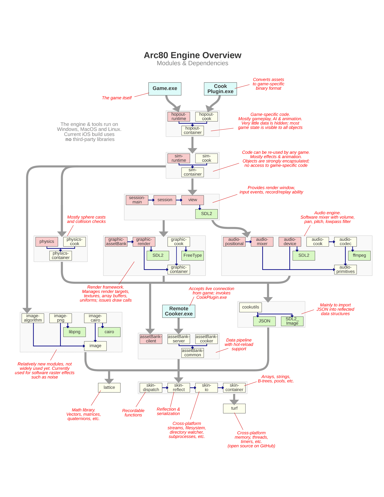

# An Engine Developer's Toolbox

_Jeff Preshing is a programmer with close to 20 years of experience working for various game companies and non-game companies. He recently wrote a C++ game engine from scratch and is using it to make a dope cartoon-action game for mobile. You should follow his blog at [preshing.com](http://preshing.com/). He likes rock climbing and Vindaloo curry._

(The following is the edited transcription of a conversation we had with Jeff Preshing.)

## The Arc80 Engine Architecture

Back when I was starting my career, I considered myself a good programmer, but I would look at existing games and game engines and just be unable to even fathom how everything all fit together. That's the most confusing part, and to illustrate, I've provided my own engine's architecture here. This can give you an architectural overview of my own game engine; it's something that I would have liked to see early on in my career. You can find other overviews like that online, but having a particular view of the modules, the dependencies between them, and how an engine goes from high level to low level is a good start. That was by far the most confusing thing: Getting the big picture of it all.

## Engine Design Principles

I have my own set of personal design principles behind how I write and maintain my own engine. They probably won't apply to anybody else, but that's what I've chosen and I think it's an interesting way of looking at things.

To the extent that I can, I avoid building custom tools. I don't want to spend time building them. That's a big part of real AAA game development at a studio—because you've got hundreds of people on the team, the investment that you make in user-friendly tools pays off. That said, it's a big investment, and for me personally I don't want to spend time on custom tools. To get around that, I leverage Blender[^1]; I do all my level editing and character design in Blender.

[^1]: **Blender** is an open-source 3D computer graphics software used in creating 3D models, animations, and interactive applications. 

Another one of my personal design principles is that I always want to focus on the application running on the device. All my effort is targeted at keeping that lean and mean and efficient, so rather than focus on tools, I focus on the game application itself.

The other principle that I follow to an extreme is maintaining reusable modules, because everyone likes modularity. The way I make sure that my modules are reusable is by building small applications that compile and link with individual components, and I can't do that unless the components are decoupled from each other. When I say components, every small box on my architecture diagram is a component. Each one has its own directory of header files, and when each box is compiled, it's a library and it has access to the headers of specific other modules that it's allowed to depend on. Because of that, I'm really aggressive in terms of modularity. What I found at game studios is that engines tend to be monolithic code bases, so I'm deliberately making an effort to go the other way. I would almost say that what I've got is more of an SDK[^2] than an engine—I just happen to be making a game out of this SDK.

[^2]: A **software developer kit (SDK)** is a set of programs used in developing another program.

## Creating Your First Engine

For my own engine, I write everything. I've written my own containers, string class and file system class, which includes the physics and the audio engine. I use almost nothing from the standard library, except for type traits[^3]. If you're a novice game engine programmer and are setting out to do your first project, _you don't want to do that_. For everything that I've written, there are really good open-source equivalents.

[^3]: **Type traits** define a compile-time templated-base interface to query or modify the properties of types, for more see [type support](https://en.cppreference.com/w/cpp/types).

So I don't know if it's a good or bad idea, but one way to build your own initial game engine is to look at it as an integration exercise: Go get [GLM](https://glm.g-truc.net/0.9.9/index.html)[^4], download [Bullet](https://pybullet.org/wordpress/)[^5], download some renderer like Horde3D, and so on. You've got libraries for a lot of things, like libraries that import 3D models and everything, so you can stitch together an engine out of those. I think that's a good way of going about it, since it will expose you to the interfaces to each component. That's the best starting point, and then depending on how your needs evolve, maybe you'll end up opening those black boxes and modifying things under the hood. For a beginner, you can integrate available code rather than doing everything from scratch, because that's taken me a long time. But that's just my style. 

[^4]: **OpenGL Mathematics (GLM)** is a mathematics library based off of OpenGL specifications, that contains definitions for typical math constructs used in graphics.

[^5]: **Bullet Physics** is a real-time physics simulation library, a physics engine, which simulate collisions for soft and rigid body dynamics.

## Skills of Engine Development

These were skills I didn't expect to need in the beginning of my career, but I ended up developing them during my career. The reality is that every engine programmer ends up exposed to them, so don't be surprised to find yourself getting better at these skills by necessity.

### Systems Integration

I call the first one _Systems Integration_. It's actually a big category, as it has to do with integrating third-party libraries—taking separate codebases and making them build and link together to run as one thing. Another systems integration exercise would be porting to new platforms, as well as doing big three-way merges (you've branched a library, integrated it at some point, then maybe you've made changes both to your code and inside the library itself). That happens a lot in the industry; months later, there's a new version of a library you want to integrate, which is the latest and greatest of that dependency[^6]. That can end up being a huge task that can take weeks or months to accomplish.

[^6]: **Dependencies** are links that are required between programs, such that one program is reliant on another.

Between all of those things, Systems Integration is a valuable category of skills to have. However, a lot of C++ programmers want to avoid it because they hate it. Many C++ programmers hate integrating libraries; they want everything to be a header-only library, just to make their lives easier. If you learn how it works, though, you're doing yourself a big service. Getting more familiar with it and tools like CMake[^7] to help you generate build pipelines instead of tweaking Visual Studio properties is just a good skill to have. It's especially useful when you're going cross-platform. 

[^7]: **CMake** is a cross-platform, open-source application for managing the build process of software in a compiler-independent way.

### Low-level Debugging

_Low-level Debugging_ is another great skill to have, especially when you are tracking down crashes in the final optimized build. Especially at the end of the project, you'll have testers hammering on the optimized build, so there's bound to be crashes and issues that don't happen in a debug build. The ability to diagnose and fix those bugs is useful because you want to ship a stable game! How you develop that skill is a different story, but at some point you or someone on your team will have to go into the disassembly[^8] window or the memory view and figure things out at that level. It's kind of considered a black art, which is a bit of a shame because it doesn't really have to be. 

[^8]: **Disassembly** is the assembly language, translated from machine code, of a program; it is the compiler's version of the program.

I started developing my low-level debugging skills when I had no other choice but to figure it out. In 2005, we needed to ship a project but it kept crashing. I knew it was possible to solve the problem because, at an earlier job, I had a teammate who would constantly go look at crash dumps and disassembly and memory views. I would always think, "What the heck is this guy doing?" I asked him how he did it, but he never explained it to me; he just said "I like computers." So I knew that was a skill that was possible to have. I don't remember exactly how I picked it up, but at some point that became my bread and butter at Ubisoft. My teammates there would always come to me to if they had a crash and I would help them out. Eventually it got to the point where Ubisoft started giving an in-house course on this subject. In my experience, it's something that's passed on from one person to the other, and yet no one really seems to want to get down to that level. Everyone's more interested in what sort of high-level programming paradigms can help us be more productive, but the most productive thing is to ship the game, and to ship the game you have to fix these issues at a low level. 

### Profiling

The next skill on the list is _Profiling_. Everyone agrees that it's important—you want to profile before you decide where and how you should optimize. How you use profilers is kind of similar to low-level debugging in that it's a skill passed on from one person to another on a project. I would point to a talk I gave on profiling at a [student conference](https://www.youtube.com/watch?v=3iXcjwTflac). I think it's a pretty good introduction to the different types of profilers and examples of how you would use them in practice. 

### Concurrency

The fourth skill worth developing is _Concurrency_, or multi-threading, which is probably no surprise considering everyone talks about it. Everyone knows it's part of life as a game developer. 

### Iterative Development

Number five, _Iterative Development_, is the ability to look at feature goals and envision how it'll work at a level. If you can break that into bite-sized tasks and decide what's your rollout plan (which tasks you'll do in what order) is a good skill. Managers love it because they want these enumerated tasks, which helps them create a schedule.

### Development Journal

I also think an engine developer should keep a _Journal_. When you're working on a task or debugging a problem, you might open NotePad or a text editor and start taking notes, you could copy and paste call stacks[^9], and maybe you take notes when you're researching things on Google and Stack Overflow or even while brainstorming. I especially make a lot of notes when I'm brainstorming—looking at all my options and alternatives and trying to figure out what's the best one.

[^9]: The **call stack** is a stack data structure that stores the information about the active routines of a computer. It can be walked up/down into the callee functions and function definitions, respectively.

So when I talk about keeping a journal, I'm not talking about keeping a diary of what I did each day. What I mean is having a place to store your notes so you can go back to them in the future. The way I personally do this is I have a folder full of text files, and it's just organized by date. I don't even try to organize by category. I just have one text file per month and at the start of the day, if I have something to note, I put a heading for the date and I jot things down. I can't work without doing that personally, because I'm constantly trying to remember what my observations were on a subject in the past. It's great to be able to search that directory of my notes and refresh my memory that way. I think it's a useful skill, but maybe every person has their own way of working in that respect. 

### Reflection and Serialization

The next two things on my list of skills are _Reflection and Serialization_. In the industry, every game engine has their own approach for this. You don't even need to have an approach at all, but just be aware that there are varying approaches to reflecting data structures. There's different reasons to have reflection, ranging from serialization to managing shader parameters to networking. Being able to think in those terms is a particularly useful skill for game development because C++ has nothing for runtime reflection. Well, there is RTTI[^10], but RTTI doesn't provide any information about data members, so it can't help you implement things like serialization. 

[^10]: **Run-time type information/identification (RTTI)** is specific to C++ in that information about an object's type is available at runtime.

### Professionalism

The final thing is a soft skill: being _Professional_. You'll have to do most of your work on a team, so obviously it's a matter of treating your teammates with respect. This was a mistake I made at the beginning, when I really wanted to advance in my career and I really wanted to shine as a good contributor to the project. A better way of thinking, though, is to help make sure that the game ships. Five to ten years from now, no one will remember who shined and who didn't, but if you have a shipped project on your resume, that's like currency; employers love to see that. So you need to stay professional and not get attached to your way of doing things. Letting other people tackle the problem their way, even if you don't think it's the best way, will minimize friction on the team, and that helps the game ship. 

## Console Development Experiences

The first time I did a seek-free loading[^11] system, it was only for the Xbox console on the game _Rainbow Six: Lockdown_. Since we were loading from DVDs, seeks[^12] were expensive, so you wanted to avoid them. My job was looking at the problem of how the game is opening all these files and reading from different places. All I did was implement a mode where the game runs, and as it starts up it's logging which files it's reading from and in what positions. It then takes that data and makes a linear version of the same data with no seeks. I also added another mode of running the game that uses the seek-free files, so I was able to just focus on the strategy of how and when the data is accessed. That also included fallbacks, so if the game loaded a little differently the next time, it wouldn't totally break. At that time, though, I didn't have to worry so much about platform differences. The second time that I did it I already had experience with the strategy, but I had to do it in a cross-platform way: for PC, PS3, and Xbox 360.

[^11]: **Seek-free loading** is a system which is able to read a file "free" (without) "seeking", (searching) a file, for data/position within a file. Seeking causes disk activity which is generally slower than CPU performance. 

[^12]: A **seek** is a programming concept related to file reading, where a program has a file pointer associated with a position and a seek moves the pointer to a specific position within that file.

That meant it was just a matter of reimplementing the same thing, but using cross-platform primitives. The engine already had some cross-platform wrappers for low-level things like opening files and such, but not everything. I remember on the PS3, there was a limit to how many files you could have open, and that limit was very small. At some point, I had to make a wrapper layer between the engine and the hardware that let the game pretend it was opening a lot of files, but if it wasn't actually reading from those open file handles—I was closing the files and it would be opening them on next access.

The reason I had to do a lot of PS3 optimization was that the _Rainbow Six: Vegas_ engine was actually a branch of Unreal Engine 3. That project actually branched very early, before Unreal 3 was even officialized, so we didn't have a lot of the work that Epic Games did that we could just integrate. That was actually one of my favorite projects because when _Rainbow Six: Vegas_ shipped on PlayStation 3, it didn't perform very well: It was pixely, it was blurry, and it had a low framerate. But on _Rainbow Six: Vegas 2,_ we optimized things and made it look good. The PS3 version almost became indistinguishable from the Xbox 360 version. We didn't even use the SPU's[^13] a whole lot, as I recall. I remember SPU's were used by audio mixing, but I don't recall that we used them for the engine itself. Most of it was basics, like making sure you had the best frame buffer[^14] pixel format for the GPU because the PS3 needed a specific set of conditions maintained for Z-buffering[^15] to work in the optimal way. It was hierarchical Z, and it was very easy to break that, so using the tools that Sony gave us to identify where it was broken and fixing those, that was a huge boost. Avoiding redundant state changes being sent to the GPU was also a huge win. So a lot of it was basics, not crazy concurrent SPU stuff. I saw a lot more SPU stuff on later projects, but I didn't gain that much experience developing for SPU's myself. I did a lot of debugging on them for sure, but not so much on the development side. 

[^13]: A **Synergistic Processing Unit (SPU)** is the processing unit associated with the Cell architecture of the PS3. The PS3 had seven as part of its hardware, only six of which were usable by game developers.

[^14]: **Frame buffers** are a portion of RAM containing a bitmap of the display, containing the data for that given frame on the video display.

[^15]: The **z-buffer** also known as the depth buffer, contains information regarding the distance from the camera, the depth. **Z-buffering** can also refer to the technique in which pixels are culled from the frame, not rendered, because another pixel's depth is closer to the camera, therefore the pixel in the background is being covered.

## How Profiling Can Differ

Profiling on _Child of Light_ was completely different from profiling on _Assassin's Creed: Unity_. _Child of Light_ was a much simpler game engine by far; when you put the controller down and let the character sit there in an environment, activity on the CPU and GPU was pretty consistent from one frame to the next. With _Assassin's Creed: Unity_, on the other hand, it was a totally different thing because the assassin was often in a crowd, and the crowd is walking all over the place and bumping into each other. That movement causes a lot of fluctuation in CPU activity from one frame to the next, and that made it harder to profile. It kind of bummed me out a little bit, but it seemed like most of the _Assassin's Creed_ team's approach to optimization was just moving stuff around from one core to the next. They have this job system and you capture a profile and you see which jobs ended up on which cores, and if there were holes in the schedule, they would try to move jobs around. There was not as much direct optimization going on. To be fair, it was such a mature engine that it was hard to find those optimizations.

## The Game Engine Marketplace

If you ask me, "What's the next big thing in game engines?" I would say the Arc80 Engine, obviously! Just kidding. I mean, I would love it if I could use the Arc80 Engine for the rest of my career. But I don't believe in the "next big thing" in terms of a predetermined path that the industry is inevitably walking along. Right now, there are people who think that real-time ray tracing will be the next big thing in game engines, and there are people who think that cloud gaming is the future. I don't know about either of those things. I do know that history is littered with inventions that people thought were going to become huge, but weren't, because market forces just didn't support the idea.

Game engines are just another marketplace. The ideas that succeed in this market will be the ones that meet a demand, either by enabling more interesting games for consumers, by making developers more productive, or both, or in a different way altogether. The only way something will become "the next big thing" is if an idea is so good, so compelling that a big segment of the industry adopts it. But by necessity, that will always be hard to predict, because if an idea was both compelling and obvious, people would already have adopted it! The point is that future of game engines has not yet been written. As engine programmers, we're the ones who get to write it.

_Interview conducted October 24, 2018._