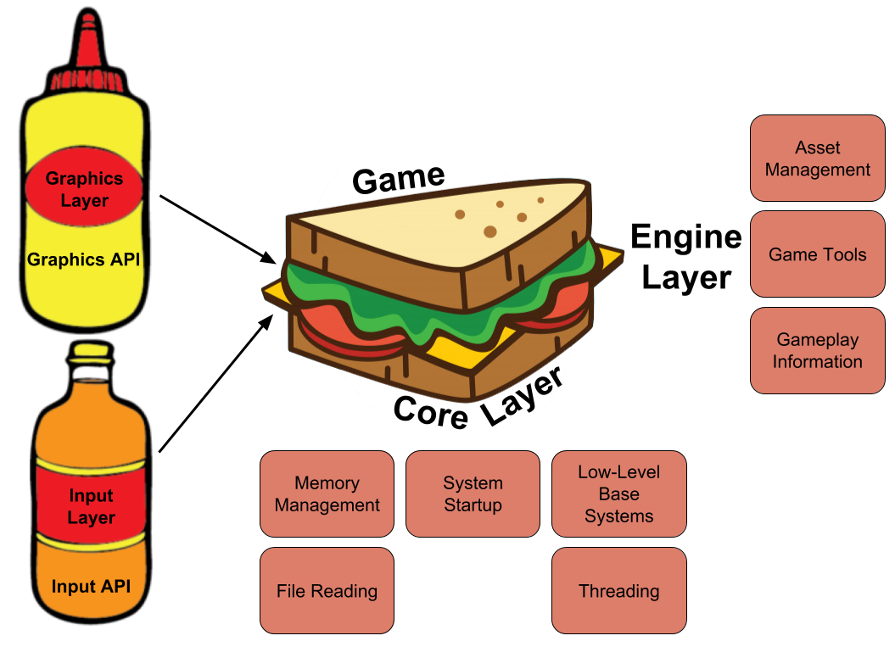

# The Engine Sandwich: Made with Super Meat 

_**Tommy Refenes** is the programmer for the million-selling and award-winning_ [Super Meat Boy](https://store.steampowered.com/app/40800/Super_Meat_Boy/)  _and the lead programmer on the upcoming_ [Super Meat Boy Forever](http://supermeatboy.com/). _He also appeared in_ Indie Game: The Movie.

(The following is the edited transcription of a conversation we had with Tommy Refenes.)

## Compartmentalizing is Key

Regarding my first attempt at a game engine, I experimented with making a game engine right before I started working in the games industry. I got really confused while working on it, but it was really helpful going through the process. It prepared me more for working on the 2x engine[^1] and then porting that engine to the Xbox 360 and working on the 360. By the time I left that first company, I learned the benefits of engine abstraction[^2] and trying to keep platform-dependent[^301] code separate from game code. This is important because in the first engines I would write, everything was all just one project. It was just a quick and dirty way to make something that worked. These are the places where you have to compartmentalize the different parts of development. For instance, the way my current engine is structured, there is no concept of Xbox, Switch, or Playstation in the code of _Super Meat Boy_ or_ Super Meat Boy Foreve_r. There's very little concept of platform even in the engine code, which is the piece that actually talks to the platforms. 

[^1]: Refers to Unreal Engine 2.x, which was originally debuted in 2002 with _America's Army_. The Unreal Engine is a source-available game engine developed by Epic Games

[^2]: **Engine abstraction** is the part of the engine code which depends on the hardware/software platform that the engine runs on and will be different on each platform. For example, the code that talks to the operating system on macOS will be different from that on Windows. Engine developers usually tackle this problem by having an abstraction layer on top of operating system code. So the code above that layer still looks the same when you swap out the underlying operating system.

[^301]: **Platform-dependent** code refers to application code that is dependent on one operating system, and typically won't run on  multiple. 

The biggest point of confusion when I was starting out was actually learning how to properly abstract and compartmentalize and implant, because when you're at the beginning of making an engine, **where the hell do you start?** That's a huge challenge; even getting something simple like a triangle drawing on the screen takes 100 lines of OpenGL[^3] code or 200 lines of DirectX[^4] code. From that point, even when you have a triangle on-screen, where do you go from there? I think learning that I needed to compartmentalize,having: my asset loader, my game, my controller code, my audio code, having all those things... I think that was the biggest point of confusion for me. Being able to compartmentalize those systems actually allowed me to have that starting point.

[^3]: **OpenGL** is short for Open Graphics Library - a cross-language, cross-platform application programming interface (API) for rendering 2D and 3D vector graphics. The API is typically used to interact with a graphics processing unit (GPU), to achieve hardware-accelerated rendering. It's the underlying rendering library for many modern game engines.

[^4]: Microsoft **DirectX** is a collection of application programming interfaces (APIs) for handling tasks related to multimedia, especially game programming, on Microsoft platforms, like Windows and Xbox. It is most known for Direct3D which is the graphics API used for creating windows and rendering, and serves similar purposes as OpenGL.

## Basic Principles of Abstraction

Right before PAX last year, _Forever_ was only running on Switch but two or three days before the convention, I realized I wanted to be able to show it in 1080p because I only had the handheld Switches to show at our booth. At first I thought I should just buy some computers, but then I looked over on my desk and saw my two Xbox dev kits. So I ported to Xbox in about two days, and then PlayStation in a day and a half. I attribute this quick turnaround time to how the engine is structured. If it weren't for abstraction, porting games wouldn't have been nearly as easy for me.

The engine has a core layer which consists of memory management, threading, anything specific to system startup for consoles, file reading, and all the very low-level base systems that will change per platform. The core layer is on the very bottom. On top of the core layer is the engine layer ,which sits between the core and the game (which is at the very very top). The engine layer handles stuff like asset management, including the SWF[^6] reader and Spine[^8]. It also contains gameplay information, such as levels and the base level of your characters and players.

[^6]: **SWF**, short for Small Web Format, is an Adobe Flash file format used for multimedia, vector graphics and ActionScript. SWF files can contain animations or applets of varying degrees of interactivity and function.

[^8]: **Spine** is a 2D skeletal animation software for video games by Esoteric Software.

You build upwards from the engine layer to make your game, but it has all the tools for making a level, like placing tiles from assets. If you imagine the engine layer is sitting there as a sandwich between core layer on the bottom and game layer on top, out to the side you have graphics, audio, input, etc. All of those are abstracted out, so if I want to load an asset I go into Tommunism Graphics (the namespace and the name of my engine), and then access Texture and from there Create Texture. All of those exist in-engine, but that function itself— the low-level Create Texture function— exists in the graphics layer that talks directly to the API for that particular platform. On the PC, for instance, the graphics layer is DirectX 11, and DirectX 11 has all of these functions that are defined like: Present, Draw, Load Texture, Load Vertex Buffer, and Load Shader. The engine layer can call those, so when I compile the static library of DirectX 11, it links to the engine. The engine layer only cares that Draw, Present— all these things that I need— are defined in this lower level of the graphics API. It was easy because I wasn't porting the engine or the entire game; I was simply porting graphics and input. 

If you abstract to the point where the engine can load in textures and vertex buffers and shaders, that's pretty much all you need. So porting those libraries, those static libraries of inputs and graphics, audio and whatever else, plus core which is the lower level stuff with file reading and everything, is all that is needed. None of those libraries talk to each other; they all talk through the engine layer, and the gameplay layer talks to the engine layer, which means that when I ported the Xbox version, I only had to port about three libraries. 

Once I ported those three libraries, as soon as I boot the game up, it works. Sometimes a couple little weird graphical things will come up because DirectX 11 works differently on Xbox than it does on PC or PlayStation 4, so I have to switch some shader stuff. But every time I port something, I get something on the screen immediately because everything is abstracted and the engine doesn't care as long as functions are defined. 

## Using 3rd Party Libraries

I like understanding what's happening in my engine at all layers. All of the of the render pipelines stuff is custom, the layers that talk to the Xbox One DirectX 11 API/PlayStation/Switch and any other platform's graphics API are all written by me and then put under my abstraction layer for graphics. 

One of the big 3rd party libraries I used was Box2D[^3125]. When I looked at the Box2D code, I thought it was good and I understood how it worked, but didn't want to write it because I didn't want to go through the process of writing a physics engine that can do exactly what Box2D does. That would take iterations of velocity and position solving, which I'm capable of doing but wouldn't want to waste time on. What I did was modified Box2D to work with the physics in my engine by doing the physics solving, acting as a solver[^3126].

[^3125]: **Box2D** is an open source C++ engine for simulating rigid bodies in 2D. Box2D is developed by Erin Catto and has the zlib license.

[^3126]: Physics engine for games usually consists of two parts: collision detection and collision resolution, and **solver** refers to the resolution part. Collision detection detects what objects collide with each other first, and then the solver determines their correct physical response, like position, rotation, velocity, etc.

I think the biggest part of game development is the asset pipeline. With Flash, a lot of the asset pipeline is just taken care of. In addition to Box2D, there are some other third party libraries I use. I integrated FMOD[^743] for audio, because I originally made my own audio engine for the first _Meat Boy_ but didn't want to do that again moving forward. I also used Bink[^519] by [Rad Game Tools](http://www.radgametools.com/default.htm), because cutscenes were getting a little too crazy. _Forever's_ black-and-white intro cutscene is rendered as vector, but everything else is actually movies now because it was just easier for me to edit the movies and add effects than it was to put them in Flash. That made life way easier. The way Bink just plays videos makes things so easy, because all I have to do is integrate a few things and then movies run on every platform. Overall, it's a much better use of my time and money. 

[^743]: **FMOD** is a cross platform audio engine and authoring tool used throughout the game industry. It was used by over 2,000 games in the last 15 years.

[^519]: **Bink** is the defacto video codec for games created by Rad Tools.

## Customizing toward Flash

The way my engine is structured, there is only one concept of Flash and that is the SWF file loader. Everything else goes to a higher concept of animation and instance, so while I have support for Flash, I also built-in support for Spine and .obj files. The engine doesn't care; for instance, some of the things in _Super_ _Meat Boy_ and _Forever_ I know are going to be Flash animations because that's where all of our assets are. For_ Meat Boy_'s character animations, I have a `CharacterAnimation_Flash` class that is part of character animation, but the Flash would have special little things. This lets me use the best parts of different file types and the engine is able to render them regardless. That way it's not pigeon-holed or anything, it's just a thing that the engine supports. This versatility gives me a lot of options for future projects. Down the road, if I want to make a 3D _Meat Boy_, I can just make a _3D Meat Boy_ with the engine. Or if we were going to do hand-drawn pixel art, which Flash is terrible for, I can do that. 

## Tools for Your Teammates

My philosophy is whatever program my artists or designers are comfortable working in, I'm going to try to make it so that they can continue their work with that program. I know that on my own, I am not going to make something that is better than what they're used to. 

If you think of this with regards to programming, I'm very used to C++, and people always ask me if I'm going to use [Jonathan Blow](https://twitter.com/Jonathan_Blow)'s JAI[^654]. And I tell them no, because I'm comfortable with C++. I'm not looking to change it, I don't think C++ really needs to be better because I've worked around the limitations of it for so long that at this point they're not limitations anymore. 

[^654]: **JAI** is a language being developed by Jonathan Blow and his at Thekla to address some of the issues game developers have with the current industry standard, C++.

When making _Super Meat Boy_, [Edmund](https://twitter.com/edmundmcmillen)[^35290] was the most comfortable with Flash, just like I was, since we both started out on Newgrounds[^5] and everything. It's what he drew in and animated in. So instead of making something new or trying to shoehorn him into some other process, I took the burden on myself. I made a tool that would let us export all the images, timelines and animations from Flash. The tool arranged all the assets on the stage, and then moved and sorted them so they were packed into the smallest texture possible. Finally,  it would export texture coordinates and go through the timeline, which would be used by my custom animation index and PNG files that run all of _Super_ _Meat Boy_. And that made it easy for Edmund to just work the way he needed to work. 

[^35290]: Edmund McMillen worked on _Super Meat Boy_ together with Tommy as an artist and designer. He is also famous for making _The Binding of Isaac_ and its remake.

[^5]: Newgrounds is an American online entertainment and social media website and company. The site hosts user-generated content such as games, movies, audio, and artwork in four respective site "portals".

After _Super_ _Meat Boy_ was done, I thought it was time to cut out the middleman of PNG files. I wanted to make my engine just render SWF files, which I figured has to be possible because Flash renders them. What I did was download the SWF file specs and read through the full documentation. I found out exactly what's in an SWF file and I used that to make the new engine. The new engine can just load in an SWF. I also tied in some native code that I can put into actual FLA[^38927] files, and the artists can export those to SWF. Now I can add C++ code to animations, which is great when working with Flash artists (such as Edmund, [Temmie,](https://twitter.com/tuyoki) [Paul, Sandra,](https://twitter.com/PaulterVoorde) and [Ivan](https://twitter.com/IvanA1mighty)) because everything is in Flash.

[^38927]: **FLA** is the file format for projects created by Adobe Animate, and can contain graphics, video, text, audio, and more. They are often saved as SWF files to be used on the web.

This goes back to making it easy for the people you are working with. For example, Paul was making all of the animations for the enemies and they're all vector graphics, so we can scale those to any size and they work in-engine. He doesn't have to jump through any hoops. The only thing he and the other animators can't use is the Flash's filter stuff, but I've supported a lot of the filters that are in Flash now because it just makes sense. The engine renders them fast and it's a nice little asset package that you can zip; it does a lot to help out the team.

## Pixel to Vector Art

A lot of _Forever_ is vector graphics, but a lot of it is still rasterized[^234] images that are read and compressed into the SWFs. The only weird challenge that came with switching over to vector from raster graphics is the fact that graphics cards are made to render polygons, and they're actually pretty garbage at rendering textures. That's why you have games that look like the new _Spider-Man_ that runs at a steady framerate, but a game that has a bunch of particle effects that are 2D and has high-resolution art can run like garbage. It's has to do with the fill rate, and the way you get around the fill rate of the hardware is by carefully choosing which pixels to render. You really can't do that with full-screen PNGs because you have to encode alpha and optimize to make it actually look right. That kind of optimization is not as trivial as doing a backface cull[^789], where if I was rendering a character model, I would only render half of it because you don't see the other side.

[^234]: A **rasterized** image is one which is represented as a grid of pixels with RGBA color.

[^444]: **Fill rate** refers to the number of pixels a video card can read/write to the screen per second.

[^789]: **Backface culling** is the technique of performing visibility checks on a mesh to not render the back face (face not facing the camera).

With the vector stuff, I actually needed to render a little differently. This meant I got to use more advanced rendering techniques like stencil buffers[^99] and depth culling[^32], which actually makes the vector graphics render way faster than any of the PNGs. It wasn't so much a challenge, as it was a different way of thinking. Everything in_ Super Meat Boy_ was just layered PNGs; you draw your background, you draw your foreground, you go from bottom up. With vectors, though, you tend to go from top down and mixing the two can be ridiculously inconvenient. 

[^99]: **Stencil buffer** is an additional depth buffer to the depth and color buffers.

[^32]: **Depth culling** is the process of deciding which elements to render based on the distance from the camera and if it is being hidden by another element.

## Stealth Loading in Super Meat Boy

_Super Meat Boy_ and _Forever_ levels consists of palette and level information, which then need to be loaded by the engine. Information in _Super_ _Meat Boy_ was essentially run-length encoded[^21]—all the tiles, object positions, and object properties. Those are all very small files that can be read immediately in the memory and then have direct access through memory. When you have direct memory access instead of actual file loading, you don't have to worry about cache misses or swapping memory around to be able to load everything. That's just the level data; the pallete data is your textures and your animations— everything that has to do with the visuals of the game. For example, The Forest[^888] is a palette, so every level in the Forest uses the forest palette.

[^21]: **Run-length encoding** is a form of lossless data compression where data is stored as a single data value and count, for [more](https://en.wikipedia.org/wiki/Run-length_encoding).

[^888]: **The Forest** is the first chapter of _Super Meat Boy_.

In _Super_ _Meat Boy,_ when you would go into the chapter, it would start playing a little cutscene where we'd introduce the chapter, and at the same time it would start loading in the pallete on a different thread. During all of this the game would pause, but you wouldn't notice it because at the end of the cutscenes it has the black and white screen that says "The Forest" that goes "dun dun dunnnn!"[^432] Even if you skip the cutscene during that time, it's continuing to load the palette. Because the palettes aren't very big anyway, it's only about four seconds so that jingle gives the game enough time to load everything I have. That's then cached so when you're in the level the only thing it is loading new is new level data which is anywhere between 5 KB and 50 KB. Even the craziest levels are only about 100 KB. The textures were already loaded from the palette, then the game would continue from there. I utilized a lot with the presentation of the game to actually background load assets such as palettes. I think the boss battle cutscenes loaded either during the chapter intro or when you were on the overworld map getting ready to hit the button to go into the boss level. Again, the loads were small because the bosses were just a couple assets, and the levels and palette were already loaded. So for the Lil' Slugger[^871] fight, all that is loaded is Lil' Slugger's animations, which are just him walking. The reason everything seems to load so fast is because all the heavy lifting is done when the player doesn't notice it.

[^432]: For reference of what Tommy is talking about, here is a [clip](https://youtu.be/4_Iq2RPDQ-M?t=1m48s).

[^871]: **Lil' Slugger** is the first boss in the _Super Meat Boy_ game.

## "Garbage Physics"

The garbage physics came about all from iteration[^154]. For_ Forever,_ I wanted to keep the exact same feel of Meat Boy with the new game, so a lot of the physics are exactly the same. The player doesn't have control over the direction, so physics from _Super Meat Boy_ like air friction for when you're turning around in the air, the amount of time when you're going in one direction and then  switch to another direction, those don't exist in _Forever_ because you don't have any control over direction. But how his jump works and the new mechanics, like his punch and dive, were also developed from what I call "garbage physics." There's different obstacles, like fans, that had to be adjusted for this game, which also required iteration. Nothing in the game is physically accurate to real physics, not a single thing. All of Meat Boy's weird controls are done in-game, not in-engine.

_Interview conducted September 13. 2018._

[^154]: Tommy talked more about the creation of the Meat Boy physics in an interview with [Casey Muratori](https://twitter.com/cmuratori?ref_src=twsrc%5Egoogle%7Ctwcamp%5Eserp%7Ctwgr%5Eauthor) at [HandmadeCon 2015](https://www.youtube.com/watch?v=QVpSIdWE0do&t=1s&index=2&list=PLEMXAbCVnmY6HE0bxUHeLLP5QbBE2zhJi).

