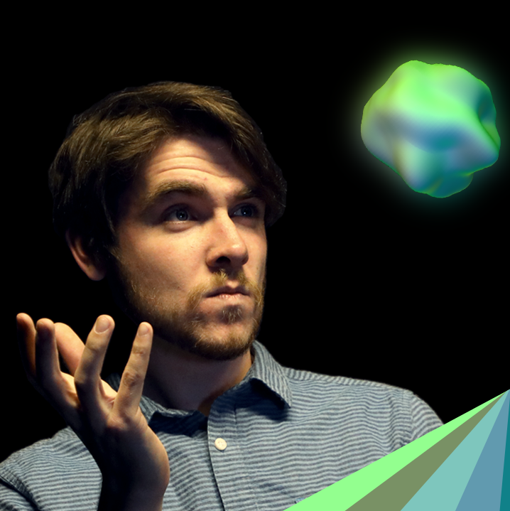
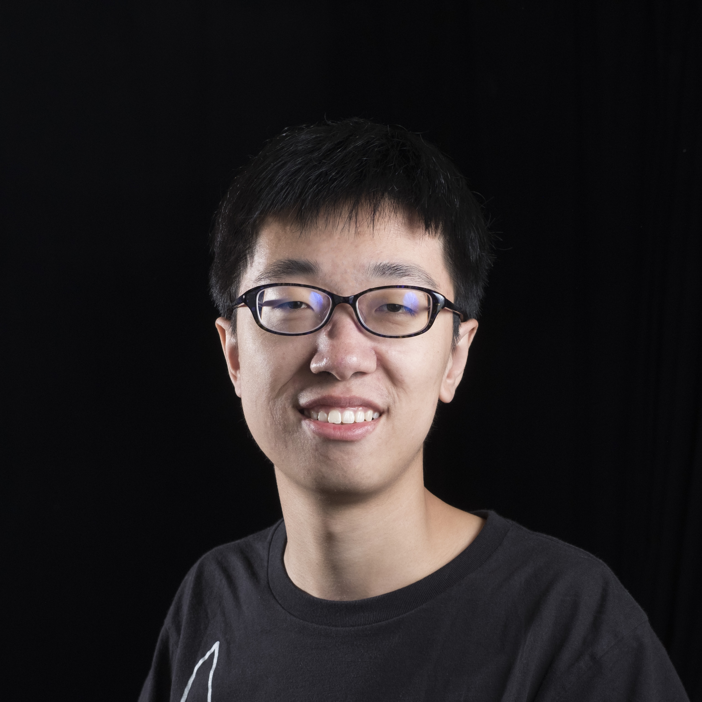
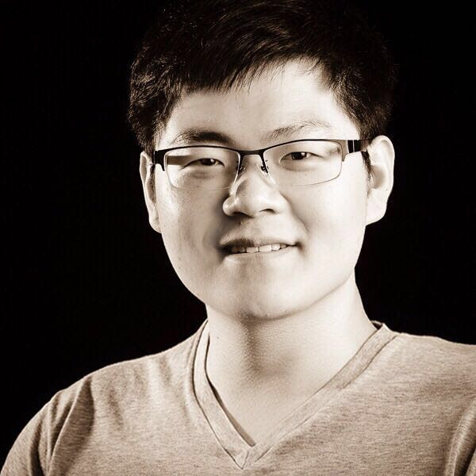

disqus: 

# Team

The team behind Isetta Engine. They are graduate students studying at Carnegie Mellon's Entertainment Technology Center with graduation date of May 2019.

**Producer**
- [Jared Ettinger](https://jettingerworks.com/)
    

**Programmers**

- [Caleb Biasco](https://calebbiasco.com/)  
      
		Caleb started game programming in the Video Game Development Club at the University of Minnesota, and hasn't stopped since!  
		Seriously. The madman is making a game engine now, someone stop him.

- [Jacob Wilson](http://jacwilso.com/)  
      
    Jacob has a background in physics from Colorado School of Mines, and has specific interest in game tool development and software prototyping.

- [Chaojie Zhu](http://zcj.io/)  
      
    Chaojie has a background in software engineering from Shanghai Jiao Tong University, and has specific interests in game AI, self driving vehicles and software engineering.

- [Yidi Zhu](http://yidizhu.com/)  
      
    Yidi is a gameplay programmer / designer who escaped from the building construction management field. He loves making meaningful and joyful interactive experiences.
