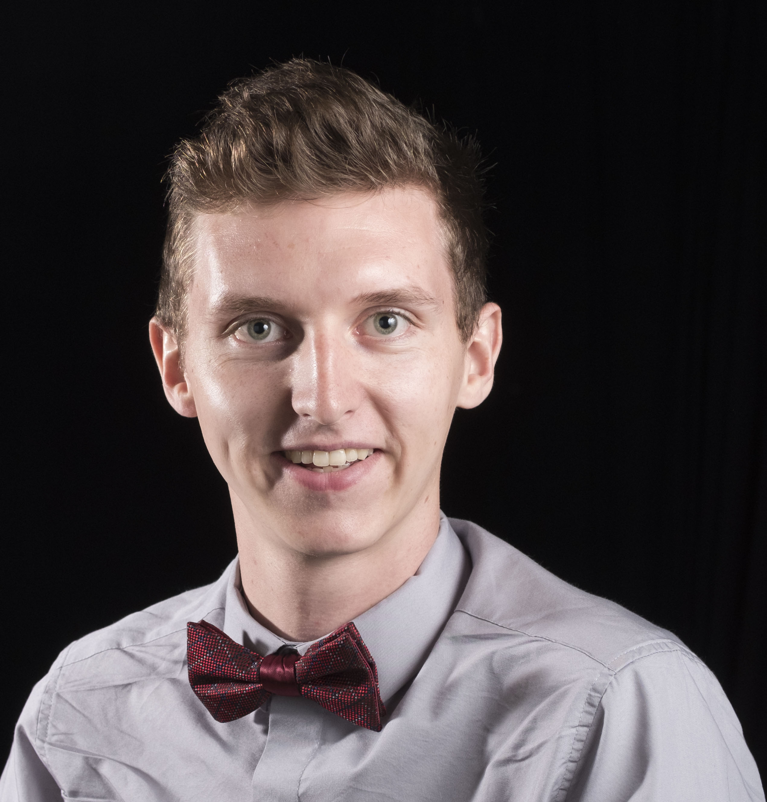

disqus: 

# Team

The team behind Isetta Engine. They are graduate students studying at Carnegie Mellon's Entertainment Technology Center with graduation date of May 2019.

**Producer**
- [Jared Ettinger](https://jettingerworks.com/)
    

**Programmers**
- [Caleb Biasco](https://calebbiasco.com/)
    
- [Jacob Wilson](http://jacwilso.com/)
    
    Jacob has a background in physics from Colorado School of Mines, and has specific interest in game tool development and software prototyping.
- [Chaojie Zhu](http://zcj.io/)
    
- [Yidi Zhu](http://yidizhu.com/)
    