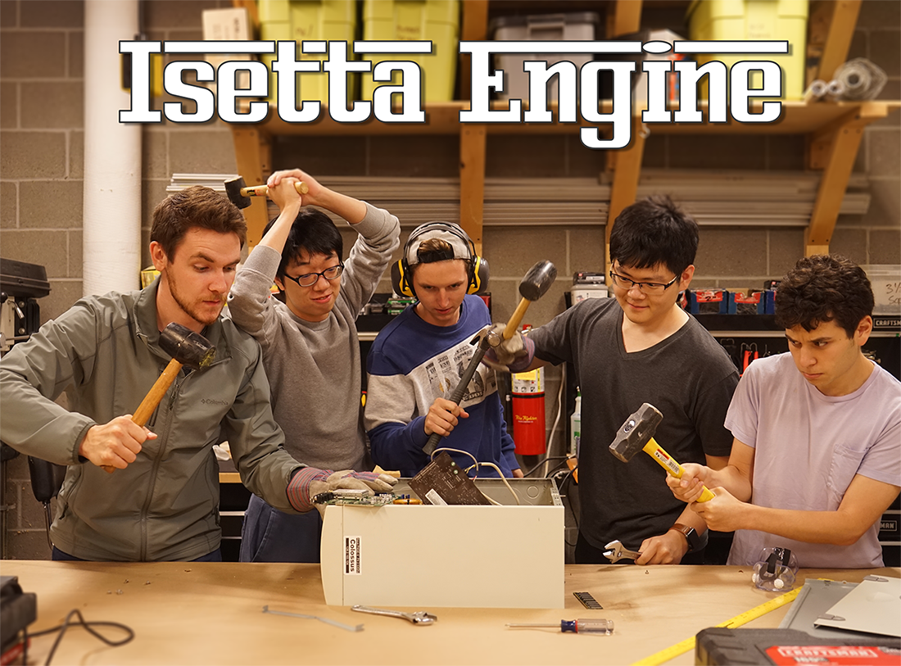
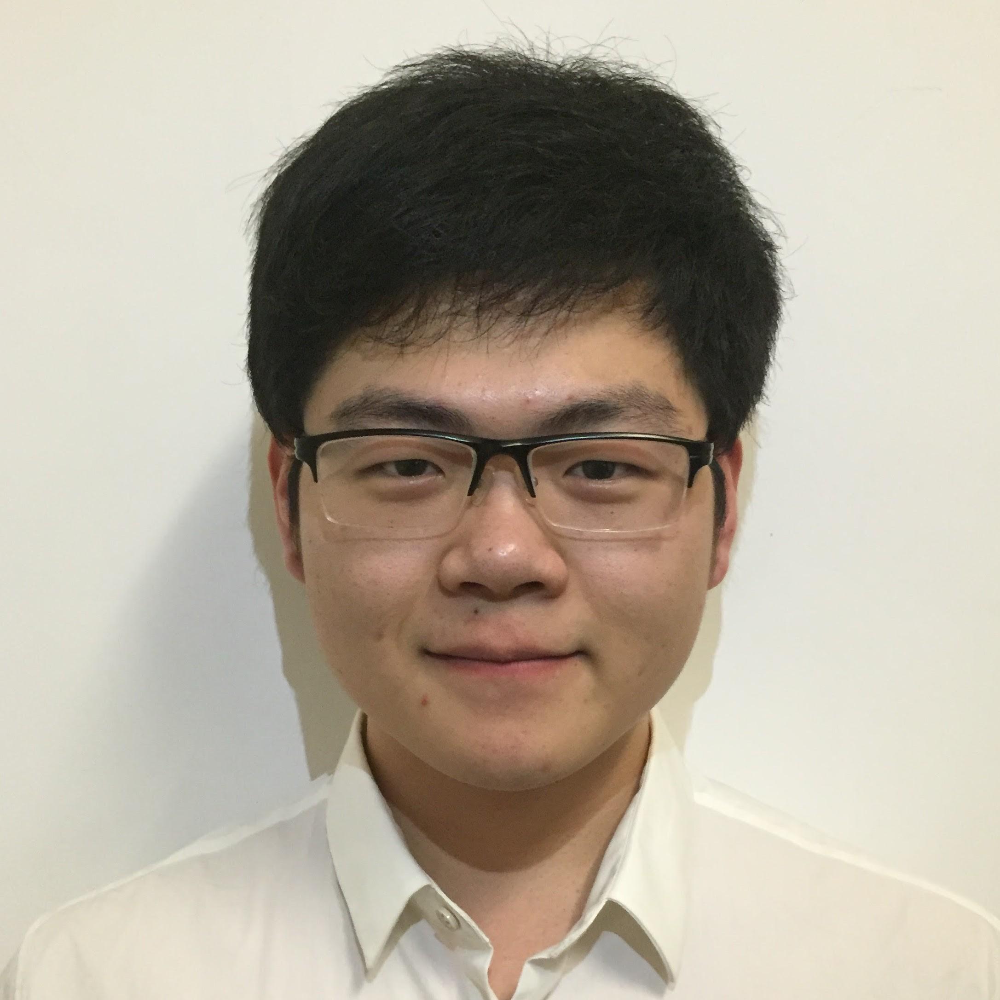

disqus: 

# Team

This is the team behind Isetta Engine. They are graduate students studying at Carnegie Mellon's Entertainment Technology Center, all anticipating to graduate in May 2019 with Master of Entertainment Technology degrees.

**Producer**

## [Jared Ettinger](https://jettingerworks.com/)  
![team-headshot] (images/team/Jared.jpg "Jared Headshot")  
Jared is a creative writer and producer from New York. He is excited about the intersection of art and technology, particularly in video games and animation. He hopes to further his production skills by keeping the rest of the team steady on this wild ride. 

**Programmers**

## [Caleb Biasco](https://calebbiasco.com/)  
  
Caleb started game programming in the Video Game Development Club at the University of Minnesota, and hasn't stopped since!  
	Seriously. The madman is making a game engine now, someone stop him.

## [Jacob Wilson](http://jacwilso.com/)  
  
Jacob is always taking things apart to understand how they work and sometimes they are able to go back together. His background in physics helps him understand math and mechanics, and he is interested in tool development to help others see the light.

## [Chaojie Zhu](http://zcj.io/)  
  
Chaojie has a background in software engineering from Shanghai Jiao Tong University, and has specific interests in game AI, self driving vehicles and software engineering.

## [Yidi Zhu](http://yidizhu.com/)  
  
Yidi is a gameplay programmer / designer who escaped from the building construction management field. He loves making meaningful and joyful interactive experiences.
